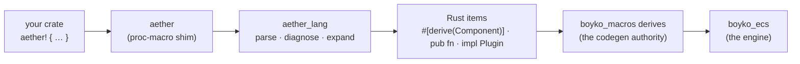

# Aether DSL

**Aether** is boyko-engine's authoring language. It is one function-like macro,
`aether! { … }`, holding a compact notation for the things a game declares over
and over: components, tags, bundles, events, systems, plugins, and reactive state
machines.

Aether is a **superstructure over Rust, not a language beside it**. Every
construct expands, at compile time, to the *canonical hand-written engine
surface* — the same `#[derive(Component)]` struct, the same `Query<D, F>`
signature, the same `impl Plugin`. There is no interpreter, no runtime registry,
no reflection, and no second codegen path: `boyko_macros` stays the single
codegen authority, and Aether just hands it the annotated items you would have
typed yourself.

The consequences are the point:

- **Zero runtime overhead.** Nothing Aether emits exists at run time except the
  items themselves. An Aether component *is* a `boyko_macros` component.
- **Zero drift.** Aether cannot behave differently from hand-written code,
  because it produces hand-written code. When the derive gains a feature,
  Aether-authored types get it for free.
- **Your code stays your code.** Types, expressions and system bodies pass
  through as verbatim token trees with their original spans, so rustc errors,
  rust-analyzer completions and go-to-definition land on your own tokens.

*(Branch: `feat/multi-paradigm-render`. Shipped rungs: A0–A3.)*

## Hello, Aether

A complete feature — two components, a bundle, a plugin, and four systems with
ordering and a run condition — in one block:

```rust,ignore
use aether::aether;

aether! {
    component Position {
        x: f32,
    }

    component Velocity {
        v: f32,
    }

    bundle Mover {
        pos: Position,
        vel: Velocity,
    }

    plugin Movement;

    system boot(mut cmds: commands) on startup {
        cmds.spawn(Mover { pos: Position { x: 0.0 }, vel: Velocity { v: 2.0 } });
    }

    system integrate(q: query<(&mut Position, &Velocity)>, log: mut res<SeqLog>) on update {
        for (p, v) in &mut q {
            p.x += v.v;
        }
        log.integrate_runs += 1;
    }

    system observe(q: query<&Position>, log: mut res<SeqLog>) on update after integrate {
        for p in &q {
            log.x_seen = p.x;
        }
    }

    system frozen(log: mut res<SeqLog>) on update when never {
        log.frozen_ran = true;
    }
}
```

The observation resource and the run condition are ordinary hand-written Rust in
the same module — Aether sugars what it has constructs for and leaves everything
else alone:

```rust,ignore
use boyko_ecs::App;

/// Aether systems are plain fns (no captures), so a resource is how they talk.
#[derive(boyko_macros::Resource, Default)]
struct SeqLog {
    integrate_runs: u32,
    frozen_ran: bool,
    x_seen: f32,
}

/// The `when` gate's condition — an ordinary fn, fully rust-analyzer-visible.
fn never() -> bool {
    false
}

fn main() {
    let mut app = App::new();
    app.insert_resource(SeqLog::default());
    app.add_plugin(Movement); // the struct the `plugin Movement;` line generated
    app.update();
}
```

This example is the shipped integration test
`crates/aether_tests/tests/a2_system_plugin.rs`, trimmed.

### What that block becomes

`system integrate(…) on update` and its siblings expand to plain functions plus
one `Plugin` impl that holds the registrations:

```rust,ignore
pub struct Movement;
impl ::boyko_ecs::Plugin for Movement {
    fn build(&self, app: &mut ::boyko_ecs::App) {
        app.add_startup_system(boot);
        app.add_systems_cfg(|b| {
            let __aether_k_integrate = b.add_system(integrate).key();
            b.add_system(observe).after(__aether_k_integrate);
            b.add_system(frozen).run_if(never);
        });
    }
    fn name(&self) -> &'static str { "Movement" }
}

pub fn integrate(
    mut q: ::boyko_ecs::ecs::core::iters::query::Query<(&mut Position, &Velocity)>,
    mut log: ::boyko_ecs::ecs::core::system::ResMut<SeqLog>,
) {
    for (p, v) in &mut q {
        p.x += v.v;
    }
    log.integrate_runs += 1;
}
```

Two details are worth naming right away, because both are visible in every
expansion:

- **Emitted engine paths are absolute and fully qualified.** Aether emits
  `::boyko_ecs::ecs::core::system::ResMut<…>`, not `ResMut<…>`, so a block
  compiles without importing anything from the engine. (The paths are the *real*
  nested module paths, not root re-exports — the root re-exports only `App`,
  `Plugin` and friends, and a token that does not resolve would be worthless.)
- **`mut` bindings are inferred.** `log: mut res<SeqLog>` becomes `mut log:
  ResMut<SeqLog>`. See [the inference table](systems-and-plugins.md#mutability-inference).

## The constructs

| Construct | Emits | Rung | Page |
|-----------|-------|------|------|
| `component Name { … }` | `#[derive(::boyko_macros::Component)]` struct | A0 | [Data constructs](data-constructs.md#component) |
| `tag Name;` / `tag Name(bitset);` | ZST component, optionally `storage = "bitset"` | A0 | [Data constructs](data-constructs.md#tag) |
| `bundle Name { … }` | `#[derive(::boyko_macros::Bundle)]` struct | A1 | [Data constructs](data-constructs.md#bundle) |
| `event Name { … }` | `#[::boyko_macros::event]` struct | A1 | [Data constructs](data-constructs.md#event) |
| `system name(…) clauses { … }` | `pub fn` with the desugared `SystemParam` signature | A2 | [Systems & plugins](systems-and-plugins.md) |
| `plugin Name;` | `pub struct` + `impl Plugin` holding every sibling registration | A2 | [Systems & plugins](systems-and-plugins.md#the-plugin-header) |
| `machine Name { … }` | flat `States` enum + one transition system per (leaf, event) | A3 | [State machines](state-machines.md) |
| `material name { … }` | *planned* — rung A5 | — | — |
| `scene name { … }` | *planned* — rung A6 | — | — |

Naming the two planned constructs in that list is deliberate: writing
`material gold { }` today gives you an error that says **which rung it lands
on**, not "unknown construct". See [Diagnostics](diagnostics.md#planned-constructs-name-their-rung).

## Three crates, one macro



| Crate | Role |
|-------|------|
| `aether` | The user-facing `#[proc_macro]`. Two lines: it forwards to `aether_lang`. |
| `aether_lang` | The whole language — parser, diagnostics, expander. A plain library, unit-testable without a compiler session, and it depends on **nothing** from the engine. |
| `aether_tests` | The integration crate. It depends on the real `boyko_ecs` / `boyko_macros`, so it is where expansion drift gets caught. |

`aether_lang` emitting engine paths as *tokens* rather than depending on the
engine is the same no-cycle rule `boyko_macros` follows. Your crate resolves
them, which means your crate needs `aether`, `boyko_ecs` and `boyko_macros` as
dependencies — exactly the set hand-written engine code already needs.

## What Aether does not do

Aether is a syntax layer with a hard boundary. It never invents runtime
behavior, and a few things stay firmly yours:

- **Event lanes still need registration.** `event Damage { … }` declares the
  type; it does not preregister the buffers. Call
  `world.preregister_event::<Damage>(…)` (or `preregister_event_default`) during
  config, exactly as for a hand-written `#[event]` type — see
  [Events](../concepts/events.md) and [App & Plugins](../app/plugins.md#events-there-is-no-appadd_event).
- **Names must be in scope.** Component paths, resource types, condition fns and
  event types inside a block are ordinary Rust names resolved at the expansion
  site. Aether does not add imports.
- **Resources, hooks and observers are hand-written.** There is no `resource`
  construct; `#[derive(Resource)]` is unchanged. Component hooks are *forwarded*
  by the `component` construct, not reimplemented.
- **Cross-block references do not exist.** Sibling resolution (a system naming a
  system for ordering, a machine naming its states) is scoped to one `aether!`
  block. Across blocks you are back to ordinary Rust name resolution — which is
  usually what you want, because the expanded items are just items.
- **No `Vec`, no `HashMap`, no `dyn`, no allocation** appears in any expansion.
  The transpiler's own internals use them freely; the *emitted* code obeys the
  engine's [design principles](../architecture/principles.md).

## Seeing the expansion

The expansion is not a black box, and reading it is the fastest way to learn the
mapping:

```powershell
cargo expand -p aether-tests --test a2_system_plugin
```

Every construct's expansion is also pinned token-for-token by unit tests in
`crates/aether_lang/src/expand.rs`. If you want the authoritative "what does
this become", those tests are it.

## Status and what is next

Rungs **A0–A3** ship in this build: `component`, `tag`, `bundle`, `event`,
`system`, `plugin`, `machine`. Machines include hierarchy — composite states,
`initial` retargeting, superstate handler inheritance and LCA-inlined
enter/exit — which the roadmap had scheduled one rung later.

Planned, not shipped:

| Rung | Contents | Status today |
|------|----------|--------------|
| A4 | machine hierarchy (composites, handler copy-down, LCA inlining, group predicates) + the initial-enter chain | the hierarchy landed early, with the shipped `machine`; the [initial-enter chain](state-machines.md#hazards) has not |
| A5 | `material` — PBR material builder fns over `Material::new` / `with_textures` | the parser refuses it and names the rung |
| A6 | `scene` — entity trees, mesh/material resolution, demand-driven spawn-fn params | the parser refuses it and names the rung |
| A7 | DX hardening: expansion-size CI measurement, span-column-pinned goldens, `aether v1;` version header | not started |

Because the parser answers with the rung, you never have to check a roadmap to
find out whether a construct exists yet — try it and read the error.

## See also

- [Data constructs](data-constructs.md) — `component`, `tag`, `bundle`, `event`.
- [Systems & plugins](systems-and-plugins.md) — the param sugar table, clauses,
  and sibling ordering.
- [State machines](state-machines.md) — `machine`, flattening, and the two
  recorded hazards.
- [Diagnostics](diagnostics.md) — every error contract Aether promises.
- [Components](../concepts/components.md) and [Systems](../concepts/systems.md) —
  the hand-written surface Aether expands to.
- Source: `crates/aether_lang/src/parse.rs`, `crates/aether_lang/src/expand.rs`,
  `crates/aether/src/lib.rs`; design plan in `docs/AETHER-LANG-PLAN.md`.
