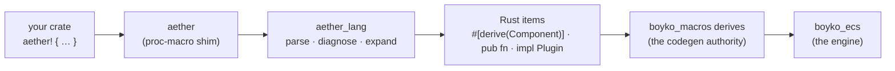

# Aether DSL

**Aether** is boyko-engine's authoring language. It is one function-like macro,
`aether! { … }`, holding a compact notation for the things a game declares over
and over: components, tags, bundles, events, systems, plugins, and reactive state
machines.

Aether is a **superstructure over Rust, not a language beside it**. Every
construct expands, at compile time, to the *canonical hand-written engine
surface* — the same `#[derive(Component)]` struct, the same `Query<D, F>`
signature, the same `impl Plugin`. There is no interpreter, no runtime registry,
no reflection, and no second codegen path: `boyko_macros` stays the single
codegen authority, and Aether just hands it the annotated items you would have
typed yourself.

The consequences are the point:

- **Zero runtime overhead.** Nothing Aether emits exists at run time except the
  items themselves. An Aether component *is* a `boyko_macros` component.
- **Zero drift.** Aether cannot behave differently from hand-written code,
  because it produces hand-written code. When the derive gains a feature,
  Aether-authored types get it for free.
- **Your code stays your code.** Types, expressions and system bodies pass
  through as verbatim token trees with their original spans, so rustc errors,
  rust-analyzer completions and go-to-definition land on your own tokens.

*(Branch: `feat/multi-paradigm-render`. Shipped rungs: **A0–A7 — the plan is
complete**. Nothing in the language is scheduled for a later rung.)*

## Hello, Aether

A complete feature — two components, a bundle, a plugin, and four systems with
ordering and a run condition — in one block:

```rust,ignore
use aether::aether;

aether! {
    component Position {
        x: f32,
    }

    component Velocity {
        v: f32,
    }

    bundle Mover {
        pos: Position,
        vel: Velocity,
    }

    plugin Movement;

    system boot(mut cmds: commands) on startup {
        cmds.spawn(Mover { pos: Position { x: 0.0 }, vel: Velocity { v: 2.0 } });
    }

    system integrate(q: query<(&mut Position, &Velocity)>, log: mut res<SeqLog>) on update {
        for (p, v) in &mut q {
            p.x += v.v;
        }
        log.integrate_runs += 1;
    }

    system observe(q: query<&Position>, log: mut res<SeqLog>) on update after integrate {
        for p in &q {
            log.x_seen = p.x;
        }
    }

    system frozen(log: mut res<SeqLog>) on update when never {
        log.frozen_ran = true;
    }
}
```

The observation resource and the run condition are ordinary hand-written Rust in
the same module — Aether sugars what it has constructs for and leaves everything
else alone:

```rust,ignore
use boyko_ecs::App;

/// Aether systems are plain fns (no captures), so a resource is how they talk.
#[derive(boyko_macros::Resource, Default)]
struct SeqLog {
    integrate_runs: u32,
    frozen_ran: bool,
    x_seen: f32,
}

/// The `when` gate's condition — an ordinary fn, fully rust-analyzer-visible.
fn never() -> bool {
    false
}

fn main() {
    let mut app = App::new();
    app.insert_resource(SeqLog::default());
    app.add_plugin(Movement); // the struct the `plugin Movement;` line generated
    app.update();
}
```

This example is the shipped integration test
`crates/aether_tests/tests/a2_system_plugin.rs`, trimmed.

### What that block becomes

`system integrate(…) on update` and its siblings expand to plain functions plus
one `Plugin` impl that holds the registrations:

```rust,ignore
pub struct Movement;
impl ::boyko_ecs::Plugin for Movement {
    fn build(&self, app: &mut ::boyko_ecs::App) {
        app.add_startup_system(boot);
        app.add_systems_cfg(|b| {
            let __aether_k_integrate = b.add_system(integrate).key();
            b.add_system(observe).after(__aether_k_integrate);
            b.add_system(frozen).run_if(never);
        });
    }
    fn name(&self) -> &'static str { "Movement" }
}

pub fn integrate(
    mut q: ::boyko_ecs::ecs::core::iters::query::Query<(&mut Position, &Velocity)>,
    mut log: ::boyko_ecs::ecs::core::system::ResMut<SeqLog>,
) {
    for (p, v) in &mut q {
        p.x += v.v;
    }
    log.integrate_runs += 1;
}
```

Two details are worth naming right away, because both are visible in every
expansion:

- **Emitted engine paths are absolute and fully qualified.** Aether emits
  `::boyko_ecs::ecs::core::system::ResMut<…>`, not `ResMut<…>`, so a block
  compiles without importing anything from the engine. (The paths are the *real*
  nested module paths, not root re-exports — the root re-exports only `App`,
  `Plugin` and friends, and a token that does not resolve would be worthless.)
- **`mut` bindings are inferred.** `log: mut res<SeqLog>` becomes `mut log:
  ResMut<SeqLog>`. See [the inference table](systems-and-plugins.md#mutability-inference).

## The constructs

| Construct | Emits | Rung | Page |
|-----------|-------|------|------|
| `component Name { … }` | `#[derive(::boyko_macros::Component)]` struct | A0 | [Data constructs](data-constructs.md#component) |
| `tag Name;` / `tag Name(bitset);` | ZST component, optionally `storage = "bitset"` | A0 | [Data constructs](data-constructs.md#tag) |
| `bundle Name { … }` | `#[derive(::boyko_macros::Bundle)]` struct | A1 | [Data constructs](data-constructs.md#bundle) |
| `event Name { … }` | `#[::boyko_macros::event]` struct | A1 | [Data constructs](data-constructs.md#event) |
| `system name(…) clauses { … }` | `pub fn` with the desugared `SystemParam` signature | A2 | [Systems & plugins](systems-and-plugins.md) |
| `plugin Name;` | `pub struct` + `impl Plugin` holding every sibling registration | A2 | [Systems & plugins](systems-and-plugins.md#the-plugin-header) |
| `machine Name { … }` | flat `States` enum + one transition system per (leaf, event) + the initial-enter startup system | A3 · A4 | [State machines](state-machines.md) |
| `material name { … }` | `#[inline] pub fn` over `Material::new` / `with_textures` | A5 | [Materials](materials.md) |
| `scene name { … }` | `pub fn` spawning the declared world, registered as a startup one-shot | A6 | [Scenes](scenes.md) |

**That table is now the whole v1 surface, and every row of it ships.** The list
used to carry constructs that only named the rung they were coming on; A6 landed
the last of them, so an unrecognized keyword is unambiguously a misspelling and
the [unknown-construct](diagnostics.md#unknown-construct) message is the whole
truth about it.

## Three crates, one macro



| Crate | Role |
|-------|------|
| `aether` | The user-facing `#[proc_macro]`. Two lines: it forwards to `aether_lang`. |
| `aether_lang` | The whole language — parser, diagnostics, expander. A plain library, unit-testable without a compiler session, and it depends on **nothing** from the engine. |
| `aether_tests` | The integration crate. It depends on the real `boyko_ecs` / `boyko_macros`, so it is where expansion drift gets caught. |

`aether_lang` emitting engine paths as *tokens* rather than depending on the
engine is the same no-cycle rule `boyko_macros` follows. Your crate resolves
them, which means your crate needs `aether`, `boyko_ecs` and `boyko_macros` as
dependencies — exactly the set hand-written engine code already needs.

## What Aether does not do

Aether is a syntax layer with a hard boundary. It never invents runtime
behavior, and a few things stay firmly yours:

- **Event lanes still need registration.** `event Damage { … }` declares the
  type; it does not preregister the buffers. Call
  `world.preregister_event::<Damage>(…)` (or `preregister_event_default`) during
  config, exactly as for a hand-written `#[event]` type — see
  [Events](../concepts/events.md) and [App & Plugins](../app/plugins.md#events-there-is-no-appadd_event).
- **Names must be in scope.** Component paths, resource types, condition fns and
  event types inside a block are ordinary Rust names resolved at the expansion
  site. Aether does not add imports.
- **Resources, hooks and observers are hand-written.** There is no `resource`
  construct; `#[derive(Resource)]` is unchanged. Component hooks are *forwarded*
  by the `component` construct, not reimplemented.
- **Cross-block references do not exist.** Sibling resolution (a system naming a
  system for ordering, a machine naming its states, a scene naming a material)
  is scoped to one `aether!` block. Across blocks you are back to ordinary Rust name resolution — which is
  usually what you want, because the expanded items are just items.
- **No `Vec`, no `HashMap`, no `dyn`, no allocation** appears in any expansion.
  The transpiler's own internals use them freely; the *emitted* code obeys the
  engine's [design principles](../architecture/principles.md).

## Seeing the expansion

The expansion is not a black box, and reading it is the fastest way to learn the
mapping:

```powershell
cargo expand -p aether-tests --test a2_system_plugin
```

Every construct's expansion is also pinned token-for-token by unit tests in
`crates/aether_lang/src/expand.rs`. If you want the authoritative "what does
this become", those tests are it.

## Status: the plan is complete

**Every rung ships. A0 through A7 — the design plan's last — are done, and
nothing in the language is waiting on a later one.**

The nine constructs are `component`, `tag`, `bundle`, `event`, `system`,
`plugin`, `machine`, `material` and `scene`. Machines carry the full hierarchy —
composite states, `initial` retargeting, superstate handler inheritance,
LCA-inlined enter/exit and group predicates — which A3 delivered a rung early.

A4 was therefore spent on the piece nobody had built and on hardening what was
already there:

- **[The initial-enter chain](state-machines.md#the-initial-enter-chain).**
  `insert_state` seeds the *value*; nothing in the kernel runs an entry action
  for a state nobody transitioned into. One generated startup system now walks
  the initial leaf's ancestor path, outermost-first — emitted only when that
  chain has a body.
- **[Drain-then-act](state-machines.md#what-a-transition-system-does).** A
  transition system reads *every* event queued this frame and acts once. The
  earlier `return`-in-loop shape left the remainder unread, and it fired a
  second transition on the next frame.
- **Declaration-order registration.** Registrations follow your source order,
  not the inheritance walk's — the deterministic half of the last-write-wins
  policy on `NextState`.
- **Eight new refusals** for charts that used to expand silently or to collide
  on generated tokens; see
  [Charts the flattener refuses](state-machines.md#charts-the-flattener-refuses).
- **Three parser repairs**, all visible in the errors you get: `plugin` joined
  the construct registry (so `pluging P;` gets its did-you-mean), `if let` /
  `when let` are refused on your own `let` instead of expanding to invalid Rust,
  and the case gate reads through a `r#raw` ident escape. See
  [Diagnostics](diagnostics.md).

A5 then added the first construct that reaches outside the ECS kernel:
**[`material`](materials.md)** — seven keys over a six-entry default table,
emitting an `#[inline]` builder fn over `Material::new`, or over
`Material::with_textures` when you name the `textures:` escape. It is also the
first construct whose emitted paths point outside `boyko_ecs`. The language
crates still depend on nothing — but the integration crate now compiles against
`boyko_render`, deliberately, so a change to `Material::new` goes red in this
repo instead of in your game.

A6 is the rung the others were built toward: **[`scene`](scenes.md)**, the
declarative world. Eight node heads, scene-scoped `let` mesh bindings, poses,
`children:` trees and a demand-driven parameter list — a scene with neither mesh
nor material compresses to `(commands)` alone. It is also where §4's symbol
table became a real module: `material:` props resolve through
[`AetherCtx`](scenes.md#aetherctx-the-blocks-symbol-table), which now owns every
whole-block rule. Two defects were caught by writing the pins before trusting
the code — asset mints were first-use ordered (so moving two nodes renumbered
every row a scene minted), and the four generated params could be shadowed by an
ordinary `let`, which is why they are `__aether_`-prefixed today.

A7 added **no constructs** — it hardened the language around them:

- **[Recovery](diagnostics.md#recovery-one-typo-costs-one-error).** One broken
  construct now costs **one error**. Each construct is parsed speculatively; a
  failure records its error plus a name-carrying stub, the parser resyncs at the
  next construct head, and every sibling expands in full. Listed since A0, built
  here.
- **The `aether v1;` header.** Optional, and about the future rather than the
  present — see below.
- **An expansion-volume band**, two-sided per corpus. A ceiling alone is
  satisfied by emitting nothing; a band catches drift in both directions. The
  sugar constructs measure near 3× their source, and the two that *transpile* —
  `machine` and `scene` — sit at 9–11×, counted against the hand-written code
  they replace.
- **A mechanical span sweep** over the whole golden corpus: every fixture is
  registered, every `.stderr` pins a `line:column`, and **no label sits on the
  `aether! {` line** — primary or secondary. That last clause was widened this
  rung, because the one defect the sweep caught put its macro-line reference in a
  *secondary* label.
- **The four recorded candidates**, all landed: the
  [`at BARE_PATH` hint](scenes.md#poses-and-where-at-is-refused), the
  [`too_many_arguments` allow](systems-and-plugins.md#generated-fns-and-the-arity-lint),
  the snake-collapse fix, and both spans on a duplicate key.

**Nothing is planned and unshipped.** Post-v1 ideas exist — an `aetherfmt`, a
tree-sitter grammar, a `shader` construct pointing at an eDSL body — but none of
them is a keyword the language names today and refuses tomorrow.

### The version header

A block may open with a syntax-version header:

```rust,ignore
aether! {
    aether v1;

    component Health { hp: f32 }
}
```

It is **insurance, not ceremony**. Absent, a block is read as the crate's
current version, and v1 code never needs it. What it buys is the day a v2
grammar breaks v1: the version dispatches through an **exhaustive match** on a
one-row table, so adding v2 forces a *second construct table* rather than
letting two grammars quietly share one — and the compiler enumerates every site
that must grow an arm.

Without that gate, v2 source would parse against the v1 table and every
construct in the block would report its own unrelated fault. With it, the block
is refused on the version token itself, with the supported list.

## See also

- [Data constructs](data-constructs.md) — `component`, `tag`, `bundle`, `event`.
- [Systems & plugins](systems-and-plugins.md) — the param sugar table, clauses,
  and sibling ordering.
- [State machines](state-machines.md) — `machine`, flattening, the initial-enter
  chain, and the one recorded hazard.
- [Materials](materials.md) — `material`, the key table, and the `textures:`
  escape.
- [Scenes](scenes.md) — `scene`, the eight node heads, and the demand-driven
  spawn fn.
- [Diagnostics](diagnostics.md) — every error contract Aether promises,
  including [recovery](diagnostics.md#recovery-one-typo-costs-one-error).
- [Contributing](../contributing.md#changing-the-aether-dsl) — the checklist a
  change to the DSL is reviewed against.
- [Components](../concepts/components.md) and [Systems](../concepts/systems.md) —
  the hand-written surface Aether expands to.
- Source: `crates/aether_lang/src/parse.rs`, `crates/aether_lang/src/expand.rs`,
  `crates/aether/src/lib.rs`; design plan in `docs/AETHER-LANG-PLAN.md`.
