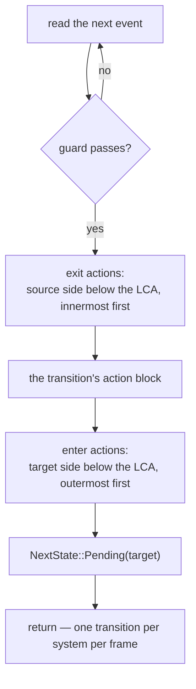

# State Machines

The `machine` construct is Aether's reactive centerpiece: a Harel-lite chart —
nested states, guards, entry/exit actions — that the transpiler **flattens at
compile time**. What reaches the runtime is a flat enum implementing
[`States`](../scheduling/states.md) plus one ordinary system per
(leaf state, event) pair. There is no runtime hierarchy walk, no `dyn`, no queue
beyond the engine's own double-buffered events, and no new runtime type of any
kind.

Machines are **app-scoped** in this build: the state is a world-global
`State<S>` resource, exactly like a hand-written state enum. Per-entity machines
are a designed future path, not a shipped feature.

## Grammar

```ebnf
machine    := 'machine' IDENT '{' 'initial' IDENT ';' state* '}'
state      := 'state' IDENT '{' item* '}'
item       := 'initial' IDENT ';'                         (* a composite's default child *)
            | 'enter' params? BLOCK
            | 'exit'  params? BLOCK
            | 'on' PATH params? ('if' EXPR)? '=>' state_path (BLOCK | ';')
            | state                                       (* nesting *)
state_path := IDENT ('.' IDENT)*                          (* root-anchored: Playing.Paused *)
params     := '(' param (',' param)* ')'                  (* the `system` param grammar *)
```

A machine opens with `initial <State>;` and its body holds nothing but states.
Machine and state names are UpperCamelCase — leaf names concatenate into enum
variants. A `machine` **requires a `plugin` header** in the same block to hold
its `insert_state` and its transition registrations.

Guards and actions use the same parameter grammar as
[systems](systems-and-plugins.md#parameter-sugar): `res<T>`, `mut res<T>`,
`query<…>`, `commands`, and the verbatim escape hatch all work.

## A chart and its flattening

```rust,ignore
aether! {
    plugin Flow;

    machine GameFlow {
        initial Boot;

        state Boot {
            on AssetsReady => Playing;
        }

        state Playing {
            initial Running;
            enter (mut cmds: commands) { cmds.spawn(Hud); }
            exit  (mut cmds: commands) { cmds.despawn_hud(); }

            state Running {
                on PausePressed => Playing.Paused;
            }
            state Paused {
                on PausePressed => Playing.Running;
            }

            on PlayerDied (score: res<Score>) if score.lives == 0 => GameOver {
                // action block: runs on the accepting frame
            }
        }

        state GameOver {
            on RestartPressed => Boot;
        }
    }
}
```

The hierarchy disappears into the enum:

```rust,ignore
#[derive(Clone, Copy, PartialEq, Eq, Hash, Debug)]
pub enum GameFlow {
    Boot,
    PlayingRunning,
    PlayingPaused,
    GameOver,
}
impl ::boyko_ecs::ecs::core::state::States for GameFlow {}

impl GameFlow {
    /// Zero-cost superstate predicate (compile-time group membership).
    #[inline]
    pub const fn in_playing(self) -> bool {
        matches!(self, Self::PlayingRunning | Self::PlayingPaused)
    }
}
```

### The flattening rules

| Rule | Effect |
|------|--------|
| Leaves become variants | `Playing.Running` → `GameFlow::PlayingRunning` (names concatenate) |
| Composites retarget | `=> Playing` resolves through `initial Running;` to `PlayingRunning`, recursively |
| Handlers copy down | A superstate's `on E` is inherited by every descendant leaf that has no `on E` of its own — **innermost wins** |
| Composites get predicates | Each composite emits `const fn in_<name>(self) -> bool` over its leaf set |
| Targets are root-anchored | `Playing.Paused` is resolved from the machine's top level, never relative to the enclosing state |

Because `PlayerDied` is declared on `Playing`, both `Playing` leaves get their
own generated transition system for it — the copy-down happens in the
transpiler, so "bubbling" costs exactly nothing at run time. Handler inheritance
dedupes by the event path's **token spelling**, so spell an event the same way
throughout one chart (`Damage` and `events::Damage` count as two).

## What a transition system does

Each (leaf, event) pair becomes one plain fn named
`__aether_<machine>__<leaf>__<event>`, taking an `EventReader<E>`, a
`ResMut<NextState<M>>`, and the merged parameters of everything it inlines:

```rust,ignore
fn __aether_game_flow__playing_running__player_died(
    mut __aether_ev: EventReader<PlayerDied>,
    mut __aether_next: ResMut<NextState<GameFlow>>,
    score: Res<Score>,          // from the transition's own params (guard)
    mut cmds: Commands,         // from the exit action it inlines
) {
    for _ in __aether_ev.read() {
        if !(score.lives == 0) { continue; }        // guard — verbatim expr
        { cmds.despawn_hud(); }                     // exit  Playing (below the LCA)
        { }                                         // the transition's action block
        *__aether_next = NextState::Pending(GameFlow::GameOver);
        return;                                     // first accepted event wins
    }
}
```

(Engine paths elided; the real emission is fully qualified.) The body order is
fixed and computed from the **lowest common ancestor** of source and target:



Three consequences to keep in mind:

- **A failed guard skips that event, not the frame.** The loop `continue`s, so
  the next queued event still gets its chance.
- **The first accepted event wins.** After a transition is taken the system
  returns; remaining events of that type were not read this frame by *this*
  system.
- **The LCA decides what runs.** `Playing.Running → Playing.Paused` has LCA
  `Playing`, so `Playing`'s `exit` and `enter` do **not** fire — you are not
  leaving `Playing`. Only `Boot → Playing.*` and `Playing.* → GameOver` cross
  that boundary, and the pinned expansion shows exactly that.

### Merged parameters

The transition's own params, plus the params of every `exit` and `enter` action
it inlines, are merged into one signature and deduped by name. Two handlers may
both declare `mut cmds: commands` — that is one parameter. The same **name**
bound to a **different type** across the merged handlers is a compile error
naming the conflict.

## Registration

The sibling plugin holds it all:

```rust,ignore
impl ::boyko_ecs::Plugin for Flow {
    fn build(&self, app: &mut ::boyko_ecs::App) {
        app.insert_state(GameFlow::Boot);
        app.add_systems_cfg(|b| {
            b.add_system(__aether_game_flow__boot__assets_ready)
                .run_if(in_state(GameFlow::Boot));
            b.add_system(__aether_game_flow__playing_running__pause_pressed)
                .run_if(in_state(GameFlow::PlayingRunning));
            // … one registration per generated transition system …
        });
    }
    fn name(&self) -> &'static str { "Flow" }
}
```

`insert_state` seeds the machine-level `initial`, resolved through composite
`initial` chains to a leaf. Every transition system carries
`run_if(in_state(<its leaf>))`, so the dormant cost of a machine idling in
another state is the engine's ordinary run-condition machinery — a bit test, not
a walk. Everything here is existing kernel machinery by name: `States`,
`State<S>` / `NextState<S>`, `insert_state`, the transition pass, `in_state`,
`EventReader`.

## Timing

`NextState::Pending(target)` is a *request*. The engine applies it in its
transition pass at the top of the next `Schedule::run`, which means:

- Guards and actions observe the **pre-transition** world. That is the
  deterministic, allocation-free mapping; the alternative (engine-side enqueued
  action callbacks) would be a `dyn` design and was rejected.
- The new state is visible to `in_state`-gated systems on the following frame.
- Two hops therefore take several frames end to end. The shipped A3 test runs
  six frames to cover two transitions plus the events' one-frame delivery bound.

Because the flattened enum is a first-class `States` type, the whole existing
condition surface applies to it from *outside* the machine —
`on_enter(GameFlow::PlayingPaused)`, `on_exit(…)`, `on_transition(a, b)` on any
ordinary system. Aether adds nothing there and hides nothing.

## Hazards

> **The `run_if`-gated backlog bounce.** A system that does not run does not
> advance its `EventReader` cursor. If two leaves of the same machine transition
> on the **same event type**, the leaf you just entered can read that same event
> out of its backlog and bounce straight back. The shipped A3 test avoids this
> by design: `Running` transitions on `PauseOn`, `Paused` on `PauseOff` — two
> types, two cursors. Give a chart's opposing edges distinct event types, or
> accept that a stale event can be re-observed by the newly active leaf.

> **The initial state's `enter` does not fire at boot (rung A3).**
> `insert_state` seeds the value; the shipped registration adds transition
> systems and nothing else. Entry and exit actions therefore run only inside
> transition systems, so a machine that starts in `Playing` never executes
> `Playing`'s `enter`. Until the initial-enter chain lands (a rung-A4 item), do
> boot-time setup with an ordinary system carrying `on_enter(Machine::Leaf)` —
> which *does* fire once at startup, see
> [States](../scheduling/states.md#the-startup-on_enter) — or with a plain
> startup system.

## A runnable machine

```rust,ignore
use aether::aether;
use boyko_ecs::App;
use boyko_ecs::ecs::core::events::event_config::EventConfig;
use boyko_ecs::ecs::core::state::State;

aether! {
    event AssetsReady { tick: u32, }
    event PauseOn { tick: u32, }
    event PauseOff { tick: u32, }

    plugin Flow;

    system driver(n: mut res<Script>, ar: emit<AssetsReady>, po: emit<PauseOn>) on update {
        n.frame += 1;
        if n.frame == 1 {
            ar.send(AssetsReady {
                participants: AssetsReadyParticipants {},
                parameters: AssetsReadyParameters { tick: 1 },
            })
            .expect("send within lane capacity");
        }
        if n.frame == 3 {
            po.send(PauseOn {
                participants: PauseOnParticipants {},
                parameters: PauseOnParameters { tick: 3 },
            })
            .expect("send within lane capacity");
        }
    }

    machine GameFlow {
        initial Boot;

        state Boot {
            on AssetsReady => Playing;
        }

        state Playing {
            initial Running;
            enter (log: mut res<Script>) { log.entered_playing += 1; }

            state Running {
                on PauseOn => Playing.Paused;
            }
            state Paused {
                on PauseOff => Playing.Running;
            }
        }
    }
}

#[derive(boyko_macros::Resource)]
struct Script {
    frame: u32,
    entered_playing: u32,
}

#[test]
fn machine_transitions_ride_real_events_and_state() {
    let mut app = App::new();
    // Aether declares the event types; the lanes are still yours to register.
    app.world_mut()
        .preregister_event::<AssetsReady>(EventConfig::default_for(2).expect("config"))
        .expect("preregister");
    app.world_mut()
        .preregister_event::<PauseOn>(EventConfig::default_for(2).expect("config"))
        .expect("preregister");
    app.world_mut()
        .preregister_event::<PauseOff>(EventConfig::default_for(2).expect("config"))
        .expect("preregister");
    app.insert_resource(Script { frame: 0, entered_playing: 0 });
    app.add_plugin(Flow);

    for _ in 0..6 {
        app.update();
    }

    let flow = *app.world_mut().resource::<State<GameFlow>>().get();
    assert_eq!(flow, GameFlow::PlayingPaused);
    assert!(flow.in_playing());                       // the flattened predicate
    assert_eq!(app.world_mut().resource::<Script>().entered_playing, 1);
}
```

Note the shape of the send calls: they go through the `#[event]` macro's
two-band rewrite, which Aether inherits rather than replaces — see
[Registering event lanes](data-constructs.md#registering-event-lanes). Full
source: `crates/aether_tests/tests/a3_machine.rs`.

## See also

- [Systems & plugins](systems-and-plugins.md) — the parameter grammar guards and
  actions reuse, and the plugin header a machine requires.
- [States](../scheduling/states.md) — `State<S>`, `NextState<S>`, the transition
  pass, and the `on_enter` / `on_exit` conditions the flattened enum works with.
- [Events](../concepts/events.md) — the reader cursor behind the backlog hazard.
- [Diagnostics](diagnostics.md) — the machine error contract.
- Source: `crates/aether_lang/src/expand.rs` (the `MachineModel` flattener),
  `crates/aether_tests/tests/a3_machine.rs`.
