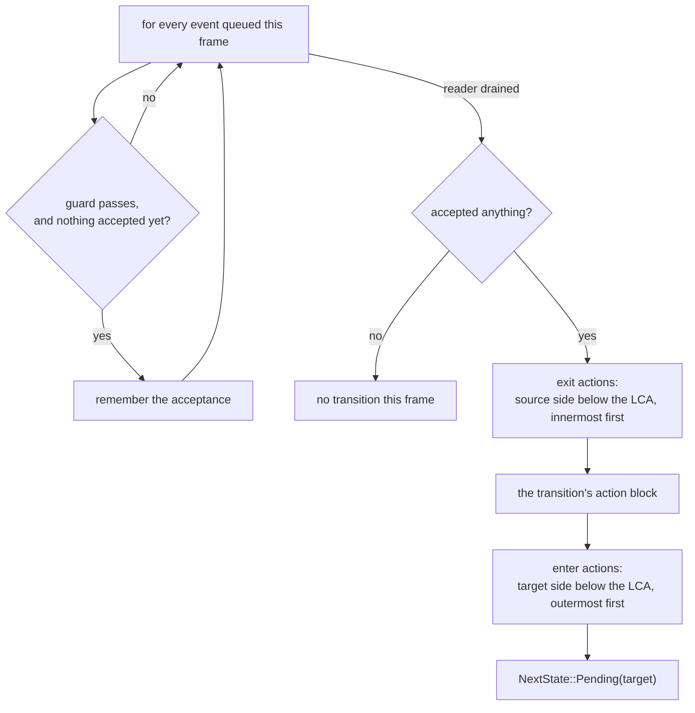

# State Machines

The `machine` construct is Aether's reactive centerpiece: a Harel-lite chart —
nested states, guards, entry/exit actions — that the transpiler **flattens at
compile time**. What reaches the runtime is a flat enum implementing
[`States`](../scheduling/states.md), one ordinary system per (leaf state, event)
pair, and — when the initial state's lineage declares `enter` — one startup
system holding [the initial-enter chain](#the-initial-enter-chain). There is no
runtime hierarchy walk, no `dyn`, no queue beyond the engine's own
double-buffered events, and no new runtime type of any kind.

Machines are **app-scoped** in this build: the state is a world-global
`State<S>` resource, exactly like a hand-written state enum. Per-entity machines
are a designed future path, not a shipped feature.

## Grammar

```ebnf
machine    := 'machine' IDENT '{' 'initial' IDENT ';' state* '}'
state      := 'state' IDENT '{' item* '}'
item       := 'initial' IDENT ';'                         (* a composite's default child *)
            | 'enter' params? BLOCK
            | 'exit'  params? BLOCK
            | 'on' PATH params? ('if' EXPR)? '=>' state_path (BLOCK | ';')
            | state                                       (* nesting *)
state_path := IDENT ('.' IDENT)*                          (* root-anchored: Playing.Paused *)
params     := '(' param (',' param)* ')'                  (* the `system` param grammar *)
```

A machine opens with `initial <State>;` and its body holds nothing but states.
Machine and state names are UpperCamelCase — leaf names concatenate into enum
variants. A `machine` **requires a `plugin` header** in the same block to hold
its `insert_state` and its transition registrations.

Guards and actions use the same parameter grammar as
[systems](systems-and-plugins.md#parameter-sugar): `res<T>`, `mut res<T>`,
`query<…>`, `commands`, and the verbatim escape hatch all work.

## A chart and its flattening

```rust,ignore
aether! {
    plugin Flow;

    machine GameFlow {
        initial Boot;

        state Boot {
            on AssetsReady => Playing;
        }

        state Playing {
            initial Running;
            enter (mut cmds: commands) { cmds.spawn(Hud); }
            exit  (mut cmds: commands) { cmds.despawn_hud(); }

            state Running {
                on PausePressed => Playing.Paused;
            }
            state Paused {
                on PausePressed => Playing.Running;
            }

            on PlayerDied (score: res<Score>) if score.lives == 0 => GameOver {
                // action block: runs on the accepting frame
            }
        }

        state GameOver {
            on RestartPressed => Boot;
        }
    }
}
```

The hierarchy disappears into the enum:

```rust,ignore
#[derive(Clone, Copy, PartialEq, Eq, Hash, Debug)]
pub enum GameFlow {
    Boot,
    PlayingRunning,
    PlayingPaused,
    GameOver,
}
impl ::boyko_ecs::ecs::core::state::States for GameFlow {}

impl GameFlow {
    /// Zero-cost superstate predicate (compile-time group membership).
    #[inline]
    pub const fn in_playing(self) -> bool {
        matches!(self, Self::PlayingRunning | Self::PlayingPaused)
    }
}
```

### The flattening rules

| Rule | Effect |
|------|--------|
| Leaves become variants | `Playing.Running` → `GameFlow::PlayingRunning` (names concatenate) |
| Composites retarget | `=> Playing` resolves through `initial Running;` to `PlayingRunning`, recursively |
| Handlers copy down | A superstate's `on E` is inherited by every descendant leaf that has no `on E` of its own — **innermost wins** |
| Composites get predicates | Each composite emits `const fn in_<name>(self) -> bool` over its leaf set |
| Targets are root-anchored | `Playing.Paused` is resolved from the machine's top level, never relative to the enclosing state |

Because `PlayerDied` is declared on `Playing`, both `Playing` leaves get their
own generated transition system for it — the copy-down happens in the
transpiler, so "bubbling" costs exactly nothing at run time. Handler inheritance
dedupes by the event path's **token spelling**, so spell an event the same way
throughout one chart (`Damage` and `events::Damage` count as two). If two
spellings of one event do reach the same leaf, Aether refuses the chart instead
of emitting it — the generated fn name keys on the path's *last* segment, so
both would mint one name. See
[Charts the flattener refuses](#charts-the-flattener-refuses).

## What a transition system does

Each (leaf, event) pair becomes one plain fn named
`__aether_<machine>__<leaf>__<event>`, taking an `EventReader<E>`, a
`ResMut<NextState<M>>`, and the merged parameters of everything it inlines:

```rust,ignore
fn __aether_game_flow__playing_running__player_died(
    mut __aether_ev: EventReader<PlayerDied>,
    mut __aether_next: ResMut<NextState<GameFlow>>,
    score: Res<Score>,          // from the transition's own params (guard)
    mut cmds: Commands,         // from the exit action it inlines
) {
    let mut __aether_fire = false;
    for _ in __aether_ev.read() {                        // drain: every event, every frame
        if !__aether_fire && (score.lives == 0) {        // guard — verbatim expr
            __aether_fire = true;
        }
    }
    if __aether_fire {                                   // …then act, exactly once
        { cmds.despawn_hud(); }                          // exit  Playing (below the LCA)
        { }                                              // the transition's action block
        *__aether_next = NextState::Pending(GameFlow::GameOver);
    }
}
```

(Engine paths elided; the real emission is fully qualified.) The shape is
**drain-then-act**, and the action order is computed from the **lowest common
ancestor** of source and target:



Four consequences to keep in mind:

- **One transition per machine per frame, and the remainder is discarded.** The
  loop always runs to completion, so the reader's cursor advances past every
  event delivered this frame. Two `Tick`s in one frame produce one transition —
  not one now and one next frame. This is the §5.1 policy, and the shipped test
  `two_same_frame_events_produce_exactly_one_transition` measures it.
- **A failed guard skips that event, not the frame.** Acceptance is a flag, not
  an early exit, so a later queued event can still pass the guard the first one
  failed.
- **The guard stops being evaluated once one event is accepted.** The emitted
  condition is `!__aether_fire && (<your expr>)`, so a guard with side effects
  never runs against the events that are about to be discarded.
- **The LCA decides what runs.** `Playing.Running → Playing.Paused` has LCA
  `Playing`, so `Playing`'s `exit` and `enter` do **not** fire — you are not
  leaving `Playing`. Only `Boot → Playing.*` and `Playing.* → GameOver` cross
  that boundary, and the pinned expansion shows exactly that.

> The earlier shape — act on the first accepted event and `return` from inside
> the loop — is gone as of rung A4. The kernel's `EventIter` advances the cursor
> only past what it *yielded*, so returning mid-drain left the rest of the
> frame's events unread and fired a second transition on the next frame.

### Merged parameters

The transition's own params, plus the params of every `exit` and `enter` action
it inlines, are merged into one signature and deduped by name. Two handlers may
both declare `mut cmds: commands` — that is one parameter. The same **name**
bound to a **different type** across the merged handlers is a compile error
naming the conflict.

Because that merge can push a generated fn past clippy's argument threshold on
params you never wrote in one place, transition systems and the initial-enter
chain carry
[the arity allow](systems-and-plugins.md#generated-fns-and-the-arity-lint).

## The initial-enter chain

`insert_state` seeds the machine's **value**, but nothing in the kernel runs an
entry action for a state nobody transitioned into. A machine that boots inside a
composite would therefore skip every `enter` on the way in. Rung A4 closes that:
the `enter` bodies along the initial leaf's **ancestor path** are emitted as one
startup system, **outermost-first** — the same order the LCA rule uses on a
transition's enter side.

```rust,ignore
machine Sim {
    initial World;

    state World {
        initial Field;
        enter (mut cmds: commands) { cmds.spawn(Ground); }

        state Field {
            initial Idle;
            enter (mut cmds: commands, log: mut res<Probe>) { log.field += 1; }

            state Idle {
                enter (log: mut res<Probe>) { log.idle += 1; }
                on Go => World.Field.Busy;
            }
            state Busy {
                on Stop => World.Field.Idle;
            }
        }
    }
}
```

`initial World` resolves through two composite `initial` hops to
`Sim::WorldFieldIdle`, and the three `enter` bodies along that path become one fn
with their params merged:

```rust,ignore
fn __aether_sim__initial_enter(
    mut cmds: Commands,             // declared by two handlers at one type → one binding
    mut log: ResMut<Probe>,
) {
    { cmds.spawn(Ground); }         // World  — outermost first
    { log.field += 1; }             // Field
    { log.idle += 1; }              // Idle   — the initial leaf itself
}
```

Four properties are pinned:

- **It is a startup system**, registered immediately after `insert_state`, so it
  runs once, pre-loop, before frame 1.
- **The whole ancestor path runs, once.** The shipped E2E asserts
  `world_entered == field_entered == idle_entered == 1`.
- **Later transitions do not replay it.** `Idle → Busy → Idle` re-enters the leaf
  and nothing above it, because both leaves share those ancestors and the LCA
  excludes them — the E2E reads `idle_entered == 2` with `world_entered` still
  `1`.
- **An `enter`-less chain emits nothing at all.** No fn, no registration; an
  empty startup system per machine would be pure expansion volume.

The merged-param rule reaches here too, and the error names *this* site:
``param `x` is declared with conflicting types across the initial state's merged
`enter` chain``.

If you want entry behavior *outside* the machine, the flattened enum is an
ordinary `States` type — put `on_enter(Sim::WorldFieldIdle)` on a system of your
own. That condition also fires once at startup, for a different reason (the
engine synthesizes a `none → initial` transition on the first run); see
[States](../scheduling/states.md#the-startup-on_enter).

## Registration

The sibling plugin holds it all:

```rust,ignore
impl ::boyko_ecs::Plugin for Flow {
    fn build(&self, app: &mut ::boyko_ecs::App) {
        app.insert_state(GameFlow::Boot);
        // Had the initial leaf's lineage declared `enter`, the chain's startup system
        // would be registered right here:
        //     app.add_startup_system(__aether_game_flow__initial_enter);
        // `Boot` declares none, so nothing is emitted and nothing is registered.
        app.add_systems_cfg(|b| {
            b.add_system(__aether_game_flow__boot__assets_ready)
                .run_if(in_state(GameFlow::Boot));
            b.add_system(__aether_game_flow__playing_running__pause_pressed)
                .run_if(in_state(GameFlow::PlayingRunning));
            // … one registration per generated transition system …
        });
    }
    fn name(&self) -> &'static str { "Flow" }
}
```

`insert_state` seeds the machine-level `initial`, resolved through composite
`initial` chains to a leaf. Every transition system carries
`run_if(in_state(<its leaf>))`, so the dormant cost of a machine idling in
another state is the engine's ordinary run-condition machinery — a bit test, not
a walk. Everything here is existing kernel machinery by name: `States`,
`State<S>` / `NextState<S>`, `insert_state`, the transition pass, `in_state`,
`EventReader`.

### Declaration order

`NextState<S>` is a plain resource, so if two transition systems of one machine
fire on the same frame (different events), the **last write wins**. Aether adds
no priority arbitration in v1; what it does add is determinism about *which
order the registrations are emitted in* — and since A4 that order is your
**declaration order**.

That is not free, because inheritance walks each leaf innermost-first: a
superstate handler declared *above* an inner state would otherwise register
after the leaf's own, ordering the block by the shape of the tree instead of by
the source. The parser stamps every `on` handler with its source index, and the
walk re-sorts on it:

```rust,ignore
machine M {
    initial P0;
    state P0 {
        initial A;
        on E1 => X;            // registered first — it is written first
        state A { on E2 => X; }
    }
    state X {}
}
```

Swap those two lines in the source and the registrations swap with them. The
pinned unit test is `registration_follows_declaration_order_not_the_inheritance_walk`.

That order reaches execution, too: every transition system of one machine takes
`ResMut<NextState<M>>`, so any two of them conflict, and the scheduler's
topological tie-break for conflicting systems is insertion order (see
[the scheduler](../scheduler.md)). The handler you wrote last is the one whose
write survives the frame.

## Timing

`NextState::Pending(target)` is a *request*. The engine applies it in its
transition pass at the top of the next `Schedule::run`, which means:

- Guards and actions observe the **pre-transition** world. That is the
  deterministic, allocation-free mapping; the alternative (engine-side enqueued
  action callbacks) would be a `dyn` design and was rejected.
- The new state is visible to `in_state`-gated systems on the following frame.
- **Each leg costs two frames**: one for the transition system to read the event
  and write the request, one for the state pass to apply it. The shipped A4
  chart test walks five legs that way and asserts *every* intermediate state —
  checking only the final one cannot see a composite-`initial` regression that
  landed in the wrong leaf and never fired the edge in between.
- **The initial-enter chain runs earlier than any of this.** It is a startup
  system: pre-loop, before the first `Schedule::run`, before the synthesized
  `none → initial` transition that makes `on_enter(initial)` fire on frame 1.

Because the flattened enum is a first-class `States` type, the whole existing
condition surface applies to it from *outside* the machine —
`on_enter(GameFlow::PlayingPaused)`, `on_exit(…)`, `on_transition(a, b)` on any
ordinary system. Aether adds nothing there and hides nothing.

## Charts the flattener refuses

Flattening is **concatenation**, and the generated fn and predicate names are
its snake_case **collapse**. Both steps are lossy, so two positions in a legal
chart can collide on one emitted name. Left alone, rustc reports "defined
multiple times" pointing at tokens you never wrote; Aether owns the check, so
the message names both chart positions and the name they share:

```text
error: states `A.BC` and `AB.C` both flatten to `ABC` — flattening concatenates the state path, so they would emit one name; rename one
  --> tests/ui/machine_flattened_name_collision.rs:17:19
   |
17 |             state C {}
   |                   ^

error: the first state flattening to this name is here
  --> tests/ui/machine_flattened_name_collision.rs:13:19
   |
13 |             state BC {}
   |                   ^^
```

The same comparison, at each level a name is minted:

- two siblings spelled alike — ``duplicate state `Idle` — sibling states need
  distinct names``;
- ``states `AB` and `Ab` both generate the system `__aether_m__ab__e` `` — the
  variants differ, their snake_case collapse does not;
- ``composite states `AB` and `Ab` … which both collapse to the predicate
  `in_ab` — rename one``;
- ``events `a::E` and `b::E` both generate the system `__aether_m__a__e` for
  leaf `A` `` — inheritance dedupes on the event's full spelling, the fn name
  keys on its last segment. Import one under an alias.

The second family is about **when** a name gets checked. Retargeting and handler
inheritance are lazy walks, so a name no leaf happens to reach was never
resolved at all — and a typo in it expanded clean. Since A4 every declared name
is resolved eagerly, reachability be damned:

- an `initial` on a childless state: ``` `Idle` has no nested states, so
  `initial` has nothing to name — drop it, or nest `state Running { … }` inside
  `Idle` ```;
- an `initial` inside a composite that is never a transition target:
  ``no state `Runing` in `Lonely`; states declared here: `Running` (did you mean
  `Running`?)``;
- the target of a handler that an inner state shadows for the same event, which
  no leaf's inheritance walk ever reaches: ``no state `Nowhere` in `M`; states
  declared here: `P0`, `Top` ``.

Every one of these is a `trybuild` golden; see
[Diagnostics](diagnostics.md#machines) for the full table.

> **The colliding pair moved at A7.** The collapse used to spell a run of
> capitals one letter per word — `GOLD` became `g_o_l_d`, then `gold` — which
> made `AB` and `A_b` collide. With that fixed, they no longer do: they mint
> `__aether_m__ab__e` and `__aether_m__a_b__e`. The collision *fixture* was
> therefore re-aimed at `AB` / `Ab`, a pair the current rule really does
> collapse alike, rather than re-blessed — a compile-fail fixture whose input
> has stopped being a fault still passes, for the wrong reason, and pins
> nothing.

## Hazards

> **The `run_if`-gated backlog bounce.** A system that does not run does not
> advance its `EventReader` cursor. If two leaves of the same machine transition
> on the **same event type**, the leaf you just entered still holds a stale
> cursor, and a leftover event could send it straight back. Measured, the
> shipped A4 chart drives `Running ⇄ Paused` on one `PausePressed` type without
> bouncing — the reader window is exactly **one swap wide**, so the event that
> drove the transition has already left `reader_buf` by the frame the new leaf
> first runs. That holds only while your presses are **at least two frames
> apart**, which is the v1 requirement, not a property of the chart. Give
> opposing edges distinct event types if you cannot guarantee the spacing;
> reader-window-aware arbitration is a §5 v1.1 refinement, not shipped.

## A runnable machine

```rust,ignore
use aether::aether;
use boyko_ecs::App;
use boyko_ecs::ecs::core::events::event_config::EventConfig;
use boyko_ecs::ecs::core::state::State;

aether! {
    event AssetsReady { tick: u32, }
    event PauseOn { tick: u32, }
    event PauseOff { tick: u32, }

    plugin Flow;

    system driver(n: mut res<Script>, ar: emit<AssetsReady>, po: emit<PauseOn>) on update {
        n.frame += 1;
        if n.frame == 1 {
            ar.send(AssetsReady {
                participants: AssetsReadyParticipants {},
                parameters: AssetsReadyParameters { tick: 1 },
            })
            .expect("send within lane capacity");
        }
        if n.frame == 3 {
            po.send(PauseOn {
                participants: PauseOnParticipants {},
                parameters: PauseOnParameters { tick: 3 },
            })
            .expect("send within lane capacity");
        }
    }

    machine GameFlow {
        initial Boot;

        state Boot {
            on AssetsReady => Playing;
        }

        state Playing {
            initial Running;
            enter (log: mut res<Script>) { log.entered_playing += 1; }

            state Running {
                on PauseOn => Playing.Paused;
            }
            state Paused {
                on PauseOff => Playing.Running;
            }
        }
    }
}

#[derive(boyko_macros::Resource)]
struct Script {
    frame: u32,
    entered_playing: u32,
}

/// The kernel's maximum event-lane count (`EventConfig` validates `1..=64`).
const MAX_EVENT_LANES: u32 = 64;

#[test]
fn machine_transitions_ride_real_events_and_state() {
    let mut app = App::new();
    // Aether declares the event types; the lanes are still yours to register.
    app.world_mut()
        .preregister_event::<AssetsReady>(EventConfig::default_for(MAX_EVENT_LANES).expect("config"))
        .expect("preregister");
    app.world_mut()
        .preregister_event::<PauseOn>(EventConfig::default_for(MAX_EVENT_LANES).expect("config"))
        .expect("preregister");
    app.world_mut()
        .preregister_event::<PauseOff>(EventConfig::default_for(MAX_EVENT_LANES).expect("config"))
        .expect("preregister");
    app.insert_resource(Script { frame: 0, entered_playing: 0 });
    app.add_plugin(Flow);

    // Frame 1 sends AssetsReady; three frames cover its delivery plus the state pass.
    for _ in 0..3 {
        app.update();
    }
    let mid = *app.world_mut().resource::<State<GameFlow>>().get();
    assert_eq!(mid, GameFlow::PlayingRunning);        // retargeted through `initial Running`
    assert!(mid.in_playing());                        // the flattened predicate
    assert_eq!(app.world_mut().resource::<Script>().entered_playing, 1);

    // Frame 3 sent PauseOn; three more frames cover its delivery and state pass.
    for _ in 0..3 {
        app.update();
    }
    let flow = *app.world_mut().resource::<State<GameFlow>>().get();
    assert_eq!(flow, GameFlow::PlayingPaused);
    assert_eq!(app.world_mut().resource::<Script>().entered_playing, 1);  // LCA excluded it
}
```

Two things in that test are worth copying into your own:

- **The middle state is asserted, not just the last one.** A regression that
  landed `Boot` directly in `Playing.Paused` satisfies every end-state
  assertion while the `PauseOn` edge never fires at all.
- **Lanes are sized for the kernel maximum, not for a hand-picked small
  number.** `EventConfig::default_for`'s argument is the *worker-lane count*,
  and `EventWriter::send` picks its lane by the id of whichever worker the
  scheduler placed the sending system on. A lane count narrower than the pool
  trips a `debug_assert` on a worker thread, which surfaces as a hang rather
  than a failure. See [Events](../concepts/events.md).

The send calls go through the `#[event]` macro's two-band rewrite, which Aether
inherits rather than replaces — see
[Registering event lanes](data-constructs.md#registering-event-lanes). Full
source: `crates/aether_tests/tests/a3_machine.rs`; the three-level chart and the
initial-enter chain live in `crates/aether_tests/tests/a4_machine_hierarchy.rs`.

## See also

- [Systems & plugins](systems-and-plugins.md) — the parameter grammar guards and
  actions reuse, and the plugin header a machine requires.
- [States](../scheduling/states.md) — `State<S>`, `NextState<S>`, the transition
  pass, and the `on_enter` / `on_exit` conditions the flattened enum works with.
- [Events](../concepts/events.md) — the reader cursor behind the backlog hazard.
- [Diagnostics](diagnostics.md) — the machine error contract.
- Source: `crates/aether_lang/src/expand.rs` (the `MachineModel` flattener, the
  initial-enter chain and the drain-then-act body),
  `crates/aether_tests/tests/a3_machine.rs`,
  `crates/aether_tests/tests/a4_machine_hierarchy.rs`.
