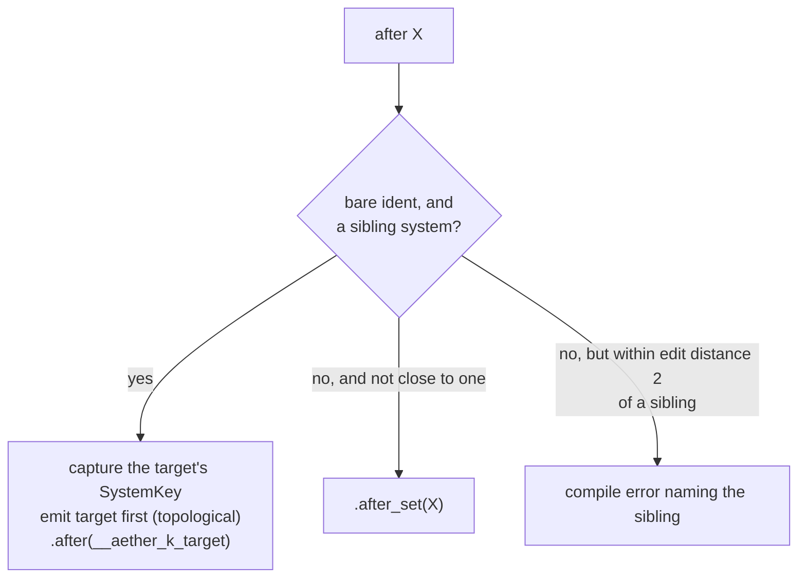

# Systems & Plugins

The `system` construct sugars a system's **signature** and its **registration**.
It never touches the body: everything between the braces is verbatim Rust with
its original spans, so rust-analyzer serves completions and go-to-definition
inside an Aether system exactly as it does inside a normal `fn`.

The `plugin` header is what holds the registrations. A block that schedules
anything needs one.

```ebnf
system   := 'system' IDENT '(' param (',' param)* ')' clause* BLOCK
param    := 'mut'? IDENT ':' param_ty
clause   := 'on' ('startup' | 'update' | 'fixed')
          | 'in' PATH            | 'when' EXPR
          | 'before' PATH        | 'after' PATH
plugin   := 'plugin' IDENT ';'
```

System names are **snake_case** (they expand to fns); plugin names are
**UpperCamelCase** (it expands to a struct). Both are checked in the block, with
a rename in the message.

## Parameter sugar

```ebnf
param_ty := 'query' '<' QUERY_DATA (',' filter)* '>'
          | 'res' '<' TYPE '>'    | 'mut' 'res' '<' TYPE '>'
          | 'local' '<' TYPE '>'  | 'commands'
          | 'events' '<' TYPE '>' | 'emit' '<' TYPE '>'
          | TYPE                                        (* escape: any real SystemParam *)
```

| You write | You get | `mut` binding |
|-----------|---------|---------------|
| `q: query<D>` | `Query<D>` | inferred from `D` |
| `q: query<D, with A, without B>` | `Query<D, (With<A>, Without<B>)>` | inferred from `D` |
| `r: res<T>` | `Res<T>` | no |
| `r: mut res<T>` | `ResMut<T>` | **yes** |
| `l: local<T>` | `Local<T>` | no |
| `c: commands` | `Commands` | **yes** |
| `e: events<E>` | `EventReader<E>` | **yes** |
| `w: emit<E>` | `EventWriter<E>` | **yes** |
| `d: NonSendRes<Gpu>` | `NonSendRes<Gpu>`, untouched | no |

`Res`, `ResMut`, `Local`, `Commands`, `EventReader` and `EventWriter` are emitted
as `::boyko_ecs::ecs::core::system::…`; `Query` and every filter as
`::boyko_ecs::ecs::core::iters::query::…`. You import none of it.

`mut res<T>` is the only two-token type sugar — in the type position, `mut`
pairs with `res` and nothing else.

### Query filters

| Sugar | Filter type |
|-------|-------------|
| `with P` | `With<P>` |
| `without P` | `Without<P>` |
| `added P` | `Added<P>` |
| `changed P` | `Changed<P>` |
| `enabled P` | `Enabled<P>` |
| `disabled P` | `Disabled<P>` |

The filter tuple is built to the shape the kernel wants: **zero** filters omit
the parameter entirely (`Query<D>`), **one** stays bare (`Query<D, With<Alive>>`
— the kernel implements `QueryFilter` for a bare filter, so no one-tuple is
emitted), and **two or more** become a tuple.

The query *data* is verbatim Rust and Aether never validates it. `&T`, `&mut T`,
`Ref<T>`, `Mut<T>`, `Option<&T>`, tuples — whatever
[`QueryData`](../concepts/queries.md) accepts. The trait system is the
authority, and its errors land on your own tokens.

### Mutability inference

A parameter whose expansion needs `&mut self` access gets its `mut` binding
automatically. This removes the single most common piece of Rust boilerplate
noise in system signatures without changing any semantics:

```rust,ignore
aether! {
    system s(a: query<&T>, b: query<&mut T>, c: res<R>, d: events<E>, e: emit<E>,
             f: query<&Mutation>, g: local<u32>) {}
}
```

```rust,ignore
pub fn s(
    a: Query<&T>,
    mut b: Query<&mut T>,          // data mentions `&mut`
    c: Res<R>,
    mut d: EventReader<E>,         // read() takes &mut self
    mut e: EventWriter<E>,
    f: Query<&Mutation>,           // NOT a false positive — see below
    g: Local<u32>,
) {}
```

(Engine paths elided for readability; the real emission is fully qualified.)

Two details:

- **The scan is token-exact, not textual.** It looks for the `mut` and `Mut`
  *identifiers* in the query data, so a type named `Mutation` or a path segment
  `permutation` never triggers it. A substring scan on the printed type would
  have.
- **`events<E>` is included.** This engine's `EventReader::read` takes
  `&mut self` (the per-`(system, E)` cursor lives in the reader), so a
  non-`mut` reader binding could never be read. The design plan's inference list
  omitted `events`; the shipped table includes it.

You may always write `mut` yourself — an explicit `mut` and an inferred one
produce the same binding. For a verbatim escape-hatch parameter, writing it is
the only way, because Aether does not inspect types it does not own.

### The escape hatch

Anything the sugar does not claim passes through as a verbatim type, so any real
`SystemParam` works the day the engine gains it, with no Aether release:

```rust,ignore
system draw(dev: NonSendRes<GpuDevice>, mut assets: NonSendResMut<Assets<MeshGpu>>) on update { … }
```

The sugar keywords are **contextual**: a sugar applies only when its own syntax
follows it. `query::Thing`, a bare user type named `res`, and
`commands::Something` all fall through to the verbatim path.

## Clauses

| Clause | Emits | Repeatable |
|--------|-------|------------|
| `on startup` | `app.add_startup_system(f)` | no — one schedule per system |
| `on update` | registration inside `app.add_systems_cfg(…)` (Main) | no |
| `on fixed` | registration inside `app.add_systems_cfg_in(CoreSchedule::Fixed, …)` | no |
| `in Set` | `.in_set(Set)` | yes |
| `before X` / `after X` | `.before(key)` / `.after(key)`, or `.before_set(X)` / `.after_set(X)` | yes |
| `when EXPR` | `.run_if(EXPR)` | yes |

`when` takes a verbatim expression — `in_state(GameFlow::Playing)`, `run_once`,
your own condition fn — parsed so the system's body brace is never swallowed as
a struct literal. See [Run conditions](../scheduling/run-conditions.md).

A system with **no `on` clause** lands on Main, the engine's own default for
`add_systems_cfg`.

## The `plugin` header

```rust,ignore
plugin Movement;
```

- **At most one per block.** A second one is an error naming both.
- **Scheduling clauses require it.** A block with `on` / `after` / `when` but no
  plugin has nowhere to hold the registration, and says so.
- **A clause-free system needs no plugin.** It expands to a plain `pub fn` you
  register by hand — useful for helper systems or for handing a fn to
  `add_systems` yourself.
- **With a plugin present, every sibling system is registered** — clause-free
  ones land on Main, unordered. The plugin collects the block.

The generated plugin is an ordinary `impl Plugin`, so everything on the
[App & Plugins](../app/plugins.md) page applies: it is consumed at `add_plugin`
time, and adding the same plugin type twice panics.

```rust,ignore
pub struct Movement;
impl ::boyko_ecs::Plugin for Movement {
    fn build(&self, app: &mut ::boyko_ecs::App) {
        // 1. startup one-shots, in source order
        // 2. Main:  app.add_systems_cfg(|b| { … })
        // 3. Fixed: app.add_systems_cfg_in(CoreSchedule::Fixed, |b| { … })
    }
    fn name(&self) -> &'static str { "Movement" }
}
```

## Ordering by sibling name

`before` / `after` take **either** a `SystemSet` path **or** the bare name of a
sibling system in the same block. The two produce different code, and Aether
picks by looking the name up in the block:



Sibling ordering rides the engine's own handle-forwarding API:
`SystemConfig::key()` yields a `SystemKey`, and `.after(key)` consumes it. That
means the target must be registered **before** the referrer, so Aether
topologically sorts the emission inside each schedule bucket:

```rust,ignore
aether! {
    plugin P;
    system a() on update before z {}
    system z() on update {}
}
```

```rust,ignore
app.add_systems_cfg(|b| {
    let __aether_k_z = b.add_system(z).key();     // emitted first: its key is needed
    b.add_system(a).before(__aether_k_z);
});
```

The sort is stable (lowest source index first), so the emission is
deterministic. Four rules keep the mapping honest:

- **A cycle among siblings is a compile error**, naming every member. The engine
  would also catch it at `build()` as `ScheduleBuildError::OrderingCycle`;
  Aether says it earlier and points at source.
- **Cross-schedule sibling ordering is refused.** A Main system cannot be
  ordered against a Fixed one — that relation is not expressible.
- **Ordering against a startup system is refused.** Startup systems run once,
  pre-loop; there is nothing to order against.
- **A near-miss name is an error, not a silent fallback.** `after read_inpt`
  when a sibling `read_input` exists reports the near-miss instead of quietly
  emitting `after_set(read_inpt)` and leaving you with rustc's unresolved-name
  error. The cost of that choice: a *real* `SystemSet` type whose name is within
  edit distance 2 of a sibling system must be referenced by a qualified path
  (`sets::ReadInput`) to pass through. This is a deliberate deviation from the
  design plan, which wanted a note attached to rustc's error — stable
  proc-macros cannot attach notes to downstream errors.

See [Ordering & sets](../scheduling/ordering-and-sets.md) for what the edges
mean once they reach the scheduler.

## Schedules

```rust,ignore
aether! {
    plugin Sim;
    system boot(mut cmds: commands) on startup { … }
    system step(q: query<&mut Body, with Alive>) on fixed after PhysicsSet { … }
    system draw(dev: NonSendRes<Gpu>) on update { … }
}
```

```rust,ignore
impl ::boyko_ecs::Plugin for Sim {
    fn build(&self, app: &mut ::boyko_ecs::App) {
        app.add_startup_system(boot);
        app.add_systems_cfg(|b| {
            b.add_system(draw);
        });
        app.add_systems_cfg_in(::boyko_ecs::ecs::core::app::CoreSchedule::Fixed, |b| {
            b.add_system(step).after_set(PhysicsSet);
        });
    }
    fn name(&self) -> &'static str { "Sim" }
}
```

`on startup` accepts **no other clause**. The engine runs startup systems once,
before the loop, single-threaded — `in`, `before`, `after` and `when` have no
meaning there, and the parser rejects them on the offending clause's own
keyword. If you need ordered setup, use an `on_enter`-gated system instead (see
[States](../scheduling/states.md)).

`on fixed` routes into the fixed-timestep schedule; a Fixed system reads
`Res<FixedTime>` for its delta. See [Time & fixed timestep](../app/time.md).

## The body is untouched

Aether sugars the signature and the registration, never the code. This is worth
stating plainly because it is what makes the DSL safe to adopt: there is no
Aether expression syntax, no Aether control flow, no Aether-invented method. The
`for (p, v) in &mut q { p.x += v.v; }` you write is the `for` loop that ends up
in the binary, character for character.

## Complete example

Condensed from the shipped A2 integration test — a startup spawn, an `after`
edge whose observable is asserted every frame, and a `when` gate that must hold
its system shut:

```rust,ignore
use aether::aether;
use boyko_ecs::App;

aether! {
    component Position { x: f32, }
    component Velocity { v: f32, }

    bundle Mover {
        pos: Position,
        vel: Velocity,
    }

    plugin Movement;

    system boot(mut cmds: commands) on startup {
        cmds.spawn(Mover { pos: Position { x: 0.0 }, vel: Velocity { v: 2.0 } });
    }

    system integrate(q: query<(&mut Position, &Velocity)>, log: mut res<SeqLog>) on update {
        for (p, v) in &mut q {
            p.x += v.v;
        }
        log.integrate_runs += 1;
    }

    system check_order(log: mut res<SeqLog>) on update after integrate {
        // The after-edge's observable: integrate has ALREADY run this frame, every frame.
        log.order_ok = log.order_ok && (log.integrate_runs == log.check_runs + 1);
        log.check_runs += 1;
    }

    system frozen(log: mut res<SeqLog>) on update when never {
        log.frozen_ran = true;
    }
}

#[derive(boyko_macros::Resource)]
struct SeqLog {
    integrate_runs: u32,
    check_runs: u32,
    order_ok: bool,
    frozen_ran: bool,
}

fn never() -> bool { false }
```

Full source: `crates/aether_tests/tests/a2_system_plugin.rs`.

## See also

- [Aether overview](overview.md) — the macro and what it expands to.
- [State machines](state-machines.md) — `machine`, which reuses this exact
  parameter grammar for its guards and actions.
- [Diagnostics](diagnostics.md) — every clause and parameter error contract.
- [Systems](../concepts/systems.md), [Queries](../concepts/queries.md),
  [Commands](../concepts/commands.md) — the underlying surface.
- [Ordering & sets](../scheduling/ordering-and-sets.md),
  [Run conditions](../scheduling/run-conditions.md),
  [App & Plugins](../app/plugins.md) — where the registrations land.
- Source: `crates/aether_lang/src/parse.rs`, `crates/aether_lang/src/expand.rs`.
