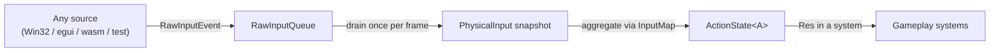

# Input

`boyko_input` turns raw keyboard and mouse events into typed, named **actions**.
Your game logic asks "is `Jump` pressed this frame?" — never "is the `Space`
scancode down?". Bindings live in data, so they are remappable at runtime and
loadable from a config file; gameplay code never changes when a player rebinds a
key.

The crate is **source-agnostic**. Raw events arrive through one seam type
([`RawInputEvent`]) from *any* producer — a native raw-FFI Win32 window, the
in-engine egui demo, a synthetic test stream — and the action layer depends on no
windowing library. As a result it compiles on **every target, including wasm**
(`wasm32-unknown-unknown`); the OS-specific translators live behind feature-gated
edge adapters that the core never references.

## Why an action layer

Most engines hand systems the raw key state and let each one hard-code its own
key checks. That couples every gameplay system to physical keys, makes rebinding
a cross-cutting rewrite, and scatters input handling across the codebase.

boyko-engine inverts this:



- A source pushes [`RawInputEvent`] values into a [`RawInputQueue`].
- Once per frame the ingest system drains the queue into a [`PhysicalInput`]
  snapshot and aggregates it — through your binding map — into the typed
  [`ActionState<A>`].
- Gameplay systems read `Res<ActionState<A>>` and ask about *actions*.

The action set is a single **compile-time-closed enum**, not a runtime registry.
That gives a `const COUNT` and a dense `0..COUNT` index, so [`ActionState`] and
[`InputMap`] are fixed-size arrays: zero runtime registration, zero hashing, and
the hot "is action N pressed?" query is one [`BitSet256`] bit test across one
cache line. You rebind *inputs*, never invent *actions* at runtime.

## Step 1: define your actions

Derive [`Actionlike`] on a plain enum. Each variant is one action. By default an
action is a **button**; annotate a variant with `#[actionlike(Axis1D)]` or
`#[actionlike(Axis2D)]` to make it an analog axis.

```rust,ignore
use boyko_macros::Actionlike;

#[derive(Actionlike, Clone, Copy, PartialEq, Eq, Debug)]
enum GameplayAction {
    Jump,                  // a Button (the default kind)
    Fire,
    #[actionlike(Axis2D)]  // a 2D axis (WASD / stick movement)
    Move,
}
```

The derive emits the `Actionlike` impl: a `const COUNT`, a dense `index()`, the
inverse `from_index()`, plus per-variant `kind()` and `name()`. The name is the
stable identifier used by the `.keys` config format and any rebind UI. A
compile-time assert keeps `COUNT <= 256` (the [`BitSet256`] capacity).

The derive macro comes from `boyko_macros`; the [`Actionlike`] trait it
implements is in the input prelude. Bring both in with:

```rust,ignore
use boyko_input::prelude::*;   // Actionlike trait, InputMap, ActionState, BindSpec, KeyCode, ...
use boyko_macros::Actionlike;  // the #[derive(Actionlike)] macro
```

## Step 2: bind inputs to actions

Build an [`InputMap<A>`] with the builder. Each [`BindSpec`] is one binding for an
action; an action may have several. Bindings are stored `#[repr(u8)]` in a flat
arena and `match`-dispatched at runtime — no boxing per binding, no virtual
dispatch.

```rust,ignore
use boyko_input::prelude::*;

# #[derive(Clone, Copy, PartialEq, Eq, Debug)]
# enum GameplayAction { Jump, Fire, Move }
# impl Actionlike for GameplayAction {
#     const COUNT: usize = 3;
#     fn index(self) -> usize { self as usize }
#     fn from_index(i: usize) -> Option<Self> {
#         [Self::Jump, Self::Fire, Self::Move].get(i).copied()
#     }
#     fn kind(self) -> ActionKind {
#         match self { Self::Move => ActionKind::Axis2D, _ => ActionKind::Button }
#     }
#     fn name(self) -> &'static str {
#         match self { Self::Jump => "Jump", Self::Fire => "Fire", Self::Move => "Move" }
#     }
# }
let map = InputMap::builder()
    .bind(GameplayAction::Jump, BindSpec::Key(KeyCode::Space))
    .bind(GameplayAction::Fire, BindSpec::Mouse(MouseButton::Left))
    .wasd(GameplayAction::Move)            // preset: a normalized WASD 2D axis
    .clash(ClashStrategy::PrioritizeLongest)
    .build();
```

Available [`BindSpec`] variants:

| Variant | Action kind | Meaning |
|---------|-------------|---------|
| `Key(KeyCode)` | Button | one physical key |
| `Mouse(MouseButton)` | Button | one mouse button |
| `Chord { keys, len }` | Button | all keys held together, e.g. `Ctrl+S` (build with `BindSpec::chord(&[..])`, up to `MAX_CHORD_KEYS`) |
| `Axis1 { neg, pos, dz }` | Axis1D | a signed 1D axis from two opposing button legs, with a deadzone |
| `Axis2 { up, down, left, right, dz, mode }` | Axis2D | a 2D axis from four button legs (the `.wasd(..)` preset is this) |
| `None` | — | an explicit unbind (the slot is intentionally empty) |

The axis legs use [`InputRef`] (`InputRef::Key(..)` or `InputRef::Mouse(..)`).
For a 2D composite, [`AxisMode::DigitalNormalized`] normalizes diagonals to unit
length (no diagonal speed boost — the WASD default); `DigitalRaw` leaves the raw
sum.

`Stick` exists as a reserved gamepad seam — it is parsed and round-tripped by the
`.keys` format but **ignored at runtime in v1**. Gamepad support is not yet
shipped.

### Clashes

When `Ctrl+S` and a bare `S` are both bound and both held, which fires?
[`ClashStrategy::PrioritizeLongest`] (the default) suppresses the binding whose
key-set is a strict subset of another active binding — so `Ctrl+S` fires and bare
`S` does not. `ClashStrategy::AllowAll` fires both.

## Step 3: wire it into the app

Add an [`InputPlugin`] per action enum. It inserts the source-agnostic raw
resources and the per-`A` [`ActionState`] / [`InputMap`] (allocating their fixed
buffers once on the cold build path), and registers the ingest system on
`CoreSchedule::Main`, ordered **before** the [`GameplaySet`] so gameplay systems
see a freshly-updated state each frame.

```rust,ignore
use boyko_ecs::ecs::core::app::App;
use boyko_input::prelude::*;

# let map = InputMap::<()>::builder().build(); // illustrative
let mut app = App::new();
app.add_plugin(InputPlugin::new(map));
//             ^ optionally .with_keys_path("config/keybinds.keys")
```

The ingest runs once per frame on the variable (Main) step, never on the fixed
step — input is *sampled* once per frame, and the fixed loop reads a frame-stable
snapshot (see [Fixed-step reads](#fixed-step-reads) below).

## Step 4: read action state in a system

Take `Res<ActionState<A>>` and query by action. The accessors are branchless bit
tests; analog values live in a separate cold array a button-only game never
touches.

```rust,ignore
use boyko_ecs::prelude::*;
use boyko_input::prelude::*;

# #[derive(Clone, Copy, PartialEq, Eq, Debug)]
# enum GameplayAction { Jump, Fire, Move }
# impl Actionlike for GameplayAction {
#     const COUNT: usize = 3;
#     fn index(self) -> usize { self as usize }
#     fn from_index(i: usize) -> Option<Self> {
#         [Self::Jump, Self::Fire, Self::Move].get(i).copied()
#     }
#     fn kind(self) -> ActionKind {
#         match self { Self::Move => ActionKind::Axis2D, _ => ActionKind::Button }
#     }
#     fn name(self) -> &'static str {
#         match self { Self::Jump => "Jump", Self::Fire => "Fire", Self::Move => "Move" }
#     }
# }
fn player_input(input: Res<ActionState<GameplayAction>>) {
    if input.just_pressed(GameplayAction::Jump) {
        // rising edge: fire exactly once on the frame the key goes down
    }
    if input.pressed(GameplayAction::Fire) {
        // level: true on every frame the button is held (auto-fire)
    }

    // Axis2D: a deadzoned, clamped [x, y] (diagonals normalized for WASD)
    let [mx, my] = input.axis2(GameplayAction::Move);
    let _ = (mx, my);
}
```

The state accessors, all keyed by your action value:

| Accessor | Returns | Use for |
|----------|---------|---------|
| `pressed(a)` | `bool` | held this frame (level) |
| `just_pressed(a)` | `bool` | rising edge — fire once on key-down |
| `just_released(a)` | `bool` | falling edge — fire once on key-up |
| `value(a)` | `f32` | analog magnitude: Button `0..1`, Axis1D `-1..1` |
| `axis2(a)` | `[f32; 2]` | deadzoned + clamped 2D vector for an Axis2D action |
| `consume(a)` | — | mark `a` handled this frame; later reads see it inactive |

`consume` lets one system claim an action so a lower-priority system in the same
frame does not also react to it (e.g. a pause menu consuming `Confirm` so
gameplay never sees it).

## Fixed-step reads

A system on the **fixed** timestep (physics) must not read the live
`just_pressed`, because a render frame can run zero or many fixed substeps. For
this case [`ActionState`] carries a **frame-stable fixed snapshot**, read with the
`fixed_*` accessors:

| Variable (Main) | Fixed-loop equivalent |
|-----------------|-----------------------|
| `pressed(a)` | `fixed_pressed(a)` |
| `just_pressed(a)` | `fixed_just_pressed(a)` |
| `just_released(a)` | `fixed_just_released(a)` |
| `value(a)` | `fixed_value(a)` |
| `axis2(a)` | `fixed_axis2(a)` |

A single physical press is reported as `fixed_just_pressed` for **exactly one**
fixed batch — never missed across a zero-substep render frame, never
double-counted across a multi-substep one. A fixed system that wants "fire once
per press" reads `fixed_just_pressed` and acts idempotently per frame; one that
wants "act every substep while held" reads `fixed_pressed`. See
[`Time` / fixed timestep](time.md) for the frame structure this builds on.

## Feeding events from a source

Whoever owns the OS window pushes raw events into the [`RawInputQueue`]. The
single seam is [`RawInputEvent`] — a plain enum (`Key`, `MouseButton`,
`MouseMotion`, `CursorMoved`, `Wheel`, focus/enter/leave, ...), matched, never a
`Box<dyn Backend>`:

```rust,ignore
use boyko_input::prelude::*;

# fn ex(queue: &mut RawInputQueue) {
queue.push_raw(RawInputEvent::Key {
    code: KeyCode::Space,
    state: ButtonState::Pressed,
    repeat: false,
});
# }
```

For the in-house Win32 window, the crate ships a **pure** translator,
`translate_win32` (re-exported from `win32::translate`), that maps a raw
`(msg, wparam, lparam)` triple to a `RawInputEvent` with no FFI and no windowing
dependency — keeping `boyko_input` a leaf crate. On wasm or under tests you simply
push events from whatever source you have; the action layer is identical.

## Rebinding and persistence

Bindings are data, so they can be changed at runtime and saved to disk.

- **Runtime rebind** — a [`RebindSession`] enters "listen mode" for one
  `(action, slot)`. The application forwards UI input through `RebindSession::feed`
  until it captures the next gameplay-relevant press, writes it into the map, and
  reports [`RebindOutcome`] (`Bound`, `Conflict { existing }`, or `Cancelled`).
  The engine never owns the rebind UI; it only captures and conflict-checks.
- **Config file** — the in-house, human-editable `.keys` text format
  (`load_keys` / `save_keys`, no serde/toml). Point a plugin at one with
  `InputPlugin::new(map).with_keys_path("config/keybinds.keys")`: at build the
  file is applied as an **override-delta** over the code defaults — actions the
  file omits keep their defaults, actions it mentions are fully overridden. A
  missing or unreadable file silently falls back to the defaults, and a per-line
  parse error is recoverable, so a hand-edited config never bricks the game.

Both are cold, off-the-hot-path operations: the per-frame ingest does **zero**
heap allocation — every buffer is preallocated at plugin build.

## See also

- [Systems](../concepts/systems.md) — how a system takes `Res<ActionState<A>>`
- [Resources](../concepts/resources.md) — `ActionState<A>` and `InputMap<A>` are per-`A` resources
- [`Time` / fixed timestep](time.md) — the frame structure behind the `fixed_*` accessors
- Source: [`boyko_input`](https://github.com/bluesteelll/boyko-engine/blob/ecs/crates/boyko_input/src/lib.rs),
  [`actionlike.rs`](https://github.com/bluesteelll/boyko-engine/blob/ecs/crates/boyko_input/src/action/actionlike.rs),
  [`state.rs`](https://github.com/bluesteelll/boyko-engine/blob/ecs/crates/boyko_input/src/action/state.rs),
  [`map.rs`](https://github.com/bluesteelll/boyko-engine/blob/ecs/crates/boyko_input/src/action/map.rs),
  [`plugin.rs`](https://github.com/bluesteelll/boyko-engine/blob/ecs/crates/boyko_input/src/plugin.rs)

[`Actionlike`]: https://github.com/bluesteelll/boyko-engine/blob/ecs/crates/boyko_input/src/action/actionlike.rs#L45
[`ActionState`]: https://github.com/bluesteelll/boyko-engine/blob/ecs/crates/boyko_input/src/action/state.rs#L42
[`ActionState<A>`]: https://github.com/bluesteelll/boyko-engine/blob/ecs/crates/boyko_input/src/action/state.rs#L42
[`InputMap`]: https://github.com/bluesteelll/boyko-engine/blob/ecs/crates/boyko_input/src/action/map.rs#L132
[`InputMap<A>`]: https://github.com/bluesteelll/boyko-engine/blob/ecs/crates/boyko_input/src/action/map.rs#L132
[`BindSpec`]: https://github.com/bluesteelll/boyko-engine/blob/ecs/crates/boyko_input/src/action/map.rs#L55
[`InputRef`]: https://github.com/bluesteelll/boyko-engine/blob/ecs/crates/boyko_input/src/action/map.rs#L32
[`AxisMode::DigitalNormalized`]: https://github.com/bluesteelll/boyko-engine/blob/ecs/crates/boyko_input/src/action/map.rs#L40
[`ClashStrategy::PrioritizeLongest`]: https://github.com/bluesteelll/boyko-engine/blob/ecs/crates/boyko_input/src/action/map.rs#L118
[`InputPlugin`]: https://github.com/bluesteelll/boyko-engine/blob/ecs/crates/boyko_input/src/plugin.rs#L56
[`GameplaySet`]: https://github.com/bluesteelll/boyko-engine/blob/ecs/crates/boyko_input/src/plugin.rs#L37
[`RawInputEvent`]: https://github.com/bluesteelll/boyko-engine/blob/ecs/crates/boyko_input/src/raw/event.rs#L18
[`RawInputQueue`]: https://github.com/bluesteelll/boyko-engine/blob/ecs/crates/boyko_input/src/raw/queue.rs
[`PhysicalInput`]: https://github.com/bluesteelll/boyko-engine/blob/ecs/crates/boyko_input/src/raw/queue.rs
[`RebindSession`]: https://github.com/bluesteelll/boyko-engine/blob/ecs/crates/boyko_input/src/action/rebind.rs#L37
[`RebindOutcome`]: https://github.com/bluesteelll/boyko-engine/blob/ecs/crates/boyko_input/src/action/rebind.rs#L20
[`BitSet256`]: https://github.com/bluesteelll/boyko-engine/blob/ecs/crates/boyko_utils/src/bit_mask/bit_set_256.rs
