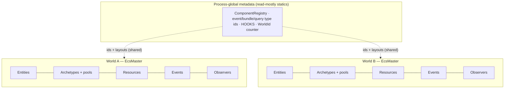

# Multiple Worlds

A *world* is one self-contained ECS instance: its entities, its archetypes, its
component storage, its resources, its events. In boyko-engine a world is exactly
one [`EcsMaster`]. You can create as many as you like in a single process — they
share nothing but read-only type metadata.

This is an **advanced** topic. The vast majority of games run a single world
(usually wrapped in one [`App`](./plugins.md)). Reach for multiple worlds when you
genuinely need *isolated* simulations side by side: a headless server world plus a
client prediction world, an editor's live scene plus a paused preview, or a test
harness that spins up disposable worlds. If you only want to group *systems*, you
want [schedule sets](../scheduling/ordering-and-sets.md), not a second world.

## One `EcsMaster` is one world

Every constructor mints a fresh world:

```rust,ignore
use boyko_ecs::prelude::*; // EcsMaster

let a = EcsMaster::new();
let b = EcsMaster::with_capacity(4096, 64); // entity + archetype capacity

// Two fully independent worlds. They share no entities, no storage, no resources.
assert_ne!(a.world_id(), b.world_id());
```

Each world owns:

- its **entity allocator** (per-world ids and generations),
- its **archetypes** and **component pools** (each pool on its own
  [virtual-memory reservation](../memory/arena.md)),
- its **resources** (`Send` slab + lazy `!Send` slab),
- its **events** (one `EventDispatcher` per world),
- its **observers**, **hooks flags**, **change ticks**, and the per-world
  **bundle / query-state caches**.

Operating on world `a` never touches world `b`. Spawning, despawning, mutating,
and `clear()` are all world-local. There is no global "the world" — the engine
never holds an implicit current world; you always pass `&mut EcsMaster`
explicitly.

## World-owned state vs. global metadata

The line between the two is the whole design, so it is worth stating precisely.

| Lives **per world** (on `EcsMaster`) | Lives **process-global** (static, read-mostly) |
|---|---|
| Entities, generations, recycling | Component / event / resource **type ids** |
| Archetypes + `ComponentPool` storage | Component **layouts** (size/align/drop fn) |
| Resources (`Send` and `!Send`) | Bundle-type and query-type registries |
| Event buffers (`EventDispatcher`) | The hooks table (`HOOKS`) |
| Observers | The `WorldId` counter |
| Change-detection ticks | — |
| Bundle / query-state caches | — |

The global side is **metadata only** — ids and layouts, assigned once per *type*,
identical across every world. It carries no entity data, so two worlds using the
same component type read the same `ComponentId` but store rows in separate pools.
That is what lets the `Entity` handle stay a tight 8 bytes and what lets a
component's layout be resolved once and reused everywhere.



## `WorldId`

Each `EcsMaster` is stamped at construction with a process-unique [`WorldId`] — a
`#[repr(transparent)]` newtype over a `u64` handed out by a single relaxed atomic
counter. Two equal ids always mean the same world: there is no public constructor,
so an id cannot be forged.

```rust,ignore
use boyko_ecs::prelude::*; // EcsMaster
use boyko_ecs::ecs::identifiers::primitives::WorldId;

let world = EcsMaster::new();
let id: WorldId = world.world_id();
println!("{id}");        // "WorldId(7)" — the number is opaque
let raw: u64 = id.get(); // diagnostics only; carries no meaning beyond uniqueness
```

`WorldId` exists to give per-world caches a cheap identity check. Its headline job
is binding schedules to worlds.

## The `WorldId` ↔ `Schedule` binding

A [`Schedule`](../scheduler.md) is built against a specific world. During the build,
some systems cache **per-world pointers**: an `EventReader` caches the
`NonNull<EventBuffer>` of *that* world's dispatcher, a `Query` caches archetype
generation snapshots from *that* world's archetype set. Those caches are valid
only against the world they were built on.

So a `Schedule` records the `WorldId` of its build world, and `Schedule::run`
checks it on every frame:

```rust,ignore
use boyko_ecs::prelude::*; // EcsMaster
use boyko_ecs::ecs::core::schedule::ScheduleBuilder;
use boyko_threadpool::ThreadPoolBuilder;

let pool = ThreadPoolBuilder::new().num_threads(1).build();
let mut a = EcsMaster::new();
let mut b = EcsMaster::new();

let mut builder = ScheduleBuilder::new(pool);
builder.add_system(|| { /* ... */ });
let mut schedule = builder.build(&mut a); // bound to A's WorldId

schedule.run(&mut a); // OK — same world

// schedule.run(&mut b); // PANIC: boyko-B9101 — built on A, run on B
```

The check is a single `u64` compare, predicted-not-taken, with the panic body
kept out of line (`#[cold]`). It costs effectively nothing on the hot path
(measured at +0.06 ns on an empty 50-system run) and it is a **release-level**
panic, not a `debug_assert!`. That is deliberate: a cross-world `run` would
dereference cached pointers against the wrong world — a use-after-free surface —
so it must fail loudly in every build. This matches Bevy, whose `Schedule::run`
also panics when handed a different world.

Using [`App`](./plugins.md) makes this binding invisible: each `App` owns one
world and one set of schedules, builds them lazily against its own world, and
always runs them against that same world. You only meet `boyko-B9101` if you
build schedules by hand and cross the wires.

## The hooks-staleness gate

Component **hooks** (`on_add`, `on_remove`, …) are registered against a *type* and
stored in the process-global `HOOKS` table — so a hook is, by design, shared by
every world that uses that component. (Observers, by contrast, live on each
world's `ArchetypeMaster` and are strictly per-world.)

This asymmetry hides a trap. Hooks may only be installed for a component **before**
that component first lands in any live archetype, because installing them flips
per-archetype flags that gate the hook dispatch. If a *different* world has already
archetyped the component, those existing archetypes would keep stale flags and the
freshly-registered hook would be silently skipped there.

A naive per-world "has this been archetyped yet?" scan misses this — the world you
are registering on may be empty while another world is full. boyko-engine closes
the gap with a process-global `EVER_ARCHETYPED` bitset, set at *both* archetype-mint
funnels, and checked by `register_component_hooks`. Registering hooks for a
component that already appears in a live archetype *in any world* panics, rather
than installing a hook that would fire inconsistently:

```rust,ignore
use boyko_ecs::prelude::*; // EcsMaster

#[derive(boyko_macros::Component)]
#[repr(C)]
struct Hooked(u32);

let mut b = EcsMaster::new();
let _arch = b.create_archetype(&[Hooked::component_id()]); // B archetypes Hooked

let mut a = EcsMaster::new();
// PANIC: "already appears in a live archetype" — hooks are process-global,
// so installing them now would be silently skipped in B's existing archetype.
let _builder = a.register_component_hooks::<Hooked>();
```

The fix is ordering: register hooks during setup, before any world archetypes the
component. With a single world (or `App`) this is the natural flow and you never
see the panic.

## Sharing a thread pool across worlds

Worlds are independent, but their schedules can share one [`ThreadPool`]. Two
`App`s can run on the same pool via [`App::with_pool`], interleaving their frames:

```rust,ignore
use boyko_ecs::prelude::*; // App
use boyko_threadpool::ThreadPoolBuilder;
use std::sync::Arc;
use std::time::Duration;

// ThreadPoolBuilder::build() already returns an Arc<ThreadPool>.
let pool = ThreadPoolBuilder::new().num_threads(2).build();

let mut server = App::with_pool(Arc::clone(&pool));
let mut client = App::with_pool(Arc::clone(&pool));
// ... add_systems / init_state / finish each app ...

let step = Duration::from_nanos(15_625_000); // one 64 Hz tick
for _ in 0..4 {
    server.update_with_delta(step);
    client.update_with_delta(step);
}
```

Each `App` still owns its own world and its own events. One caveat applies to
events on a shared pool: an event lane must be sized for *all* threads that might
touch it. Preregister with `EventConfig::default_for(worker_count + 1)` so every
worker lane plus the dispatcher lane is in range for both worlds. An event sent in
one world is never visible in the other — buffers are world-owned even when the
pool is shared.

## Current scope — be honest about the edges

Multiple worlds are isolated *simulations*, not a transfer mechanism. A few sharp
edges are deliberate trade-offs, kept for the sake of the 8-byte `Entity`:

- **`Entity` is not world-tagged.** Each world hands out ids and generations from
  its own space, so the first entity of *every* world carries the identical
  `(id, generation)` pair. A handle from world A used against world B does **not**
  error — it silently resolves to B's *own* row at that slot. The contract is
  "don't cross `Entity` handles between worlds." This matches Bevy. An *out-of-range*
  foreign handle reads as absent (`None` / `false`), never UB.
- **No built-in cross-world data transfer.** There is no `extract`/sub-app pipeline
  yet (the render-world transfer pattern). Moving entities between worlds means
  reading them out and re-spawning them yourself.
- **`EcsMaster` is `Send + Sync`; `App` is not.** A world can move between threads.
  An `App` cannot — it stages type-erased one-shot startup closures
  (`Box<dyn FnOnce(&mut EcsMaster)>`, no `+ Send`), and *that* is what makes it
  `!Send`, not the world it holds.

When in doubt: one world per independent simulation, and never share an `Entity`
across the boundary.

## See also

- [Plugins & the App](./plugins.md) — the single-world wrapper most code uses
- [Entities & Generations](../architecture/entities-and-generations.md) — why a handle is 8 bytes and not world-tagged
- [Entities](../concepts/entities.md) — the entity model
- [Scheduler](../scheduler.md) — how a `Schedule` runs systems
- [Storage trade-offs](../architecture/storage-tradeoffs.md) — per-pool virtual-memory reservations
- Source: [`ecs_master.rs`](https://github.com/bluesteelll/boyko-engine/blob/ecs/crates/boyko_ecs/src/ecs/core/ecs_master/ecs_master.rs#L148), [`primitives.rs` (`WorldId`)](https://github.com/bluesteelll/boyko-engine/blob/ecs/crates/boyko_ecs/src/ecs/identifiers/primitives.rs#L106), [`schedule.rs` (run gate)](https://github.com/bluesteelll/boyko-engine/blob/ecs/crates/boyko_ecs/src/ecs/core/schedule/schedule.rs#L230)

[`EcsMaster`]: https://github.com/bluesteelll/boyko-engine/blob/ecs/crates/boyko_ecs/src/ecs/core/ecs_master/ecs_master.rs#L148
[`WorldId`]: https://github.com/bluesteelll/boyko-engine/blob/ecs/crates/boyko_ecs/src/ecs/identifiers/primitives.rs#L106
[`App`]: ./plugins.md
[`App::with_pool`]: https://github.com/bluesteelll/boyko-engine/blob/ecs/crates/boyko_ecs/src/ecs/core/app/app.rs#L195
[`ThreadPool`]: https://github.com/bluesteelll/boyko-engine/blob/ecs/crates/boyko_threadpool/src/thread_pool.rs
