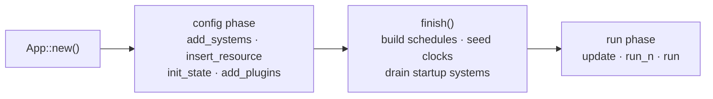
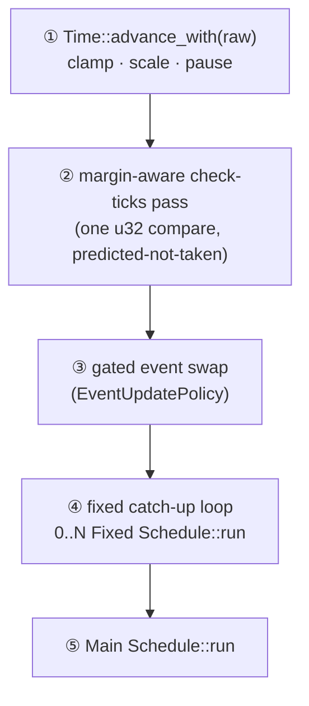

# App & Plugins

`App` is the top-level builder and runner. It owns the world, the worker pool,
and the schedules, and it drives the per-frame loop. `Plugin` is the modular unit
of configuration: a coherent slice of setup (systems, resources, states,
sub-plugins) behind one `build` call. Together they let you compose a large
program out of `app.add_plugins((RenderPlugin, PhysicsPlugin, InputPlugin))`
instead of hand-wiring every registration.

If you come from Bevy this will feel familiar by design — the surface is
deliberately Bevy-shaped. The differences are noted inline where they matter
(plugins are consumed at add-time, not retained; there is no `App::add_event`;
the schedule set is a closed enum, not an open label map).

`App` is a thin, additive layer over the shipped kernel: `EcsMaster` (the world),
`ScheduleBuilder` + `Schedule`, and a `ThreadPool`. It adds no per-frame
allocation, no `dyn` dispatch, and no atomic beyond `Schedule::run` itself — all
the plugin / tuple / `TypeId` machinery is cold, setup-only code. The frame
driver lowers to the `Schedule::run`s plus a handful of predictable branches.

Source: [`core/app/app.rs`](https://github.com/bluesteelll/boyko-engine/blob/ecs/crates/boyko_ecs/src/ecs/core/app/app.rs#L113),
[`core/app/plugin.rs`](https://github.com/bluesteelll/boyko-engine/blob/ecs/crates/boyko_ecs/src/ecs/core/app/plugin.rs#L27).

## The prelude

Everything you commonly need is one glob away:

```rust,ignore
use boyko_ecs::prelude::*;
// re-exports: App, AppExit, Plugin, Plugins, CoreSchedule, EventUpdatePolicy,
// Time, FixedTime, fixed_advance, EcsMaster, Entity, Component, Resource,
// Bundle, Query, Commands, Res, ResMut, EventReader, EventWriter, States,
// State, NextState, ThreadPool, ThreadPoolBuilder, ... and more.
```

One pitfall, repeated throughout this book: **the prelude re-exports the
traits, never the derive macros.** `#[derive(Component)]`, `#[derive(Resource)]`,
`#[derive(Bundle)]`, `#[derive(SystemSet)]`, and `#[event]` live in the
`boyko_macros` crate (a dev-dependency of `boyko_ecs`), so you import them
directly:

```rust,ignore
use boyko_ecs::prelude::*;
use boyko_macros::{Component, Resource, Bundle};
```

Calling a trait associated function (for example `Position::component_id()`)
needs the **trait** in scope — that comes from the prelude — not just the derive.

## Two phases: config, then run

An `App`'s lifetime has two phases, separated by exactly one call to
[`finish()`](#finish):

- **Config phase** — `add_systems`, `insert_resource`, `init_state`,
  `add_plugins`, `set_fixed_hz`, `add_startup_system`, …
- **Run phase** — `update`, `run_n`, `run`.



`finish()` consumes the staged schedule builders, seeds the clock resources,
builds the schedules, and drains the one-shot startup systems. It is **idempotent**
(a second call is a no-op) and the runners call it for you, so you rarely call it
by hand. The transition is one-way: every config method panics with
`boyko-B1802` if called after `finish()`, because a late registration could never
be built into a running schedule — it fails loudly instead of silently dropping
your setup.

## Building an app

```rust,ignore
use boyko_ecs::prelude::*;
use boyko_macros::{Component, Resource, Bundle};

#[derive(Component, Clone, Copy)]
#[repr(C)]
struct Position { x: f32, y: f32 }

#[derive(Component, Clone, Copy)]
#[repr(C)]
struct Velocity { x: f32, y: f32 }

// A tuple-of-components is a Bundle ONLY through a #[derive(Bundle)] struct —
// a bare tuple is not a Bundle (that impl was removed; Bundle is sealed).
#[derive(Bundle)]
struct Body { pos: Position, vel: Velocity }

#[derive(Resource, Default)]
struct Score(u32);

fn integrate(mut q: Query<(&mut Position, &Velocity)>) {
    for (p, v) in q.iter_mut() {
        p.x += v.x;
        p.y += v.y;
    }
}

fn main() {
    let mut app = App::new();

    // Resources, systems, and startup are all config-phase calls; they return
    // &mut App so they chain.
    app.insert_resource(Score(0))
        .add_startup_system(spawn_world)
        .add_systems(integrate);

    // Run ten self-clocked frames, then stop.
    app.run_n(10);
}

fn spawn_world(mut commands: Commands) {
    commands.spawn(Body {
        pos: Position { x: 0.0, y: 0.0 },
        vel: Velocity { x: 1.0, y: 0.0 },
    });
}
```

### Constructing the App

| Constructor | Pool |
|-------------|------|
| `App::new()` | a fresh pool sized to the platform's available parallelism |
| `App::with_threads(n)` | a fresh pool of `n` threads (clamped to `[1, 64]`) |
| `App::with_pool(pool)` | reuse an existing `Arc<ThreadPool>` across several apps |

`App::default()` equals `App::new()`. The pool is reachable later via
`app.pool() -> &Arc<ThreadPool>` — an escape hatch for code that needs the raw
pool (for example a manual `par_iter` outside a system).

> `App` is `!Send + !Sync`. Not because of the world — `EcsMaster` has been
> `Send + Sync` since the parallel scheduler landed — but because the app stages
> type-erased `Box<dyn FnOnce(&mut EcsMaster)>` startup closures that are not
> `+ Send`. In practice an app is built and run on one dispatcher thread and
> never crosses a thread boundary; the only other threads are the pool's workers,
> touched exclusively inside `Schedule::run`.

## Adding systems

There are three registration paths, narrowest to widest.

```rust,ignore
use boyko_ecs::prelude::*;

fn physics(/* params */) {}
fn render(/* params */) {}
fn setup(/* params */) {}

fn build(app: &mut App) {
    // 1. One unordered system. Chains.
    app.add_systems(physics).add_systems(render);

    // 2. Full ordering control: the closure gets the raw &mut ScheduleBuilder,
    //    so the whole chaining DSL is available verbatim.
    app.add_systems_cfg(|b| {
        let setup_key = b.add_system(setup).key();
        b.add_system(physics).after(setup_key);
        b.add_system(render).after(setup_key);
    });
}
```

`add_systems_cfg` is the primary path for any non-trivial schedule. The closure
receives `&mut ScheduleBuilder`, so ordering, sets, and run-conditions all work
as documented in [Ordering & Sets](../scheduling/ordering-and-sets.md) and
[Run Conditions](../scheduling/run-conditions.md).

> The scheduling handle is `SystemConfig::key() -> SystemKey`. `.after(...)` /
> `.before(...)` take a `SystemKey`. There is no `.id()` on a `SystemConfig`.

### Startup systems

`add_startup_system` registers a system to run **once**, before the frame loop,
drained inside `finish()` after the world is fully built. Startup systems run
single-threaded via `EcsMaster::run_system` — no pool, no `par_iter`
participation. For ordered or parallel setup, prefer an `on_enter`-state system
(see [States](../scheduling/states.md)).

## Resources

`insert_resource` forwards straight to the world and overwrites any existing
value of the same type:

```rust,ignore
use boyko_ecs::prelude::*;
use boyko_macros::Resource;

#[derive(Resource)]
struct Config { gravity: f32 }

fn build(app: &mut App) {
    app.insert_resource(Config { gravity: -9.81 });
}
```

For direct world access during config, `app.world()` / `app.world_mut()` hand you
the underlying `EcsMaster`. This is also where you register events (next section)
and seed entities before the loop.

## Events: there is no `App::add_event`

Coming from Bevy you might reach for `app.add_event::<E>()`. boyko has **no such
method**. Events are owned by the world, not the app facade, and a type must be
**preregistered** before any `EventWriter<E>` or `EventReader<E>` touches it —
the parameter does not lazily register the type. Using an unregistered event
panics with a constructive message naming the missing type.

Register on the world directly during config, or inside a plugin's `build`:

```rust,ignore
use boyko_ecs::prelude::*;
use boyko_ecs::ecs::core::events::event_config::EventConfig;
use boyko_macros::event;

#[event]
struct Damage { amount: u32 }

fn build(app: &mut App) {
    // Default lanes + capacity (the single-threaded-friendly default).
    app.world_mut()
        .preregister_event_default::<Damage>()
        .expect("event registration");

    // Or a custom config: N writer lanes, default per-lane capacity.
    // app.world_mut()
    //     .preregister_event::<Damage>(EventConfig::default_for(4).unwrap())
    //     .expect("event registration");
}
```

After registration, systems use the [`EventReader`/`EventWriter`](../concepts/events.md)
params normally. All buffers are allocated once at preregister time; steady-state
`send` / `update_events` never allocate.

> Who flips the event double-buffer? The `App` frame driver does, once per frame
> — see [EventUpdatePolicy](#event-swap-policy). A world driven by an `App` must
> **not** also call `EcsMaster::update_events` manually; a second flip would halve
> every reader's visibility window.

## Plugins

A `Plugin` packages a unit of setup. Implement the trait and put all your
registrations in `build`:

```rust,ignore
use boyko_ecs::prelude::*;
use boyko_macros::Resource;

#[derive(Resource, Default)]
struct PhysicsClock(f64);

fn integrate(/* params */) {}
fn detect_collisions(/* params */) {}

struct PhysicsPlugin;

impl Plugin for PhysicsPlugin {
    fn build(&self, app: &mut App) {
        app.insert_resource(PhysicsClock::default())
            .add_systems(integrate)
            .add_systems(detect_collisions);
    }
}

fn main() {
    let mut app = App::new();
    app.add_plugin(PhysicsPlugin);
    app.run_n(60);
}
```

The trait is small:

```rust,ignore
pub trait Plugin: 'static {
    fn build(&self, app: &mut App);
    fn name(&self) -> &'static str { /* type_name by default */ }
}
```

### Lifecycle — consumed at add-time

Unlike Bevy, a `Plugin` is **consumed when it is added**. `add_plugin` calls
`build` immediately and then drops the plugin value; the app never retains the
instance. Bevy keeps every plugin alive in a `Vec<Box<dyn Plugin>>` for its
deferred `finish`/`cleanup` async-init lifecycle (sub-apps, render world); boyko
has no such lifecycle, so it keeps nothing.

Two consequences:

- **No `Send + Sync` supertrait.** The only supertrait is `'static` (needed so
  duplicate detection can key on `TypeId::of::<P>()`). Dropping the bound is
  strictly more permissive — a plugin may capture `!Send` setup data such as an
  `Rc`.
- **Duplicate plugins panic.** Adding the same plugin *type* twice panics with
  `boyko-B1801`. Re-adding is almost always a bug (double-registered systems or
  states), so it is rejected loudly rather than silently skipped. Generic
  instantiations are distinct types: `Foo<A>` and `Foo<B>` have distinct
  `TypeId`s and so are not duplicates.

### Composing plugins with `add_plugins`

`add_plugins` accepts either a single plugin or a heterogeneous tuple of `1..=12`
plugins, added in declaration order. Tuples **nest**, because a tuple is itself a
`Plugins` group — so you can build composite "plugin groups" out of smaller
tuples:

```rust,ignore
use boyko_ecs::prelude::*;

struct InputPlugin;
struct RenderPlugin;
struct PhysicsPlugin;
struct UiPlugin;
struct AudioPlugin;
# impl Plugin for InputPlugin   { fn build(&self, _: &mut App) {} }
# impl Plugin for RenderPlugin  { fn build(&self, _: &mut App) {} }
# impl Plugin for PhysicsPlugin { fn build(&self, _: &mut App) {} }
# impl Plugin for UiPlugin      { fn build(&self, _: &mut App) {} }
# impl Plugin for AudioPlugin   { fn build(&self, _: &mut App) {} }

fn main() {
    let mut app = App::new();

    // A "plugin group" is just a tuple — and tuples nest, because a tuple is
    // itself a `Plugins` group. This adds five plugins in declaration order.
    app.add_plugins((
        (InputPlugin, RenderPlugin),  // a nested tuple is itself a group
        PhysicsPlugin,
        (UiPlugin, AudioPlugin),
    ));

    app.run_n(1);
}
```

`Plugins` is a sealed trait: the only valid inputs are "a `Plugin`" or "a tuple of
`Plugins`". The `Marker` type parameter exists only to disambiguate the
single-plugin blanket impl from the tuple impls — you never name it directly.
Each plugin in a group is added via `add_plugin`, so duplicate detection and the
once-only `build` rule apply uniformly across the whole tree.

## The frame driver

A frame is one call to [`update_with_delta(raw)`](#frame-functions). It runs a
fixed, documented order:



Every step between the runs holds the dispatcher's own `&mut EcsMaster` with zero
workers in flight, so the `Schedule::run`s are opaque, conflict-free units. The
clock advance plus three predictable branches are the entire additive envelope
over the bare schedule runs.

### CoreSchedule

```rust,ignore
pub enum CoreSchedule { Main, Fixed }
```

`CoreSchedule` is a **closed enum**, not an open label map. Two top-level slots:

- **`Main`** — runs exactly once per frame, after the fixed loop. This is the
  default target of `add_systems` / `add_systems_cfg`.
- **`Fixed`** — the fixed-timestep schedule, run 0..N times per frame by the
  catch-up loop (64 Hz by default, at most 16 substeps at the defaults). Created
  lazily on the first `*_in(CoreSchedule::Fixed, …)` registration.

Route a system to a specific schedule with the `_in` variants:

```rust,ignore
use boyko_ecs::prelude::*;

fn step_physics(/* reads Res<FixedTime> */) {}
fn draw(/* reads Res<Time> */) {}

fn build(app: &mut App) {
    app.add_systems_in(CoreSchedule::Fixed, step_physics)  // once per substep
        .add_systems(draw);                                // once per frame
    // ordered fixed registration: add_systems_cfg_in(CoreSchedule::Fixed, |b| ...)
}
```

The parameter type *is* the clock documentation: a `Fixed` system reads
`Res<FixedTime>` for its delta; a `Main` system reads `Res<Time>`. New top-level
slots are an engine change by design — finer-grained structure *within* a
schedule is what [system sets](../scheduling/ordering-and-sets.md) are for. The
fixed-timestep machinery (`set_fixed_hz`, `set_fixed_timestep`, `Time`,
`FixedTime`, the catch-up loop) is covered in depth in [Time & Fixed
Timestep](time.md).

### Event swap policy

```rust,ignore
pub enum EventUpdatePolicy { WaitForFixed, EveryFrame }
```

The driver flips the event double-buffer once per frame at step ③. *When* it
flips is the policy:

- **`EveryFrame`** — swap at the start of every frame. The single-schedule
  default.
- **`WaitForFixed`** — swap only after the Fixed schedule has run ≥ 1 substep
  since the last swap, so a fixed-schedule `EventReader` never loses a buffer
  generation on a 0-substep frame.

Resolved at `finish()`: a value you set with `set_event_update_policy` always
wins; otherwise the default is `WaitForFixed` iff a Fixed schedule was configured,
else `EveryFrame`.

> **The `WaitForFixed` pause hazard.** A paused `Time` yields 0 substeps every
> frame, so the swap is held indefinitely — starving *all* readers, even Main-only
> ones (a paused menu sending UI events is the canonical case). Held sends keep
> accumulating until the per-lane capacity is hit, after which `send` returns
> `Err(EventBufferFull)`. In pause-capable apps either check that `Result` or
> select `EveryFrame` when no fixed-schedule reader exists. On unpause the held
> backlog arrives in one generation — bounded, nothing lost.

## Running the app

| Method | Behavior |
|--------|----------|
| `update()` | one frame, self-clocked: raw delta = wall time since the last `update` (zero on the first frame, Bevy parity) |
| `update_with_delta(d)` | one frame with an externally supplied raw delta — the frame function |
| `run_n(frames)` | `finish` once, then run `frames` self-clocked frames |
| `run_n_with_delta(frames, d)` | `finish` once, then run `frames` frames with the same `d` each frame — the deterministic loop for tests, benches, and Miri |
| `run()` | `finish` once, then loop self-clocked frames until a system sets `AppExit(true)` |

Embedders that own their own clock (an eframe / wasm host, a deterministic test)
call `update_with_delta` directly and never touch `Instant`. Pinning the delta
with `run_n_with_delta` keeps `Instant::now` jitter out of measured loops.

### AppExit

```rust,ignore
use boyko_ecs::prelude::*;

fn quit_on_escape(mut exit: ResMut<AppExit>, /* input */) {
    let escape_pressed = true; // ← from your input resource
    if escape_pressed {
        exit.0 = true;
    }
}

fn main() {
    let mut app = App::new();
    app.add_systems(quit_on_escape);
    app.run(); // loops until a system sets AppExit(true)
}
```

`AppExit(pub bool)` is the cooperative exit flag read by `run()`. `run()` inserts
`AppExit(false)` before the loop (so the per-frame read never panics on a missing
resource) and checks the flag once per frame, after the Main run — so a
Fixed-schedule exit request is observed at the end of the same frame. Because
`run()` resets the flag to `false` at the start, a pre-loop request (for example
from a startup system) is cleared and at least one frame always executes —
request exit from a *frame* system. `update`, `run_n`, and `run_n_with_delta` do
not read `AppExit` (no exit branch on those hot paths).

## How it all composes

A real program is a small `main` plus a tree of plugins. Each plugin registers
its own systems, resources, states, and events; the app facade composes them and
drives the loop:

```rust,ignore
use boyko_ecs::prelude::*;

struct CorePlugin;
struct GameplayPlugin;
# impl Plugin for CorePlugin     { fn build(&self, _: &mut App) {} }
# impl Plugin for GameplayPlugin { fn build(&self, _: &mut App) {} }

fn main() {
    App::new()
        .add_plugins((CorePlugin, GameplayPlugin))
        .set_fixed_hz(60.0)        // physics tick rate (see Time page)
        .run();                    // run until AppExit(true)
}
```

`add_plugins` and the config setters all return `&mut App`, so the whole program
is one chain. The plugins fan out into independent setup; the frame driver folds
them back into one deterministic loop.

## See also

- [First App](../getting-started/first-app.md) — the shortest end-to-end example.
- [Time & Fixed Timestep](time.md) — `Time`, `FixedTime`, `set_fixed_hz`, and the
  catch-up loop in depth.
- [Multi-World](multi-world.md) — running several worlds / apps side by side.
- [Events](../concepts/events.md) — `EventReader` / `EventWriter` and the
  double-buffer.
- [Systems](../concepts/systems.md) — what a system is and how params work.
- [States](../scheduling/states.md) — `init_state`, `on_enter`, and ordered
  setup.
- Source: [`core/app/app.rs`](https://github.com/bluesteelll/boyko-engine/blob/ecs/crates/boyko_ecs/src/ecs/core/app/app.rs),
  [`core/app/plugins.rs`](https://github.com/bluesteelll/boyko-engine/blob/ecs/crates/boyko_ecs/src/ecs/core/app/plugins.rs).
