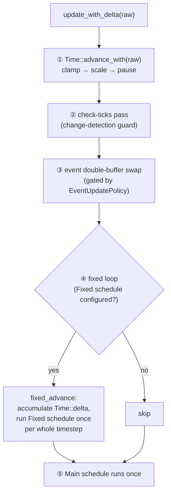

# Time & Fixed Timestep

The engine ships two clock resources. `Time` is the **per-frame virtual clock** —
pausable, scalable, hitch-clamped. `FixedTime` is the **fixed-timestep clock +
accumulator** that drives a deterministic simulation step. A frame-rate-coupled
gameplay system reads `Res<Time>`; a deterministic physics step reads
`Res<FixedTime>`. The *parameter type is the documentation* of which clock a
system marches to — there is no generic `Time<Real>` swap to misread.

This split exists because rendering and simulation want different time. Rendering
wants *whatever delta the GPU actually delivered* so motion stays smooth at any
refresh rate. Simulation wants a *constant* step so a contact solver, a network
replay, or a determinism test produces the same result regardless of frame rate.
The fixed-timestep loop bridges the two: it runs the simulation **zero or more
times** per displayed frame, then hands rendering an interpolation alpha so the
visible result stays smooth between fixed steps.

Both resources are inserted automatically by [`App::finish`](plugins.md) (and the
[`App`](plugins.md) builder drives both clocks for you). A pool-less or wasm host
that owns its own frame loop inserts them by hand — see
[Driving the clock without an App](#driving-the-clock-without-an-app) below.

> Source: [`core/time/`](https://github.com/bluesteelll/boyko-engine/blob/ecs/crates/boyko_ecs/src/ecs/core/time/mod.rs) —
> [`time.rs`](https://github.com/bluesteelll/boyko-engine/blob/ecs/crates/boyko_ecs/src/ecs/core/time/time.rs),
> [`fixed_time.rs`](https://github.com/bluesteelll/boyko-engine/blob/ecs/crates/boyko_ecs/src/ecs/core/time/fixed_time.rs),
> [`fixed_loop.rs`](https://github.com/bluesteelll/boyko-engine/blob/ecs/crates/boyko_ecs/src/ecs/core/time/fixed_loop.rs).

## The two clocks at a glance

| | `Time` (virtual frame clock) | `FixedTime` (fixed-step clock) |
|---|---|---|
| Read in | `CoreSchedule::Main` systems | `CoreSchedule::Fixed` systems |
| Delta | `delta()` / `delta_secs()` — variable, clamped, scaled | `delta()` / `delta_secs()` — the *constant* timestep |
| Runs per frame | exactly once | 0..N times (catch-up loop) |
| Pausable / scalable | yes (`pause`, `set_relative_speed`) | follows `Time` (zero virtual delta ⇒ zero substeps) |
| Determinism | integer-ns at speed `1.0` | integer-ns accumulator; `elapsed` is the witness |

## `Time` — the per-frame virtual clock

`Time` is written exactly once per frame by the frame driver
([`App::update_with_delta`](plugins.md) calls `Time::advance_with(raw)`), then
read by systems through `Res<Time>`. The *virtual* delta you read is the raw
wall-clock delta after two transforms:

1. **Clamp** to `max_delta` (default **250 ms**). A hitch longer than this — a
   stall on a loading screen, the debugger pausing the process — is truncated.
   This is the single death-spiral guard: it bounds how many fixed substeps one
   frame can trigger.
2. **Scale** by `relative_speed` (default `1.0`). A paused clock yields a **zero**
   virtual delta.

The raw, unclamped, unscaled delta is carried alongside as `real_delta()` /
`real_elapsed()` for wall-clock needs (an FPS counter, a profiler), so there is
no separate "real time" resource to juggle.

```rust,ignore
use boyko_ecs::prelude::*; // Time, Res, ResMut
use boyko_macros::Component;

#[derive(Component)]
struct Velocity {
    x: f32,
    y: f32,
}

#[derive(Component)]
struct Position {
    x: f32,
    y: f32,
}

// A frame-coupled system: scale movement by the per-frame delta so speed is
// frame-rate independent. Runs in CoreSchedule::Main (the default `add_systems`
// target), so it reads `Res<Time>`.
fn integrate_visual(time: Res<Time>, mut q: Query<(&mut Position, &Velocity)>) {
    let dt = time.delta_secs(); // already clamped + scaled; zero while paused
    for (mut pos, vel) in q.iter_mut() {
        pos.x += vel.x * dt;
        pos.y += vel.y * dt;
    }
}
```

### Pausing, slow-motion, time scale

`Res<Time>` only *reads*. To mutate the clock from a system, take
`ResMut<Time>` and call the setters — never re-advance it (the driver owns the
single per-frame advance; `advance_with` even `debug_assert!`s it is not called
inside a scheduled system).

```rust,ignore
use boyko_ecs::prelude::*; // Time, ResMut

// Toggle pause / slow-mo from gameplay. Pausing yields a ZERO virtual delta on
// every subsequent frame — and therefore ZERO fixed substeps — until `unpause`.
// It does NOT accumulate a backlog: unpause resumes cleanly, no catch-up burst.
fn time_controls(mut time: ResMut<Time>) {
    time.pause();                 // freeze virtual time (real time keeps ticking)
    time.unpause();               // resume
    time.set_relative_speed(0.5); // half-speed slow motion (0.0 is a pause alias)
    time.set_max_delta(std::time::Duration::from_millis(100)); // tighter hitch clamp
}
```

Setter contracts (each panics rather than silently misbehaving):

- `set_relative_speed(s)` panics if `s` is not finite or is negative. `0.0` is a
  legal pause alias. At exactly `1.0` the virtual delta is **bit-identical** to
  the clamped raw delta (pure integer-nanosecond, no float round-trip) — the
  determinism-friendly default path.
- `set_max_delta(d)` panics if `d` is zero (a zero clamp would freeze virtual
  time forever).

## `FixedTime` — the fixed-step clock + accumulator

`FixedTime::delta()` *is* the timestep — the constant per-substep delta a
fixed-schedule system integrates against. The default is exactly **64 Hz =
15 625 000 ns**, chosen because it is lossless in both `f32` and `f64` and free of
refresh-rate beat patterns. Configure it on the builder with
`set_fixed_timestep(Duration)` or `set_fixed_hz(f64)`, or construct one directly
with `FixedTime::new(...)` / `FixedTime::from_hz(...)`.

A fixed-schedule system reads `Res<FixedTime>` and uses `delta_secs()` as its
step — a *constant*, unlike `Time::delta_secs()`:

```rust,ignore
use boyko_ecs::prelude::*; // FixedTime, Res
use boyko_macros::Component;

#[derive(Component)]
struct Position {
    x: f32,
    y: f32,
}

#[derive(Component)]
struct Velocity {
    x: f32,
    y: f32,
}

// A deterministic step: `dt` is the CONSTANT 1/64 s timestep, so the trajectory
// is identical at 30 FPS or 240 FPS. Register this into CoreSchedule::Fixed.
fn integrate_fixed(fixed: Res<FixedTime>, mut q: Query<(&mut Position, &Velocity)>) {
    let dt = fixed.delta_secs(); // constant timestep (== fixed.timestep())
    for (mut pos, vel) in q.iter_mut() {
        pos.x += vel.x * dt;
        pos.y += vel.y * dt;
    }
}
```

Beyond the timestep, `FixedTime` exposes:

- `overstep()` — the accumulator remainder, always `< timestep` after each loop.
- `overstep_fraction()` — the interpolation alpha in `[0, 1)` (see
  [Interpolation](#interpolation-smooth-rendering-between-fixed-steps)).
- `elapsed()` — the exact sum of *expended* timesteps; the determinism witness.
- `steps_this_frame()` — how many substeps the most recent loop ran (a permanent
  `0` when no fixed schedule exists).
- `discard_overstep()` — the explicit escape hatch (teleport, long-pause resume)
  for dropping accumulated time. The engine itself never drops time.

## Registering fixed systems

Systems are routed to a schedule by the closed `CoreSchedule { Main, Fixed }` set.
The one-arg `add_systems` defaults to `Main`; the explicit `add_systems_in`
(and `add_systems_cfg_in`) target a schedule. The Fixed schedule is created
lazily on the first `Fixed` registration.

```rust,ignore
use std::time::Duration;
use boyko_ecs::prelude::*; // App, CoreSchedule, Time, FixedTime
# fn integrate_visual() {}
# fn integrate_fixed() {}
# fn ui_render() {}

fn build() {
    let mut app = App::new();
    app
        // Configure the fixed rhythm during the config phase (before `finish`).
        .set_fixed_hz(120.0)                                // or set_fixed_timestep(Duration)
        // A Main system: runs once per frame, reads `Res<Time>`.
        .add_systems(integrate_visual)
        // A Fixed system: runs 0..N times per frame, reads `Res<FixedTime>`.
        .add_systems_in(CoreSchedule::Fixed, integrate_fixed)
        // A Main system that consumes the interpolation alpha for rendering.
        .add_systems(ui_render);

    app.run_n_with_delta(600, Duration::from_nanos(16_666_667)); // deterministic 60 FPS loop
}
```

`set_fixed_timestep` / `set_fixed_hz` are **config-phase only** and apply the
timestep as `FixedTime::new(...)` at `finish()` — *insert-if-absent*, so a
`FixedTime` you insert yourself during config wins. Both panic if called after
`finish()` (the staged value would never apply) and reject a zero / invalid step.

## The frame driver: zero-or-more steps per frame

Each call to `App::update_with_delta(raw)` runs a fixed five-step sequence:



Step ④ is the catch-up loop. [`fixed_advance`](https://github.com/bluesteelll/boyko-engine/blob/ecs/crates/boyko_ecs/src/ecs/core/time/fixed_loop.rs#L51)
adds this frame's *virtual* delta to `FixedTime::overstep`, then repeatedly
expends one whole timestep — running the Fixed schedule once per expense — until
the accumulator drops below one step. So the Fixed schedule can run:

- **0 times** when the frame was short (delta below one timestep), or paused, or
  zero-delta. The leftover delta is kept in `overstep` for next frame.
- **1 time** on a steady frame near the step rate.
- **N times** when the frame was long, draining the accumulated backlog.

At the defaults (250 ms `max_delta`, 64 Hz, speed `1.0`) the loop runs **at most
16 substeps** per frame — the clamp is exactly what bounds that worst case. A
one-second hitch clamps to 250 ms and still runs only 16 steps; the real clock
keeps the full second. Lowering the timestep, raising the speed, or raising
`max_delta` raises the bound proportionally:

```text
worst-case substeps  ≈  ⌈(max_delta × relative_speed + timestep) / timestep⌉
```

`fixed_advance` must be called **exactly once** per `Time::advance_with` — it
consumes the frame's delta by value into the accumulator, so a second call would
double-count time. The `App` driver guarantees this pairing for you.

### Timestep changes are snapshotted

A Fixed system may reconfigure the timestep via `ResMut<FixedTime>` with
`set_timestep(...)`. The change takes effect on the **next** fixed loop: the
running loop snapshots its timestep once at entry and threads it through every
expense, so a mid-loop change can never void the substep bound. The new value is
staged for the following frame.

## Interpolation: smooth rendering between fixed steps

Because the Fixed schedule advances in discrete jumps and rendering happens once
per frame, the latest simulated state is usually *between* two fixed steps. The
remainder lives in `overstep`, and `overstep_fraction()` turns it into an
interpolation alpha — `overstep / timestep`, guaranteed in `[0, 1)` — read from a
**Main** system *after* the fixed loop has settled.

```rust,ignore
use boyko_ecs::prelude::*; // FixedTime, Res
use boyko_macros::Component;

// Carry both the previous and current fixed-step positions so the renderer can
// blend between them. `prev` is set to the old `current` at the start of each
// fixed substep; `current` is the freshly integrated value.
#[derive(Component)]
struct RenderTransform {
    prev_x: f32,
    prev_y: f32,
    x: f32,
    y: f32,
}

// A Main (render) system: alpha ∈ [0, 1) positions the visible sprite between
// the last two fixed steps, eliminating the stutter of rendering raw step state.
fn upload_interpolated(fixed: Res<FixedTime>, q: Query<&RenderTransform>) {
    let alpha = fixed.overstep_fraction();
    for t in q.iter() {
        let _draw_x = t.prev_x + (t.x - t.prev_x) * alpha;
        let _draw_y = t.prev_y + (t.y - t.prev_y) * alpha;
        // ...hand the blended position to the renderer.
    }
}
```

Read the alpha from **Main**, never from a Fixed system: the frame-driver order
guarantees the loop has finished expending before Main runs, so `overstep <
timestep` and the alpha is a clean `[0, 1)`. Mid-catch-up a Fixed system could
still see `overstep >= timestep`; `overstep_fraction` then saturates just below
`1.0` rather than exceeding the documented range. The
[physics](../simulation/physics.md) and rendering layers consume this alpha to do
the blend on the GPU.

## Driving the clock without an App

`fixed_advance` is the *same* code path on native, wasm, and Miri — no pool, no
`Instant`, no platform branch. A host that owns its frame loop (an `eframe`
integration, a wasm `requestAnimationFrame` callback, a deterministic test)
advances `Time` and calls `fixed_advance` directly. Insert both clock resources
first — there is no `App::finish` to do it.

```rust,ignore
use std::time::Duration;
use boyko_ecs::prelude::*; // EcsMaster, Time, FixedTime, fixed_advance

fn hand_rolled_frame(world: &mut EcsMaster, raw: Duration) {
    // Once, at setup:
    // world.insert_resource(Time::default());
    // world.insert_resource(FixedTime::from_hz(64.0));

    // Per frame:
    world.resource_mut::<Time>().advance_with(raw); // clamp / scale / pause

    // Run the fixed step 0..N times this frame. The closure IS one substep.
    let _steps = fixed_advance(world, |w| {
        // ...run your fixed simulation against `w` here (one timestep)...
        let _ = w; // e.g. w.run_system(integrate_fixed);
    });

    // ...then your once-per-frame render, reading FixedTime::overstep_fraction().
}
```

`fixed_advance` panics if `Time` or `FixedTime` is missing — a clear signal to
insert them before the first frame.

## Reading the clock — quick reference

| You want | Resource | Method |
|---|---|---|
| Per-frame delta (smooth, scaled) | `Res<Time>` | `delta_secs()` / `delta()` |
| Total virtual time | `Res<Time>` | `elapsed()` |
| Wall-clock delta / total (unscaled) | `Res<Time>` | `real_delta()` / `real_elapsed()` |
| Pause / slow-mo / hitch clamp | `ResMut<Time>` | `pause` / `set_relative_speed` / `set_max_delta` |
| Fixed timestep (constant) | `Res<FixedTime>` | `delta_secs()` / `delta()` / `timestep()` |
| Interpolation alpha | `Res<FixedTime>` (Main) | `overstep_fraction()` |
| Substeps run this frame | `Res<FixedTime>` | `steps_this_frame()` |
| Determinism witness | `Res<FixedTime>` | `elapsed()` |

## See also

- [App & Plugins](plugins.md) — the builder that wires both clocks and the
  `CoreSchedule::Fixed` routing.
- [Resources](../concepts/resources.md) — how `Res` / `ResMut` access world data.
- [Physics](../simulation/physics.md) — the primary consumer of the fixed step
  and the interpolation alpha.
