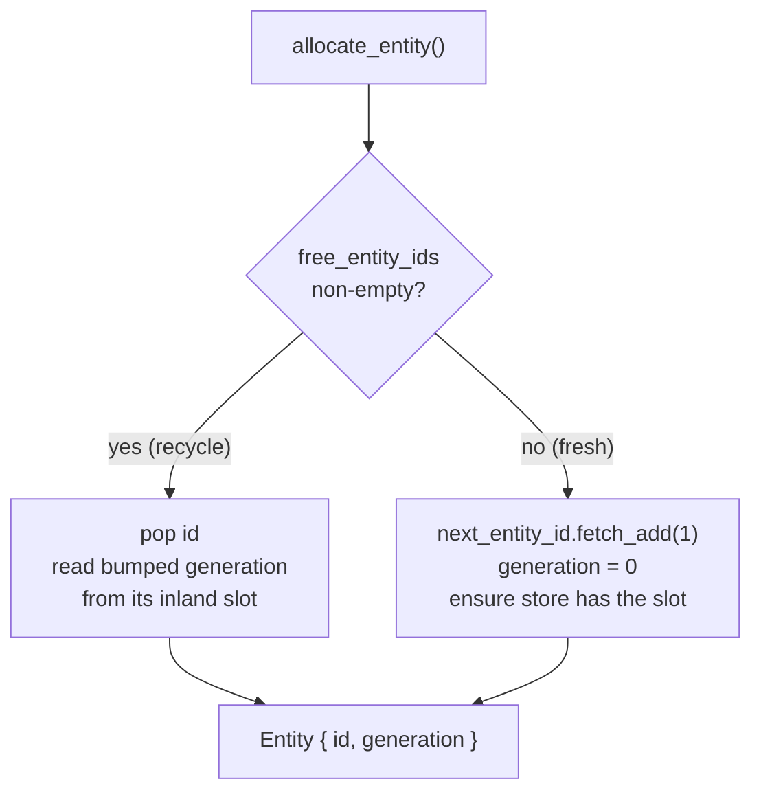
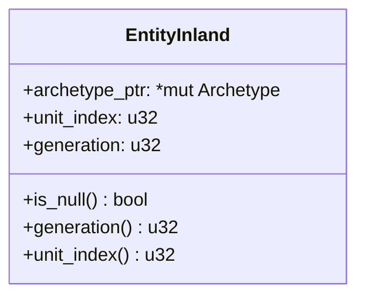
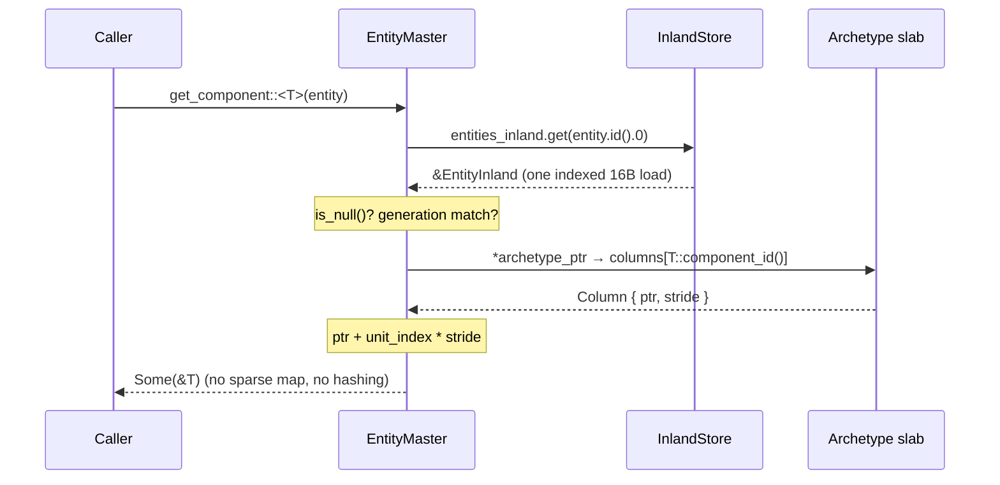

# Entities & Generations

> An entity is a 12-byte `{ id, generation }` handle. Behind it sits an address-stable slab that recycles ids, defends stale handles with a generation counter, and turns `get_component` into a single pointer dereference — no sparse-map indirection.

*(Branch: `ecs`.)*

The [Entities](../concepts/entities.md) concept page is the "how do I use it" view. This
page is the layer below: how the engine *allocates* and *recycles* entity ids, why the
generation counter exists, and how the entity → component-row lookup is made into a direct
pointer chase rather than a hash or sparse-set walk.

If you come from Bevy, the `Entity` type and its semantics are deliberately the same. What
differs is the storage underneath: instead of a sparse-set generation table, boyko-engine
records each entity's location as a *direct pointer into its archetype slab*, kept in an
address-stable virtual-memory reservation. That single decision is what removes the
indirection from the hot read path.

## The handle

An [`Entity`](https://github.com/bluesteelll/boyko-engine/blob/ecs/crates/boyko_ecs/src/ecs/core/entity/entity.rs#L5)
is two fields and nothing else:

```rust,ignore
use boyko_ecs::prelude::*;

fn inspect(entity: Entity) {
    let _index: usize = entity.id().0;   // EntityId is a newtype over usize
    let _gen:   u32   = entity.generation();
}
```

- **`id: EntityId`** — a [`#[repr(transparent)]`](https://github.com/bluesteelll/boyko-engine/blob/ecs/crates/boyko_ecs/src/ecs/identifiers/primitives.rs#L56)
  newtype over `usize`. It is the *slot index* into the entity store, so a lookup is a
  direct index, never a hash.
- **`generation: u32`** — a counter bumped every time a slot is reused. It is the half
  that makes a *stale* handle detectable.

`Entity` is `Copy` and its derived `PartialEq` compares **both** fields. That "both fields"
rule is the whole use-after-despawn defence — covered under
[Generations are the ABA defence](#generations-are-the-aba-defence) below.

## Allocation and recycling

All entity lifecycle goes through
[`EntityMaster`](https://github.com/bluesteelll/boyko-engine/blob/ecs/crates/boyko_ecs/src/ecs/core/entity/entity_master.rs#L44),
which since Phase X.D is just four fields, ordered `#[repr(C)]` so the hot scalar cluster
sits on one cache line:

| Field | Type | Role |
|-------|------|------|
| `entities_inland` | `InlandStore` | The fast store: one location record per id, indexed by `EntityId.0`. |
| `next_entity_id` | `AtomicUsize` | Monotonic counter for minting fresh ids. |
| `live_count` | `usize` | Number of currently-live entities. |
| `free_entity_ids` | `Vec<EntityId>` | LIFO recycling queue of freed ids. |

### Allocate

[`allocate_entity`](https://github.com/bluesteelll/boyko-engine/blob/ecs/crates/boyko_ecs/src/ecs/core/entity/entity_master.rs#L124)
returns a recycled id if one is waiting, otherwise mints a fresh one:



The fresh path reads through `fetch_add(1, Ordering::Relaxed)` even though the dispatcher
holds `&mut self`. That keeps a *single* source of truth for the counter shared with the
worker-side path: systems running in parallel reserve ids through an
`EntityCounter<'s>` newtype that wraps only `*const AtomicUsize`, so a worker can mint an
id but cannot reach any other `EntityMaster` field. `Relaxed` is correct because the
counter guarantees only uniqueness; the happens-before that publishes a worker's writes is
established later by the scheduler's apply-window barrier.

### Deallocate

[`deallocate_entity`](https://github.com/bluesteelll/boyko-engine/blob/ecs/crates/boyko_ecs/src/ecs/core/entity/entity_master.rs#L360)
is where the generation gets bumped:

1. Reject the call if the handle is stale (generation mismatch) or its slot is already dead.
2. Bump the slot's generation **in place**, then null its `archetype_ptr` (marking it dead).
3. Push the id onto `free_entity_ids` for reuse.
4. Decrement `live_count` — but only on the success path.

The order matters. The generation must be incremented *before* the slot is reused, and it
must survive deallocation, because the next `allocate_entity` for that recycled id reads the
already-bumped generation back out of the slot. So the freed id comes back as
`Entity { id, generation + 1 }` — a value that can never compare equal to the handle the old
owner is still holding.

```rust,ignore
use boyko_ecs::prelude::*;
use boyko_macros::Component;

#[derive(Component)]
struct Health(u32);

// Inside a system: spawning and despawning go through Commands, never
// EntityMaster directly (allocate/deallocate are crate-internal).
fn lifecycle(mut commands: Commands) {
    let e = commands.spawn(/* a #[derive(Bundle)] value */ HealthBundle(Health(100))).id();
    // ... later ...
    commands.entity(e).despawn();
    // `e` is now a stale handle: its id may be reused by a future spawn,
    // but its generation no longer matches, so every lookup rejects it.
}

#[derive(boyko_macros::Bundle)]
struct HealthBundle(Health);
```

> Note: a bare tuple is **not** a `Bundle` (the tuple impl was removed in Phase 8.5, and
> `Bundle` is sealed). Wrap components in a `#[derive(Bundle)]` struct or tuple-struct.

### live_count: the slot model after Phase X.D

Earlier versions carried two extra acceleration vectors: `active_ids` (a dense list of live
ids) and `sparse_to_active` (a sparse→dense map), maintained on every spawn and despawn so a
"list all live entities" call could run in O(active). Phase X.D **deleted both**. Their only
consumer was the cold `iter_entities` inspection API — it had *zero* hot callers, because
real iteration goes through [queries](../concepts/queries.md) over archetype columns, never
through the entity master.

What replaced them is a single `usize`: `live_count`, bumped on register and decremented on
deallocate. `entity_count()` is now an O(1) field read. The trade-off is that
[`iter_entities`](https://github.com/bluesteelll/boyko-engine/blob/ecs/crates/boyko_ecs/src/ecs/core/entity/entity_master.rs#L447)
became an O(capacity) scan of the fast store that skips dead (`is_null`) slots — accepted,
because it is a cold inspection/test path and the hot iteration path was never here.

## The location record: EntityInland

Each slot in the fast store is one
[`EntityInland`](https://github.com/bluesteelll/boyko-engine/blob/ecs/crates/boyko_ecs/src/ecs/core/entity/entity_inland.rs#L24):
a 16-byte `#[repr(C)]` record (size/align/offsets are const-asserted) that says *exactly
where this entity's row lives*.



- **`archetype_ptr`** — a raw pointer straight into the archetype slab the entity lives in.
  A **null** pointer is the single source of truth for "this slot is dead". Storing the
  pointer (rather than an `ArchetypeId` to be looked up) is what lets the read path skip an
  indirection entirely.
- **`unit_index`** — the row index of this entity inside that archetype's column tables.
- **`generation`** — the slot's current generation, matched against the handle's generation
  on every access.

The dead-slot sentinel `EntityInland::NULL` is **all-zero bytes** (a const test pins this).
That fact is load-bearing for the store's growth strategy: a freshly committed,
OS-zeroed page already reads as a sea of dead slots, so growth never has to write a fill.

## The fast read path

Here is the payoff. A typed
[`get_component::<T>(entity)`](https://github.com/bluesteelll/boyko-engine/blob/ecs/crates/boyko_ecs/src/ecs/core/ecs_master/ecs_master.rs#L2139)
resolves to a short, branch-light pointer chase:



In words:

1. **Index the fast store** by `entity.id().0`. The store is a contiguous slice, so this is
   one bounds check plus one 16-byte load — codegen-identical to `Vec::get`.
2. **Validate liveness**: reject if `archetype_ptr.is_null()` (dead slot) or the stored
   `generation` does not match the handle.
3. **Project the column**: read `columns[component_id]` straight through `archetype_ptr`,
   yielding the column base pointer and its stride.
4. **Compute the row address**: `column.ptr + unit_index * stride`, cast to `&T`.

There is no sparse-set lookup and no `HashMap` anywhere on this path — the location record
*is* the pointer. (`get_component_mut` follows the same prologue and additionally returns a
change-detection-aware [`Mut<T>`](../change_detection.md), and `has_entity` /
`has_component` stop after step 2 / step 3.)

## InlandStore: address-stable growth

The fast store is an
[`InlandStore`](https://github.com/bluesteelll/boyko-engine/blob/ecs/crates/boyko_ecs/src/ecs/core/entity/inland_store.rs#L1),
not a `Vec`. It is one contiguous **virtual-address reservation**
([`VmReservation`](../memory/arena.md), `DEFAULT_INLAND_RESERVE` = 1 GiB on 64-bit),
committed lazily in geometric slabs (256 KiB → 16 MiB) as ids grow.

The reason is the read path above. Because the location records hold raw `*mut Archetype`
pointers and are read under `&self` by parallel workers, the store's base address **must
never move**. A `Vec` would relocate its buffer on every capacity doubling, invalidating
every interior pointer and forcing a full memcpy spike. `InlandStore` reserves the address
range once and only commits more pages at the frontier — so:

- **Growth is O(1) in live entities**: one commit syscall, **zero bytes copied, zero bytes
  written**. Newly exposed slots read `EntityInland::NULL` because fresh pages are
  OS-zeroed and `NULL` is all-zero.
- **Every slot address is stable for the store's lifetime** — the property the worker read
  path and the scheduler's exclusivity argument both rest on.

`Deref`/`DerefMut` expose the live `[EntityInland]` slice with `Vec`-identical codegen, so
the indexed read in step 1 above pays nothing for the virtual-memory backing.

## Generations are the ABA defence

Recycling ids is what makes the slot model fast and bounded — but it creates the classic
ABA problem: an id `42` you despawned can be handed back out to a brand-new, unrelated
entity. Without a discriminator, a stale handle would silently read or write the new
occupant's data. That is a use-after-free in spirit, even if every pointer is technically
valid.

The generation counter closes it. Because deallocate **bumps the generation before the slot
can be reused**, and because every lookup checks `inland.generation() == entity.generation()`
*after* confirming the slot is live, a stale handle is rejected even when its id has been
recycled:

```rust,ignore
use boyko_ecs::prelude::*;

// Conceptual trace (allocate/deallocate are crate-internal; this is what
// Commands::spawn / EntityCommands::despawn do underneath):
//
//   let a = allocate();          // Entity { id: 0, generation: 0 }
//   deallocate(a);               // slot 0 -> { null, generation: 1 }, id 0 recycled
//   let b = allocate();          // Entity { id: 0, generation: 1 }  (same id!)
//
//   a == b              -> false (generations differ)
//   get_component(a)    -> None  (slot generation 1 != handle generation 0)
//   get_component(b)    -> Some  (slot generation 1 == handle generation 1)
fn _doc() {}
```

The wrap window is `2^32` per slot — a slot would have to be recycled four billion times
before a stale handle could alias by collision, which is a deliberate, documented design
budget rather than an accident.

## Performance characteristics

| Operation | Complexity | Notes |
|-----------|------------|-------|
| `allocate_entity` (fresh) | O(1) | `fetch_add` + `ensure` (amortized; growth is a rare commit) |
| `allocate_entity` (recycled) | O(1) | LIFO `pop` + one slot read |
| `deallocate_entity` | O(1) | In-place generation bump + `push` |
| `get_component` / `has_entity` | O(1) | One indexed 16-B load → pointer chase; **no sparse map** |
| `entity_count` | O(1) | Reads `live_count` |
| `iter_entities` | O(capacity) | Cold inspection scan; real iteration uses queries |
| Store growth | O(1) in live entities | One commit syscall; zero copies, zero fills |

## See also

- [Entities](../concepts/entities.md) — the user-facing view of `Entity`.
- [Components](../concepts/components.md) and [Queries](../concepts/queries.md) — what the
  location record points *at*.
- [Per-Pool Virtual Memory](../memory/arena.md) — the `VmReservation` primitive shared by
  `InlandStore` and every component pool.
- [Storage trade-offs](storage-tradeoffs.md) — why the engine pays a virtual reservation to
  keep addresses stable.
- [Change detection](../change_detection.md) — the per-row ticks `get_component_mut`'s
  `Mut<T>` interacts with.
- Source: [`entity.rs`](https://github.com/bluesteelll/boyko-engine/blob/ecs/crates/boyko_ecs/src/ecs/core/entity/entity.rs#L5),
  [`entity_master.rs`](https://github.com/bluesteelll/boyko-engine/blob/ecs/crates/boyko_ecs/src/ecs/core/entity/entity_master.rs#L44),
  [`entity_inland.rs`](https://github.com/bluesteelll/boyko-engine/blob/ecs/crates/boyko_ecs/src/ecs/core/entity/entity_inland.rs#L24),
  [`inland_store.rs`](https://github.com/bluesteelll/boyko-engine/blob/ecs/crates/boyko_ecs/src/ecs/core/entity/inland_store.rs#L1).
