# Storage Trade-offs: Tags, Churn, and Fragmentation

> Tags are free to carry and free to query — but not free to toggle, and not free to combine without limit. This page is the cost model, and the storage-kind decision matrix.

*(Branch: `ecs`, EnableTag + Dense components.)*

## Problem

Every game has boolean-ish state: *frozen*, *selected*, *poisoned*, *dirty*.
An archetype ECS gives you three ways to model it, with different cost profiles:

1. **A data field** (`struct Status { frozen: bool }`) — cheap to flip, but
   every system pays a per-row load + branch, forever, even when nothing is
   frozen.
2. **An archetype (table) tag** (`struct Frozen;`) — the branch vanishes from
   the hot loop (existence-based processing: non-matching entities live in
   archetypes the query never visits), but *flipping* the state is an archetype
   migration.
3. **An enable (bitset) tag** (`#[component(storage = "bitset")] struct Frozen;`)
   — presence is a per-row bit, flipped in place: no migration, no
   fragmentation, at the price of a per-row bit test during iteration and **no
   change detection**.

None is universally right. The two tag backends are an **explicit choice**, and
the axis that decides it is toggle frequency.

### Where this sits in the storage-kind axis

Tags are not the only place storage kind matters. The kernel classifies every
component id into a `StorageKind` with **three** members
([`component_registry.rs:397`](https://github.com/bluesteelll/boyko-engine/blob/ecs/crates/boyko_ecs/src/ecs/core/component/component_registry.rs#L397)):

| `StorageKind` | In archetype signature? | Backing store |
|---------------|-------------------------|---------------|
| `Table` (0) | yes — mints archetypes | per-archetype `ComponentPool` |
| `Bitset` (1) | no | per-archetype paged enable bitset (no data column) |
| `Dense` (2) | no | **one global `DenseStore` column** across all archetypes |

Only `Table` is a *signature* kind: `is_signature_storage` returns `true` for
`Table` and `false` for both `Bitset` and `Dense`
([`component_registry.rs:428`](https://github.com/bluesteelll/boyko-engine/blob/ecs/crates/boyko_ecs/src/ecs/core/component/component_registry.rs#L428)).
That single predicate is why neither bitset tags nor dense components ever mint
an archetype.

**This page is the cost model for the two *tag* backends — `Table` vs `Bitset`.**
The third kind, **dense (non-fragmenting) components**
(`#[component(storage = "dense")]`), is the canonical "one contiguous buffer for
all instances" storage — solver state, GPU instances — rather than a way to
model boolean-ish flags. It shares the non-fragmenting property (signature
excluded) but it carries *data*, not presence, so it is out of scope for the
toggle-frequency analysis below. It appears here only where the fragmentation
story needs it (the [comparison table](#comparison-to-other-engines)).

## The churn ladder

A tag toggle (`insert(Frozen)` / `remove::<Frozen>()` / `add_tag` /
`remove_tag`) moves the **whole row** — every retained data column is copied
into the destination archetype, ticks are re-initialized, hooks fire. The tag
column itself copies zero bytes; the entity's *other* components are what you
pay for.

```mermaid
flowchart TD
    Q{How often does the<br/>boolean flip?} -->|every frame /<br/>most frames,<br/>many entities| E[Enable bitset tag<br/>O&#40;1&#41; bit flip in place]
    Q -->|occasionally:<br/>seconds, events| T[Archetype tag<br/>archetype move per flip]
    Q -->|rarely / never:<br/>spawn-time identity| T2[Archetype tag — ideal case]
    E -.->|need Added/Changed?| F[Data field<br/>branch per row]
```

Rules of thumb:

- **Per-frame booleans on many entities are enable tags.** A state that flips
  every frame turns an archetype tag's structural `#[cold]` migration path into
  your hot path. Use an [enable bitset tag](../concepts/enable-tags.md) — the
  flip is an O(1) in-place bit RMW with no migration. (Use a plain data field
  instead only when you also need `Added`/`Changed`, which enable tags do not
  support.)
- **Persistent, low-frequency state is the archetype-tag sweet spot.**
  Identity-like markers (`Player`, `Boss`) toggle never; status effects that
  change on gameplay events (seconds apart) are fine. Archetype-level
  `With`/`Without` filtering is free per row.
- **Archetype-tag querying is free; enable-tag querying is nearly free.** An
  archetype tag's `With`/`Without` (and dynamic tag terms) resolve at archetype
  granularity — zero per-row cost — while an enable tag costs about one
  predicted-not-taken branch per row (bench-flat for queries that do not name
  one). The carry cost inverts: an archetype tag is 8 B/row resident (the tick
  pair — see [Tags](../concepts/tags.md)); an enable tag is 0 B/row until a row
  is toggled.

## The fragmentation ceiling

Tags multiply archetypes. Entities holding the same data components but
different tag subsets are *different archetypes*: N independent tags over one
base archetype can mint up to **2^N** combinations. Five tags = up to 32
archetypes for one logical kind of entity.

Boyko's hard ceiling is `MAX_ARCHETYPES = 1024`, and hitting it is a **loud
failure**, never silent misbehavior. There are two surfaces, both carrying the
count: the infallible creation path trips a release-active
`assert!(self.count < MAX_ARCHETYPES, ...)`
([`archetype_bundle.rs:654`](https://github.com/bluesteelll/boyko-engine/blob/ecs/crates/boyko_ecs/src/ecs/core/archetype/archetype_bundle.rs#L654)),
while the fallible path returns `Err(BundleFullError)`
([`archetype_bundle.rs:433`](https://github.com/bluesteelll/boyko-engine/blob/ecs/crates/boyko_ecs/src/ecs/core/archetype/archetype_bundle.rs#L433))
whose `Display` reads `ArchetypeBundle is full (MAX_ARCHETYPES = {…})`
([`archetype_bundle.rs:71`](https://github.com/bluesteelll/boyko-engine/blob/ecs/crates/boyko_ecs/src/ecs/core/archetype/archetype_bundle.rs#L71)).
The practical guidance:

- Budget tags per entity *kind*, not per idea. Ten orthogonal toggleable tags
  on one base archetype is a 1024-combination worst case — the entire budget.
- Fragmentation also degrades iteration: many small archetypes mean more
  archetype transitions per query (each one ~a predicted branch + pointer
  chase) and worse per-archetype SIMD batch sizes.
- The same ceiling protects you: the failure mode is a counted assert (or a
  counted `Err`), not a slow drift into pointer soup.

## The address-space profile (what a VM monitor will show you)

Each tag pool stores only the two tick regions, but it **reserves** address
space for the full row ceiling up front (reserve ≠ commit):

| Build | Reservation per tag pool *per hosting archetype* | Resident |
|-------|--------------------------------------------------|----------|
| Native (Windows / Linux x86-64) | 2^24 rows × 4 B × 2 regions = **128 MiB** | **zero** until rows commit |
| cfg fallback (Miri / wasm / exotic) | 262,144 rows × 4 B × 2 = **2 MiB** | eager (fallback arm) |

Because tags multiply hosting archetypes by design, the reservations multiply
too: at the theoretical 1024-archetype ceiling with one tag pool each, the
worst case is **128 GiB of reserved address space** — out of a 128 TiB user VA
space on x86-64. This is bounded and harmless (demand-zero pages, zero
resident cost until a row range actually commits, committed slabs grow
geometrically from 64 KiB), but it is stated here so nobody discovers it from
a VM-commit monitor and files it as a leak. Watch **resident/committed**
memory, not reserved.

## What this buys: the design rationale

The recurring trade in this design is *honest costs over silent lies*:

- Tags keep their tick pair (8 B/row) so `Added<Tag>`/`Changed<Tag>` genuinely
  work — the 0 B/row alternative compiles and silently never matches.
- Toggling moves the row through the one audited migration path instead of a
  second bespoke storage class.
- Ceilings (`512` component ids, `1024` archetypes, `8` dynamic terms, `16`
  bundle arity) fail loudly at the boundary.

## Comparison to other engines

| Aspect | Boyko | Bevy | flecs |
|--------|-------|------|-------|
| Tag storage | tick-only pool, 8 B/row | ZST in table + ticks (~8 B/row) | 0 B/row (no column) |
| `Added`/`Changed` on tags | yes | yes | n/a (different reactive model) |
| Toggle cost | archetype move | archetype move | archetype move; opt-in non-fragmenting toggle (`DontFragment`/enable bits) |
| Dynamic (runtime) tags | name-keyed `TagId` in the shared id space | dynamic components share `ComponentId` space | tags are entities |
| Fragmentation mitigation | enable bitset tags (below) + dense (signature-excluded) components | none built-in | enable bits / union storage |

## The second backend: enable bitset tags

The non-fragmenting escape hatch *for tags* landed as a second tag backend. An
**enable tag** (`#[component(storage = "bitset")]` or `register_enable_tag`)
encodes presence in a per-archetype **paged bitset** — one bit per row — instead
of the archetype signature. Toggling is an O(1) atomic bit read-modify-write in
place: no migration, no fragmentation, no spawn-time tick-pool floor. The full
concept page is [Enable Tags](../concepts/enable-tags.md); this section is the
trade-off side.

(Enable tags are not the *only* signature-excluded backend. Dense components
(`StorageKind::Dense`) are likewise filtered out of every archetype signature
and so never mint an archetype — see
[the storage-kind axis](#where-this-sits-in-the-storage-kind-axis). But a dense
column carries per-instance *data* in one global `DenseStore`, not boolean
presence, so it is not a tag and the rest of this section concerns only the
bitset backend.)

### Table vs Bitset decision matrix

| Axis | Archetype (table) tag | Enable (bitset) tag |
|------|------------------------|----------------------|
| Best for | low-churn, query-defining identity | high-churn transient flags (per-frame) |
| Presence encoded in | archetype signature bit | per-archetype paged bitset (one bit/row) |
| Toggle cost | archetype migration (whole row moves) | O(1) atomic bit RMW, in place |
| Fragmentation | yes — N tags → up to 2^N archetypes | **none** — toggling never mints an archetype |
| Carry cost | 8 B/row resident (tick pair) | 0 B/row until a row is toggled |
| Spawn-time floor | tick-pool floor per hosting archetype | none |
| Query cull | whole archetypes included/excluded — **free** | per-row bit test (≈ 1 branch/row); positive-term archetype cull is a planned follow-up |
| Change detection | `Added`/`Changed` work | **compile-rejected** (the bit has no per-row tick) |
| `Or<…>` composition | `With`/`Without` compose freely | `Enabled`/`Disabled` are sealed against `Or` |
| Data-less sole query | n/a | `Query<(), Enabled/Disabled<A>>` — bounded global scan |

### The cull-cost asymmetry

This is the one axis that is not strictly in the bitset tag's favour. An
archetype tag culls at archetype granularity: a query that excludes `Frozen`
never even enters a frozen archetype's row loop — the work is *zero* for the
excluded rows. An enable tag currently filters **per row**: every candidate row
is visited and its bit tested, even rows that will be rejected. The cost is
small (one predicted branch per row, bench-flat for queries that name no enable
tag), but it is not zero.

A positive-term archetype-level cull for enable tags — skipping an archetype
whose presence bitset shows no enabled rows for the tag — is a **planned
follow-up**, not yet implemented. Until it lands, an `Enabled<A>` positive-term
query scans every row of every archetype that satisfies its data term, gating
per row. The data-less sole `Query<(), Enabled<A>>` is already bounded the other
way: it seeds its candidate archetypes from the per-world presence bitset, so it
visits only archetypes where `A` is a property — never a full-world sweep.

### Paging

An enable column is stored as lazily allocated 512-byte pages: one page is
`[AtomicU64; 64]` = 4096 bits, covering 4096 rows. A tag with no toggles in an
archetype allocates **nothing** there; a tag whose touched rows all sit in the
first 4096-row block allocates exactly one page. This is why the carry cost is
0 B/row until a row is toggled — the bitset backend has no address-space
reservation profile comparable to the archetype-tag tick pools above.

### The access contract (D8)

`enable` / `disable` take `&mut EcsMaster` — they are **structural-class**
operations, and that exclusivity is what makes the bit's `Relaxed` atomics sound
in v1 (no worker is live during a toggle). Queries read the bit **shared**
(`&self`). The discipline is identical to ordinary structural operations:
**toggling an enable bit during query iteration is not allowed.**

## See also

- [Enable Tags (Bitset Storage)](../concepts/enable-tags.md) — the full concept, API, and rejected shapes

- [Tags](../concepts/tags.md) — the 8 B/row cost model and change detection on tags
- [Dynamic Tags](../concepts/dynamic-tags.md) — runtime tags, budgets, query terms
- [Design Principles](principles.md)
- Source: [`constants.rs`](https://github.com/bluesteelll/boyko-engine/blob/ecs/crates/boyko_ecs/src/ecs/constants.rs) (`POOL_MAX_ROWS`, layout math), [`component_pool.rs`](https://github.com/bluesteelll/boyko-engine/blob/ecs/crates/boyko_ecs/src/ecs/memory/component_pool.rs) (tick-only pools, reserve/commit growth)
