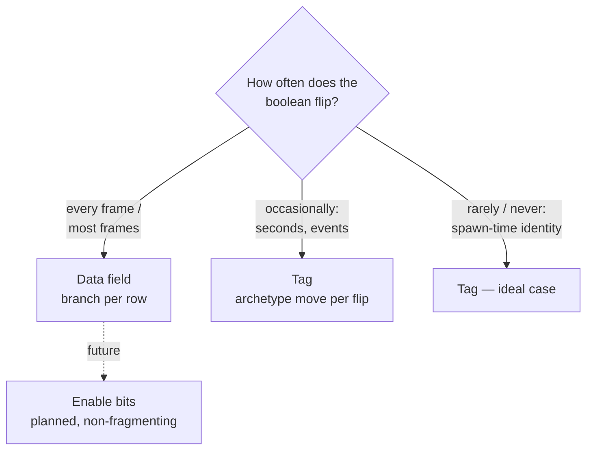

# Storage Trade-offs: Tags, Churn, and Fragmentation

> Tags are free to carry and free to query — but not free to toggle, and not free to combine without limit. This page is the cost model.

*(Branch: `ecs`, Phase 22.)*

## Problem

Every game has boolean-ish state: *frozen*, *selected*, *poisoned*, *dirty*.
An archetype ECS gives you two ways to model it, with opposite cost profiles:

1. **A data field** (`struct Status { frozen: bool }`) — cheap to flip, but
   every system pays a per-row load + branch, forever, even when nothing is
   frozen.
2. **A tag** (`struct Frozen;`) — the branch vanishes from the hot loop
   (existence-based processing: non-matching entities live in archetypes the
   query never visits), but *flipping* the state is an archetype migration.

Neither is universally right. Choosing by toggle frequency is the discipline.

## The churn ladder

A tag toggle (`insert(Frozen)` / `remove::<Frozen>()` / `add_tag` /
`remove_tag`) moves the **whole row** — every retained data column is copied
into the destination archetype, ticks are re-initialized, hooks fire. The tag
column itself copies zero bytes; the entity's *other* components are what you
pay for.

Rules of thumb:

- **Per-frame booleans are not tags.** A state that flips every frame on many
  entities turns the structural `#[cold]` migration path into your hot path.
  Use a data field (and `Changed<T>` if you need reactivity).
- **Persistent, low-frequency state is the tag sweet spot.** Identity-like
  markers (`Player`, `Boss`) toggle never; status effects that change on
  gameplay events (seconds apart) are fine.
- **Querying is always free.** However the tag got there, `With`/`Without`
  and dynamic tag terms resolve at archetype granularity — zero per-row cost.
  The carry cost is 8 B/row (the tick pair — see [Tags](../concepts/tags.md)).

## The fragmentation ceiling

Tags multiply archetypes. Entities holding the same data components but
different tag subsets are *different archetypes*: N independent tags over one
base archetype can mint up to **2^N** combinations. Five tags = up to 32
archetypes for one logical kind of entity.

Boyko's hard ceiling is `MAX_ARCHETYPES = 1024`, and hitting it is a **loud
failure** (a release-active assert at archetype creation), never silent
misbehavior. The practical guidance:

- Budget tags per entity *kind*, not per idea. Ten orthogonal toggleable tags
  on one base archetype is a 1024-combination worst case — the entire budget.
- Fragmentation also degrades iteration: many small archetypes mean more
  archetype transitions per query (each one ~a predicted branch + pointer
  chase) and worse per-archetype SIMD batch sizes.
- The same ceiling protects you: the failure mode is an assert with a count,
  not a slow drift into pointer soup.

## The address-space profile (what a VM monitor will show you)

Each tag pool stores only the two tick regions, but it **reserves** address
space for the full row ceiling up front (reserve ≠ commit):

| Build | Reservation per tag pool *per hosting archetype* | Resident |
|-------|--------------------------------------------------|----------|
| Native (Windows / Linux x86-64) | 2^24 rows × 4 B × 2 regions = **128 MiB** | **zero** until rows commit |
| cfg fallback (Miri / wasm / exotic) | 262,144 rows × 4 B × 2 = **2 MiB** | eager (fallback arm) |

Because tags multiply hosting archetypes by design, the reservations multiply
too: at the theoretical 1024-archetype ceiling with one tag pool each, the
worst case is **128 GiB of reserved address space** — out of a 128 TiB user VA
space on x86-64. This is bounded and harmless (demand-zero pages, zero
resident cost until a row range actually commits, committed slabs grow
geometrically from 64 KiB), but it is stated here so nobody discovers it from
a VM-commit monitor and files it as a leak. Watch **resident/committed**
memory, not reserved.

## What this buys: the design rationale

The recurring trade in this design is *honest costs over silent lies*:

- Tags keep their tick pair (8 B/row) so `Added<Tag>`/`Changed<Tag>` genuinely
  work — the 0 B/row alternative compiles and silently never matches.
- Toggling moves the row through the one audited migration path instead of a
  second bespoke storage class.
- Ceilings (`512` component ids, `1024` archetypes, `8` dynamic terms, `16`
  bundle arity) fail loudly at the boundary.

## Comparison to other engines

| Aspect | Boyko | Bevy | flecs |
|--------|-------|------|-------|
| Tag storage | tick-only pool, 8 B/row | ZST in table + ticks (~8 B/row) | 0 B/row (no column) |
| `Added`/`Changed` on tags | yes | yes | n/a (different reactive model) |
| Toggle cost | archetype move | archetype move | archetype move; opt-in non-fragmenting toggle (`DontFragment`/enable bits) |
| Dynamic (runtime) tags | name-keyed `TagId` in the shared id space | dynamic components share `ComponentId` space | tags are entities |
| Fragmentation mitigation | planned enable-bits (below) | none built-in | enable bits / union storage |

## Future: enable bits

The planned non-fragmenting escape hatch is a **per-archetype enable mask**: a
bit per row per tag, flipped in place — no migration, at the price of a
per-row mask test during iteration. The seams are already reserved (an unused
`Column` field and the single query-term funnel where the mask test would
slot in), so adopting it later will not disturb the storage layout. Until it
lands, the churn ladder above is the guidance.

## See also

- [Tags](../concepts/tags.md) — the 8 B/row cost model and change detection on tags
- [Dynamic Tags](../concepts/dynamic-tags.md) — runtime tags, budgets, query terms
- [Design Principles](principles.md)
- Source: [`constants.rs`](https://github.com/bluesteelll/boyko-engine/blob/ecs/crates/boyko_ecs/src/ecs/constants.rs) (`POOL_MAX_ROWS`, layout math), [`component_pool.rs`](https://github.com/bluesteelll/boyko-engine/blob/ecs/crates/boyko_ecs/src/ecs/memory/component_pool.rs) (tick-only pools, reserve/commit growth)
