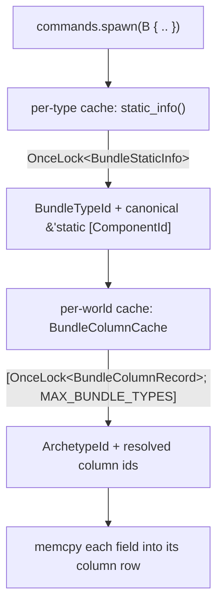

# Bundles

> A bundle is a typed group of components you spawn or insert together in one call.

A bundle answers a single question: *"which components does this kind of entity
start with?"* You declare that set once as a struct, derive `Bundle`, and hand
instances to `Commands::spawn`. The engine resolves the destination archetype,
copies every field into its column, and fires the lifecycle hooks — all from one
deferred command.

*(Branch: `ecs`, sealed since Phase 8.5, arity raised to 16 in Phase 22.)*

If you come from Bevy, the shape is familiar: a `#[derive(Bundle)]` struct passed
to `commands.spawn(...)`. The difference is under the hood — Boyko's bundle path
is built around a two-level static cache so that repeated spawns of the same
bundle type cost a couple of L1 loads, not a registry walk. That story is the
back half of this page.

## Defining a bundle

A bundle is a plain struct where **every field is a [`Component`](components.md)**.
Derive `Bundle` and you are done.

Remember the import rule: the `Bundle` trait comes from the prelude, but the
derive macros live in `boyko_macros` and are *not* re-exported by the prelude.
Import them directly.

```rust,ignore
use boyko_ecs::prelude::*;       // Component (trait), Commands, Entity, ...
use boyko_macros::{Bundle, Component};

#[derive(Component)]
struct Position { x: f32, y: f32, z: f32 }

#[derive(Component)]
struct Velocity { x: f32, y: f32, z: f32 }

#[derive(Component)]
struct Health(u32);

#[derive(Bundle)]
struct PlayerBundle {
    pos: Position,
    vel: Velocity,
    hp: Health,
}
```

Tuple structs work too — the derive accepts both named and tuple field layouts:

```rust,ignore
use boyko_macros::Bundle;

#[derive(Bundle)]
struct Projectile(Position, Velocity);
```

What the derive will **reject** (each is a compile error, pinned to the struct):

- **Generics** — `struct G<T> { .. }`. A per-impl static cache slot only works
  for a non-generic type; a generic would mint one cache per monomorphisation.
- **Enums and unions** — only structs describe a fixed component set.
- **Unit structs and zero-field structs** — there is nothing to spawn. Use
  [`Commands::spawn_empty`](#single-component-and-empty-bundles) for a
  component-less entity.
- **A non-`Component` field** — the derive emits a `where Field: Component`
  bound, so `x: u32` fails at the bound check.
- **More than 16 fields** — see [`MAX_BUNDLE_ARITY`](#max_bundle_arity).

## Spawning from a bundle

`Commands::spawn` takes a bundle by value and returns an
[`EntityCommands`](commands.md) handle you can chain on. The entity ID is minted
synchronously from an atomic counter; the actual spawn is applied when the
command queue flushes (`.id()` is valid immediately, the entity becomes
query-visible after the apply).

```rust,ignore
use boyko_ecs::prelude::*;
use boyko_macros::{Bundle, Component};

#[derive(Component)] struct Position { x: f32, y: f32, z: f32 }
#[derive(Component)] struct Velocity { x: f32, y: f32, z: f32 }
#[derive(Component)] struct Health(u32);
#[derive(Component)] struct Player;          // a tag (zero-sized)

#[derive(Bundle)]
struct PlayerBundle { pos: Position, vel: Velocity, hp: Health }

fn setup(mut commands: Commands) {
    let id: Entity = commands
        .spawn(PlayerBundle {
            pos: Position { x: 0.0, y: 0.0, z: 0.0 },
            vel: Velocity { x: 1.0, y: 0.0, z: 0.0 },
            hp:  Health(100),
        })
        // chain extra components onto the same entity
        .insert(Player)
        .id();

    let _ = id;
}
```

`.insert(bundle)` enqueues a follow-up `InsertCommand`. On apply, if the new
components are already present they are replaced in place; otherwise the entity
**migrates** to the wider archetype. Either way the order of operations is
deferred and applied at the command-queue flush, so the spawn and the insert land
as one logical step.

### Field order does not matter

You declare fields in whatever order reads best. The engine stores a bundle's
component IDs in a **canonical ascending order** (sorted by `ComponentId`), and a
bundle declared `{ vel, pos }` resolves to the exact same archetype as one
declared `{ pos, vel }`. The sort happens once per bundle type (see the cache
section); per-spawn it costs nothing.

## Single-component and empty bundles

You rarely need to wrap a lone component in a struct. `#[derive(Component)]`
*itself* emits a one-component `Bundle` impl, so any component is directly
spawnable:

```rust,ignore
use boyko_ecs::prelude::*;
use boyko_macros::Component;

#[derive(Component)] struct Enemy;            // a tag
#[derive(Component)] struct Health(u32);

fn spawn_singletons(mut commands: Commands) {
    commands.spawn(Enemy);        // one ZST tag
    commands.spawn(Health(50));   // one data component
}
```

Two consequences of that auto-emission:

- A type cannot derive **both** `Component` and `Bundle`. The two `Bundle` impls
  collide (`E0119`). If you want a multi-field bundle whose *name* is also a
  component, opt the component derive out of bundle emission with
  `#[component(no_bundle)]`.
- The single-component bundle requires `Send + Sync + Unpin` (the same bounds the
  `Bundle` trait demands — see below). An exotic component (`Rc` fields,
  `PhantomPinned`) gets a readable named const-assert error; `#[component(no_bundle)]`
  suppresses the emission and keeps the type usable as a plain component.

For an entity with **zero** components, skip bundles entirely:

```rust,ignore
use boyko_ecs::prelude::*;

fn spawn_blank(mut commands: Commands) {
    let e = commands.spawn_empty().id();   // lands in the empty archetype
    let _ = e;
}
```

`spawn_empty()` is `spawn(EmptyBundle)` under the hood — a hand-written
zero-component bundle that owns its own bundle-type ID, so it warms the same
static cache as any other bundle.

## The static bundle cache (and why batch spawns are fast)

This is the part that differs most from a naive implementation, and it is why
spawning ten thousand of the same bundle is cheap.

A bundle spawn needs two pieces of derived data:

1. **The canonical component-ID set** — to find or create the right archetype.
2. **The resolved column pointers in that archetype** — to know *where* each
   field's bytes go.

Computing either from scratch on every spawn would mean re-sorting IDs and
walking the archetype's pool map per entity. Boyko computes each exactly once and
caches it at two levels.



**Level 1 — per-type, process-global.** Each `#[derive(Bundle)]` impl owns one
`static INFO: OnceLock<BundleStaticInfo>`. The first call mints a process-global
`BundleTypeId`, sorts the component IDs into canonical order, and leaks the sorted
slice into `'static` storage. Every later call is a single Acquire load (~2 ns).
Because this is keyed on the *type*, it is shared across threads and across
`EcsMaster` instances — sorting and ID-minting happen at most once per bundle type
per process.

**Level 2 — per-world.** The cache that actually accelerates spawning is the
[`BundleColumnCache`](https://github.com/bluesteelll/boyko-engine/blob/ecs/crates/boyko_ecs/src/ecs/core/bundle/bundle_column_cache.rs)
on each `EcsMaster`: a boxed `[OnceLock<BundleColumnRecord>; MAX_BUNDLE_TYPES]`
indexed directly by `BundleTypeId`. A record holds the destination `ArchetypeId`
plus the resolved per-component column IDs in canonical order. The first spawn of
a bundle in a given world resolves the archetype and the column map (~1 µs);
every subsequent spawn is a direct array index plus one `OnceLock::get` Acquire
load (~3 ns) — no sort, no archetype lookup, no per-component map walk.

For `spawn_batch`, this pays off per row. The column record is loaded **once at
the top of the batch**, the destination capacity is grown once, and the write loop
then does fixed-width stores straight into each column — the canonical sort and
the archetype resolution are entirely amortised away. This is the architectural
reason a batch of N identical bundles scales linearly with a tiny constant rather
than re-deriving metadata N times.

```rust,ignore
use boyko_ecs::prelude::*;
use boyko_macros::{Bundle, Component};

#[derive(Component)] struct Position { x: f32, y: f32, z: f32 }
#[derive(Component)] struct Velocity { x: f32, y: f32, z: f32 }

#[derive(Bundle)]
struct Mover { pos: Position, vel: Velocity }

fn spawn_swarm(mut commands: Commands) {
    // One archetype resolve + one column-record load for the whole batch.
    commands
        .spawn_batch((0..1_000).map(|i| Mover {
            pos: Position { x: i as f32, y: 0.0, z: 0.0 },
            vel: Velocity { x: 0.0, y: 1.0, z: 0.0 },
        }))
        .expect("batch size is within MAX_BATCH_HINT")
        .for_each(drop);   // drain the reserved Entity IDs
}
```

`spawn_batch` caps a single call at `MAX_BATCH_HINT` (8 192) entities and returns
`Err(EcsError::SpawnBatchExceedsCapacity)` above that — chunk larger spawns
yourself.

## Sealing and trait bounds

`Bundle` is **sealed**: the only blessed way to get a `Bundle` impl is the
derive. The trait's bound is
`Bundle: BundleSealed + Send + Sync + Unpin + 'static`, and `BundleSealed` lives
in a private module that downstream code cannot name, so a hand-written
`impl Bundle for MyType` will not compile.

`Unpin` is load-bearing, not decorative: the deferred-command queue moves bundle
values through a byte arena with unaligned bitwise copies, which is sound only if
the bundle has no self-references. Every derived bundle is `Unpin` by default
because its fields are ordinary components.

If a callback panics mid-spawn, the not-yet-written fields **leak** rather than
risk a double-drop: the derive wraps each field in `ManuallyDrop` *before* any
copy runs. A leak on panic is the deliberate trade-off over UB.

## `MAX_BUNDLE_ARITY`

A bundle holds at most **16 components**
([`MAX_BUNDLE_ARITY`](https://github.com/bluesteelll/boyko-engine/blob/ecs/crates/boyko_ecs/src/ecs/core/bundle/bundle.rs#L49)),
raised from 8 in Phase 22 because tags make wide bundles ordinary. The derive
rejects a 17th field at macro-expansion time
([`boyko_macros/src/lib.rs:3334`](https://github.com/bluesteelll/boyko-engine/blob/ecs/crates/boyko_macros/src/lib.rs#L3334)),
so the limit surfaces as a clear compile error rather than a runtime surprise.
The constant also sizes the fixed-width stack arrays the spawn path uses to
resolve columns, which is why it is a hard ceiling: those arrays never allocate.

If you genuinely need more than 16 components on an entity, split them across a
`spawn(...)` plus one or more `.insert(...)` calls — the entity migrates to the
wider archetype on apply, and the result is identical to a single fat bundle.

## Performance characteristics

| Operation | Cost | Notes |
|-----------|------|-------|
| First call to `static_info()` for a type | ~80 ns, once per process | mints `BundleTypeId`, sorts + leaks the ID slice |
| Cached `static_info()` / `component_ids()` | ~2 ns | one `OnceLock` Acquire load |
| First spawn of a bundle in a world | ~1 µs | resolves archetype + column record |
| Warm spawn (cached) | ~3 ns metadata + per-field memcpy | direct `BundleTypeId` array index |
| `spawn_batch` of N | one resolve + N fixed-width writes | metadata amortised across the batch |

## See also

- [Components](components.md) — every bundle field is one
- [Entities](entities.md) — what a spawn actually produces
- [Commands](commands.md) — `spawn`, `spawn_empty`, `spawn_batch`, `insert`
- [Tags](tags.md) — zero-sized components, the reason arity is 16
- Source: [`core/bundle/`](https://github.com/bluesteelll/boyko-engine/blob/ecs/crates/boyko_ecs/src/ecs/core/bundle/bundle.rs),
  [`bundle_column_cache.rs`](https://github.com/bluesteelll/boyko-engine/blob/ecs/crates/boyko_ecs/src/ecs/core/bundle/bundle_column_cache.rs)
