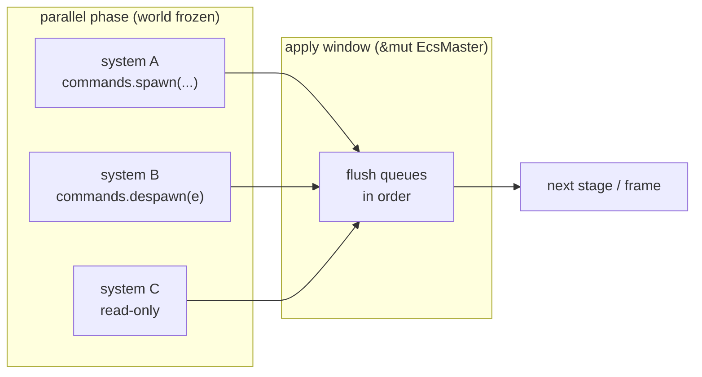

# Commands

`Commands` is how a system mutates the *structure* of the world — spawning and
despawning entities, inserting and removing components — without ever taking a
`&mut` on the world. Every such request is recorded into a small per-system
buffer and replayed later, at a single well-defined point in the frame. That
deferral is exactly what lets boyko run your systems in parallel.

If you have written Bevy, this API will feel familiar by design: `Commands`,
`EntityCommands`, `commands.spawn(bundle).insert(extra).id()`. The shapes match;
the storage underneath does not — see [The CommandQueue](#the-commandqueue) for
the byte-arena that replaces Bevy's `Box<dyn Command>`.

---

## Why structural mutation must be deferred

Spawning an entity can grow a `ComponentPool`. Inserting a component can migrate
an entity to a different archetype, moving rows in memory. Despawning swap-removes
a row. All of these are `&mut`-world operations — they invalidate the very slices
that *other* systems are iterating.

The [scheduler](../scheduler.md) runs non-conflicting systems concurrently on
worker threads. While those bodies run, the world is frozen: no archetype grows,
no row moves, no pool reallocates. A system that wants to change structure cannot
do it inline — it would race every sibling reading the same data. So it asks
`Commands` instead, and the request is held until the **apply window**: a serial
phase, after all dispatched systems have reported back, where the dispatcher holds
`&mut EcsMaster` exclusively and flushes every queue in deterministic order.



The cost you pay is latency: a spawn requested in this frame is not query-visible
until the apply window. The cost you avoid is a data race — and the serialization
penalty is tiny, because applying a queue is a tight memcpy-and-dispatch walk, not
re-running any user logic.

> Note the asymmetry: `Commands` does **structural** mutation. *Reading and
> writing component values you already have* is not deferred — that is what
> `Query<&mut T>` is for, and it runs inline in the parallel phase. Reach for
> `Commands` only when the set of entities, components, or tags changes.

---

## Getting a `Commands`

`Commands` is a [system parameter](systems.md). Declare it in a system signature
and the scheduler hands you one, freshly bound to that system's own queue, on
every run:

```rust,ignore
use boyko_ecs::prelude::*;
use boyko_macros::{Component, Bundle};

#[derive(Component)]
struct Position { x: f32, y: f32 }

#[derive(Component)]
struct Velocity { x: f32, y: f32 }

#[derive(Bundle)]
struct ProjectileBundle {
    pos: Position,
    vel: Velocity,
}

fn spawn_projectiles(mut commands: Commands) {
    commands.spawn(ProjectileBundle {
        pos: Position { x: 0.0, y: 0.0 },
        vel: Velocity { x: 1.0, y: 0.0 },
    });
}
```

`Commands` declares **no** component or resource access. Buffering is a pure
append onto its own queue, and reserving an entity ID is a single atomic
increment — neither conflicts with anything. That is *why* a system taking
`Commands` never blocks a sibling: it adds no edges to the scheduler's conflict
graph.

> The examples below build on the `Position`, `Velocity`, and `Health` component
> types defined above. If you copy a single block in isolation, redeclare the
> types it uses.

---

## Spawning: `spawn` and `EntityCommands`

`commands.spawn(bundle)` reserves a fresh [`Entity`](entities.md) immediately (via
the world's atomic counter) and enqueues the spawn. It returns an
[`EntityCommands`](#the-entitycommands-handle) handle so you can keep building the
entity in one expression:

```rust,ignore
use boyko_ecs::prelude::*;
use boyko_macros::{Component, Bundle};

#[derive(Component)]
struct Health(u32);

#[derive(Bundle)]
struct EnemyBundle {
    pos: Position,
    vel: Velocity,
}

#[derive(Bundle)]
struct CombatBundle {
    hp: Health,
}

fn spawn_enemy(mut commands: Commands) {
    let id = commands
        .spawn(EnemyBundle {
            pos: Position { x: 10.0, y: 0.0 },
            vel: Velocity { x: -1.0, y: 0.0 },
        })
        .insert(CombatBundle { hp: Health(100) })
        .id();

    // `id` is usable NOW — e.g. to wire a relation — even though the entity
    // becomes query-visible only after the apply window.
    let _ = id;
}
```

The returned ID is valid synchronously: you can thread it through other commands
in the same frame (relations, parenting, a follow-up `entity(id)`), and it will
point at the right entity once everything flushes. What you *cannot* do is query
for it before the apply window — it is not in any pool yet.

Two convenience constructors round this out:

- `commands.spawn_empty()` — an entity with **zero** components. It lands in the
  empty archetype and is invisible to every component query until you add
  something. Tag-only and component-less entities are first-class.
- `commands.spawn_batch(iter)` — reserve and spawn many entities sharing one
  bundle type in a single command. Returns an iterator of the reserved IDs.
  Batches are capped at `MAX_BATCH_HINT` (8192) per call; chunk larger requests
  yourself.

---

## The `EntityCommands` handle

`EntityCommands` is a chainable cursor over **one** entity. You get it from
`commands.spawn(...)` (a fresh entity) or `commands.entity(existing)` (any entity,
spawned this frame or long-lived). Each method enqueues one command and returns
`&mut Self`, so calls compose:

```rust,ignore
use boyko_ecs::prelude::*;
use boyko_macros::{Component, Bundle};

#[derive(Component)]
struct Frozen;

#[derive(Bundle)]
struct Shield { amount: Health }

fn modify(mut commands: Commands, target: Entity) {
    commands
        .entity(target)
        .insert(Shield { amount: Health(50) })  // add components
        .remove::<Velocity>()                    // strip a component
        .insert(Frozen);                         // attach a tag
}
```

The core surface:

| Method | Effect on apply |
|--------|-----------------|
| `.insert(bundle)` | Add `bundle`'s components (migrate the archetype, or replace in place if already present). |
| `.remove::<C>()` | Strip component `C`. No-op if the entity lacks it. |
| `.despawn()` | Destroy the entity (recursively despawns its children by default). |
| `.id()` | Return the targeted `Entity` (not deferred — just reads the captured ID). |

It also carries the ergonomic helpers for the kernel's higher-level features —
`.add_child` / `.set_parent` / `.clear_children` for parent-child hierarchies,
`.add_tag` / `.remove_tag` for [dynamic tags](dynamic-tags.md), and
`.enable::<T>()` / `.disable::<T>()` for [enable-tags](enable-tags.md). All of them
are just typed wrappers that push the corresponding command.

Two sharp edges worth internalizing:

- **No validation at the call site.** `commands.entity(stale_id)` compiles and
  enqueues happily. On apply, a command targeting a dead entity silently no-ops
  in release (a `debug_assert` fires in debug). This is deliberate: a despawn may
  legitimately race an insert within the same frame.
- **`despawn` is not terminal.** The borrow checker will let you chain calls after
  `.despawn()`; those post-despawn commands just no-op on the freed entity. The
  type system cannot protect you from that logical mistake.

---

## Despawning

`commands.despawn(entity)` is the shorthand for `commands.entity(entity).despawn()`.
It takes an [`Entity`](entities.md) — the full handle, ID **and** generation, since
the apply-time generation guard rejects stale handles.

To despawn from inside a system you need that full `Entity` for each row you iterate.
A `Query<&T>` yields component references, not entities, so the idiomatic pattern is
to store each entity's own handle in a self-reference component, written at spawn
time. Then query for it:

```rust,ignore
use boyko_ecs::prelude::*;
use boyko_macros::Component;

#[derive(Component)]
struct Health(u32);

// A self-reference: every entity carries its own handle, set when it spawns.
#[derive(Component)]
struct EntityRef(Entity);

fn cull_dead(mut commands: Commands, query: Query<(&EntityRef, &Health)>) {
    for (me, hp) in query.iter() {
        if hp.0 == 0 {
            commands.despawn(me.0);
        }
    }
}
```

> Why a self-reference and not the entity ID from the row? `Query` does expose the
> per-row entity through `iter_entities()`, but it yields an
> [`EntityId`](entities.md) — a bare index — whereas `despawn` needs a full
> `Entity` carrying the generation. An `EntityId` alone cannot be turned into a
> valid `Entity` for despawn, because a fabricated generation would be rejected as
> stale for any recycled slot. Storing the real `Entity` handle in a component
> sidesteps the problem entirely.

Despawning an entity with children **cascades by default**: `commands.despawn(e)`
flushes to [`EcsMaster::delete_entity`](https://github.com/bluesteelll/boyko-engine/blob/ecs/crates/boyko_ecs/src/ecs/core/ecs_master/ecs_master.rs#L1368),
which fires the `Children` relationship's despawn hook and recursively destroys the
whole subtree — no orphaned children, no dangling parents. If you want to free just
the one entity and keep its children alive, the direct opt-out is
[`EcsMaster::despawn_without_children(e)`](https://github.com/bluesteelll/boyko-engine/blob/ecs/crates/boyko_ecs/src/ecs/core/ecs_master/ecs_master.rs#L1391),
which suppresses the cascade for exactly that one removal (the surviving children
keep a now-dangling `ChildOf` — a documented footgun, so reparent or despawn them
yourself).

---

## Custom commands with `add`

Any `Send + 'static` type that implements the `Command` trait can be enqueued via
`commands.add(cmd)`. This is the escape hatch for mutations the built-in methods
do not cover — including things `Commands` has no dedicated method for, like
inserting a resource:

```rust,ignore
use boyko_ecs::prelude::*;
// `EcsMaster` is in the prelude, but the `Command` trait is not — it lives at
// its module path. The derive macros are dev-dependency-only, so import them too.
use boyko_ecs::ecs::core::commands::Command;
use boyko_macros::Resource;

#[derive(Resource)]
struct Score(u32);

// A command is a value-typed payload. On flush it consumes itself and gets
// exclusive `&mut EcsMaster` — the full direct API is available here.
struct SetScore(u32);

impl Command for SetScore {
    fn apply(self, world: &mut EcsMaster) {
        world.insert_resource(Score(self.0));
    }
}

fn reset_score(mut commands: Commands) {
    commands.add(SetScore(0));
}
```

The `apply(self, world: &mut EcsMaster)` signature is the whole contract: your
command runs exactly once, in the apply window, with exclusive world access. If
`apply` is never called (the queue is dropped with un-flushed commands), the
command's `Drop` still runs exactly once — no leaks.

`commands.send_event(event)` is a built-in command of this shape: it forwards to
the event dispatcher at apply time. See [Events](events.md).

---

## Commands vs. direct `EcsMaster` mutation

`Commands` is the in-system path. Outside a parallel system run — at app setup, in
an exclusive system that receives `&mut EcsMaster`, or in tests — you can mutate
the world directly and **immediately**, with no apply window:

```rust,ignore
use boyko_ecs::prelude::*;
use boyko_macros::Resource;

#[derive(Resource)]
struct Score(u32);

fn setup(world: &mut EcsMaster) {
    // Immediate: the resource exists the instant this returns.
    world.insert_resource(Score(0));
}
```

The two paths trade off latency against the parallelism guarantee:

| | `Commands` (in a system) | Direct `&mut EcsMaster` |
|---|---|---|
| When it takes effect | The next apply window | Immediately |
| World access | None declared — pure buffering | Exclusive `&mut` |
| Runs in parallel with other systems | **Yes** | No (it *is* the exclusive phase) |
| Typical use | Gameplay logic | App setup, exclusive systems, tests |

The kernel's facade methods — `world.create_entity(...)`, `world.spawn_one(...)`,
`world.insert_resource(...)`, `world.delete_entity(...)` — are the lower-level direct
surface that `Commands` ultimately drives during apply. (`DespawnCommand::apply`
calls `world.delete_entity(...)`; there is no `world.despawn`. The non-cascading
teardown is `world.despawn_without_children(...)`.) Reach for them when you already
hold `&mut EcsMaster` and want the change to land now. Reach for `Commands`
everywhere else. See [Entities](entities.md) for the direct entity-construction API.

---

## The CommandQueue

Each system that takes `Commands` owns one `CommandQueue`, stored in the system's
cached state. It is a **type-erased byte arena**, not a list of boxed trait
objects. Every command is written as a contiguous slot:

```text
[ CommandMeta (8 B) ][ command payload (size_of::<C>()) ]
        |
        +-- one fn-pointer: the type-erased apply-or-drop glue for C
```

Pushing a command is two `write_unaligned` calls plus an amortized `Vec` reserve —
no per-command heap allocation, no `Box<dyn Command>`, no virtual table walk. The
queue header is 56 bytes and lives on the system's state; `Vec::new()` defers the
heap allocation until your first push, so a system that conditionally issues no
commands pays nothing.

At the apply window the dispatcher calls `SystemParam::apply`, which walks the
arena from a cursor, reads each slot's meta fn-pointer, and dispatches `apply`
against `&mut EcsMaster`. The walk is wrapped in a single `catch_unwind`: if one
command panics, the survivors are preserved for the next apply and the original
panic is re-raised — your queue is never left half-drained or corrupt. Capacity is
retained across applies, so a queue that fills and drains every frame stops
allocating after warm-up.

Why this shape:

- **No allocation on the hot path.** Buffering is append-into-arena; flushing is a
  linear walk. This is the [zero-runtime-overhead](../architecture/principles.md)
  principle applied to deferral.
- **`Send`, not `Sync`.** The arena is `Send` (every stored command is
  `Send + 'static`), so a worker thread can own and fill its system's queue. It is
  deliberately not `Sync` — a queue has a single writer (its system); the
  scheduler arbitrates between queues, not within one.
- **Tree-Borrows-clean apply.** The flush walks the arena through a raw-pointer
  twin minted with `&raw mut`, never materializing an intermediate reference into
  a byte slot. This is what keeps the type-erased reads sound under Miri's
  strictest aliasing model.

You never touch `CommandQueue` directly — it is the machinery behind the
`Commands` parameter — but knowing it is a packed arena explains why issuing
hundreds of commands per system per frame is cheap.

---

## See also

- [Systems](systems.md) — how `Commands` is supplied as a system parameter.
- [The scheduler](../scheduler.md) — the apply window, the conflict graph, and why
  `Commands` adds no scheduling edges.
- [Entities](entities.md) — the direct, immediate entity-construction API.
- [Bundles](bundles.md) — what you pass to `spawn` and `insert`.
- [Dynamic tags](dynamic-tags.md) and [enable-tags](enable-tags.md) — the
  `.add_tag` / `.enable::<T>()` helpers on `EntityCommands`.
- [Events](events.md) — `commands.send_event` and deferred dispatch.

Source: [`params/commands.rs`](https://github.com/bluesteelll/boyko-engine/blob/ecs/crates/boyko_ecs/src/ecs/core/system/params/commands.rs),
[`params/entity_commands.rs`](https://github.com/bluesteelll/boyko-engine/blob/ecs/crates/boyko_ecs/src/ecs/core/system/params/entity_commands.rs),
[`commands/command_queue.rs`](https://github.com/bluesteelll/boyko-engine/blob/ecs/crates/boyko_ecs/src/ecs/core/commands/command_queue.rs),
[`commands/command.rs`](https://github.com/bluesteelll/boyko-engine/blob/ecs/crates/boyko_ecs/src/ecs/core/commands/command.rs).
