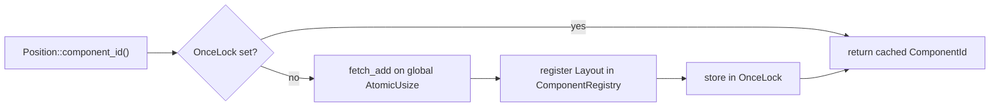

# Components

A component is a plain Rust struct attached to an entity — the *data* half of
ECS. Define one with `#[derive(Component)]`, and the engine handles its storage,
its identity, and its layout. If you have written Bevy components, these will
feel immediately familiar; the differences are about *where the bytes live*, not
about the API shape.

*(Branch: `ecs`.)*

## What a component is

An [entity](entities.md) is just an id. All of its actual state lives in
components: a `Position`, a `Velocity`, a `Health`. Each component type is stored
as its own contiguous column (see [Storage trade-offs](../architecture/storage-tradeoffs.md)),
so iterating one component over thousands of entities walks straight, packed
memory — the property the whole engine is built around.

A component is any `'static + Sized` type that implements the `Component` trait.
You never implement the trait by hand; `#[derive(Component)]` does it for you,
and the derive also wires up several optional features (a one-component
[bundle](bundles.md), lifecycle [hooks](hooks-and-observers.md), required
components, clone behavior). The trait itself is tiny — its center is one method:

```rust,ignore
// crates/boyko_ecs/src/ecs/core/component/component.rs
pub trait Component: 'static + Sized {
    fn component_id() -> ComponentId;
    // ... plus const flags the derive fills in (HAS_HOOKS, HAS_REQUIRES, ...)
}
```

## Defining a component

The derive macro lives in the `boyko_macros` crate. This matters: `boyko_macros`
is only a **dev-dependency** of `boyko_ecs`, so the derives are **not** re-exported
from the prelude. The *trait* `Component` comes from `boyko_ecs::prelude::*`; the
*derive macro* must be imported directly from `boyko_macros`.

```rust,ignore
use boyko_macros::Component; // the DERIVE — not in the prelude

#[derive(Component)]
struct Position {
    x: f32,
    y: f32,
    z: f32,
}

#[derive(Component)]
struct Velocity {
    x: f32,
    y: f32,
    z: f32,
}
```

That is the entire ceremony. There is no registration call, no central type list
to maintain — the type's id and layout are minted lazily the first time the
engine sees it (see [How ids are assigned](#how-ids-are-assigned)).

> **Import gotcha (came up before):** writing `use boyko_ecs::prelude::*;` alone
> and then `#[derive(Component)]` will *not* compile — the prelude exports the
> trait, not the macro. Always add `use boyko_macros::Component;` (and the other
> derives you use: `Resource`, `Bundle`, `SystemSet`).

### Marker components (ZSTs)

A component with **zero fields** is a marker, or *tag*: it carries no data, only
the fact of its presence on an entity.

```rust,ignore
use boyko_macros::Component;

#[derive(Component)]
struct Player;

#[derive(Component)]
struct Frozen;
```

There is no attribute and no special trait for this. Tag-ness is detected purely
from `size_of::<T>() == 0` at registration — internally
[`ComponentLayout::is_zst`](https://github.com/bluesteelll/boyko-engine/blob/ecs/crates/boyko_ecs/src/ecs/core/component/component_registry.rs#L148)
is just `self.size == 0`. A zero-byte component gets a *tick-only* pool (8 bytes
per row, no data region) so that `Added<Player>` / `Changed<Player>` still work,
but otherwise attaching it only flips the entity's archetype signature bit and
copies nothing. This is the mechanism behind existence-based processing: a
`Without<Frozen>` query never even visits frozen entities. Markers are covered in
depth on the [Tags](tags.md) page (including runtime-named
[dynamic tags](dynamic-tags.md) and the bitset-backed
[enable tags](enable-tags.md)).

## How ids are assigned

Every component type maps to a small integer, `ComponentId`. The engine uses that
id everywhere internally — as an index into per-archetype pool arrays, as a bit
position in a component mask — which is exactly why it must be small and dense,
not a `TypeId` hash.

Assignment is **lazy and per-process**:

1. The first call to `T::component_id()` mints a fresh id from a global
   `AtomicUsize` and registers `T`'s `Layout` (size, alignment, drop glue) into
   the global `ComponentRegistry`.
2. The minted id is cached in a per-type `OnceLock<ComponentId>`, so every
   later call is a plain cached read — no atomic, no lock on the hot path.

```rust,ignore
use boyko_ecs::prelude::*; // brings the Component TRAIT into scope (for component_id())
use boyko_macros::Component; // the DERIVE macro

#[derive(Component)]
struct Position { x: f32, y: f32, z: f32 }

let id = Position::component_id(); // mints on first call, cached thereafter
```



Two consequences follow from "lazy, per-process":

- **Ids are not stable across runs.** They depend on the order types are first
  touched, so you must never persist a raw `ComponentId` to disk or send it over
  a wire — that is the job of [serialization](../persistence/serialization.md),
  which keys on stable type identity instead. Code that needs deterministic ids
  at startup should *warm up* the registry by calling `component_id()` on its
  types in a fixed order during setup.
- **There is a ceiling.** `MAX_COMPONENTS = 512` distinct component ids per
  process (shared with dynamic tags). This is a deliberate, loud limit: it keeps
  the per-archetype id arrays and component masks compact and cache-resident.

Bevy contrast: Bevy assigns `ComponentId`s lazily from a per-`World` counter as
well, but Boyko's counter is **process-global** rather than per-world, which lets
several worlds share one set of registered layouts (see
[Multi-world](../app/multi-world.md)). The trade-off is the fixed 512-id budget.

## Layout, `repr`, and SoA storage

The derive also emits inherent associated consts on the type, so you can ask
about its memory shape without an instance:

```rust,ignore
use boyko_macros::Component;

#[derive(Component)]
struct Position { x: f32, y: f32, z: f32 }

const _: () = {
    let _size  = Position::SIZE;   // size_of::<Position>()  == 12
    let _align = Position::ALIGN;  // align_of::<Position>() == 4
};
// Position::layout() returns the matching core::alloc::Layout.
```

Storage is **Struct-of-Arrays, one column per component type**. Each component
type owns its own
[`ComponentPool`](https://github.com/bluesteelll/boyko-engine/blob/ecs/crates/boyko_ecs/src/ecs/memory/component_pool.rs#L147)
inside an archetype — a single contiguous, SIMD-aligned buffer holding every
instance of *that* component for entities in *that* archetype, back to back.
Iterating `Position` does not drag `Velocity` or `Health` into cache; each query
touches only the columns it reads. Because the columns are separate, the *order*
in which you list fields inside one struct only affects that struct's own bytes —
there is no AoS interleaving across component types to worry about.

You do **not** need `#[repr(C)]` for an ordinary component: the engine treats the
component's bytes opaquely (it copies `SIZE` bytes at `ALIGN`, runs the drop glue
on removal), so Rust's default layout is fine. Reach for `#[repr(C)]` only when
*you* depend on the in-struct field order — for instance a type whose bytes are
uploaded straight to the GPU (see [GPU columns](../rendering/gpu-columns.md)) or
read by hand-written SIMD. When in doubt, leave it off.

> **Drop discipline.** A component's `Drop` impl runs when the row is removed or
> the world is torn down, and it must **not panic** — the teardown path is not
> wrapped in `catch_unwind` (that would cost ~20-30 ns per element). Prefer owning
> heap data through `Vec` / `Box` / `Arc`, which drop without panicking.

## Required components

A component can declare that attaching it *implies* other components, via the
`#[require(...)]` attribute. When you spawn or insert the type, any required
component that is missing is added automatically. This replaces ad-hoc "bundle of
defaults" boilerplate and mirrors Bevy 0.15+ required components.

```rust,ignore
use boyko_macros::Component;

#[derive(Component, Default)]
struct Position { x: f32, y: f32, z: f32 }

#[derive(Component, Default)]
struct Velocity { x: f32, y: f32, z: f32 }

// A Player always needs a Position and a Velocity.
#[derive(Component)]
#[require(Position, Velocity)]
struct Player;
```

Each entry in the list may be a bare type (`Position`, constructed via its
`Default`), an explicit value (`Health = Health(100)`), or a constructor call
(`Velocity(spawn_velocity())`). Now `commands.spawn(Player)` yields an entity
that already carries `Position` and `Velocity` even though you only named
`Player`.

## Lifecycle hooks on a component

A component can bind **lifecycle hooks** — code that runs when the component is
added to or removed from an entity — through the optional `#[component(...)]`
helper attribute:

```rust,ignore
use boyko_macros::Component;

#[derive(Component)]
#[component(on_add = on_health_added, on_remove = on_health_removed)]
struct Health(u32);
```

The valid keys are `on_add`, `on_insert`, `on_replace`, and `on_remove`, each
pointing at an `unsafe fn(DeferredEcsMaster<'_>, HookContext)`. The derive-bound
form is mutually exclusive with the runtime hook builder for the same type. Hooks,
their runtime sibling **observers**, and the full `HookContext` API are documented
on [Hooks and observers](hooks-and-observers.md).

## Performance characteristics

| Operation | Complexity | Notes |
|-----------|------------|-------|
| `component_id()` (after first call) | O(1) | Cached `OnceLock` read; no atomic, no lock |
| `component_id()` (first call) | O(1) amortized | One `fetch_add` + registry insert, then cached |
| Sequential iteration of a column | O(n) | Contiguous SoA, SIMD-aligned, cache-friendly |
| Attach / detach (data component) | O(component count) | Archetype move: copy each column's row |
| Attach / detach (ZST marker) | O(component count) | Archetype move, but copies 0 data bytes |

## See also

- [Bundles](bundles.md) — grouping components for one-shot spawn/insert.
- [Entities](entities.md) — what a component is attached *to*.
- [Tags](tags.md) — zero-sized marker components, in depth.
- [Hooks and observers](hooks-and-observers.md) — react to component add/remove.
- [Storage trade-offs](../architecture/storage-tradeoffs.md) — why SoA columns.
- Source: [`component.rs`](https://github.com/bluesteelll/boyko-engine/blob/ecs/crates/boyko_ecs/src/ecs/core/component/component.rs),
  [`component_registry.rs`](https://github.com/bluesteelll/boyko-engine/blob/ecs/crates/boyko_ecs/src/ecs/core/component/component_registry.rs),
  derive in [`boyko_macros/src/lib.rs`](https://github.com/bluesteelll/boyko-engine/blob/ecs/crates/boyko_macros/src/lib.rs).
