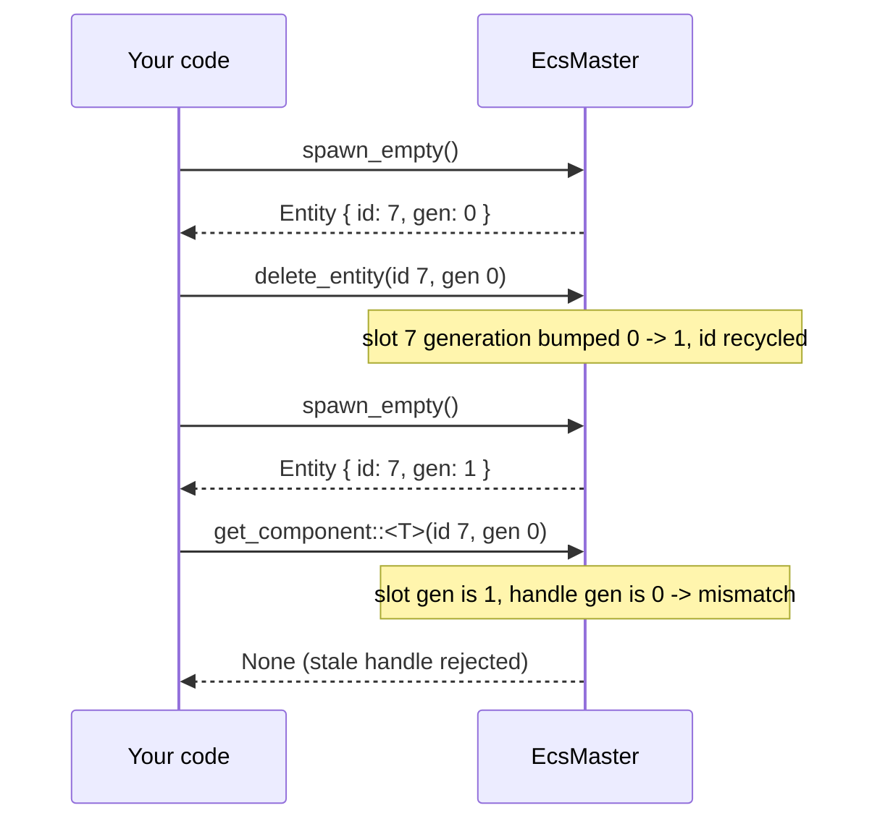

# Entities

> An entity is a tiny, copyable handle — an id plus a generation — that names a row of component data. It owns nothing itself.

*(Branch: `ecs`.)*

An [`Entity`](https://github.com/bluesteelll/boyko-engine/blob/ecs/crates/boyko_ecs/src/ecs/core/entity/entity.rs#L5)
is the thing you keep around to refer to a game object later: a player, a
projectile, a UI node. It is deliberately small and `Copy`, so you pass it by
value everywhere. The actual data lives in [component](components.md) columns
inside an archetype; the entity is just the key that finds the right row.

If you come from Bevy, this is the same `Entity` concept and most of the same
spelling. What differs is the layer below it: recycling and lookup are built on
an address-stable slab
([`EntityMaster`](https://github.com/bluesteelll/boyko-engine/blob/ecs/crates/boyko_ecs/src/ecs/core/entity/entity_master.rs#L44)
over an
[`InlandStore`](https://github.com/bluesteelll/boyko-engine/blob/ecs/crates/boyko_ecs/src/ecs/core/entity/inland_store.rs#L1))
rather than a sparse-set generation table. This page is the "use it" view; the
recycling rules that matter to a caller are covered in
[Generations defend against ABA](#generations-defend-against-aba) below.

## The handle: id + generation

```rust,ignore
use boyko_ecs::prelude::*;

fn inspect(entity: Entity) {
    let _index: usize = entity.id().0;   // the slot index (a newtype over usize)
    let _gen: u32 = entity.generation(); // the recycling counter
}
```

An `Entity` is two fields:

- **`id`** — the slot index into the entity store. This is what makes lookup
  O(1): the id is a direct index, not a hash key.
- **`generation`** — a counter that increments each time a slot is reused. This
  is the half that makes a *stale* handle detectable.

Equality compares **both** fields. Two handles are the same entity only if their
id and generation both match:

```rust,ignore
use boyko_ecs::prelude::*;

fn same(a: Entity, b: Entity) -> bool {
    a == b           // derived PartialEq: compares id AND generation
    // identical to: a.is_same(&b)
}
```

That "both fields" rule is not a detail — it is the entire use-after-despawn
defence. A handle with the right id but a stale generation is *not equal* to the
live entity now occupying that slot, and every lookup rejects it (see
[Generations defend against ABA](#generations-defend-against-aba) below).

`Entity::new(id, generation)` and `Entity::with_id(id)` exist for constructing a
handle literal (tests, serialization round-trips), but in normal code you never
build one by hand — you receive entities back from spawning.

## Spawning directly through `EcsMaster`

[`EcsMaster`](https://github.com/bluesteelll/boyko-engine/blob/ecs/crates/boyko_ecs/src/ecs/core/ecs_master/ecs_master.rs#L148)
is the world: it owns every archetype, pool, and the entity store. When you hold
`&mut EcsMaster` directly — at startup, in tests, or inside an exclusive
`|w: &mut EcsMaster|` system — you spawn through it immediately. (Inside ordinary
parallel systems you use deferred [`Commands`](commands.md) instead; see
[below](#deferred-spawning-inside-systems).)

Spawning is a two-step model: resolve the **archetype** for a set of component
types, then create an entity in it. `get_or_create_archetype` is the funnel that
maps a component-id set to an `ArchetypeId` (lazily creating it the first time):

```rust,ignore
use boyko_ecs::prelude::*;
use boyko_macros::Component;

#[derive(Component)]
struct Position { x: f32, y: f32 }

#[derive(Component)]
struct Velocity { dx: f32, dy: f32 }

fn boot(world: &mut EcsMaster) {
    // Resolve (or create) the archetype that holds exactly {Position, Velocity}.
    let arch = world.get_or_create_archetype(&[
        Position::component_id(),
        Velocity::component_id(),
    ]);

    // Type-safe single-component spawn into that archetype.
    let _e: Entity = world
        .spawn_one(arch, Position { x: 0.0, y: 0.0 })
        .expect("archetype hosts Position");
}
```

`spawn_one` (and its sibling `spawn_two`) take ownership of the value, copy its
bytes into the matching pool, and hand drop responsibility to that pool — your
local is `mem::forget`'d on success and dropped normally on failure, so there is
no leak and no double-free either way. They return an `EcsResult<Entity>` because
the push can be rejected (e.g. the archetype does not host the component type).

For more than two components, or for spawning many at once, use `create_entity`
(raw id + byte-slice pairs) or `spawn_batch`. In day-to-day code you rarely call
`create_entity` by hand — a [`Bundle`](bundles.md) packs the component set for
you, and `Commands` drives the common path.

### `spawn_empty`: an entity with zero components

```rust,ignore
use boyko_ecs::prelude::*;

fn boot(world: &mut EcsMaster) {
    let e: Entity = world.spawn_empty();
    // `e` exists and is a valid handle, but holds NO components yet.
}
```

[`spawn_empty`](https://github.com/bluesteelll/boyko-engine/blob/ecs/crates/boyko_ecs/src/ecs/core/ecs_master/ecs_master.rs#L1237)
gives you a live entity that belongs to the **EMPTY archetype** — the archetype
with an empty signature. It is the explicit "I want a handle now, components
later" path. Two consequences follow from the empty signature:

- The entity matches **no** component query. Query matching is subset-based, so
  the empty signature is selected only by zero-required-component filters — it
  will never show up in a `Query<&Position>`.
- You can add components to it afterwards through the ordinary insert/migration
  funnel (it migrates to a richer archetype on first insert), exactly as you
  would for any other entity.

The EMPTY archetype is resolved lazily on first `spawn_empty`, so a world that
never spawns an empty entity pays nothing for it.

## Reading and mutating components by handle

Given an `Entity`, you read its data directly off the world:

```rust,ignore
use boyko_ecs::prelude::*;
use boyko_macros::Component;

#[derive(Component)]
struct Health { hp: i32 }

fn poke(world: &mut EcsMaster, e: Entity) {
    // Shared read: None if the handle is stale or the archetype lacks Health.
    if let Some(h) = world.get_component::<Health>(e) {
        println!("hp = {}", h.hp);
    }

    // Change-tracked mutable access: writing through the guard bumps the
    // row's changed-tick, so a later Changed<Health> query observes the write.
    if let Some(mut h) = world.get_component_mut::<Health>(e) {
        h.hp -= 10;
    }
}
```

- [`get_component::<T>`](https://github.com/bluesteelll/boyko-engine/blob/ecs/crates/boyko_ecs/src/ecs/core/ecs_master/ecs_master.rs#L2139)
  returns `Option<&T>`. `None` means one of: the handle is stale (wrong
  generation), the id was never registered, or the entity's archetype does not
  host `T`. You do not get to tell these apart — and you usually do not need to.
- [`get_component_mut::<T>`](https://github.com/bluesteelll/boyko-engine/blob/ecs/crates/boyko_ecs/src/ecs/core/ecs_master/ecs_master.rs#L2184)
  returns `Option<Mut<T>>`. The [`Mut`](../change_detection.md) guard is what
  ties a direct write into change detection: any `DerefMut` through it stamps the
  row's `changed_tick`. Plain `&mut` would bypass that, so the API hands you the
  guard, not a bare reference.

There is no separate "is this entity alive?" predicate on the direct API: a
failed `get_component` *is* the liveness answer for the type you asked about. If
you only need existence, ask for any component you know the entity carries.

## Despawning

```rust,ignore
use boyko_ecs::prelude::*;

fn cleanup(world: &mut EcsMaster, e: Entity) {
    let removed: bool = world.delete_entity(e);
    // `removed == false` => the handle was already stale / never registered.
}
```

[`delete_entity`](https://github.com/bluesteelll/boyko-engine/blob/ecs/crates/boyko_ecs/src/ecs/core/ecs_master/ecs_master.rs#L1368)
drops every component of the entity, frees its slot for recycling, and returns
`true` on success / `false` for a handle that was already dead. It also runs the
full removal pipeline — the `on_replace` / `on_remove` / `on_despawn` lifecycle
hooks and observers fire for the dying row before its data is dropped — and, by
default, it **cascades to children**: an entity's `Children` are despawned
recursively
([`delete_entity`](https://github.com/bluesteelll/boyko-engine/blob/ecs/crates/boyko_ecs/src/ecs/core/ecs_master/ecs_master.rs#L1368)).
Use
[`despawn_without_children`](https://github.com/bluesteelll/boyko-engine/blob/ecs/crates/boyko_ecs/src/ecs/core/ecs_master/ecs_master.rs#L1391)
to despawn a single node and leave its children alive (they will keep a
now-dangling `ChildOf` — reparent or despawn them yourself).

Despawning the same handle twice is harmless: the second call sees a stale
generation and returns `false`.

## Generations defend against ABA

When a slot is freed, its generation is bumped (`wrapping_add(1)`) before the id
goes back on the recycle queue. The next spawn that reuses that id therefore
gets the **same index but a higher generation** — a fresh, distinct `Entity`. An
old handle to the freed entity now disagrees with the live slot on the
generation field, so every lookup rejects it:

```rust,ignore
use boyko_ecs::prelude::*;

fn aba(world: &mut EcsMaster) {
    let old = world.spawn_empty();      // e.g. id=7, generation=0
    world.delete_entity(old);           // slot 7 freed, generation bumped to 1

    let new = world.spawn_empty();      // recycles id=7, but generation=1

    // Same slot index, different generation => NOT the same entity.
    assert_ne!(old, new);

    // The stale handle cannot read the new occupant's data.
    // get_component::<T>(old) is None: its generation no longer matches slot 7.
}
```

This is the classic **ABA defence**. Without the generation, a recycled id would
silently alias a different game object — a `delete` then `spawn` could turn a
dangling reference into a "valid" pointer at the wrong entity. The generation
turns that data-corruption bug into a clean `None` / `false`.



The slot-store and recycling internals — the address-stable
[`InlandStore`](https://github.com/bluesteelll/boyko-engine/blob/ecs/crates/boyko_ecs/src/ecs/core/entity/inland_store.rs#L1),
the LIFO free list, the generation-on-deallocate bump — live in
[`EntityMaster`](https://github.com/bluesteelll/boyko-engine/blob/ecs/crates/boyko_ecs/src/ecs/core/entity/entity_master.rs#L44).
For the wider picture of how storage kinds shape archetypes and churn, see
[Storage Trade-offs](../architecture/storage-tradeoffs.md).

## Deferred spawning inside systems

The direct `&mut EcsMaster` API above requires exclusive world access, which a
*parallel* system does not have. Inside an ordinary system you spawn and despawn
through [`Commands`](commands.md), which records the structural change and applies
it at the next apply window:

```rust,ignore
use boyko_ecs::prelude::*;
use boyko_macros::Component;

#[derive(Component)]
struct Position { x: f32, y: f32 }

fn spawner(mut commands: Commands) {
    // Returns an EntityCommands handle immediately; the entity's id is
    // reserved now, its data is written at the apply window.
    commands.spawn(Position { x: 0.0, y: 0.0 });
}

fn reaper(mut commands: Commands, e: Entity) {
    commands.entity(e).despawn();
}
```

`Commands::spawn` returns an id-reserved handle straight away, so you can wire up
relationships in the same frame, while the actual storage write is deferred —
that is what lets many systems spawn in parallel without contending on the world.
See [Commands](commands.md) for the full deferred API and
[Scheduler](../scheduler.md) for when apply windows run.

## See also

- [Components](components.md) — the data an entity points at
- [Bundles](bundles.md) — packing a component set for spawning
- [Commands](commands.md) — deferred spawn/despawn inside systems
- [Queries](queries.md) — iterating entities by component set
- [Change Detection](../change_detection.md) — the `Mut<T>` write-tracking guard
- [Storage Trade-offs](../architecture/storage-tradeoffs.md) — how storage kinds shape archetypes and churn
- Source: [`entity.rs`](https://github.com/bluesteelll/boyko-engine/blob/ecs/crates/boyko_ecs/src/ecs/core/entity/entity.rs#L5), [`entity_master.rs`](https://github.com/bluesteelll/boyko-engine/blob/ecs/crates/boyko_ecs/src/ecs/core/entity/entity_master.rs#L44) — the handle and its recycling store
