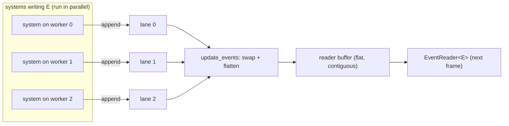

# Events

Events are Boyko's mechanism for **decoupled, one-to-many messaging** between
systems. A system that detects something interesting (a collision, a key press,
an entity dying) writes an event; any number of other systems read it on a later
frame — without the writer and readers knowing about each other, sharing a
`Resource`, or contending on a lock.

If you have used Bevy's `EventWriter` / `EventReader`, the surface here is
deliberately familiar. The difference is underneath: a Boyko event bus is a
**double-buffered, per-thread-lane dispatcher** that sits *outside* the
scheduler's conflict graph, so any number of systems can write the same event
type in parallel with zero coordination.

*(Branch: `ecs`. Events: dispatcher Phase 6, `EventReader` / `EventWriter`
SystemParams Phase 12.)*

---

## When to reach for events

Use an event when a producer and a consumer should stay decoupled, and the
consumer can act on the **next** frame:

- A `damage` system writes `DamageEvent`; a `health` system, an `audio` system,
  and a `vfx` system each read it independently.
- An input system writes `JumpRequested`; the movement system reads it.
- A spawner writes `EnemySpawned`; the minimap, the AI director, and an
  achievement tracker all react.

Do **not** use an event when you need a value *this* frame, in a guaranteed
order, inside the same system run — for that, pass data through a
[`Resource`](resources.md) or a component the consumer queries directly. Events
carry a built-in **one-frame latency**: a reader sees what was written before the
last buffer swap, never what is being written in the current run (see
[The double buffer](#the-double-buffer-and-one-frame-latency) below).

---

## Defining an event

An event type is declared with the `#[event]` attribute macro. Like the other
derives, it lives in `boyko_macros` and is **not** re-exported by the prelude —
import it directly:

```rust,ignore
use boyko_macros::event;
use boyko_ecs::prelude::*; // Entity, EventWriter, EventReader (but NOT the Event trait)

#[event]
struct DamageEvent {
    // A `#[participant]` field is an `Entity` the event is *about*. The
    // `components = "..."` list names the components that entity is expected
    // to carry — metadata the engine records for the event type.
    #[participant(components = "Health")]
    victim: Entity,
    // A `#[parameter]` field is plain payload data.
    #[parameter]
    amount: f32,
}
```

What the macro does to the struct: it **rewrites the outer type** to hold exactly
two fields — `participants` and `parameters` — and moves each of your annotated
fields into the matching substruct. After expansion, `DamageEvent` is literally:

```rust,ignore
struct DamageEvent {
    pub participants: DamageEventParticipants, // { victim: Entity }
    pub parameters: DamageEventParameters,     // { amount: f32 }
}
```

So there is no `damage_event.amount` — it is `damage_event.parameters.amount`.
That split keeps participant entities and plain payload in separate, `Copy`able
SoA-friendly groups.

Rules enforced by the macro:

- **Every field** must carry exactly one of `#[participant(components = "...")]`
  or `#[parameter]`.
- The struct must use **named fields** and must **not be generic**.
- The generated `*Participants` / `*Parameters` substructs derive only
  `Clone, Copy`. If you want `Debug` / `PartialEq` on the event, implement them
  by hand rather than `#[derive(...)]`-ing on the outer struct.
- Constructing and inspecting an event goes through the
  [`Event`](https://github.com/bluesteelll/boyko-engine/blob/ecs/crates/boyko_ecs/src/ecs/core/events/event.rs#L18)
  trait (`Event::new`, `Event::participants`). The prelude does **not** re-export
  `Event`; import it with
  `use boyko_ecs::ecs::core::events::event::Event;` wherever you call `E::new`.

An event with no participants is fine too — a pure message:

```rust,ignore
use boyko_macros::event;

#[event]
struct LevelCleared {
    #[parameter]
    level: u32,
}
```

The macro generates an implementation of the
[`Event`](https://github.com/bluesteelll/boyko-engine/blob/ecs/crates/boyko_ecs/src/ecs/core/events/event.rs#L18)
trait. Each event type is assigned a unique `EventId` lazily on first use, the
same model as component ids.

---

## Registering an event

Before the first send or read, an event type must be **preregistered** on the
world's dispatcher. This is where every writer lane and the reader buffer are
allocated — *once*, up front — so steady-state `send` / `read` never allocate.

How many **writer lanes** to allocate is the one decision that matters, because
each writing thread routes to its own lane by index (see [Why writers don't
conflict](#why-writers-dont-conflict)). You must allocate a lane for every thread
that might write the event, or the write will index past the end of the lane
array and panic.

### Single-writer events: `preregister_event_default`

If the event is written from **one place** — the main thread, an FFI callback,
the dispatcher thread, or exactly one worker — `preregister_event_default` is the
shortest path. It allocates a **single lane** with the default
1024-event-per-frame capacity:

```rust,ignore
use boyko_macros::event;
use boyko_ecs::prelude::*;

#[event]
struct LevelCleared {
    #[parameter]
    level: u32,
}

fn build() {
    let mut app = App::new();

    // One lane, default capacity. Correct for an event written from a single
    // thread (main / dispatcher / one worker). NOT enough lanes if several
    // worker systems write it concurrently — see the next section.
    app.world_mut()
        .preregister_event_default::<LevelCleared>()
        .expect("LevelCleared registered exactly once");

    // ... add_systems, run ...
}
```

> **`_default` allocates one lane, not one-per-worker.** The dispatcher's default
> lane count is fixed at `1`; there is no setter, and `App::with_pool` does not
> raise it. If you write an event from several worker threads after registering
> it with `preregister_event_default`, a worker whose id exceeds 0 routes to a
> lane that was never allocated and `send` **panics with an out-of-bounds index**.
> For multi-writer events, size the lanes explicitly as shown below.

Forgetting to preregister at all is loud, not silent: an `EventReader<E>` /
`EventWriter<E>` whose type was never registered **panics at system-init time**
with a clear message, so the mistake surfaces the first time the schedule is
built rather than corrupting anything at runtime.

### Multi-writer events: size the lanes with `EventConfig`

If two or more **worker** systems write the same event in parallel, register it
with an explicit
[`EventConfig`](https://github.com/bluesteelll/boyko-engine/blob/ecs/crates/boyko_ecs/src/ecs/core/events/event_config.rs#L16)
through `preregister_event`. Allocate **`worker_count + 1`** lanes: one per worker
(workers are indexed `0..worker_count`) plus one for the dispatcher thread, which
gets the lane at index `worker_count`.

```rust,ignore
use boyko_ecs::ecs::core::events::event_config::EventConfig;
# use boyko_macros::event;
# use boyko_ecs::prelude::*;
# #[event] struct ParticleSpawned { #[parameter] kind: u32 }

fn build(app: &mut App, worker_count: u32) {
    // One lane per worker (ids 0..worker_count) plus the dispatcher lane at
    // index `worker_count`. `default_for` keeps the 1024-per-lane capacity.
    // Bounds: thread_count in 1..=64, capacity_per_lane in 1..=16384.
    let cfg = EventConfig::default_for(worker_count + 1)
        .expect("config within bounds");

    app.world_mut()
        .preregister_event::<ParticleSpawned>(cfg)
        .expect("registered once");
}
```

For a hot, high-volume event, raise the per-lane capacity at the same time with
`EventConfig::new(thread_count, capacity_per_lane)`:

```rust,ignore
use boyko_ecs::ecs::core::events::event_config::EventConfig;
# use boyko_macros::event;
# use boyko_ecs::prelude::*;
# #[event] struct ParticleSpawned { #[parameter] kind: u32 }

fn build(app: &mut App, worker_count: u32) {
    // `worker_count + 1` lanes, each holding up to 4096 events per frame.
    let cfg = EventConfig::new(worker_count + 1, 4096)
        .expect("config within bounds");

    app.world_mut()
        .preregister_event::<ParticleSpawned>(cfg)
        .expect("registered once");
}
```

`capacity_per_lane` defaults to `EventConfig::DEFAULT_CAPACITY` (1024); a lane
that overflows in one frame returns `EventBufferFull` rather than reallocating.

---

## Writing events

Take an [`EventWriter<E>`](https://github.com/bluesteelll/boyko-engine/blob/ecs/crates/boyko_ecs/src/ecs/core/system/params/event_writer.rs#L89)
as a [system parameter](systems.md) and call `send`:

```rust,ignore
use boyko_macros::event;
use boyko_ecs::prelude::*;
// `DamageEvent::new` is a method on the `Event` trait — the trait must be in
// scope to call it. The prelude re-exports `EventReader` / `EventWriter` but
// NOT `Event` itself, so import it directly.
use boyko_ecs::ecs::core::events::event::Event;

# #[event] struct DamageEvent { #[participant(components = "Health")] victim: Entity, #[parameter] amount: f32 }

fn deal_damage(mut writer: EventWriter<DamageEvent>, target: Entity) {
    // `send` routes the event to *this thread's* lane and returns a Result.
    // The only error is EventBufferFull (lane at capacity this frame).
    let _ = writer.send(DamageEvent::new(
        DamageEventParticipants { victim: target },
        DamageEventParameters { amount: 10.0 },
    ));
}
```

The `#[event]` macro rewrites the outer struct into exactly two fields —
`participants` and `parameters` — and moves your original fields into the
generated `DamageEventParticipants` / `DamageEventParameters` substructs. It also
generates `DamageEvent::new(participants, parameters)` on the `Event` trait. For a
parameter-only event, construct it the same way with an empty participants value
(`LevelClearedParticipants {}`).

Three send methods are available:

| Method | Use |
|--------|-----|
| `send(e) -> EcsResult<()>` | One event. |
| `send_many(iter) -> EcsResult<()>` | A batch; all-or-nothing on overflow. `iter` must be an `ExactSizeIterator`. |
| `send_default() -> EcsResult<()>` | `E::default()`, when `E: Default`. |

### Why writers don't conflict

This is the key departure from a naive event bus. `EventWriter<E>` declares **no
access** to the conflict graph (the scheduler model the parallel executor uses to
decide which systems may run together — see [Systems](systems.md)). Two systems
that both write `DamageEvent` are therefore free to run **at the same time on
different threads**.

That is sound because each writer routes to a **per-thread lane**, picked from
the calling worker's thread-local id. Worker 0 writes lane 0, worker 1 writes
lane 1, and so on; the dispatcher thread gets its own reserved lane. No two
threads ever touch the same lane, so there is no shared mutable state to race on
and no lock to take — the cost of a `send` is dominated by appending to a lane
and one relaxed counter bump.

This indexing is exactly why a multi-writer event needs `worker_count + 1` lanes
([Registering an event](#multi-writer-events-size-the-lanes-with-eventconfig)): a
worker routing to lane `id` panics if that lane was never allocated.



> `EventWriter::send` must be called from **inside a scheduled system body**. In
> debug builds a `debug_assert!` catches misuse. From the main thread or an FFI
> callback, use `world.events().send_event::<E>(event)` (or
> `world.send_event::<E>(thread_index, event)`) instead — those route safely from
> an unattached thread. From an `EntityCommands`/[`Commands`](commands.md) closure
> use `commands.send_event(event)`, which is enqueued and dispatched on the apply
> window.

---

## Reading events

Take an [`EventReader<E>`](https://github.com/bluesteelll/boyko-engine/blob/ecs/crates/boyko_ecs/src/ecs/core/system/params/event_reader.rs#L87)
and iterate `read()`:

```rust,ignore
use boyko_macros::event;
use boyko_ecs::prelude::*;

# #[event] struct DamageEvent { #[participant(components = "Health")] victim: Entity, #[parameter] amount: f32 }

fn apply_damage(mut reader: EventReader<DamageEvent>) {
    for ev in reader.read() {
        // `#[parameter]` fields live on the generated `parameters` substruct.
        let _amount = ev.parameters.amount;
        // `#[participant]` fields live on the generated `participants` substruct.
        let _victim = ev.participants.victim;
    }
}
```

`read()` returns an `EventIter` that yields `&E` over every event this system has
not yet consumed. The reader holds a **per-system cursor** that persists across
frames: each system tracks independently how far it has read, so two readers of
the same event type never steal events from each other. The cursor is advanced on
the iterator's `drop`, by exactly the number of events you actually consumed —
which makes partial iteration work cleanly:

```rust,ignore
# use boyko_macros::event;
# use boyko_ecs::prelude::*;
# #[event] struct DamageEvent { #[participant(components = "Health")] victim: Entity, #[parameter] amount: f32 }
fn process_one_per_frame(mut reader: EventReader<DamageEvent>) {
    // `break` after the first event: the rest stay unread and are yielded by
    // the NEXT call to read(). Panicking mid-loop is safe too — the cursor
    // still advances by whatever was consumed.
    for ev in reader.read() {
        handle(ev);
        break;
    }
}
# fn handle(_: &DamageEvent) {}
```

Inspection helpers, all O(1) (no iteration):

| Method | Returns |
|--------|---------|
| `is_empty() -> bool` | No unread events. |
| `len() -> usize` | Count of unread events. |
| `missed_events() -> u64` | How many events were discarded by a swap before this reader got to them (the reader fell behind). |
| `clear()` | Skip to the front: drop all currently-pending events without yielding them. |

`missed_events` is your diagnostic for a reader that can't keep up — e.g. "audio
dropped N cues this frame because the mixer fell behind".

---

## The double buffer and one-frame latency

Each event type owns **two** regions: the per-thread **write lanes** that
`send` appends to during the frame, and a flat, contiguous **reader buffer** that
`read()` iterates. Once per frame the dispatcher performs `update_events`, which
**swaps**: it flattens all the write lanes into the reader buffer and clears the
lanes for the next frame.

The consequence is a deliberate **one-frame visibility model**:

- A reader sees events that were sent *before* the most recent swap.
- Events sent *during* the current frame become visible *after the next swap*.
- An event therefore lives for one swap-to-swap window. A reader that doesn't
  run, or runs but doesn't consume, simply loses that window's events (reported
  via `missed_events`) — events never accumulate without bound.

This is what lets writers be lock-free: readers only ever touch the *frozen*
reader buffer (a shared `&[E]`), while writers only ever touch the *live* lanes
(disjoint per thread). The two never alias, so neither side needs a lock, and the
swap itself runs under the exclusive `&mut` the frame driver already holds.

### Who calls the swap

If you drive your world with an `App`, **the App owns the swap** — it calls
`update_events` once per frame for you. Do **not** also call
`EcsMaster::update_events` by hand under an App; a second flip would halve every
reader's visibility window.

When and whether the swap fires is governed by `EventUpdatePolicy` (re-exported
by the prelude):

- **`EveryFrame`** — swap at the start of every frame. The default for a
  single-schedule app.
- **`WaitForFixed`** — swap only after the fixed-timestep schedule has run at
  least one substep since the last swap, so a fixed-schedule reader never loses a
  buffer generation on a zero-substep frame. Auto-selected when a fixed schedule
  is configured; call `App::set_event_update_policy` to override the choice.

If you drive the world manually (no App), call `world.update_events()` yourself
once per frame, between schedule runs.

---

## Performance characteristics

| Operation | Cost | Notes |
|-----------|------|-------|
| `EventWriter::send` | append to a per-thread lane + one `Relaxed` counter bump | No lock, no shared state across threads. |
| `EventReader::read` (empty) | two `Acquire` loads + arithmetic | No allocation, no iteration. |
| `EventReader::read` (per element) | bounds check + cursor increment | Yields `&E` straight from the flat reader buffer. |
| `is_empty` / `len` | O(1) atomic loads | Never iterates. |
| Conflict-graph cost | **zero** | Events live outside the graph, so they never serialize systems. |

The reader buffer is one contiguous allocation, so iterating events is a linear,
cache-friendly walk. The write-hot send counter sits on its own cache line,
padded away from the read-hot fields, so writer traffic never invalidates a
reader's cache line (no false sharing).

---

## Comparison to Bevy

| Aspect | Boyko | Bevy |
|--------|-------|------|
| Reader/writer API | `EventReader<E>` / `EventWriter<E>`, `read()` / `send()` | Same shape. |
| Visibility | Double-buffered, one-frame latency, per-system cursor | Double-buffered, per-system cursor. |
| Parallel writers | Lock-free per-thread lanes; **outside** the conflict graph | `EventWriter` is `ResMut`-like access; writers of the same event conflict. |
| Registration | Explicit `preregister_event[_default]` (preallocates lanes) | `add_event::<E>()` registers the update system. |
| Definition | `#[event]` with `#[participant]` / `#[parameter]` fields | `#[derive(Event)]`. |

The headline difference is that two Boyko systems writing the *same* event type
can run concurrently, because each lands in its own lane and the bus declares no
access. That removes a real source of false serialization in event-heavy
schedules — provided you allocated a lane per writer at registration time
(`worker_count + 1`; see [Registering an
event](#multi-writer-events-size-the-lanes-with-eventconfig)).

---

## See also

- [Systems](systems.md) — how `EventReader` / `EventWriter` are taken as
  parameters, and the conflict graph events sit outside of.
- [Commands](commands.md) — `commands.send_event(e)` for deferred sends from a
  command closure.
- `EventUpdatePolicy` and the once-per-frame swap live on the `App` —
  [`app/`](https://github.com/bluesteelll/boyko-engine/blob/ecs/crates/boyko_ecs/src/ecs/core/app)
  (`set_event_update_policy`, `EveryFrame` vs `WaitForFixed`).
- Source:
  [`events/`](https://github.com/bluesteelll/boyko-engine/blob/ecs/crates/boyko_ecs/src/ecs/core/events),
  [`event_writer.rs`](https://github.com/bluesteelll/boyko-engine/blob/ecs/crates/boyko_ecs/src/ecs/core/system/params/event_writer.rs),
  [`event_reader.rs`](https://github.com/bluesteelll/boyko-engine/blob/ecs/crates/boyko_ecs/src/ecs/core/system/params/event_reader.rs).
