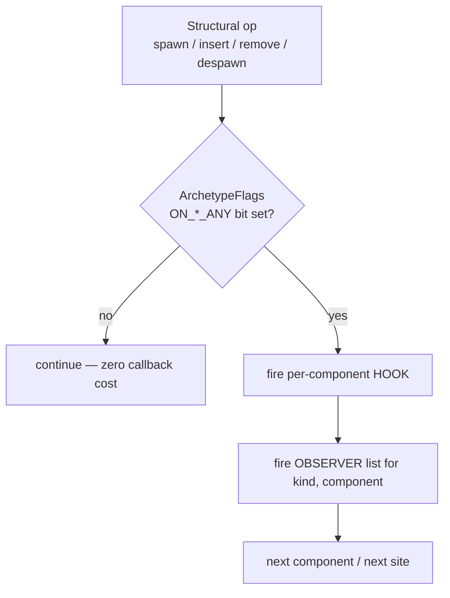

# Lifecycle Hooks & Observers

Hooks and observers are boyko-engine's two **reactive callbacks**: code that runs
automatically the moment a component is added to, replaced on, removed from, or
despawned with an entity. They are the engine's answer to "do something when the
world changes structurally" without polling. If you come from Bevy, the model is
deliberately familiar — `on_add` / `on_insert` / `on_replace` / `on_remove`, plus
an entity-level `on_despawn` — but the implementation is built around a single
`u16` branch so that a world which uses *no* callbacks pays *nothing*.

There are two mechanisms, and the difference is who owns the callback:

| | **Hooks** | **Observers** |
|---|---|---|
| Bound to | a **component type** | a **`(kind, component)`** pair, per world |
| Count per kind | exactly **one** | an `add`/`remove`-able **list** |
| Declared via | `#[component(...)]` derive **or** a runtime builder | `EcsMaster::observe_on_*` / `add_observer` |
| Lifetime | **process-global** (write-once, fires in every world) | **runtime-mutable**, **per-world** |
| Fires | **first** at each site | **after** the hook at the same site |

Hooks describe a type's intrinsic reactions ("a `Health` of 0 always logs"). 
Observers are mutable per-world reactions you wire and unwire at runtime ("while 
the editor is open, watch every `Transform` add"). Use a hook when the behaviour 
is part of what the component *is*; use an observer when it is part of what *this 
run of the game* wants to watch.

## The five lifecycle sites

Both mechanisms fire at the same set of structural-op sites. The values a
callback can read differ by site:

| Kind | Fires | Reads |
|------|-------|-------|
| `on_add` | after a component becomes **newly present** on an entity | the new value |
| `on_insert` | after a component is inserted (newly, or via a bundle insert) | the inserted value |
| `on_replace` | **before** an existing value is overwritten / leaves the entity | the **old** value |
| `on_remove` | **before** a component is removed from an entity | the **dying** value |
| `on_despawn` | once per dying **entity** at despawn, **before any component drops** | the **fully-intact** entity |

Two orderings are guaranteed and worth memorising:

- **On spawn**: all `on_add` fire, then all `on_insert`.
- **On despawn**: `on_despawn` fires first (the entity is still whole), then per
  component `on_replace` then `on_remove` — all *before* the actual drops, so a
  handler can still read every dying value.

`on_despawn` is **not** the same as `on_remove`. `on_remove` is per-component and
also fires when you remove a single component from a surviving entity.
`on_despawn` is per-entity and fires only when the whole entity dies — it is your
hook for whole-entity teardown.

## Hooks: the `#[component(...)]` derive

The most common way to attach a hook is the derive attribute. A hook is a bare
`unsafe fn` pointer — it **cannot capture**, so it talks to the outside world
through resources or `static`s.

```rust,ignore
use std::sync::atomic::{AtomicUsize, Ordering};

use boyko_ecs::ecs::core::component::component::Component;
use boyko_ecs::ecs::core::component::hooks::HookContext;
use boyko_ecs::ecs::core::component::hooks::deferred_master::DeferredEcsMaster;
use boyko_ecs::ecs::core::ecs_master::ecs_master::EcsMaster;
use boyko_macros::Component;

/// Live-enemy count, kept exact by the hooks below. A `static` (or a `Resource`)
/// is required because a `HookFn` is a non-capturing `unsafe fn` pointer.
static ENEMIES_ALIVE: AtomicUsize = AtomicUsize::new(0);

// SAFETY: every hook runner is `unsafe fn` — the engine guarantees it is called
//   only inside the single-threaded apply window with no live `&mut` into pool
//   storage, so reading the world through the view is sound.
unsafe fn on_enemy_added(_world: DeferredEcsMaster<'_>, _ctx: HookContext) {
    ENEMIES_ALIVE.fetch_add(1, Ordering::Relaxed);
}

unsafe fn on_enemy_removed(_world: DeferredEcsMaster<'_>, _ctx: HookContext) {
    ENEMIES_ALIVE.fetch_sub(1, Ordering::Relaxed);
}

#[derive(Component)]
#[component(on_add = on_enemy_added, on_remove = on_enemy_removed)]
#[repr(C)]
struct Enemy {
    hp: u32,
}
```

The derive accepts four keys, each taking a **function path**:
`on_add = path`, `on_insert = path`, `on_replace = path`, `on_remove = path`.
The derive does **not** accept `on_despawn` — that key is only available through
the runtime builder (below). Each key may appear at most once, and all hooks must
live in a single `#[component(...)]` attribute.

> **Import note.** The trait `Component` comes from
> `use boyko_ecs::prelude::*;`, but the `#[derive(Component)]` macro is in
> `boyko_macros` (a dev-dependency, not re-exported by the prelude):
> `use boyko_macros::Component;`. `HookContext` and `DeferredEcsMaster` are not in
> the prelude either — import them from their full paths as shown above.

### What a hook can read: `HookContext` and `DeferredEcsMaster`

Every hook receives two arguments.

`HookContext` is a two-field plain-data struct
([`hooks/mod.rs#L88`](https://github.com/bluesteelll/boyko-engine/blob/ecs/crates/boyko_ecs/src/ecs/core/component/hooks/mod.rs#L88)):

```rust,ignore
pub struct HookContext {
    pub entity: Entity,            // the entity the structural op targets
    pub component_id: ComponentId, // which component triggered the hook
}
```

`DeferredEcsMaster<'_>` is a **deliberately restricted** view of the world. It is
read-only into component storage and exposes *no* method that can build an
aliasing `&mut` into a component pool, so a hook physically cannot create a
data race with the apply in flight. What it *does* offer:

- `get_component::<T>(entity)` — read any component on any entity.
- `resource::<R>()` / `resource_mut::<R>()` — read or mutate resources (resources
  live outside archetype storage, so mutating one never aliases the apply).
- `current_tick()` — the change-detection tick.
- `is_alive(entity)` — liveness check.
- `commands()` — a deferred-command handle: structural changes you request from a
  hook are **queued** and applied at the outermost apply boundary, never inline.

```rust,ignore
use boyko_ecs::ecs::core::component::component::Component;
use boyko_ecs::ecs::core::component::hooks::HookContext;
use boyko_ecs::ecs::core::component::hooks::deferred_master::DeferredEcsMaster;
use boyko_macros::Component;

#[derive(Component)]
#[repr(C)]
struct Score(u32);

// SAFETY: called only inside the apply window; the view forbids aliasing `&mut`
//   into pool storage, so reading a sibling component and queuing a command are
//   both sound here.
unsafe fn on_pickup_added(mut world: DeferredEcsMaster<'_>, ctx: HookContext) {
    // Read another component on the same entity.
    if let Some(score) = world.get_component::<Score>(ctx.entity) {
        let _earned = score.0;
    }
    // Structural change is DEFERRED — queued, applied at the outermost boundary.
    world.commands().entity(ctx.entity).despawn();
}

#[derive(Component)]
#[component(on_add = on_pickup_added)]
#[repr(C)]
struct Pickup;
```

### Hooks at runtime: the builder

When you cannot edit the component's definition (a foreign type) or you need
`on_despawn`, register hooks at runtime through
[`EcsMaster::register_component_hooks`](https://github.com/bluesteelll/boyko-engine/blob/ecs/crates/boyko_ecs/src/ecs/core/ecs_master/ecs_master.rs#L2997).
It returns a chainable builder that commits when dropped (or on `.finish()`):

```rust,ignore
use boyko_ecs::ecs::core::component::component::Component;
use boyko_ecs::ecs::core::component::hooks::HookContext;
use boyko_ecs::ecs::core::component::hooks::deferred_master::DeferredEcsMaster;
use boyko_ecs::ecs::core::ecs_master::ecs_master::EcsMaster;
use boyko_macros::Component;

#[derive(Component)] // a PLAIN derive — no `#[component(...)]`
#[repr(C)]
struct Tracked(u32);

unsafe fn on_tracked_despawn(_w: DeferredEcsMaster<'_>, _c: HookContext) {
    // whole-entity teardown — runs before any component drops
}

fn setup(ecs: &mut EcsMaster) {
    ecs.register_component_hooks::<Tracked>()
        .on_despawn(on_tracked_despawn)
        .finish(); // commit explicitly (drop would commit too)
}
```

Derive and the builder are **mutually exclusive per type** — the `HOOKS` table is
written exactly once per `ComponentId`. Calling `register_component_hooks::<C>()`
for a type that already declared `#[component(...)]` hooks panics, as does
registering after `C` has appeared in a live archetype of any world. The contract
is simple: **mint the type → register its hooks → first attach it**. These are
configuration-time panics on a cold path, never a hot-path concern.

## Observers: runtime-mutable, per world

An observer is the mutable sibling of a hook. Instead of one fn-ptr baked into a
type, you register any number of runners against a `(kind, component)` pair on a
specific world, and remove them later. Register them with the typed helpers:

```rust,ignore
use boyko_ecs::ecs::core::component::component::Component;
use boyko_ecs::ecs::core::component::hooks::deferred_master::DeferredEcsMaster;
use boyko_ecs::ecs::core::component::observers::{ObserverContext, ObserverKind};
use boyko_ecs::ecs::core::ecs_master::ecs_master::EcsMaster;
use boyko_macros::Component;

#[derive(Component)]
#[repr(C)]
struct Transform {
    x: f32,
    y: f32,
    z: f32,
}

// SAFETY: the dispatch site calls this only inside the apply window with no live
//   `&mut` into pool storage (the same contract as a hook runner).
unsafe fn on_transform_added(_w: DeferredEcsMaster<'_>, ctx: ObserverContext) {
    debug_assert_eq!(ctx.kind, ObserverKind::Add);
    // react to a new Transform on `ctx.entity`
}

fn wire(ecs: &mut EcsMaster) {
    // Returns a stable ObserverId — keep it to remove the observer later.
    let id = ecs.observe_on_add::<Transform>(on_transform_added);

    // ... later, stop watching:
    let removed = ecs.remove_observer(id);
    debug_assert!(removed);
}
```

The runner signature mirrors a hook's, except the context is an
[`ObserverContext`](https://github.com/bluesteelll/boyko-engine/blob/ecs/crates/boyko_ecs/src/ecs/core/component/observers/mod.rs#L107)
— the same `entity` + `component_id` plus a `kind` field, so one runner can be
registered for several kinds and branch on `ctx.kind` internally:

```rust,ignore
pub struct ObserverContext {
    pub entity: Entity,
    pub component_id: ComponentId,
    pub kind: ObserverKind, // Add | Insert | Replace | Remove | Despawn
}
```

The typed entry points are `observe_on_add`, `observe_on_insert`,
`observe_on_replace`, and `observe_on_remove`. When you already hold a resolved
`ComponentId` (or want the `Despawn` kind), use the type-erased
`ecs.add_observer(kind, cid, runner)`. Every registration returns an
[`ObserverId`](https://github.com/bluesteelll/boyko-engine/blob/ecs/crates/boyko_ecs/src/ecs/core/component/observers/mod.rs#L59):
a monotonic, never-reused handle. Pass it to
`ecs.remove_observer(id) -> bool` to unwire.

Unlike hooks, an observer may be registered **after** archetypes containing the
component already exist — `add_observer` walks those archetypes and raises the
relevant flag bit, so there is no staleness panic. And because the registry is a
field on each world's `ArchetypeMaster`, two `EcsMaster`s have **independent**
observer sets.

## Ordering and the firing pipeline

At every structural-op site the engine fires the per-component **hook first**,
then the **observer list** for that `(kind, component)`. So for a single
`on_add`, the order is: that component's `on_add` hook, then each registered
`on_add` observer in registration order.



## Zero overhead when unused

The reason a callback-free world pays nothing is the **`ArchetypeFlags` gate**
([`archetype_flags.rs`](https://github.com/bluesteelll/boyko-engine/blob/ecs/crates/boyko_ecs/src/ecs/core/component/hooks/archetype_flags.rs)).
Each archetype carries a single `u16`. At construction it is OR-computed from the
cold hook table and observer registry: one bit per `(kind)` saying "does *any*
component in this archetype declare a hook **or** an observer for this kind?".

Every structural-op site reads that `u16` once and tests one bit
(`ON_ADD_ANY`, `ON_INSERT_ANY`, …, each `= ON_*_HOOK | ON_*_OBSERVER`). When no
component in the archetype reacts, the bit is clear, the branch predicts
not-taken, and the dispatch machinery is never touched. This is the same
"0% when unused" technique boyko uses for [change detection](../change_detection.md):
the feature is a single predicted-away branch until you opt in. Widening the test
from "hook" to "hook OR observer" cost one different immediate — the no-op hot
path stays byte-identical.

## Practical use cases

- **Maintaining a derived count or index** — increment a counter on `on_add`,
  decrement on `on_remove` (or `on_despawn`), as in the `Enemy` example above.
  The count is always exact without a scan.
- **Whole-entity cleanup** — release an external handle (a GPU resource id, an OS
  handle) in `on_despawn`, where the entity is still fully intact.
- **Enforcing invariants on insert** — read a sibling component in `on_insert`
  and queue a corrective command through `world.commands()`.
- **Relationship bookkeeping** — boyko's [hierarchies](hierarchies.md) and the
  generic [relations](relations.md) system are themselves built on hooks: the
  `ChildOf` source wires `on_insert` / `on_replace` to keep the `Children`
  reverse index consistent. You get the same machinery for your own relations.
- **Editor / debug tooling** — register observers while a tool is open and remove
  them when it closes, watching component churn without changing any type
  definition or paying any cost in shipping builds.

## Performance characteristics

| Operation | Cost | Notes |
|-----------|------|-------|
| No callbacks in archetype | one `u16` load + one predicted-away branch per site | the 0%-when-unused gate |
| Hook fire | one indirect `unsafe fn` call | non-capturing fn-ptr, no allocation |
| Observer fire | one slice walk + indirect call per entry | `Vec<ObserverEntry>` indexed by `(kind, cid)`, no hashing |
| `observe_on_*` (first for a pair) | O(archetypes containing the component) | one-time dynamic flag walk; cold path |
| `remove_observer` | O(observers) scan + `swap_remove` | cold path; recomputes the flag bit on last removal |

Both `HookFn` and `ObserverFn` are plain fn pointers, which are unconditionally
`Send + Sync`. That property is what lets the global hook table and the
per-world observer registry exist with **no `unsafe impl`** — the callbacks carry
no captured state to make thread-unsafe.

## See also

- [Components](components.md) — defining the types hooks and observers attach to
- [Hierarchies](hierarchies.md) — parent/child, built on these hooks
- [Relations](relations.md) — the generic relationship system that hooks power
- [Commands](commands.md) — the deferred structural-change API a callback queues into
- [Change detection](../change_detection.md) — the sibling "0% when unused" mechanism
- Source:
  [hooks/mod.rs](https://github.com/bluesteelll/boyko-engine/blob/ecs/crates/boyko_ecs/src/ecs/core/component/hooks/mod.rs),
  [observers/mod.rs](https://github.com/bluesteelll/boyko-engine/blob/ecs/crates/boyko_ecs/src/ecs/core/component/observers/mod.rs)
