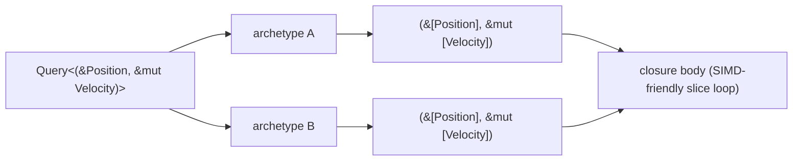

# Iteration — Chunked & Parallel

> Per-row iteration is the default; **chunked** and **parallel** iteration are how
> you reach for the engine's columnar storage and its work-stealing pool when a
> hot loop needs them.

Most of the time you iterate a [`Query`](queries.md) one entity at a time with
`iter` / `iter_mut` (or `for x in &query`). That is the right tool for branchy,
per-entity logic. This page is about the two cases where per-row iteration leaves
performance on the table:

- **`for_each_chunk`** — borrow each archetype's columns as whole SoA *slices*
  (`&[T]` / `&mut [T]`), so the compiler can auto-vectorize and you can hand a
  contiguous buffer straight to a consumer (a GPU upload, a SIMD kernel) with
  **zero AoS copy**.
- **`par_iter` / `par_for_each_chunk`** — run the body across the
  [work-stealing thread pool](../scheduler.md) instead of on one core.

All of these are methods on the same `Query<D, F>` you already use, so adopting
them is local: change the loop, not the system signature.

---

## Why chunks at all

Boyko stores components **column-major** (Struct-of-Arrays): within one
archetype, every `Position` lives in one contiguous run, every `Velocity` in
another. Per-row iteration walks those columns in lock-step, which is already
cache-friendly. But the per-row API yields you *one* `&Position` and *one*
`&mut Velocity` at a time, and the compiler cannot always prove that the next
row is the adjacent address — so it often declines to vectorize the loop.

`for_each_chunk` hands you the columns directly. For `Query<(&Position, &mut Velocity)>`
the closure receives `(&[Position], &mut [Velocity])` — one slice per component,
covering every row in that archetype. The closure runs **once per matched
archetype**. Now the body is an ordinary slice loop, which LLVM auto-vectorizes,
and you can also pass the slice verbatim to anything that consumes `&[T]`.



---

## `for_each_chunk` (sequential)

`for_each_chunk` needs `&mut self` (it advances the query cursor), so when used
as a system parameter the `Query` must be bound `mut`:

```rust,ignore
use boyko_ecs::prelude::*;
use boyko_macros::Component;

#[derive(Component)]
struct Position { x: f32, y: f32, z: f32 }

#[derive(Component)]
struct Velocity { x: f32, y: f32, z: f32 }

fn integrate(mut query: Query<(&mut Position, &Velocity)>) {
    // The closure fires ONCE per matched archetype. `pos` and `vel` are the
    // whole columns for that archetype, the same length, index-aligned.
    query.for_each_chunk(|(pos, vel): (&mut [Position], &[Velocity])| {
        for (p, v) in pos.iter_mut().zip(vel) {
            p.x += v.x;
            p.y += v.y;
            p.z += v.z;
        }
    });
}
```

The `ChunkItem` you receive is mechanical:

| Query data `D`          | Closure parameter                       |
|-------------------------|-----------------------------------------|
| `&T`                    | `&[T]`                                   |
| `&mut T`                | `&mut [T]`                              |
| `()`                    | `()` (no payload)                       |
| `(D0, D1, …)`           | `(D0::ChunkItem, D1::ChunkItem, …)`      |

Empty archetypes are skipped before the closure runs, so you never see a
zero-length slice purely because an archetype is empty.

### Outside a system

The same method exists on the `Query` you get straight from the world, which is
handy in setup code, tests, or a render-thread helper:

```rust,ignore
use boyko_ecs::prelude::*;
use boyko_macros::Component;

#[derive(Component)]
struct Position { x: f32, y: f32, z: f32 }

fn average_x(world: &mut EcsMaster) -> f32 {
    let mut sum = 0.0;
    let mut count = 0usize;
    world
        .query::<&Position, ()>()
        .for_each_chunk(|positions: &[Position]| {
            for p in positions {
                sum += p.x;
            }
            count += positions.len();
        });
    if count == 0 { 0.0 } else { sum / count as f32 }
}
```

### Zero-copy SoA → consumer

Because the chunk is a real `&[T]` into the column, you can blit it directly
into anything that takes a byte slice — no per-entity gather, no intermediate
`Vec`. This is exactly how the demo streams instances to the GPU: one
`write_buffer` per archetype, straight off the column.

`Queue`, `Buffer`, and `as_bytes` below stand in for whatever your RHI /
byte-cast layer exposes (in the real engine these are `boyko_rhi` types). Only
the `for_each_chunk` call and the `&[GpuInstance]` slice are engine API — the
rest is the consumer you hand the column to:

```rust,ignore
use boyko_ecs::prelude::*;
use boyko_macros::Component;

// --- RHI / byte-cast stand-ins (your real types live in `boyko_rhi`) ---
struct Buffer;
struct Queue;
impl Queue {
    fn write_buffer(&self, _buffer: &Buffer, _offset: u64, _data: &[u8]) {}
}
// Reinterpret a `#[repr(C)]` POD column as raw bytes. A real cast layer
// (e.g. `bytemuck::cast_slice`) checks the bound at the type level.
fn as_bytes<T: Copy>(slice: &[T]) -> &[u8] {
    // SAFETY: `T` is `#[repr(C)]` Plain-Old-Data, so any bit pattern is a valid
    // `u8`; the resulting slice covers exactly the same bytes as `slice`.
    unsafe {
        std::slice::from_raw_parts(
            slice.as_ptr() as *const u8,
            std::mem::size_of_val(slice),
        )
    }
}

// A GPU-ready, `#[repr(C)]` Plain-Old-Data instance row.
#[derive(Component, Clone, Copy)]
#[repr(C)]
struct GpuInstance { pos: [f32; 3], scale: f32, color: u32 }

fn upload_instances(world: &mut EcsMaster, queue: &Queue, buffer: &Buffer) {
    let mut byte_offset: u64 = 0;
    world
        .query::<&GpuInstance, ()>()
        .for_each_chunk(|chunk: &[GpuInstance]| {
            if chunk.is_empty() {
                return;
            }
            let bytes: &[u8] = as_bytes(chunk); // the column, reinterpreted in place
            queue.write_buffer(buffer, byte_offset, bytes);
            byte_offset += bytes.len() as u64;
        });
}
```

The column *is* the upload source. Nothing is copied on the CPU before it
reaches the driver — that is the whole point of keeping subsystem data in ECS
columns rather than a side `Vec`.

---

## `par_iter` / `par_iter_mut` (parallel, per row)

When the per-entity body is non-trivial and the entity count is large, fan it
across the pool. `par_iter` / `par_iter_mut` return a handle you consume with
`for_each`:

```rust,ignore
use boyko_ecs::prelude::*;
use boyko_macros::Component;

#[derive(Component)]
struct Position { x: f32, y: f32, z: f32 }

#[derive(Component)]
struct Velocity { x: f32, y: f32, z: f32 }

fn integrate_parallel(mut query: Query<(&mut Position, &Velocity)>, dt: Res<FixedTime>) {
    let dt = dt.delta_secs();
    query
        .par_iter_mut()
        // The body must be `Fn + Send + Sync` — capture by value (`move`),
        // not by mutable reference, because it runs on many threads at once.
        .for_each(move |(pos, vel): (&mut Position, &Velocity)| {
            pos.x += vel.x * dt;
            pos.y += vel.y * dt;
            pos.z += vel.z * dt;
        });
}
```

Two rules that differ from sequential iteration:

- **The body is `Fn`, not `FnMut`.** It is invoked concurrently, so it cannot
  borrow captured mutable state. Use `move` and put any accumulator behind an
  atomic or a per-thread shard.
- **`par_iter` (not `_mut`) requires `ReadOnlyQueryData`.** A `&mut T` query must
  use `par_iter_mut`. Disjoint chunks write disjoint row ranges, so the
  per-chunk `&mut` borrows never alias (the `&mut self` on `par_iter_mut`
  enforces cursor uniqueness up front).

### How the work is split

Each matched archetype is sliced into per-worker sub-ranges. Archetypes with
fewer than `MIN_ARCHETYPE_FOR_PARALLEL` (`1024`) rows run **inline on the calling
thread** — below that threshold the dispatch overhead would outweigh the win.
If **no pool is attached** to the calling thread (e.g. an ad-hoc test, or a world
stepped outside [`Schedule::run`](../scheduler.md)), `for_each` transparently
falls back to a sequential walk. Your code is correct either way; it just runs on
one core.

Inside a `Schedule::run`, `par_iter` is safe to call from within a system that is
*itself* running on a worker: it dispatches via the pool's re-entrant `scope`,
whose drop steals work, so nested parallelism cannot deadlock.

---

## `par_for_each_chunk` (parallel + chunked)

The two ideas combine: split each archetype across the pool **and** hand each
worker a contiguous slice. This is the heaviest hammer — a SIMD body running on
every core.

```rust,ignore
use boyko_ecs::prelude::*;
use boyko_ecs::ecs::core::iters::query::BatchingStrategy; // not in the prelude
use boyko_macros::Component;

#[derive(Component)]
struct Position { x: f32, y: f32, z: f32 }

#[derive(Component)]
struct Velocity { x: f32, y: f32, z: f32 }

fn integrate_par_chunked(mut query: Query<(&mut Position, &Velocity)>) {
    query.par_for_each_chunk(
        // `Fn + Send + Sync`: this slice loop is what auto-vectorizes, and it
        // runs on a worker thread.
        |(pos, vel): (&mut [Position], &[Velocity])| {
            for (p, v) in pos.iter_mut().zip(vel) {
                p.x += v.x;
                p.y += v.y;
                p.z += v.z;
            }
        },
        BatchingStrategy::default(),
    );
}
```

**Closure invocation differs from the sequential `for_each_chunk`.** Here the
closure fires **once per archetype sub-range**, not once per archetype. A
100k-row archetype on an 8-worker pool (default strategy) yields 8 invocations of
~12 500 rows each; a 4 096-row archetype yields 4 invocations (clamped up to the
1 024 minimum). Never use the `FnMut(&mut acc, …)` fold shape here — for
reductions, accumulate into a thread-safe sink (a per-worker `AtomicU64` array, a
sharded thread-local) or keep the fold on the sequential `for_each_chunk`.

### Tuning with `BatchingStrategy`

`BatchingStrategy` mirrors Bevy's knob of the same name, so migration is muscle
memory:

| Field                | Default                      | Effect                                                          |
|----------------------|------------------------------|----------------------------------------------------------------|
| `batches_per_thread` | `1`                          | Sub-ranges per worker. Raise it for finer-grained stealing on uneven bodies, at the cost of more dispatch overhead. |
| `min_batch_size`     | `MIN_ARCHETYPE_FOR_PARALLEL` (`1024`) | Sub-ranges smaller than this run inline.                |
| `max_batch_size`     | `usize::MAX`                 | Upper cap on a sub-range.                                        |

Build a custom strategy with struct-update syntax over the default:

```rust,ignore
use boyko_ecs::ecs::core::iters::query::BatchingStrategy;

let strategy = BatchingStrategy {
    batches_per_thread: 4, // finer granularity for a load-imbalanced body
    ..BatchingStrategy::default()
};
```

`par_iter` / `par_iter_mut` accept the same knob via `.batching_strategy(...)`
on the handle before `for_each`.

---

## Compile-time guard rails

The chunked and parallel paths deliberately reject query shapes they cannot
serve, and they do it at compile time — a misuse is a type error, not a silent
slow path or a runtime panic:

- **Change-detection terms** (`Added<T>`, `Changed<T>`, `Ref<T>`, `Mut<T>`) are
  rejected on `for_each_chunk` / `par_for_each_chunk`. They are per-row, not
  per-archetype, so a column slice cannot carry their bits. Use
  [`iter` / `iter_mut`](queries.md) for tick filtering. See
  [change detection](../change_detection.md).
- **`Option<&T>` / `AnyOf`** are rejected on the chunked paths — a "maybe absent"
  column has no single contiguous slice.
- **Dense (non-fragmenting) components** and **`Related<R, D>` relation joins**
  are rejected on `par_iter` / `par_for_each_chunk`: the parallel chunk runner
  has no world cell to resolve them per row. Use the sequential
  [`iter` / `iter_mut`](queries.md) instead, or `dense_iter` for a pure-dense
  query. (The guard is a `const` assert in
  [`par_iter.rs`](https://github.com/bluesteelll/boyko-engine/blob/ecs/crates/boyko_ecs/src/ecs/core/iters/query/par_iter.rs#L305),
  so a misuse fails to compile rather than silently degrading.)

Everything else — `&T`, `&mut T`, `()`, tuples up to 12, and the archetypal
filters `With` / `Without` / `Or` — works on all four methods.

---

## Choosing a method

| Situation                                                            | Reach for             |
|----------------------------------------------------------------------|-----------------------|
| Branchy per-entity logic, modest counts                              | `iter` / `iter_mut`   |
| Tight numeric body you want vectorized; or a zero-copy SoA hand-off  | `for_each_chunk`      |
| Heavy per-entity body, large counts, simple data                     | `par_iter_mut`        |
| Heavy *and* vectorizable, large counts, many cores                   | `par_for_each_chunk`  |
| Tick filtering (`Changed`/`Added`), `Option`/`AnyOf`, relations, dense | `iter` / `iter_mut` (only path that supports them) |

When in doubt, start with `iter`, measure, and escalate. Parallelism has a fixed
dispatch cost; below ~1 024 rows the engine already keeps you on one core
because that is the faster choice.

---

## See also

- [Queries](queries.md) — the `Query<D, F>` DSL, data and filters.
- [Systems](systems.md) — how a `Query` becomes a system parameter.
- [The scheduler](../scheduler.md) — the work-stealing pool the parallel paths run on.
- [Change detection](../change_detection.md) — why ticked terms stay on `iter`.
- Source:
  [`chunk_iter.rs`](https://github.com/bluesteelll/boyko-engine/blob/ecs/crates/boyko_ecs/src/ecs/core/iters/query/chunk_iter.rs),
  [`par_chunk.rs`](https://github.com/bluesteelll/boyko-engine/blob/ecs/crates/boyko_ecs/src/ecs/core/iters/query/par_chunk.rs),
  [`par_iter.rs`](https://github.com/bluesteelll/boyko-engine/blob/ecs/crates/boyko_ecs/src/ecs/core/iters/query/par_iter.rs).
