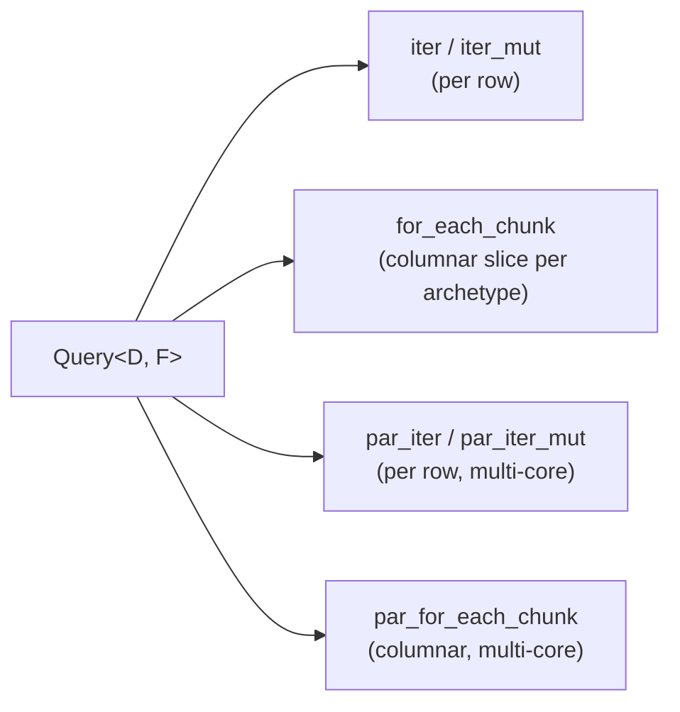

# Queries

A query is how a system *reads and writes* the world: you declare the shape of
the rows you care about — `Query<D, F>` — and the engine hands you an iterator
over exactly those rows, with nothing copied and no virtual dispatch in the
hot loop.

If you come from Bevy, this is the same `Query<D, F>` you already know:
`D: QueryData` is what each row yields, `F: QueryFilter` narrows *which* rows
you see. The differences are in the cost model (where Boyko diverges, this page
says so) and in two import details that the prelude does not paper over.

## The two shapes: `Query` vs `QueryView`

There are two entry points to the same machinery:

| Shape | How you get it | Aliasing gate | Change detection |
|-------|----------------|---------------|------------------|
| `Query<'w, 's, D, F>` | a **SystemParam** in a system body | the scheduler's conflict graph | full (`Ref` / `Mut` / `Added` / `Changed`) |
| `QueryView<'w, D, F>` | `world.query::<D, F>()` directly | `&mut self` on `EcsMaster` | **not allowed** (compile error) |

`Query` is the one you reach for 99% of the time — it rides inside a system, so
the [scheduler](../scheduler.md) can run it in parallel with any non-conflicting
system. `QueryView` is the direct, schedule-free path for setup code, tests, and
tools that hold an `&mut EcsMaster`. Both walk identical column storage; the only
runtime difference is who guarantees no aliasing.

```rust,ignore
use boyko_ecs::prelude::*;            // Query, EcsMaster, Entity, …
use boyko_macros::Component;

#[derive(Component)]
struct Position { x: f32, y: f32 }

#[derive(Component)]
struct Velocity { x: f32, y: f32 }

// As a SystemParam — the normal case.
fn integrate(mut q: Query<(&mut Position, &Velocity)>) {
    for (mut p, v) in &mut q {
        p.x += v.x;
        p.y += v.y;
    }
}

// As a QueryView — direct API, no schedule.
fn sum_x(world: &mut EcsMaster) -> f32 {
    let mut total = 0.0;
    // `query` takes `&mut self`, so this is the borrow that gates aliasing.
    for p in world.query::<&Position, ()>().iter() {
        total += p.x;
    }
    total
}
```

## The import rule (read this once)

The trait `Query` (and `QueryView` via `EcsMaster::query`) come from the
prelude. So do the change-detection data views `Ref` and `Mut`, and the
OR-combinator `AnyOf`. **The filters do not.** `With`, `Without`, `Added`,
`Changed`, and `Or` live one module deep and must be imported explicitly:

```rust,ignore
use boyko_ecs::prelude::*;
// Filters are NOT in the prelude glob — import them from the query module.
use boyko_ecs::ecs::core::iters::query::{With, Without, Added, Changed, Or};
```

`Option<&T>` needs no import (it is std). And derive macros
(`#[derive(Component)]`, `#[derive(Resource)]`, …) come from `boyko_macros`,
because that crate is only a dev-dependency of the kernel — see
[Components](components.md) for the why.

> The snippets below use illustrative component types — `Position`, `Velocity`,
> `Sprite`, `Mesh`, `Health`, `Enemy`, `Frozen`, `Transform`, `Camera`. To run
> any of them, define the ones it mentions with `#[derive(Component)]` (and the
> `use boyko_macros::Component;` import above). They are left out of each block
> to keep the focus on the query shape.

## QueryData: what a row yields (`D`)

`D` is a leaf or a tuple of leaves. Each leaf describes one column you want to
touch and dictates the borrow you get:

| Leaf | Row item | Access |
|------|----------|--------|
| `&T` | `&T` | read |
| `&mut T` | `&mut T` | write |
| `Ref<T>` | `Ref<T>` (deref to `&T` + tick info) | read + change detection |
| `Mut<T>` | `Mut<T>` (deref to `&mut T`, write bumps the tick) | write + change detection |
| `Option<&T>` | `Option<&T>` | optional read — row need not have `T` |
| `Option<&mut T>` | `Option<&mut T>` | optional write |
| `AnyOf<(A, B, …)>` | `(Option<A::Item>, …)`, ≥1 `Some` | OR over real-component leaves |
| `()` | `()` | match only, fetch nothing |
| tuples up to 12 | a tuple of the above | AND of all leaves |

A tuple is an **AND**: `Query<(&Position, &Velocity)>` visits only rows that have
*both* columns. To make a column optional, wrap it in `Option`:

```rust,ignore
use boyko_ecs::prelude::*;

// Every entity with Position; Velocity comes along only if present.
fn report(q: Query<(&Position, Option<&Velocity>)>) {
    for (p, maybe_v) in &q {
        match maybe_v {
            Some(v) => { /* moving */ }
            None    => { /* static */ }
        }
    }
}
```

`Ref<T>` and `Mut<T>` are the change-tracking views; see
[Change Detection](../change_detection.md) for their tick semantics. Note that
`&mut T` and `Mut<T>` are *not* read-only, so they are only available through
`iter_mut` / a `&mut q` loop — the type system rejects `for x in &q` when `D`
writes.

### `AnyOf` — OR over leaves

`AnyOf<(D0, D1, …)>` matches rows that contain **at least one** of its arms and
yields a tuple of `Option`s, with the guarantee that ≥1 element is `Some`:

```rust,ignore
use boyko_ecs::prelude::*;   // AnyOf is in the prelude

// Rows that carry a Sprite OR a Mesh (or both).
fn collect_renderables(q: Query<AnyOf<(&Sprite, &Mesh)>>) {
    for (sprite, mesh) in &q {
        if let Some(s) = sprite { /* … */ }
        if let Some(m) = mesh   { /* … */ }
    }
}
```

Arms must be real-component leaves — `&T`, `&mut T`, `Ref<T>`, `Mut<T>`. Nested
`AnyOf`, `Option`, `()`, and tuple arms are **compile-rejected** by a sealed
`AnyOfArm` bound, because each of those would match the whole world and break
the ≥1-member guarantee.

> **Cost note.** A *sole* `Query<AnyOf<…>>` has an empty include mask, so the
> matcher scans every live archetype on each generation bump (the `Or<F>` cost
> profile — paid per `update`, not per `iter`). Bound it with a positive leaf —
> `Query<(&Transform, AnyOf<(&Sprite, &Mesh)>)>` — to skip the full-world scan.

### Getting the entity per row

`Entity` is **not** a `QueryData` leaf here (a deliberate divergence from Bevy's
`Query<Entity>`). To pair each row with its entity id, use `iter_entities` /
`iter_entities_mut`, which yield `(EntityId, D::Item)`:

```rust,ignore
use boyko_ecs::prelude::*;

fn find_targets(q: Query<&Health>) {
    for (id, hp) in q.iter_entities() {
        if hp.0 == 0 {
            // `id` is the EntityId for this row.
        }
    }
}
```

## QueryFilter: which rows you see (`F`)

`F` never appears in the yielded item — it only narrows the row set. Leave it at
the default `()` to match on `D` alone.

| Filter | Matches | Granularity |
|--------|---------|-------------|
| `With<T>` | rows that have `T` (no borrow taken) | archetype (mask test, free per row) |
| `Without<T>` | rows that lack `T` | archetype (mask test, free per row) |
| `Added<T>` | `T` inserted within this system's window | per-row tick compare |
| `Changed<T>` | `T` mutated within this system's window | per-row tick compare |
| `Or<(F0, F1, …)>` | any sub-filter matches | depends on arms |
| tuples up to 12 | all sub-filters match (AND) | depends on arms |

`With` / `Without` are **archetype-level**: the engine resolves them once per
archetype, not once per row, so they cost nothing inside the hot loop. This is
the structural payoff of an archetype ECS — see [Tags](tags.md).

```rust,ignore
use boyko_ecs::prelude::*;
use boyko_ecs::ecs::core::iters::query::{With, Without};

// Move every enemy that is not frozen. The two filters are mask tests,
// resolved per archetype — the inner loop sees no branch for them.
fn move_enemies(mut q: Query<&mut Position, (With<Enemy>, Without<Frozen>)>) {
    for mut p in &mut q {
        p.x += 1.0;
    }
}
```

`Added<T>` and `Changed<T>` are **per-row** (non-archetypal): each visited row
compares a stored tick against the system's observation window. They cost
nothing when unused (const-folded away) — full semantics in
[Change Detection](../change_detection.md). Compose with `Or`:

```rust,ignore
use boyko_ecs::prelude::*;
use boyko_ecs::ecs::core::iters::query::{Added, Changed, Or};

fn react(q: Query<&Transform, Or<(Changed<Position>, Added<Velocity>)>>) {
    for t in &q { /* row where Position changed OR Velocity was just added */ }
}
```

## Iterating

The bread-and-butter loop is a `for` over a reference to the query:

```rust,ignore
for x in &q      { /* read-only:  requires D: ReadOnlyQueryData */ }
for x in &mut q  { /* read/write: any D */ }
```

`&q` is only legal when `D` is read-only — a write leaf (`&mut T`, `Mut<T>`)
forces `&mut q`. The explicit method forms are `q.iter()` and `q.iter_mut()`;
the `for` sugar calls them.

Both shapes (`Query` and `QueryView`) also offer the cardinality helpers:

```rust,ignore
let n = q.archetype_count(); // number of matched archetypes
let empty = q.is_empty();    // no matched archetypes
```

### `get` / `single` — `QueryView` only

The point-lookup and singleton helpers live on `QueryView` (the direct API),
**not** on the `Query` SystemParam:

```rust,ignore
use boyko_ecs::prelude::*;
use boyko_macros::Component;

#[derive(Component)]
struct Position { x: f32, y: f32 }

#[derive(Component)]
struct Camera;

// Fetch one entity's row, if it matches D + F.
fn lookup(world: &mut EcsMaster, e: Entity) {
    // Binding the view to a local is the clear, reusable form: the returned row
    // borrows the view, so a `let view = …;` keeps the view alive for as long as
    // you hold the row — and lets you reuse it for several lookups. An inline
    // `if let Some(p) = world.query::<…>().get(e) { … }` also compiles (the
    // scrutinee temporary lives for the whole `if let` body), so the binding is
    // about readability and reuse, not a borrow-check requirement.
    let view = world.query::<&Position, ()>();
    if let Some(p) = view.get(e) {
        let _ = p.x;
    }
}

// Assert exactly one matching row (panics on 0 or >1).
fn the_camera(world: &mut EcsMaster) {
    let view = world.query::<&Camera, ()>();
    let _only: &Camera = view.single();
}
```

Each helper call binds its own `let view = …;`. You cannot hold two views from
one `EcsMaster` at once — both `query` calls take `&mut world`, so the borrow
checker serializes them. Drop one view (let it leave scope) before opening the
next.

`get_mut` and `single_mut` are the writable twins (they take `&mut view`, so the
view must be `let mut view = …;`). Inside
a system, you do not have a `QueryView` — to look an entity up there, iterate the
`Query` and match on its `iter_entities` ids, or restructure the system to take
the lookup as input.

## `QueryView`'s extra constraint: no change detection

`EcsMaster::query::<D, F>()` runs *outside* a `Schedule`, and change-detection
ticks are advanced by the schedule. So a `QueryView` whose `D` or `F` carries
`Ref<T>`, `Mut<T>`, `Added<T>`, or `Changed<T>` is a **compile error**, surfaced
at the call site by a `const` assertion:

```rust,ignore
// ❌ does not compile — Mut<T> needs schedule context
let _ = world.query::<Mut<Position>, ()>();

// ✅ plain reads/writes are fine
let _ = world.query::<&mut Position, ()>();
```

If you need change detection, use a `Query` SystemParam inside a system. Plain
`&T` / `&mut T` writes through a `QueryView` are unaffected.

## Chunked and parallel iteration

`iter` / `iter_mut` are the per-row drivers. For SIMD-friendly columnar access
and multi-core fan-out, `Query` (and `QueryView`) expose `for_each_chunk`,
`par_iter` / `par_iter_mut`, and `par_for_each_chunk`. Those have their own page,
because the row-vs-chunk vs sequential-vs-parallel choice is a perf decision in
its own right:



See [Iteration](iteration.md) for the chunked and parallel APIs (including the
`ChunkedQueryData` / `ArchetypalQueryFilter` bounds, which exclude
change-detection leaves at compile time).

## How it runs under the hood

A query caches the set of matched archetypes per `(D, F)` type. The first time a
given `(D, F)` is used it classifies every live archetype against the include /
exclude / optional masks; afterward it is a slice walk, rebuilt only when the
archetype set actually changes (a generation bump). Inside a matched archetype,
the per-row step is a single `column.ptr.add(row * stride)` plus a deref per
leaf — the same machine code Bevy emits for its dense iteration, with no
per-row allocation, no `HashMap`, and no virtual call.

Because matching is archetype-granular, the filters split into two cost classes
that this page has flagged throughout: **archetypal** (`With` / `Without` / `Or`
of those) resolve once per archetype and vanish from the row loop, while
**per-row** (`Added` / `Changed`) cost one tick compare each but const-fold to
nothing when absent.

## See also

- [Iteration](iteration.md) — chunked, sequential, and parallel drivers
- [Change Detection](../change_detection.md) — `Ref`, `Mut`, `Added`, `Changed`
- [Components](components.md) — defining `D`'s leaves; the derive-import rule
- [Tags](tags.md) — why `With` / `Without` are free per row
- [Systems](systems.md) — where `Query` lives as a SystemParam
- [Scheduler](../scheduler.md) — the conflict graph that lets queries run in parallel
- Source: [`query.rs`](https://github.com/bluesteelll/boyko-engine/blob/ecs/crates/boyko_ecs/src/ecs/core/iters/query/query.rs#L62),
  [`query_view.rs`](https://github.com/bluesteelll/boyko-engine/blob/ecs/crates/boyko_ecs/src/ecs/core/iters/query/query_view.rs#L83),
  [`data.rs`](https://github.com/bluesteelll/boyko-engine/blob/ecs/crates/boyko_ecs/src/ecs/core/iters/query/data.rs),
  [`filter.rs`](https://github.com/bluesteelll/boyko-engine/blob/ecs/crates/boyko_ecs/src/ecs/core/iters/query/filter.rs),
  [`EcsMaster::query`](https://github.com/bluesteelll/boyko-engine/blob/ecs/crates/boyko_ecs/src/ecs/core/ecs_master/ecs_master.rs#L4256)
