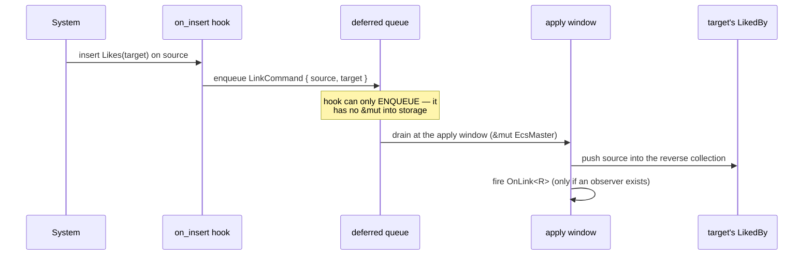

# Relations

A **relation** is a typed, bidirectional one-to-many link between entities, kept consistent by the engine itself. You write one foreign key on the *source*; the engine maintains the reverse index on the *target* automatically — link, re-target, unlink, and recursive despawn all just work.

If you have used Bevy 0.16, this is the same model: a non-fragmenting, hook-maintained pair of components (`Relationship` + `RelationshipTarget`). [Hierarchies](./hierarchies.md) (`ChildOf` / `Children`) are *the* canonical instance of this generic machinery — parent/child is just a relation that opted into recursive despawn.

## Why a generic relation system

Game data is a graph. A turret tracks a `Target`; a buff `AppliesTo` a unit; a weapon is `EquippedBy` a character; a room `Contains` props. The naive encoding — `Vec<Entity>` on one side and a hand-rolled "remember to also update the other side" on the other — is a *parallel data system*: a second source of truth that drifts, leaks on despawn, and fragments your cache.

boyko-engine refuses that. A relation is **components + systems on the ECS's own storage**, nothing glued on the side:

- The source-of-truth lives in a normal `ComponentPool` column (the FK component). No `HashMap`, no side index.
- The reverse index is a normal component too — maintained reactively by the same [lifecycle-hook substrate](./hooks-and-observers.md) that powers everything else.
- Consistency is restored at the deferred-command apply window, on the single-threaded drain — so the maintenance is **structurally race-free**, not race-free-if-you-remember-the-lock.

The whole thing is monomorphized per relation type `R`: zero `dyn`, zero virtual dispatch. A world that never declares a relation pays nothing.

## The trait pair

A relation is two components tied by their associated types so the round-trip `R::Target::Source == R` holds.

| Side | Trait | Lives on | Written by |
|------|-------|----------|------------|
| Source of truth (the FK) | [`Relationship`] | the source entity | **you** — insert/overwrite/remove |
| Reverse index (the collection) | [`RelationshipTarget`] | the target entity | **the engine** — never by hand |

[`Relationship`]: https://github.com/bluesteelll/boyko-engine/blob/ecs/crates/boyko_ecs/src/ecs/core/relationship/mod.rs#L210
[`RelationshipTarget`]: https://github.com/bluesteelll/boyko-engine/blob/ecs/crates/boyko_ecs/src/ecs/core/relationship/mod.rs#L285

```rust,ignore
use boyko_ecs::prelude::*;                       // the TRAITS + the query/observer DSL
use boyko_macros::{Component, Relationship, RelationshipTarget};

// SOURCE: the foreign key. Inserting `Likes(t)` links self -> t;
// overwriting re-targets; removing unlinks. A single-field tuple struct.
#[derive(Component, Clone, Copy, Relationship)]
#[repr(transparent)]
#[relationship(target = LikedBy)]
struct Likes(pub Entity);

// TARGET: the reverse index. Never written by user code — the engine keeps it
// in sync. `Default` is required (the supertrait); v1 collections are `Vec<Entity>`.
#[derive(Component, Default, RelationshipTarget)]
#[relationship_target(source = Likes, retain_empty)]
struct LikedBy(Vec<Entity>);
```

> **Imports.** The traits (`Relationship`, `RelationshipTarget`, `RelationshipSourceCollection`, plus the entire query/observer DSL below) come from `boyko_ecs::prelude::*`. The *derive macros* `Relationship` / `RelationshipTarget` live in `boyko_macros` (a dev-dependency that the prelude does not re-export), so they are imported separately. This split is identical to `#[derive(Component)]`.

### Derive attributes

The component itself is declared with `#[derive(Component)]`; the relation derives add only the `impl`s on top.

- **`#[relationship(target = T)]`** on the source — names the reverse-index component. Optional `allow_self_referential` permits `R(self)` (otherwise a self-link is reactively removed). [macro source](https://github.com/bluesteelll/boyko-engine/blob/ecs/crates/boyko_macros/src/lib.rs#L2251)
- **`#[relationship_target(source = S [, linked_despawn] [, retain_empty])]`** on the target — names the source component, and:
  - `linked_despawn` → despawning the target recursively despawns every source (this is how `Children` cascades).
  - `retain_empty` → an emptied collection is **kept**, not removed, so a `0 → 1 → 0` link oscillation never thrashes the archetype. **v1 requires `retain_empty`.**

A type cannot be both sides; the two attributes are mutually exclusive.

## Linking, re-targeting, unlinking

There is no special `relate` verb. The FK component *is* the link, so you use the ordinary [commands](./commands.md) you already know:

```rust,ignore
use boyko_ecs::prelude::*;
use boyko_macros::{Component, Relationship, RelationshipTarget};
# #[derive(Component, Clone, Copy, Relationship)]
# #[repr(transparent)]
# #[relationship(target = LikedBy)]
# struct Likes(pub Entity);
# #[derive(Component, Default, RelationshipTarget)]
# #[relationship_target(source = Likes, retain_empty)]
# struct LikedBy(Vec<Entity>);

fn wire_relations(mut cmds: Commands, alice: Entity, bob: Entity, carol: Entity) {
    // LINK: alice now Likes bob. After the apply window, bob's LikedBy holds alice.
    cmds.entity(alice).insert(Likes(bob));

    // RE-TARGET: overwrite the FK. The engine unlinks alice from bob's reverse
    // index and links her into carol's — one component write, both sides synced.
    cmds.entity(alice).insert(Likes(carol));

    // UNLINK: remove the FK (or despawn alice entirely).
    cmds.entity(alice).remove::<Likes>();
}
```

The reverse index becomes consistent at the **deferred-command apply window** — the same single-threaded drain where all structural changes settle. Inside a system you observe the *previous* frame's state; after the apply, both sides agree. Reading the reverse collection is a plain component read:

```rust,ignore
# use boyko_ecs::prelude::*;
# use boyko_macros::{Component, Relationship, RelationshipTarget};
# #[derive(Component, Clone, Copy, Relationship)]
# #[repr(transparent)] #[relationship(target = LikedBy)] struct Likes(pub Entity);
# #[derive(Component, Default, RelationshipTarget)]
# #[relationship_target(source = Likes, retain_empty)] struct LikedBy(Vec<Entity>);
fn who_likes(ecs: &EcsMaster, target: Entity) {
    if let Some(reverse) = ecs.get_component::<LikedBy>(target) {
        // `RelationshipSourceCollection::iter` yields the source `Entity`s.
        for source in RelationshipSourceCollection::iter(reverse.collection()) {
            let _ = source;
        }
    }
}
```

## How the reverse index is maintained

You never touch `LikedBy`. Two generic [component hooks](./hooks-and-observers.md), keyed on `R`, do all the bookkeeping ([generic hooks](https://github.com/bluesteelll/boyko-engine/blob/ecs/crates/boyko_ecs/src/ecs/core/relationship/mod.rs#L241)):

- `R::on_insert` (`on_insert`) — enqueues a `LinkCommand` that pushes the source into the target's collection.
- `R::on_replace` (`on_replace`) — enqueues an `UnlinkCommand` that removes the source from the *old* target's collection (this fires on overwrite and on removal alike).
- `R::Target::on_replace` — drives the cascade: recursive despawn when `linked_despawn` is set, plain unlink-of-all-sources otherwise.



This is the soundness keystone. A hook's only world handle is a read-only `DeferredEcsMaster` with **no `&mut`-into-storage method** — so a hook *structurally cannot* mutate a collection inline; it can only enqueue. The only mutators of a `RelationshipTarget` (`collection_mut_risky` / `from_collection_risky`) demand `&mut Self`, reachable solely inside a `Command::apply` under `&mut EcsMaster`. The reverse index is therefore unreachable from any hook, and the deferred drain runs on a disjoint allocation — so re-entrant cascades stay race-free for *any* relation, the same reason they are sound for `ChildOf`. It is a property of the API, not a rule you must remember.

## The query DSL

The relation query DSL is built **purely on the existing storage** — the FK column and the reverse collection — with no side index. Every term below is re-exported from the prelude.

### `Related<R, D>` — the read-only join

For each source row, read its `R` foreign key, resolve the target entity, and gather read-only data `D` from the *target's* row. The item type is `Option<D::Item>` — `None` when the FK is absent, the target is dead, or the target's archetype lacks `D`.

```rust,ignore
use boyko_ecs::prelude::*;                          // Query, Related, ChildOf, ...
use boyko_ecs::ecs::core::iters::query::With;       // core filters are NOT in the prelude
use boyko_macros::Component;

#[derive(Component, Clone, Copy)]
#[repr(C)]
struct Transform { x: f32, y: f32 }

// For every child, read the PARENT's Transform (not the child's own).
fn read_parent_transform(q: Query<(&Transform, Related<ChildOf, &Transform>), With<ChildOf>>) {
    for (own, parent) in q.iter() {
        // `parent: Option<&Transform>` — Some when the parent hosts a Transform.
        let _ = (own, parent);
    }
}
```

Two design constraints, both enforced at compile time:

- **Read-only only.** `D: ReadOnlyQueryData` is a hard bound. A `&mut` join is forbidden because two sources pointing at one target would alias a `&mut` into that target's row.
- **Aliasing is the conflict graph's job.** `Related<R, D>` declares `R`'s read *then* `D`'s read against the same access set, so `Query<(&mut T, Related<R, &T>)>` trips the existing read-vs-write detector at build time — no per-row runtime check.

`Related` is **sequential-only**: it is const-rejected on `par_iter` (the parallel chunk runner has no world cell to resolve a per-row target archetype) and does not implement chunked iteration (the target rows are scattered). The join is two dependent random loads per row — inherently random-access on the target side — so reach for it deliberately, not in your hottest inner loop. [related.rs](https://github.com/bluesteelll/boyko-engine/blob/ecs/crates/boyko_ecs/src/ecs/core/iters/query/relation/related.rs#L102)

### Relation filters

| Filter | Matches |
|--------|---------|
| `HasRelation<R>` | sources that carry an `R` foreign key |
| `NoRelation<R>` | entities with *no* `R` FK (e.g. hierarchy roots) |
| `RelatedTo::<R>::new(target)` | exactly the sources pointing at `target` |

```rust,ignore
use boyko_ecs::prelude::*;
use boyko_macros::Component;
# #[derive(Component, Clone, Copy)] #[repr(C)] struct Tag(u32);

fn partition(ecs: &mut EcsMaster) {       // query/query_filtered take &mut self
    let children = ecs.query::<&Tag, HasRelation<ChildOf>>().iter().count();
    let roots    = ecs.query::<&Tag, NoRelation<ChildOf>>().iter().count();
    let _ = (children, roots);
}

// `RelatedTo` carries a runtime value — use `query_filtered`, which seeds it:
fn children_of(ecs: &mut EcsMaster, parent: Entity) {
    let kids = ecs
        .query_filtered::<&Tag, _>(RelatedTo::<ChildOf>::new(parent))
        .iter()
        .count();
    let _ = kids;
}
```

> **Footgun.** `RelatedTo` needs its target seeded through `query_filtered`. Using it through the value-less `query::<_, RelatedTo<R>>()` path panics loudly (a poison sentinel) rather than silently matching nothing — `query_filtered` is the only correct entry point. [filter.rs](https://github.com/bluesteelll/boyko-engine/blob/ecs/crates/boyko_ecs/src/ecs/core/iters/query/relation/filter.rs#L254)

### Traversal accessors

Walk the relation graph directly off `EcsMaster`. Each returns an iterator of `Entity`; the transitive walks are depth-capped, and a non-acyclic relation guards revisits with a cold function-local visited set (const-folded away for an acyclic relation such as `ChildOf`). [accessors](https://github.com/bluesteelll/boyko-engine/blob/ecs/crates/boyko_ecs/src/ecs/core/ecs_master/ecs_master.rs#L2432)

| Accessor | Walks | Yields |
|----------|-------|--------|
| `ecs.targets::<R>(source)` | the single FK | 0 or 1 target |
| `ecs.sources::<R>(target)` | the reverse collection | every direct source |
| `ecs.ancestors::<R>(e)` | up the FK chain | each transitive target (not `e`) |
| `ecs.descendants::<R>(root)` | down the reverse collections | each transitive source (not `root`) |

```rust,ignore
# use boyko_ecs::prelude::*;
fn report(ecs: &EcsMaster, root: Entity, child: Entity) {
    for parent in ecs.targets::<ChildOf>(child)    { let _ = parent; }
    for kid    in ecs.sources::<ChildOf>(root)     { let _ = kid; }
    for up     in ecs.ancestors::<ChildOf>(child)  { let _ = up; }
    for down   in ecs.descendants::<ChildOf>(root) { let _ = down; }
}
```

## Relation observers

### Edge observers: `OnLink<R>` / `OnUnlink<R>`

Two built-in [triggers](./hooks-and-observers.md), one monomorphization per relation `R`, fired on the **committed edge** at the apply window — never from the read-only hook body. Keying on the trigger's own type id gives the flecs `(R, *)` wildcard analogue for free, with no new dispatch path. [edge_observers.rs](https://github.com/bluesteelll/boyko-engine/blob/ecs/crates/boyko_ecs/src/ecs/core/relationship/edge_observers.rs#L46)

- **`OnLink<R>`** fires after a new edge is committed (a fresh FK or the new side of a re-target). It targets the source; the payload `target` is the entity the source now points at. An edge that no-ops on a dead target never fires.
- **`OnUnlink<R>`** fires after an edge is confirmed destroyed (remove, the old side of a re-target, a source despawn, or a non-cascading teardown). Its payload `old_target` is the entity the source used to point at. A *spurious* unlink (self-ref guard, missing link) never fires.

Register a runner with `observe_on_link::<R>` / `observe_on_unlink::<R>`. The runner is a bare `TriggerFn` — `unsafe fn(DeferredEcsMaster<'_>, TriggerContext, *const u8)` — which cannot capture, so it reads the event through the raw pointer:

```rust,ignore
use boyko_ecs::prelude::*;          // Relationship, OnLink, OnUnlink, DeferredEcsMaster, ...
use boyko_ecs::ecs::core::component::hooks::deferred_master::DeferredEcsMaster;
use boyko_ecs::ecs::core::component::observers::trigger::TriggerContext;
use boyko_macros::{Component, Relationship, RelationshipTarget};

#[derive(Component, Clone, Copy, Relationship)]
#[repr(transparent)]
#[relationship(target = LikedBy)]
struct Likes(pub Entity);

#[derive(Component, Default, RelationshipTarget)]
#[relationship_target(source = Likes, retain_empty)]
struct LikedBy(Vec<Entity>);

unsafe fn on_like(_world: DeferredEcsMaster<'_>, _ctx: TriggerContext, ev: *const u8) {
    // SAFETY: the edge-fire walk pins a live `OnLink<Likes>` for this call.
    let event = unsafe { &*(ev as *const OnLink<Likes>) };
    let _new_target = event.target;
}

fn setup(ecs: &mut EcsMaster) {
    ecs.observe_on_link::<Likes>(on_like);
    // ecs.observe_on_unlink::<Likes>(on_unlike);  // reads `event.old_target`
}
```

The fire is gated behind a cold `has_edge_observer` probe, so a world with no edge observers pays ~nothing per committed edge — the synchronous observer machinery is never entered.

### `Broadcast<R>` — `Down` propagation

A custom trigger can fan **down** a relation: after firing on the target, it recurses over that relation's reverse collection, firing on every descendant. You declare the propagation shape and the broadcast relation on the [`Trigger`] impl:

[`Trigger`]: https://github.com/bluesteelll/boyko-engine/blob/ecs/crates/boyko_ecs/src/ecs/core/component/observers/trigger.rs#L70

```rust,ignore
use boyko_ecs::prelude::*;          // Trigger, PropagationMode, ChildOf, ...
use boyko_ecs::ecs::core::component::observers::traversal::ChildOfTraversal;

// A trigger that broadcasts DOWN the ChildOf graph: fired at a root, it reaches
// the root + every transitive child, each exactly once.
struct DamageWave;
impl Trigger for DamageWave {
    const PROPAGATION: PropagationMode = PropagationMode::Down;
    type Traversal = ChildOfTraversal;   // the up-hop relation (unused for Down)
    type Broadcast = ChildOf;            // the relation whose reverse index fans out
}
```

`PropagationMode` has three arms: `None` (target-only, the historical default), `Up` (bubble one hop along `Traversal` — the existing single-chain bubble), and `Down` (the reverse-collection fan-out). The descent is cycle-safe and depth-capped, with a per-node propagate snapshot so calling `propagate(false)` prunes only that node's subtree. Fire it with `ecs.trigger::<DamageWave>(root, DamageWave)` after registering per-entity runners via `observe_entity_event`. [traversal.rs](https://github.com/bluesteelll/boyko-engine/blob/ecs/crates/boyko_ecs/src/ecs/core/component/observers/traversal.rs#L18)

The `Up` direction is `Toward<R>`: a bridge that lets *any* single-target relation bubble, not just `ChildOf`. Setting `type Traversal = Toward<MyRelation>` makes a custom trigger walk up your relation one hop at a time, reusing the existing per-hop `get_component` lookup.

## The exclusive 1:1 collection

The cardinality is a **type choice on the target**, not a new derive. Swap the collection field from `Vec<Entity>` to [`Exclusive`] and the relation becomes one-to-one: a target held by at most one source.

[`Exclusive`]: https://github.com/bluesteelll/boyko-engine/blob/ecs/crates/boyko_ecs/src/ecs/core/relationship/collection.rs#L146

```rust,ignore
use boyko_ecs::prelude::*;          // Exclusive, Relationship, RelationshipTarget
use boyko_macros::{Component, Relationship, RelationshipTarget};

// A unit can occupy at most one slot; a slot holds at most one unit.
#[derive(Component, Clone, Copy, Relationship)]
#[repr(transparent)]
#[relationship(target = OccupiedBy)]
struct Occupies(pub Entity);

#[derive(Component, Default, RelationshipTarget)]
#[relationship_target(source = Occupies, retain_empty)]
struct OccupiedBy(Exclusive);       // 1:1 instead of Vec<Entity>
```

`Exclusive` is a `#[repr(transparent)]` newtype over `Option<Entity>` — a single slot, no heap, strictly cheaper than `Vec`'s 24 bytes plus an allocation for the at-most-one case.

**Apply-time eviction.** Linking a new source `B` to a slot already held by `A` evicts `A`. The eviction is detected at apply time inside `LinkCommand::apply`: it overwrites the slot to `B`, fires `OnUnlink{A}` exactly once, and enqueues a deferred remove of `A`'s now-dangling foreign key. Exactly one `OnUnlink` and one `OnLink` fire per re-link. The `Vec` one-to-many path is untouched — it inherits the default "nothing to evict", so the eviction branch const-folds away to byte-identical code. [eviction logic](https://github.com/bluesteelll/boyko-engine/blob/ecs/crates/boyko_ecs/src/ecs/core/relationship/mod.rs#L522)

## Comparison to other engines

| Aspect | boyko | Bevy 0.16 | flecs |
|--------|-------|-----------|-------|
| Model | hook-maintained FK + reverse component | hook-maintained FK + reverse component | first-class relationship pairs `(R, target)` |
| Storage | normal `ComponentPool` columns, no side index | normal component columns | dedicated relationship tables |
| Cardinality | type choice (`Vec<Entity>` / `Exclusive`) | type choice (collection type) | fragments per target by default |
| Wildcard query | `OnLink<R>` / `OnUnlink<R>` per-`R` trigger id | observers + `RelationshipTarget` | `(R, *)` / `(*, target)` native |
| Dispatch | fully monomorphized, no `dyn` | monomorphized | runtime archetype matching |

boyko deliberately follows the Bevy non-fragmenting model: re-targeting a relation does **not** migrate the source's archetype (the FK component stays put; only its bytes change), so high-churn relations never thrash the archetype graph — the cost flecs pays for native `(R, target)` fragmentation.

## See also

- [Hierarchies](./hierarchies.md) — `ChildOf` / `Children`, the canonical relation instance with `linked_despawn`.
- [Hooks and observers](./hooks-and-observers.md) — the lifecycle-hook + trigger substrate every relation rides on.
- [Queries](./queries.md) and [Iteration](./iteration.md) — the query model `Related` / the relation filters plug into.
- [Commands](./commands.md) — the deferred-command apply window where the reverse index settles.
- [Glossary](../reference/glossary.md) — relation, reverse index, FK, cascade.
- Source: [relationship/mod.rs](https://github.com/bluesteelll/boyko-engine/blob/ecs/crates/boyko_ecs/src/ecs/core/relationship/mod.rs), [collection.rs](https://github.com/bluesteelll/boyko-engine/blob/ecs/crates/boyko_ecs/src/ecs/core/relationship/collection.rs), [edge_observers.rs](https://github.com/bluesteelll/boyko-engine/blob/ecs/crates/boyko_ecs/src/ecs/core/relationship/edge_observers.rs), [relation query DSL](https://github.com/bluesteelll/boyko-engine/blob/ecs/crates/boyko_ecs/src/ecs/core/iters/query/relation/mod.rs).
