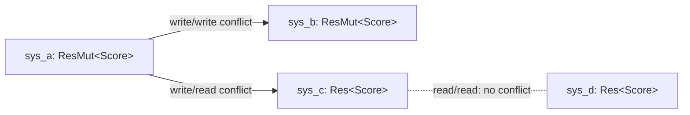

# Resources

> A resource is a world-global singleton: exactly one value per type, addressed by
> its type rather than by an entity.

Some state does not belong to any particular entity. The score, the elapsed time,
the gravity vector, a render config, the current input snapshot — there is exactly
**one** of each, for the whole world. In an entity-component store you *could* park
such data on a sentinel entity, but that is awkward and slow to look up. Resources
are the first-class home for it: insert one value per type, then read or mutate it
from any system by asking for the type.

If you come from Bevy, this is the same `Resource` you already know — the public
surface is deliberately Bevy-shaped. The differences are in the *why*: how the
storage is laid out and how resource access feeds the parallel scheduler.

## Defining a resource

A resource is any `'static + Send + Sync` type that implements the `Resource`
trait. The normal way is the derive macro:

```rust,ignore
// The TRAIT comes from the prelude; the DERIVE macro lives in boyko_macros
// (it is only a dev-dependency of boyko_ecs, so the prelude cannot re-export it).
use boyko_ecs::prelude::*;
use boyko_macros::Resource;

#[derive(Resource)]
struct Score(u32);

#[derive(Resource, Default)]
struct GameConfig {
    gravity: f32,
    max_players: u8,
}
```

A few rules the engine enforces:

- **`Send + Sync` is required.** Resources are read and written by systems that the
  scheduler may run on worker threads, so a non-`Sync` value would be unsound to
  hand out as a shared borrow from a worker. (Truly thread-bound state — FFI/GPU
  handles, `Rc`-wrapped data — has a separate `NonSendResource` lane; see below.)
- **A type is a resource *or* a component, never both.** Registering a type that is
  already a `#[derive(Component)]` panics with a clear diagnostic. The two storage
  models are distinct and the engine refuses to let a type straddle them.
- **Zero-sized resources are allowed.** A unit struct (`struct Initialized;`) is a
  valid resource — its mere presence/absence is the signal. The storage handles this
  without touching the heap: a ZST slot uses a dangling-but-aligned pointer and skips
  the allocator entirely, while still running `Drop` glue if the type has any. So a
  presence-flag resource costs no allocation. (ZST *components* — tags — are also
  fully supported, but live in archetype storage; see [Tags](./tags.md).)

## Inserting and reading on the world

The world object is `EcsMaster`. Outside of a system — typically during setup, or
in tests — you go through it directly:

```rust,ignore
use boyko_ecs::prelude::*;
use boyko_macros::Resource;

#[derive(Resource)]
struct Score(u32);

let mut world = EcsMaster::new();

// Insert (or replace) the single value of this type.
world.insert_resource(Score(0));

// Read it back. `resource` / `resource_mut` panic if it is absent.
let s: &Score = world.resource::<Score>();
assert_eq!(s.0, 0);

// Mutate in place.
world.resource_mut::<Score>().0 += 10;
assert_eq!(world.resource::<Score>().0, 10);

// Non-panicking variants return Option.
if world.try_resource::<Score>().is_some() {
    // ...
}

// Remove, taking ownership of the value back.
let taken: Option<Score> = world.remove_resource::<Score>();
assert!(taken.is_some());
```

The full facade on `EcsMaster`:

| Method | Returns | Notes |
|--------|---------|-------|
| `insert_resource::<R>(value)` | `()` | Inserts or replaces. Cold path. |
| `remove_resource::<R>()` | `Option<R>` | Takes the value out if present. |
| `resource::<R>()` | `&R` | **Panics** if absent. |
| `resource_mut::<R>()` | `&mut R` | **Panics** if absent. |
| `try_resource::<R>()` | `Option<&R>` | Non-panicking. |
| `try_resource_mut::<R>()` | `Option<&mut R>` | Non-panicking. |
| `contains_resource::<R>()` | `bool` | Presence check. |

If you build your app with the `App` facade, `insert_resource` is also available
there and returns `&mut Self` so it chains with the rest of the builder:

```rust,ignore
use boyko_ecs::prelude::*;
use boyko_macros::Resource;

#[derive(Resource)]
struct Score(u32);

App::new()
    .insert_resource(Score(0))
    .add_systems(scoring_system)
    .run();
# fn scoring_system() {}
```

## Reading resources inside systems

Inside a system you do not touch `EcsMaster` by hand. You declare what you need as
a `SystemParam`, and the scheduler hands it to you:

- `Res<R>` — a shared borrow (`Deref<Target = R>`), for reading.
- `ResMut<R>` — an exclusive borrow (`Deref + DerefMut`), for writing.

```rust,ignore
use boyko_ecs::prelude::*;
use boyko_macros::Resource;

#[derive(Resource)]
struct Score(u32);

#[derive(Resource)]
struct GameConfig {
    score_per_kill: u32,
}

// Read-only: `Res<GameConfig>`. Writes the score: `ResMut<Score>`.
fn award_points(config: Res<GameConfig>, mut score: ResMut<Score>) {
    // Both wrappers deref transparently to the inner type.
    score.0 += config.score_per_kill;
}
```

`Res<R>` and `ResMut<R>` are transparent wrappers — `Deref` lets you call methods
and read fields directly, and `ResMut` adds `DerefMut` for writes. There is no
`.get()` or `.0` ceremony; treat the param as the resource itself.

Both params **panic at first run if the resource was never inserted**. Insert your
resources during setup (via `App::insert_resource` or directly on the world) before
the systems that consume them run.

### A standalone system run

For a quick end-to-end picture without the full `App`, you can drive a single
system over a world with `run_system_once`:

```rust,ignore
use boyko_ecs::prelude::*;
use boyko_macros::Resource;
use boyko_ecs::ecs::core::system::into_system::IntoSystem;

#[derive(Resource)]
struct Counter(u32);

fn tick(mut c: ResMut<Counter>) {
    c.0 += 1;
}

let mut world = EcsMaster::new();
world.insert_resource(Counter(0));

let mut system = IntoSystem::into_system(tick);
world.run_system_once(&mut system);
world.run_system_once(&mut system);

assert_eq!(world.resource::<Counter>().0, 2);
```

## Resource access and the scheduler

This is where resources stop being "just a global" and start mattering for
performance. Boyko's scheduler runs independent systems **in parallel**, and it
decides what "independent" means from the access each system *declares* — including
its resource access.

When a system initializes, every `Res<R>` / `ResMut<R>` param records a read or a
write of `R`'s resource id into the system's access set. The scheduler then builds
a conflict graph: two systems get a conflict edge (and are forced to run on
different stages / serialized) when their declared accesses overlap. For resources
the rule is exactly the borrow rule:

- `Res<R>` + `Res<R>` — **no conflict**. Many systems can read the same resource at
  once.
- `ResMut<R>` + anything touching `R` — **conflict**. A writer cannot overlap a
  reader or another writer of the same resource.



So `sys_a` and `sys_b` (both writers) serialize; `sys_c` and `sys_d` (both readers)
may run concurrently; a writer never overlaps a reader of the same type. You get
data-race freedom **without any locks** — the conflicts are resolved once, up front,
from declarations, so the hot path holds plain `&` / `&mut` borrows with zero
runtime synchronization.

The same machinery also catches a mistake **within a single system**: asking for
two conflicting borrows of one resource (e.g. `ResMut<Score>` twice, or
`Res<Score>` alongside `ResMut<Score>`) is an intra-system conflict and panics at
init with a diagnostic, rather than producing aliasing `&mut`.

Practical consequence: if a resource is written by many systems, it becomes a
serialization point. Prefer `Res<R>` over `ResMut<R>` whenever you only read, and
split a hot, write-heavy resource into finer-grained types so unrelated writers
stop conflicting.

## How it is stored

Resources live in a single type-erased slab on the world. Each resource type is
assigned a small dense `ResourceId` the first time its id is requested (lazy,
cached in a per-type `OnceLock` — no atomic on the steady-state path). The slab
indexes by that id, so a lookup is an index, not a hash:

- **Dense, id-indexed.** There is no `HashMap` on the access path — a resource
  fetch is a bounds-checked array index plus a pointer read.
- **Cached id per param.** `Res<R>` / `ResMut<R>` resolve `R::resource_id()` *once*
  at system-init time and stash it in the param state. Every later access reuses
  the cached id directly, skipping even the `OnceLock` load.
- **Bounded slot count.** The registry currently holds up to `256` distinct
  resource types per process — ample for engine + game globals.

Insert and remove are cold, panic-safe paths: a replace clears the slot's
registration bit *before* dropping the old value, so a panic in `Drop` leaks rather
than leaving the slab in an observable half-state. (You should never call back into
the world from a resource's `Drop`; the world may be mid-teardown.)

## Common engine resources

Several engine subsystems are themselves resources you can read in your systems:

- **`Time`** — the per-frame clock. Read `Res<Time>` and call `delta_secs()`,
  `elapsed()`, etc. for frame-rate-independent movement.
- **`NextState<S>`** — the staged next value of a state machine; you write it with
  `ResMut<NextState<S>>` to request a transition.
- **`AppExit`** — the exit-signal resource the run loop checks.

Treat your own config, accumulators, and shared service handles the same way: one
type, one value, reached from any system.

```rust,ignore
use boyko_ecs::prelude::*;

// Frame-rate-independent integration using the built-in `Time` resource.
fn drift(time: Res<Time>, /* ...query... */) {
    let dt = time.delta_secs();
    // position += velocity * dt;
    let _ = dt;
}
```

### Non-`Send` resources

When a value genuinely cannot cross threads — a Vulkan device handle, an OS input
ring, anything `!Send` — it cannot be a `Resource`. The engine provides a parallel
lane: implement `NonSendResource` and store it with
`insert_non_send_resource`. Such a value lives in a separate slab and is only
reachable from systems that run on the dispatcher thread, so the `!Send` payload is
never touched concurrently. Reach for this only when the ordinary `Resource` lane is
impossible.

## See also

- [Systems](./systems.md) — how `Res` / `ResMut` are declared as `SystemParam`s.
- [The scheduler](../scheduler.md) — the conflict graph that resource access feeds.
- [Change detection](../change_detection.md) — tracking when a resource was written.
- [Tags](./tags.md) — the component-side answer to "presence as data".
- Source:
  [`resource.rs`](https://github.com/bluesteelll/boyko-engine/blob/ecs/crates/boyko_ecs/src/ecs/core/resources/resource.rs),
  [`res.rs`](https://github.com/bluesteelll/boyko-engine/blob/ecs/crates/boyko_ecs/src/ecs/core/system/params/res.rs#L40),
  [`resmut.rs`](https://github.com/bluesteelll/boyko-engine/blob/ecs/crates/boyko_ecs/src/ecs/core/system/params/resmut.rs#L42).
