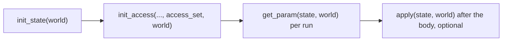
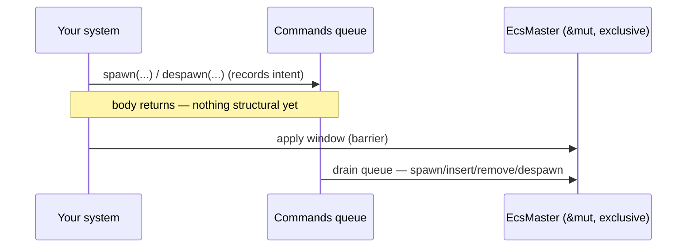

# Systems

> A system is a plain Rust function. Its parameter types declare exactly what it
> touches, and the engine turns it into a schedulable, parallelizable unit of work.

A system is the unit of logic in boyko-engine. You write an ordinary `fn` (or
closure); its argument types are all [`SystemParam`]s, and the engine reads those
types to learn which resources and components the function reads or writes. That
declared *access* is what lets the [scheduler](../scheduler.md) run
non-conflicting systems in parallel without a single lock on the hot path.

If you have used Bevy, this surface is deliberately familiar: `Query<D, F>`,
`Res`/`ResMut`, `Commands`, `EventReader`/`EventWriter`, `Local<T>`. The shapes
match; the parts that differ — per-run tick regime, the byte-arena command queue,
the `!Send` arena — are called out below.

---

## From `fn` to `System`

You never implement the [`System`] trait by hand. You write a function whose
parameters are all `SystemParam`, and the blanket [`IntoSystem`] impl wraps it in
a [`FunctionSystem`] for you the moment you register it.

```rust,ignore
use boyko_ecs::prelude::*;        // Query, Res, ResMut, Commands, App, ...
use boyko_macros::Component;      // derives are NOT in the prelude (see below)

#[derive(Component)]
struct Position { x: f32, y: f32 }

#[derive(Component)]
struct Velocity { x: f32, y: f32 }

// A system. Two params: a mutable `Position`, a read-only `Velocity`.
fn movement(mut q: Query<(&mut Position, &Velocity)>) {
    // Each iteration yields `(&mut Position, &Velocity)`; the writes
    // auto-deref through the `&mut Position`, so `pos` needs no `mut`.
    for (pos, vel) in &mut q {
        pos.x += vel.x;
        pos.y += vel.y;
    }
}

let mut app = App::new();
app.add_systems(movement);        // `movement` becomes a System here
```

> **Import rule (read this once).** The *traits* (`Component`, `Resource`,
> `Bundle`, …) and every system param come from `boyko_ecs::prelude::*`. The
> *derive macros* — `#[derive(Component)]`, `#[derive(Resource)]`,
> `#[derive(Bundle)]`, `#[derive(SystemSet)]`, `#[event]` — live in the
> `boyko_macros` crate, which `boyko_ecs` pulls in only as a dev-dependency, so
> the prelude cannot re-export them. Any example with a `#[derive(...)]` must add
> `use boyko_macros::{...};`.

### How the wrapping works

[`IntoSystem<In, Out, Marker>`] is keyed by a `Marker` type so several blanket
impls can coexist without overlap. Three matter to you:

| You pass… | Picked blanket | Produces |
|-----------|----------------|----------|
| `fn(P0, …, Pn)` where every `Pi: SystemParam` | function-system | [`FunctionSystem<F, M>`] |
| an already-built `S: System` | identity | `S` itself |
| `FnMut(&mut EcsMaster)` | exclusive | `ExclusiveFunctionSystem<F>` |

The exclusive blanket is the escape hatch: a closure taking `&mut EcsMaster`
gets the whole world to itself (no parallelism, full structural mutation). Note
that `&mut EcsMaster` is **not** a `SystemParam` — that is what keeps the three
blankets disjoint, and it is why "ordinary" systems route through `Query` / `Res`
/ `Commands` instead of grabbing the world directly.

A `FunctionSystem` is *cached*: the first run materializes each param's state and
freezes the access surface; every later run skips re-init and goes straight to the
hot path. Function-system arity runs 0..=12 params (a tuple of params is itself a
`SystemParam`, so you are never truly capped — nest a tuple).

---

## The `SystemParam` trait

Every legal parameter type implements the `unsafe trait` [`SystemParam`]. You will
rarely implement it yourself; the point is to understand the contract, because it
explains the engine's whole concurrency story.

A param has three jobs, run in order, once per system:



- **`init_state`** — build any long-lived state the param keeps in the system
  (e.g. a `Query`'s cached archetype-match set, a `Local<T>`'s `T::default()`).
  It must not mutate the world's structure.
- **`init_access`** — declare *every* read and write the param will perform. This
  is the honesty contract (`SP1`): the declared [access](../scheduler.md) is what
  the scheduler trusts to decide which systems may run together. A `Query<&mut T>`
  declares a write to `T`; a `Res<R>` declares a read of `R`. `Local`, `Commands`,
  `EventReader`, and `EventWriter` declare **nothing**, so they never add a
  conflict edge.
- **`get_param`** — produce the borrowed view handed to your function for one run.
- **`apply`** — an optional deferred-write hook, run after the body returns while
  the engine holds `&mut EcsMaster` exclusively. Only `Commands` overrides it (see
  [the apply window](#the-apply-window) below); for everything else it is a no-op.

The `unsafe` on the trait is load-bearing: `init_access` declaring an incomplete
access set would let the scheduler grant two aliasing mutable borrows. That cannot
be expressed in the type system, so it lives as a safety invariant on the
built-in impls — which is exactly why you should prefer the built-in params over
rolling your own.

---

## The built-in params

### `Query<D, F>` — entities and their components

The workhorse. `D: QueryData` is what you read/write per row; `F: QueryFilter`
narrows which entities match. See [Queries](queries.md) and
[Iteration](iteration.md) for the full DSL.

```rust,ignore
use boyko_ecs::prelude::*;
use boyko_macros::Component;

#[derive(Component)]
struct Health(u32);

#[derive(Component)]
struct Player;

// Only the player's health, read-only.
fn report(q: Query<&Health, With<Player>>) {
    for hp in &q {
        // ...inspect hp.0...
    }
}
```

`Query` is the *only* common param that declares component access, so two systems
that both write the same component are forced to run on different scheduler stages.

### `Res<R>` / `ResMut<R>` — global data

A [resource](resources.md) is a single shared value keyed by its type.
`Res<R>` is a shared borrow (`Deref<Target = R>`); `ResMut<R>` is exclusive
(`Deref` + `DerefMut`). Missing the resource is a loud panic, not a silent
`None` — declare it during app setup.

```rust,ignore
use boyko_ecs::prelude::*;
use boyko_macros::Resource;

#[derive(Resource)]
struct Score(u32);

fn award_points(mut score: ResMut<Score>) {
    score.0 += 10;   // DerefMut straight onto the inner value
}

// `Res<Time>` and `Res<FixedTime>` are the built-in clocks. A `Main`-schedule
// system reads `Res<Time>`; a `Fixed`-schedule system reads `Res<FixedTime>`.
fn tick(time: Res<Time>) {
    let _dt = time.delta_secs();
}
```

Resource access is part of the conflict graph: two systems holding `ResMut<Score>`
never run concurrently; any number of `Res<Score>` readers do.

### `Commands` — deferred structural change

You cannot spawn, despawn, or add/remove components *during* a parallel run —
that would move memory under another worker's iterator. [`Commands`](commands.md)
records the intent into a per-system byte arena and replays it later, in the
[apply window](#the-apply-window).

```rust,ignore
use boyko_ecs::prelude::*;
use boyko_macros::{Bundle, Component};

#[derive(Component)]
struct Position { x: f32, y: f32 }

#[derive(Bundle)]
struct SpawnBundle { pos: Position }

fn spawner(mut commands: Commands) {
    let _e = commands
        .spawn(SpawnBundle { pos: Position { x: 0.0, y: 0.0 } })
        .id();
    commands.spawn_empty();          // an entity with zero components
}

fn reaper(mut commands: Commands, q: Query<Entity, With<Position>>) {
    for e in &q {
        commands.entity(e).despawn();
    }
}
```

`Commands` declares **no** access, so a system using it stays freely parallel
with everything else; the cost is paid once, serially, at the apply barrier.

### `EventReader<E>` / `EventWriter<E>` — message passing

[Events](events.md) are a lock-free, per-worker-lane buffer. Writers push,
readers drain post-swap events through a private cursor. Like `Commands`, they
declare no access, so writers and readers do not serialize against each other —
ordering between them is a scheduling concern, not an access one.

```rust,ignore
use boyko_ecs::prelude::*;
use boyko_ecs::ecs::core::events::event::Event;   // brings `Event::new` into scope
use boyko_macros::event;

// `#[event]` rewrites the struct into a two-field native layout
// (`Pulse { participants: PulseParticipants, parameters: PulseParameters }`),
// so the only constructor is the generated `Event::new(participants, parameters)`
// — a bare `Pulse {}` literal would no longer compile. See concepts/events.md
// for the `#[participant]` / `#[parameter]` field markers.
#[event]
struct Pulse {}

fn emitter(mut writer: EventWriter<Pulse>) {
    // Empty event: both substructs are field-less, so their literals are `{}`.
    let _ = writer.send(Pulse::new(PulseParticipants {}, PulseParameters {}));
}                                        // `send` returns EcsResult<()>

fn listener(mut reader: EventReader<Pulse>) {
    for _ev in reader.read() {           // `read` yields an iterator of events
        // ...react to each pulse...
    }
}
```

### `Local<T>` — per-system private state

`Local<T>` is a `T` that lives inside *this one system*, default-initialized once
and persisted across frames. It requires `T: Send + Sync + Default + 'static`,
declares zero access, and never blocks parallelism. Two `Local<u32>` in the same
signature get two independent slots — the param is positional, not type-keyed.

```rust,ignore
use boyko_ecs::prelude::*;

fn count_frames(mut frame: Local<u32>) {
    *frame += 1;            // Deref/DerefMut onto the inner `u32`
}
```

Use it for a frame counter, a cached scratch buffer, or a "did I already log
this" flag — anything you would otherwise smuggle through a global.

---

## Combining params

Add more params and the engine builds them as a tuple. Each contributes its own
access; the union becomes the system's declared surface.

```rust,ignore
use boyko_ecs::prelude::*;
use boyko_macros::{Component, Resource};

#[derive(Component)]
struct Position { x: f32, y: f32 }

#[derive(Resource)]
struct Gravity(f32);

fn physics(
    mut q: Query<&mut Position>,
    gravity: Res<Gravity>,
    mut commands: Commands,
    mut frame: Local<u32>,
) {
    *frame += 1;
    for pos in &mut q {
        pos.y -= gravity.0;
    }
    let _ = &mut commands;   // deferred work, flushed after the body
}
```

Two rules govern what is legal:

- **Within one system, params may not conflict with each other.** Declaring
  `Query<&mut Position>` *and* `Query<&Position>` in the same function is an
  intra-system aliasing error and panics at build time (diagnostic `B0002`). Split
  the work, or merge into one query.
- **Across systems, declared access decides parallelism.** Two systems whose
  access surfaces are disjoint (or both read-only on every shared item) may run on
  the same stage; a shared write forces them apart. You do not annotate this — it
  falls out of the param types. See the [scheduler](../scheduler.md) for how the
  conflict graph is built.

Because `Commands`, `EventReader`/`EventWriter`, and `Local` declare nothing, you
can sprinkle them anywhere without ever shrinking the parallel set.

---

## Registering systems

Systems live on a schedule. Through the `App` facade you have three common entry
points:

```rust,ignore
use boyko_ecs::prelude::*;

fn setup() { /* runs once, before the loop */ }
fn step() { /* runs every frame */ }
fn early() {}
fn late() {}

let mut app = App::new();

// 1. One unordered system into the Main schedule.
app.add_systems(step);

// 2. A one-shot startup system (drained once before the frame loop).
app.add_startup_system(setup);

// 3. Full ordering / sets / run-conditions via the builder closure.
app.add_systems_cfg(|b| {
    // `add_system` returns a `SystemConfig` handle. Ordering edges are keyed
    // by `SystemKey`, NOT by the function value — so capture the key with
    // `.key()` and forward it. (A bare `fn` is not a `SystemKey`.)
    let early_key = b.add_system(early).key();
    b.add_system(late).after(early_key);
});

app.run_n(1);   // run one frame deterministically
```

`add_systems` / `add_systems_cfg` route into `CoreSchedule::Main`; use
`add_systems_in(CoreSchedule::Fixed, sys)` for the fixed-timestep schedule (a
`Fixed` system reads `Res<FixedTime>`; a `Main` system reads `Res<Time>` — the
param type *is* the clock documentation). The builder closure passed to
`add_systems_cfg` exposes the full ordering surface: `.before(key)` / `.after(key)`
/ `.chain(key)` take a `SystemKey` (from another handle's `.key()`), `.in_set(set)`
records set membership, and `.run_if(cond)` attaches a read-only run condition that
gates the body. See [the scheduler](../scheduler.md) for how those edges become a
conflict graph and a parallel run.

### Running a system without a schedule

For setup code, tests, or tools you can run one system directly against the world.
`EcsMaster::run_system` builds the `FunctionSystem`, initializes it, runs it once,
and flushes its `apply` window — all under the exclusive `&mut EcsMaster`, so no
parallelism and no aliasing risk:

```rust,ignore
use boyko_ecs::prelude::*;

fn seed(mut commands: Commands) {
    commands.spawn_empty();
}

let mut world = EcsMaster::new();
world.run_system(seed);   // initialize + run + apply, all inline
```

---

## The apply window

A parallel run cannot mutate the world's *structure* (spawns, despawns,
add/remove component) while workers iterate it. The engine resolves this with a
two-phase contract per system:

1. **Body** — `run_unsafe` executes your function. `Commands` only records intent
   into its byte arena; nothing structural happens yet.
2. **Apply** — after the body returns, at the schedule's apply barrier, the engine
   calls `System::apply`, which forwards to each param's `SystemParam::apply`. Only
   `Commands` does work here: it drains its `CommandQueue` against `&mut EcsMaster`
   (spawns, inserts, removes, despawns), now that no worker is iterating.



Practical consequences:

- A spawn issued in frame *N*'s body becomes visible to queries on the **next**
  stage / frame, not mid-run. The deferred command lands at a tick strictly
  between this run's reader window and the next's (see
  [Change Detection](../change_detection.md)).
- There is no `Box<dyn Command>` and no per-command heap allocation: commands are
  written into a reusable byte arena and replayed in place.
- If a system body panics, the queue's RAII guard still leaves the world
  consistent — a partially-built command is not half-applied.

For everything not structural — flipping component fields, sending events,
bumping a `Local` — you write directly in the body and the change is live
immediately.

---

## What a system may not do

- **Take `&mut EcsMaster` as one of several params.** That is the *exclusive*
  system shape: a closure whose *only* parameter is `&mut EcsMaster`. You cannot
  mix it with `Query`/`Res`/etc., because exclusive access and parallel access are
  mutually exclusive by construction.
- **Hold conflicting params.** `Query<&mut T>` plus another view of `T` in the
  same signature is a build-time panic.
- **Spawn/despawn directly in a scheduled body.** Use `Commands`; the structural
  change runs in the apply window.

---

## See also

- [Commands](commands.md) — the full deferred-mutation surface and `EntityCommands` chaining.
- [Events](events.md) — `EventReader`/`EventWriter` internals and the per-frame swap.
- [Queries](queries.md) and [Iteration](iteration.md) — the `Query<D, F>` DSL.
- [Resources](resources.md) — `Res`/`ResMut` storage and the type-keyed slab.
- [The scheduler](../scheduler.md) — how declared access becomes parallel
  execution, plus ordering edges, sets, and run conditions (controlling *when*
  systems run).
- [Change Detection](../change_detection.md) — the per-run tick regime that decides
  what a deferred spawn or a `Changed<T>` query sees.
- Source: [`core/system/`](https://github.com/bluesteelll/boyko-engine/blob/ecs/crates/boyko_ecs/src/ecs/core/system/) — [`into_system.rs`](https://github.com/bluesteelll/boyko-engine/blob/ecs/crates/boyko_ecs/src/ecs/core/system/into_system.rs#L47), [`function_system.rs`](https://github.com/bluesteelll/boyko-engine/blob/ecs/crates/boyko_ecs/src/ecs/core/system/function_system.rs#L111), [`system_param.rs`](https://github.com/bluesteelll/boyko-engine/blob/ecs/crates/boyko_ecs/src/ecs/core/system/system_param.rs#L78), [`params/`](https://github.com/bluesteelll/boyko-engine/blob/ecs/crates/boyko_ecs/src/ecs/core/system/params/).

[`System`]: https://github.com/bluesteelll/boyko-engine/blob/ecs/crates/boyko_ecs/src/ecs/core/system/system.rs#L57
[`SystemParam`]: https://github.com/bluesteelll/boyko-engine/blob/ecs/crates/boyko_ecs/src/ecs/core/system/system_param.rs#L78
[`IntoSystem`]: https://github.com/bluesteelll/boyko-engine/blob/ecs/crates/boyko_ecs/src/ecs/core/system/into_system.rs#L47
[`IntoSystem<In, Out, Marker>`]: https://github.com/bluesteelll/boyko-engine/blob/ecs/crates/boyko_ecs/src/ecs/core/system/into_system.rs#L47
[`FunctionSystem`]: https://github.com/bluesteelll/boyko-engine/blob/ecs/crates/boyko_ecs/src/ecs/core/system/function_system.rs#L111
[`FunctionSystem<F, M>`]: https://github.com/bluesteelll/boyko-engine/blob/ecs/crates/boyko_ecs/src/ecs/core/system/function_system.rs#L111
