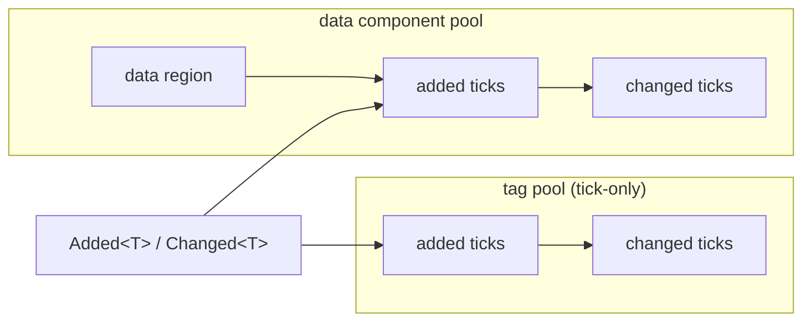

# Tags

> A tag is a zero-sized component: it carries no data, only the fact of its own presence.

*(Branch: `ecs`, Phase 22.)*

## What a tag is

In an archetype ECS, "which components an entity has" is itself information.
A tag exploits that: it is a component with **zero bytes of data**, so attaching
it changes only the entity's archetype — its signature bit — and nothing else.
Typical tags: `Player`, `Enemy`, `Frozen`, `Dead`, `Selected`.

Tags enable **existence-based processing**: instead of every system loading a
`bool is_frozen` field and branching per row, a frozen entity simply lives in a
different archetype, and systems that query `Without<Frozen>` never see it at
all. The branch disappears from the hot loop; the filter is resolved once per
archetype, not once per entity.

## Defining a tag

Any zero-sized `#[derive(Component)]` type is a tag — there is no attribute,
no registration step, no special trait:

```rust,ignore
use boyko_macros::Component;

#[derive(Component)]
struct Player;

#[derive(Component)]
struct Frozen;
```

Tag-ness is detected from `size_of::<T>() == 0` at component registration.
This is deliberate: a ZST has no data, so there is no behavioral choice an
attribute could express. The flip side is symmetric — add a field to a tag and
it silently becomes an ordinary data component, which is exactly what should
happen.

## Spawning and attaching

`#[derive(Component)]` also emits a **single-component `Bundle`** for the type,
so a bare tag is spawnable directly:

```rust,ignore
use boyko_ecs::prelude::*;

fn setup(mut commands: Commands) {
    // A tag is a valid one-component bundle.
    commands.spawn(Player);

    // Tags ride along ordinary spawn/insert chains.
    commands
        .spawn(ShipBundle { pos: Position::ZERO, hp: Health::FULL })
        .insert(Player);
}

fn freeze(mut commands: Commands, target: Entity) {
    commands.entity(target).insert(Frozen);
}

fn thaw(mut commands: Commands, target: Entity) {
    commands.entity(target).remove::<Frozen>();
}
```

Two consequences of the Bundle emission worth knowing:

- A type cannot derive **both** `Component` and `Bundle` — that is now a
  duplicate-impl compile error. Opt out with `#[component(no_bundle)]` if you
  need it.
- The emitted impl requires `Send + Sync + Unpin`. A deliberately exotic
  component (`Rc` fields, `PhantomPinned`, …) gets a readable named
  const-assert error; `#[component(no_bundle)]` suppresses the emission and
  keeps the type usable as a plain component.

Bundles accept up to **16 components** (`MAX_BUNDLE_ARITY`, raised from 8 in
Phase 22 precisely because tags make wide bundles the norm).

## Querying tags

`With<T>` / `Without<T>` are the natural tag filters — they are archetype-level
(mask-only), so they cost nothing per row:

```rust,ignore
use boyko_ecs::prelude::*;
use boyko_ecs::ecs::core::iters::query::{With, Without};

fn move_players(mut q: Query<&mut Position, (With<Player>, Without<Frozen>)>) {
    for mut pos in &mut q {
        pos.x += 1.0;
    }
}
```

`&Tag`, `&mut Tag`, `Ref<Tag>` and `Mut<Tag>` are also **legal query data**
(Bevy parity). Reading a ZST materializes a valid reference from the pool's
dangling aligned base — sound because zero bytes are ever read — and a
`Mut<Tag>` write-through stamps the row's changed tick like any component:

```rust,ignore
fn read_tag_directly(world: &mut EcsMaster, e: Entity) {
    // Valid: Some(&Player) if `e` carries the tag.
    let _tag: Option<&Player> = world.get_component::<Player>(e);
}
```

## Change detection on tags

`Added<Tag>` and `Changed<Tag>` are **fully functional**:

```rust,ignore
use boyko_ecs::ecs::core::iters::query::Added;

fn greet_new_players(q: Query<&Name, Added<Player>>) {
    for name in &q {
        println!("welcome, {name}!");
    }
}
```

This works because a tag's storage is a **tick-only component pool**: the pool
has no data region, but it keeps the same per-row `added` / `changed` tick pair
as every data component. That uniformity is the point — the change-detection
filters, the `check_ticks` wraparound scan, and `Mut<Tag>` tick stamping all
work with zero special-case code.



### Why tags are not free (and why that is the right call)

Each tag costs **8 bytes per row**: two `u32` ticks. flecs proves 0 B/row is
possible with signature-only tags — Boyko consciously pays the 8 bytes,
because the 0-byte alternative makes `Added<Tag>` a **compile-but-lie**: the
filter would compile, run, and silently never match (the tick lookup resolves
to a null column and returns `false` forever). This project treats silent-lie
APIs as a worse bug class than a measured, documented cost. The 8 B/row buys:

- `Added<Tag>` / `Changed<Tag>` correct with zero filter-code changes;
- one storage code path (tag pools are ordinary pools);
- a non-null column pointer, keeping every presence check branch-free.

Query-side cost of a tag is **zero**: `With`/`Without` filtering happens at
archetype granularity, outside the row loop.

## Hooks and observers

All four lifecycle hooks (`on_add`, `on_insert`, `on_replace`, `on_remove`) and
all observers fire for tags exactly as for data components, at every structural
site — spawn, insert, remove, despawn, migration, and the deferred `Commands`
paths. The callback context carries `{ entity, component_id }`; no data pointer
existed in the ABI to go invalid.

```rust,ignore
#[derive(Component)]
#[component(on_add = on_player_added)]
struct Player;
```

One uniform rule worth noting: re-inserting a tag the entity already carries is
**replace semantics** — `on_replace` + `on_insert` fire and the changed tick is
stamped, exactly like overwriting a data component in place. `on_add` does not
fire.

## Tag-only and empty entities

Entities may hold **zero components** (Phase 22 D5). Removing the last
component does not despawn the entity — it migrates it into the *empty
archetype*, where it stays alive and addressable:

```rust,ignore
// Direct API.
let e = world.spawn_empty();

// Deferred.
fn setup(mut commands: Commands) {
    let e = commands.spawn_empty().id();
}
```

An empty (or tag-only) entity is invisible to every query that requires a
component — the empty signature matches only zero-required-component filters.
Components and tags can be inserted later through the ordinary insert funnel.

## Performance characteristics

| Operation | Cost | Notes |
|-----------|------|-------|
| Carry a tag | 8 B/row resident | two `u32` ticks; committed lazily |
| Query `With`/`Without` | zero per row | archetype-level mask test, cached |
| `Added<Tag>` / `Changed<Tag>` | same as data components | per-row tick compare, const-elided when unused |
| Spawn with a tag | +8 B tick write per row | streaming write; column copy is 0 bytes |
| Toggle a tag (insert/remove) | archetype migration | the whole row moves — see the churn ladder |

The last row is the one to design around: tags are **free to carry, not free
to toggle**. For the full cost model — archetype fragmentation, the
address-space profile, and when to prefer a data field — see
[Storage Trade-offs](../architecture/storage-tradeoffs.md).

## See also

- [Dynamic Tags](dynamic-tags.md) — runtime-minted, name-keyed tags without a Rust type
- [Storage Trade-offs: Tags, Churn, and Fragmentation](../architecture/storage-tradeoffs.md)
- [Change Detection](../change_detection.md)
- Source: [`component_pool.rs`](https://github.com/bluesteelll/boyko-engine/blob/ecs/crates/boyko_ecs/src/ecs/memory/component_pool.rs) (tick-only ZST pools), [`spawn_at_command.rs`](https://github.com/bluesteelll/boyko-engine/blob/ecs/crates/boyko_ecs/src/ecs/core/commands/spawn_at_command.rs)
