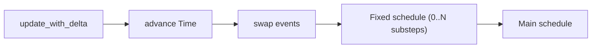

# Your First App

The `App` builder is the front door to boyko-engine: it owns the world, owns the
worker pool, registers your systems, and drives the per-frame loop. If you have
written Bevy before, the shape is familiar — `App::new()`, `add_plugins(...)`,
`add_systems(...)`, `run()` — and the differences are mostly about *when* things
happen and *what* the runtime costs.

This page builds the smallest program that actually does something: one
component, one spawned entity, and one system that queries and prints it.

## The two import lines (read this first)

boyko-engine splits its public surface across **two** crates, and you almost
always need both:

```rust,ignore
use boyko_ecs::prelude::*;        // App, Plugin, Commands, Query, Res, ... (the TRAITS and types)
use boyko_macros::{Component};    // the DERIVE MACROS (#[derive(Component)], etc.)
```

The trait `Component` (and `Resource`, `Bundle`, `SystemSet`, …) comes from the
prelude. The **derive macros of the same names do not** — `boyko_macros` is only
a dev-dependency of `boyko_ecs`, so the prelude cannot re-export them (see
[`prelude.rs`](https://github.com/bluesteelll/boyko-engine/blob/ecs/crates/boyko_ecs/src/prelude.rs#L6)).
Import the derives you use directly from `boyko_macros`:

```rust,ignore
use boyko_macros::{Component, Resource, Bundle, SystemSet};
```

Forgetting this is the single most common first-program error. If `#[derive(Component)]`
fails to resolve, you are missing the `boyko_macros` import.

## A minimal app

Here is a complete program. It defines a `Position` component, spawns one entity
in a startup system, and prints every position once per frame.

```rust,ignore
use boyko_ecs::prelude::*;
use boyko_macros::Component;

/// A plain data component. SoA-stored in a column; `#[repr(C)]` pins the layout.
#[derive(Component, Clone, Copy)]
#[repr(C)]
struct Position {
    x: f32,
    y: f32,
}

/// Runs ONCE before the frame loop: spawn one entity carrying a `Position`.
fn setup(mut commands: Commands) {
    commands.spawn(Position { x: 1.0, y: 2.0 });
}

/// Runs every frame: read every `Position` and print it.
fn print_positions(query: Query<&Position>) {
    for pos in query.iter() {
        println!("position = ({}, {})", pos.x, pos.y);
    }
}

fn main() {
    App::new()
        .add_startup_system(setup)
        .add_systems(print_positions)
        .run_n(3); // run exactly 3 frames, then return
}
```

What this does, step by step:

- **`App::new()`** constructs the app with a worker pool sized to the machine's
  available parallelism. (Use [`App::with_threads(n)`](https://github.com/bluesteelll/boyko-engine/blob/ecs/crates/boyko_ecs/src/ecs/core/app/app.rs#L189)
  for a fixed count, or `App::with_pool(pool)` to share one pool across apps.)
- **`add_startup_system(setup)`** registers a system that runs exactly once,
  before the first frame.
- **`add_systems(print_positions)`** registers a frame system into the **Main**
  schedule — it runs once per frame.
- **`run_n(3)`** finalizes the app and runs three frames. For a real game loop
  you would call [`run()`](#running-the-app) instead.

`Commands` and `Query` are *system parameters*: you declare them as plain
function arguments and the engine supplies them. `Commands` defers structural
changes (spawns, despawns, inserts) to a safe apply window; `Query<&Position>`
borrows the `Position` column read-only and iterates its rows. See
[Commands](../concepts/commands.md) and [Queries](../concepts/queries.md) for
the full story.

## Spawning with components

`commands.spawn(...)` takes a **bundle** — anything that contributes a set of
components to one entity. A single `#[derive(Component)]` type is itself a
one-component bundle, which is why `commands.spawn(Position { .. })` just works.
For several components at once, derive a `Bundle`:

```rust,ignore
use boyko_ecs::prelude::*;
use boyko_macros::{Bundle, Component};

#[derive(Component, Clone, Copy)]
#[repr(C)]
struct Position { x: f32, y: f32 }

#[derive(Component, Clone, Copy)]
#[repr(C)]
struct Velocity { x: f32, y: f32 }

/// A two-component bundle. Both land in the same archetype in one spawn.
#[derive(Bundle)]
struct Body {
    pos: Position,
    vel: Velocity,
}

fn setup(mut commands: Commands) {
    commands.spawn(Body {
        pos: Position { x: 0.0, y: 0.0 },
        vel: Velocity { x: 1.0, y: 0.0 },
    });
}
```

There is no bare-tuple bundle. The `Bundle` trait is **sealed**, so the only
implementors are a `#[derive(Bundle)]` type — a named struct *or* a tuple-struct
(`#[derive(Bundle)] struct Body(Position, Velocity)`) — plus the one-component
self-bundle that `#[derive(Component)]` emits for each component. A derived
`Bundle` gets a per-type cached archetype lookup, so it spawns the whole group
into one archetype in a single call; the alternative is to add the components one
at a time (`spawn` one, then `insert` the rest), which migrates the entity across
archetypes per insert. Prefer a derived bundle for hot spawn loops. See
[Bundles](../concepts/bundles.md) for the trade-off and
[Components](../concepts/components.md) for what makes a good component.

## Querying and mutating

A system reads and writes component columns through `Query<D, F>`, where `D` is
the data to fetch and `F` is an optional filter. `&T` is a read; `&mut T` is a
write; iterate reads with `.iter()` and writes with `.iter_mut()`:

```rust,ignore
use boyko_ecs::prelude::*;
# use boyko_macros::Component;
# #[derive(Component, Clone, Copy)] #[repr(C)] struct Position { x: f32, y: f32 }
# #[derive(Component, Clone, Copy)] #[repr(C)] struct Velocity { x: f32, y: f32 }

/// Integrate position by velocity, once per frame.
fn movement(mut query: Query<(&mut Position, &Velocity)>) {
    for (pos, vel) in query.iter_mut() {
        pos.x += vel.x;
        pos.y += vel.y;
    }
}
```

Register it the same way: `app.add_systems(movement)`. Each chunk of an
archetype is a contiguous slice, so the loop above is a tight SoA pass over L1d
— the cache locality is the point. [Queries](../concepts/queries.md) and
[Iteration](../concepts/iteration.md) cover filters (`With`, `Without`, `Added`,
`Changed`), `Option<&T>`, and parallel iteration.

## The frame loop: schedules

An `App` drives one or two **core schedules** per frame
([`CoreSchedule`](https://github.com/bluesteelll/boyko-engine/blob/ecs/crates/boyko_ecs/src/ecs/core/app/app.rs#L53)):



- **`Main`** runs exactly once per frame. `add_systems(...)` targets it by
  default; the system reads `Res<Time>` for its per-frame delta.
- **`Fixed`** runs zero or more times per frame under a fixed-timestep catch-up
  loop (64 Hz by default). Route a system to it with
  `add_systems_in(CoreSchedule::Fixed, my_system)`; it reads `Res<FixedTime>`.
  Put your physics and other rate-sensitive logic here.

The default schedule and timestep get you started. For ordering *within* a
schedule, system sets, and run conditions see the [Parallel Scheduler](../scheduler.md);
for the `Time` / `FixedTime` clocks and how a system reads its delta see
[Resources](../concepts/resources.md) and [Systems](../concepts/systems.md).

For full control of registration order you can drop down to the builder:

```rust,ignore
# use boyko_ecs::prelude::*;
# fn setup_sys() {}
# fn physics_sys() {}
# let mut app = App::new();
app.add_systems_cfg(|b| {
    let setup = b.add_system(setup_sys).key(); // SystemKey handle
    b.add_system(physics_sys).after(setup);    // explicit ordering edge
});
```

`add_system` returns a [`SystemConfig`](https://github.com/bluesteelll/boyko-engine/blob/ecs/crates/boyko_ecs/src/ecs/core/schedule/system_config.rs#L41)
handle. Call `.key()` to grab its [`SystemKey`](https://github.com/bluesteelll/boyko-engine/blob/ecs/crates/boyko_ecs/src/ecs/core/schedule/ordering.rs#L33),
then pass that key to a sibling's `.before(key)` / `.after(key)`. boyko keys
ordering edges by value rather than re-registering systems implicitly, so the
edge is unambiguous and the closure never adds a system twice.

## Running the app

There are three ways to drive the loop, picked by how you own the clock:

| Method | Behaviour | Use when |
|--------|-----------|----------|
| `run()` | Self-clocked; loops until a system sets `AppExit(true)`. | A standalone game loop. |
| `run_n(frames)` | Self-clocked; runs exactly `frames` frames, then returns. | Examples, smoke tests, headless runs. |
| `update()` | Runs exactly one frame, self-clocked. | An embedder (a windowing host, a renderer) that owns its own loop. |

For deterministic tests and benches there is `run_n_with_delta(frames, delta)` —
the same frame body with a fixed delta each time, so wall-clock jitter never
enters the measured loop.

`run()` watches the [`AppExit`](https://github.com/bluesteelll/boyko-engine/blob/ecs/crates/boyko_ecs/src/ecs/core/app/app_exit.rs#L20)
resource. A frame system requests shutdown by setting it:

```rust,ignore
use boyko_ecs::prelude::*;

/// Ask the runner to stop after this frame.
fn quit_when_done(mut exit: ResMut<AppExit>) {
    exit.0 = true;
}
```

`App::run()` inserts an `AppExit(false)` before the loop, so the read never
panics on a missing resource, and checks the flag once per frame *after* the
frame completes. (`run_n` and `update` do not read it — there is no exit branch
on those paths.)

## Plugins: composing setup

A real app does not register dozens of systems by hand in `main`. A
[`Plugin`](https://github.com/bluesteelll/boyko-engine/blob/ecs/crates/boyko_ecs/src/ecs/core/app/plugin.rs#L27)
bundles a coherent slice of setup — its systems, resources, and states — behind
one `build` call, and `add_plugins` composes them:

```rust,ignore
use boyko_ecs::prelude::*;
# use boyko_macros::Component;
# #[derive(Component, Clone, Copy)] #[repr(C)] struct Position { x: f32, y: f32 }
# fn setup(_c: Commands) {}
# fn movement() {}

/// A plugin is just a unit of `App` configuration.
struct MovementPlugin;

impl Plugin for MovementPlugin {
    fn build(&self, app: &mut App) {
        app.add_startup_system(setup)
            .add_systems(movement);
    }
}

fn main() {
    App::new()
        .add_plugins(MovementPlugin) // a single plugin ...
        // .add_plugins((MovementPlugin, RenderPlugin, InputPlugin)) // ... or a tuple of up to 12
        .run_n(3);
}
```

Two differences from Bevy worth knowing up front:

- **The only supertrait is `'static`.** There is no `Send + Sync` bound, because
  a boyko `Plugin` is **consumed when it is added**: `add_plugin` calls
  `build(&mut app)` immediately and drops the value. The `App` never retains the
  instance, so a plugin may capture `!Send` setup data.
- **`add_plugins` takes a single plugin *or* a tuple of up to 12.** Tuples nest,
  so you can group sub-plugins. Adding the same plugin type twice panics loudly
  (it is virtually always a double-registration bug), rather than silently
  skipping.

The config-vs-run phase split — every `add_*` call mutates the staged builder,
and [`App::finish`](https://github.com/bluesteelll/boyko-engine/blob/ecs/crates/boyko_ecs/src/ecs/core/app/app.rs#L543)
freezes it into the immutable [`Schedule`](../scheduler.md) the runner drives —
is the same boundary a `Plugin::build` writes into.

## What you have learned

You can now build a runnable app: define a component, spawn an entity in a
startup system, query it in a frame system, and drive the loop with `run` /
`run_n` / `update`. From here:

- [Components](../concepts/components.md) — what data belongs in a component, and
  the hot/cold split.
- [Systems](../concepts/systems.md) — the full set of system parameters
  (`Commands`, `Query`, `Res`/`ResMut`, `Local`, events).
- [Queries](../concepts/queries.md) and [Iteration](../concepts/iteration.md) —
  filters, optional data, and parallel passes.
- [Parallel Scheduler](../scheduler.md) — ordering, sets, run conditions, and
  how `add_systems_cfg` builds the frame graph.
- [Resources](../concepts/resources.md) — the `Time` / `FixedTime` clocks and
  other shared state.

## Source

- App builder + runners: [`app.rs`](https://github.com/bluesteelll/boyko-engine/blob/ecs/crates/boyko_ecs/src/ecs/core/app/app.rs#L113)
- Plugin trait: [`plugin.rs`](https://github.com/bluesteelll/boyko-engine/blob/ecs/crates/boyko_ecs/src/ecs/core/app/plugin.rs#L27)
- Variadic `add_plugins`: [`plugins.rs`](https://github.com/bluesteelll/boyko-engine/blob/ecs/crates/boyko_ecs/src/ecs/core/app/plugins.rs#L141)
- The exact prelude surface: [`prelude.rs`](https://github.com/bluesteelll/boyko-engine/blob/ecs/crates/boyko_ecs/src/prelude.rs#L1)
