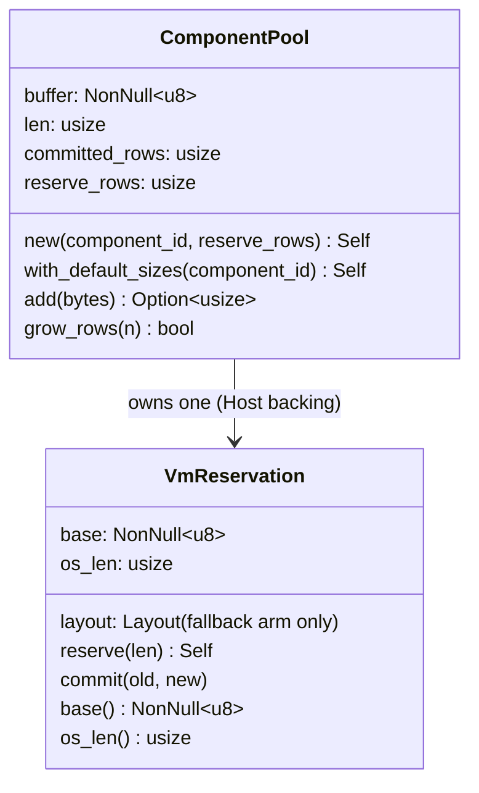

# Per-Pool Virtual Memory

> Boyko Engine has **no shared allocator**. Each component column owns its own virtual-memory reservation, committed lazily at the growth frontier. Zero system-allocator calls during gameplay.

## Overview

There is no central memory pool. The historical shared `Arena` (a best-fit, free-block allocator) was **retired in Phase X.J** — both `arena.rs` and `free_mem_block.rs` were deleted once every storage owner gained its own reservation. The module doc in [memory/vm.rs:5-8](https://github.com/bluesteelll/boyko-engine/blob/ecs/crates/boyko_ecs/src/ecs/memory/vm.rs#L5-L8) records the retirement.

The memory model today is **reserve-then-commit**, per owner:

- Each [`ComponentPool`](https://github.com/bluesteelll/boyko-engine/blob/ecs/crates/boyko_ecs/src/ecs/memory/component_pool.rs#L147) — one dense column of one component type — owns a private `VmReservation`.
- The entity-metadata table (`InlandStore`) owns one too.
- Every reservation reserves a large slice of **address space** up front (1 GiB by default on 64-bit OS arms), but commits **nothing**. Physical pages are committed lazily, one geometric slab at a time, at the row frontier.

This design keeps the wins the old arena had, without a free-block tracker:

- **No `malloc` in hot paths** — appending a row is pointer arithmetic into already-committed memory; the only syscall is a rare `#[cold]` slab commit.
- **Addresses never move** — a reservation's base is write-once, so no realloc-memcpy spikes and no pointer invalidation. Hot-path pointers stay valid for the owner's lifetime.
- **Predictable latency** — there is no fragmentation, no carve-and-coalesce, no best-fit search. Growth is O(1) in live rows.
- **Demand-zero** — freshly committed pages read as zero on first access (the engine relies on this for the tick columns).

## Layout

The bare OS primitive is `VmReservation` — a dumb `(base, os_len)` wrapper. All policy (commit watermark, slab sizing, row count) lives in the owner.



`VmReservation` is `pub(crate)` — it is an internal primitive, not a public API surface. The `layout` field exists only on the fallback arm (Miri / wasm32 / non-syscall targets); the syscall arms carry just `base` + `os_len`. See [memory/vm.rs:85-97](https://github.com/bluesteelll/boyko-engine/blob/ecs/crates/boyko_ecs/src/ecs/memory/vm.rs#L85-L97).

Within a pool's reservation, the bytes are laid out as four sub-regions:

```text
[ pad | data | added_ticks | changed_ticks ]
```

- `pad` — a per-pool, cache-line-multiple stagger so element `i` of different columns lands in different L1/L2 cache sets (the P2-CACHE-FIX; avoids a conflict-miss storm in wide SoA loops).
- `data` — the dense component rows, SIMD-aligned (`SIMD_BUFFER_ALIGN = 32`).
- `added_ticks` / `changed_ticks` — the per-row change-detection columns ([Change Detection](../change_detection.md)).

See [component_pool.rs:301-328](https://github.com/bluesteelll/boyko-engine/blob/ecs/crates/boyko_ecs/src/ecs/memory/component_pool.rs#L301-L328).

## Algorithms

### `VmReservation::reserve(len)`

Reserves `len` bytes of address space, rounded up to a 64 KiB commit granule (`COMMIT_GRANULE`). On the syscall arms it commits **nothing** — `VirtualAlloc(MEM_RESERVE, PAGE_NOACCESS)` on Windows, `mmap(PROT_NONE)` on Unix. On the fallback arm it eagerly `alloc_zeroed`s the whole reservation (commit then becomes a no-op).

Reservation failure is unrecoverable misconfiguration: there is no fallible carve API. It panics loudly.

```rust
// Internal primitive (pub(crate)) — shown for illustration, not callable from user code.
let vm = VmReservation::reserve(64 * 1024 * 1024); // address space only on syscall arms
let _base = vm.base();                              // write-once, stable for the lifetime
```

**Complexity**: O(1) — one reservation syscall.
**Rounding**: up to `COMMIT_GRANULE` (64 KiB), *not* a 64-byte cache line. See [vm.rs:109-180](https://github.com/bluesteelll/boyko-engine/blob/ecs/crates/boyko_ecs/src/ecs/memory/vm.rs#L109-L180) and [constants.rs:7](https://github.com/bluesteelll/boyko-engine/blob/ecs/crates/boyko_ecs/src/ecs/constants.rs#L7).

### `VmReservation::commit(old, new)`

Makes the byte range `[old, new)` readable/writable and zero-filled (`VirtualAlloc(MEM_COMMIT)` / `mprotect(PROT_READ|PROT_WRITE)`). It is `#[cold]` — only reached on growth — and requires granule-aligned, in-bounds ranges with `new > old` (all debug-asserted); committing strictly forward of the previous frontier is a caller contract, not an assert. It never frees; the model only ever commits forward. See [vm.rs:199-260](https://github.com/bluesteelll/boyko-engine/blob/ecs/crates/boyko_ecs/src/ecs/memory/vm.rs#L199-L260).

### `ComponentPool::grow_rows(n)`

The pool grows itself when an append would exceed the committed frontier. There is no best-fit search and no coalescing — growth is geometric slab doubling, clamped to `[POOL_MIN_SLAB, POOL_MAX_SLAB]` = **64 KiB … 64 MiB**, with the request always dominant:

```text
step = clamp(data_committed, 64 KiB, 64 MiB).max(needed - data_committed)
```

The data sub-region and **both** tick sub-regions commit in lockstep. The pool's base never moves, so previously handed-out pointers stay valid.

```rust
// What actually happens on append (illustrative; grow_rows is pub(crate)):
// if self.len >= self.committed_rows && !self.grow_rows(self.len + 1) {
//     return None; // reserve ceiling exhausted
// }
```

**Complexity**: O(1) in live rows — one (rare) commit syscall, zero bytes copied.
**Branching**: the warm path is a single `len >= committed_rows` compare; the commit is `#[cold]`.

See [component_pool.rs:494-585](https://github.com/bluesteelll/boyko-engine/blob/ecs/crates/boyko_ecs/src/ecs/memory/component_pool.rs#L494-L585), the doubling policy [`pool_commit_step`](https://github.com/bluesteelll/boyko-engine/blob/ecs/crates/boyko_ecs/src/ecs/constants.rs#L312), and the slab bounds [constants.rs:90-97](https://github.com/bluesteelll/boyko-engine/blob/ecs/crates/boyko_ecs/src/ecs/constants.rs#L90-L97).

```mermaid
sequenceDiagram
    participant U as Caller
    participant P as ComponentPool
    participant V as VmReservation
    U->>P: add(component_bytes)
    alt len >= committed_rows
        P->>P: grow_rows(len + 1)  [#cold]
        P->>V: commit(data_off, old, new)   (slab doubling)
        P->>V: commit(added_off, old, new)
        P->>V: commit(changed_off, old, new)
        V-->>P: pages now RW + zeroed
    end
    P->>P: copy bytes into row[len]; len += 1
    P-->>U: Some(row_index)
```

## Construction

`ComponentPool` and its constructors are public, but **users do not build pools directly**. A pool requires its component to be registered in the `ComponentRegistry` first, and that wiring is done by the engine: you spawn entities through `EcsMaster` / the `App` facade, and the engine creates and grows the right pools for you.

```rust
use boyko_ecs::prelude::*;

#[derive(Component)]
struct Position { x: f32, y: f32, z: f32 }

// User-facing: the engine owns the pools and grows them on demand.
let mut world = EcsMaster::new();
// world.spawn(...) / Commands::spawn(...) allocate rows in the right pools.
```

For the curious, the internal constructors are:

- `ComponentPool::new(component_id, reserve_rows)` — explicit row ceiling, exactly as given ([component_pool.rs:249](https://github.com/bluesteelll/boyko-engine/blob/ecs/crates/boyko_ecs/src/ecs/memory/component_pool.rs#L249)).
- `ComponentPool::with_default_sizes(component_id)` — byte-targeted, row-clamped ceiling: `clamp(POOL_TARGET_DATA_BYTES / stride, POOL_MIN_ROWS, POOL_MAX_ROWS)` ([component_pool.rs:429](https://github.com/bluesteelll/boyko-engine/blob/ecs/crates/boyko_ecs/src/ecs/memory/component_pool.rs#L429)).

On the 64-bit syscall arms the default reservation targets **1 GiB** of data address space per pool (`POOL_TARGET_DATA_BYTES`, [constants.rs:47](https://github.com/bluesteelll/boyko-engine/blob/ecs/crates/boyko_ecs/src/ecs/constants.rs#L47)) — virtual address space only, with no commit charge until rows are actually used.

## Concurrency

`VmReservation` is `!Send` and `!Sync` via its `NonNull` base. It uses **no** `UnsafeCell`: `commit` takes `&self` only so that a chunk-stable column can grow without an exclusive borrow, but exclusivity is supplied by the *owner*. For example, `EntityMaster` carries its own `unsafe impl Send` plus a documented "no mid-flight realloc" argument (the base never moves, so a worker can read committed rows while the owner holds the exclusive growth path).

The per-row tick columns inside a pool *do* use `UnsafeCell<Tick>` to permit shared-`&self` reads alongside the scheduler's per-`(archetype, component)` exclusive writes — but that is a change-detection concern, not the VM primitive. See [vm.rs:80-97](https://github.com/bluesteelll/boyko-engine/blob/ecs/crates/boyko_ecs/src/ecs/memory/vm.rs#L80-L97).

## Invariants

- A reservation's `base` is **write-once** — never reassigned, so every derived pointer stays valid for the reservation's lifetime.
- The data base is `SIMD_BUFFER_ALIGN`-aligned (32 B); component types aligned beyond a 4096-byte page are rejected loudly at construction.
- Commits are **monotonic** — the frontier only moves forward; memory is never freed per-row.
- Freshly committed bytes read as zero on first access (the zero-fill contract, relied on by the tick columns).
- The whole reservation **is** released on `Drop` (see below).

## Drop and release

Each `VmReservation` implements `Drop` and releases its **entire** reservation with the deallocator matching the acquisition arm: `VirtualFree(MEM_RELEASE)` on Windows, `munmap` on Unix, `dealloc` on the fallback arm. A `ComponentPool`'s `Host` backing owns the reservation, so the pool releases its memory when it is dropped (after running per-row `drop_fn`s on live rows). Memory *is* returned to the OS when the world tears down. See [vm.rs:263-298](https://github.com/bluesteelll/boyko-engine/blob/ecs/crates/boyko_ecs/src/ecs/memory/vm.rs#L263-L298).

## Performance characteristics

| Operation | Complexity | Notes |
|-----------|------------|-------|
| Append a row (`add`) | O(1) | One warm compare + a pointer copy; no allocation |
| Grow (`grow_rows`) | O(1) in live rows | `#[cold]` slab commit, zero bytes copied, bases never move |
| Reserve (`reserve`) | O(1) | One syscall at construction; address space only |
| Address row `i` | O(1) | `buffer + i * stride` (no per-row cache) |

Measured (vs Bevy, [PHASE-XI-RESULTS.md](https://github.com/bluesteelll/boyko-engine/blob/ecs/docs/PHASE-XI-RESULTS.md); see [FEATURE_MAP.md:619](https://github.com/bluesteelll/boyko-engine/blob/ecs/docs/FEATURE_MAP.md)):

- **1M-entity single-archetype ramp: ~2.24× faster** — geometric commits beat the realloc-doubling chain.
- **Worst per-batch growth spike: ~0.022×** — an address-stable commit replaces a realloc-memcpy of the whole column.

## Common pitfalls

- **There is no per-row free.** The model only commits forward; you cannot release a single allocation. Memory comes back only when the owning pool / store is dropped.
- **Don't size a pool too tightly.** `ComponentPool::new` takes the row ceiling *exactly* (no clamp); `add` returns `None` when that ceiling is exhausted. Prefer `with_default_sizes` unless you have a measured reason.
- **Reservation failure is fatal.** `reserve` panics on OS failure — there is no fallible carve variant. Treat it as misconfiguration, not a recoverable error.

## Source

- VM primitive: [crates/boyko_ecs/src/ecs/memory/vm.rs](https://github.com/bluesteelll/boyko-engine/blob/ecs/crates/boyko_ecs/src/ecs/memory/vm.rs)
- Component pool: [crates/boyko_ecs/src/ecs/memory/component_pool.rs](https://github.com/bluesteelll/boyko-engine/blob/ecs/crates/boyko_ecs/src/ecs/memory/component_pool.rs)
- Entity-metadata store: [crates/boyko_ecs/src/ecs/core/entity/inland_store.rs](https://github.com/bluesteelll/boyko-engine/blob/ecs/crates/boyko_ecs/src/ecs/core/entity/inland_store.rs)
- Sizing constants: [crates/boyko_ecs/src/ecs/constants.rs](https://github.com/bluesteelll/boyko-engine/blob/ecs/crates/boyko_ecs/src/ecs/constants.rs)
- Alignment helper `align_up(capacity, cache_line_size)`: [crates/boyko_ecs/src/ecs/memory/utils.rs](https://github.com/bluesteelll/boyko-engine/blob/ecs/crates/boyko_ecs/src/ecs/memory/utils.rs#L3)

## See also

- [Design Principles](../architecture/principles.md) — why minimum-allocation, address-stable storage exists.
- [Storage Trade-offs](../architecture/storage-tradeoffs.md) — how component columns are organized.
- [Change Detection](../change_detection.md) — the `added` / `changed` tick sub-regions.
