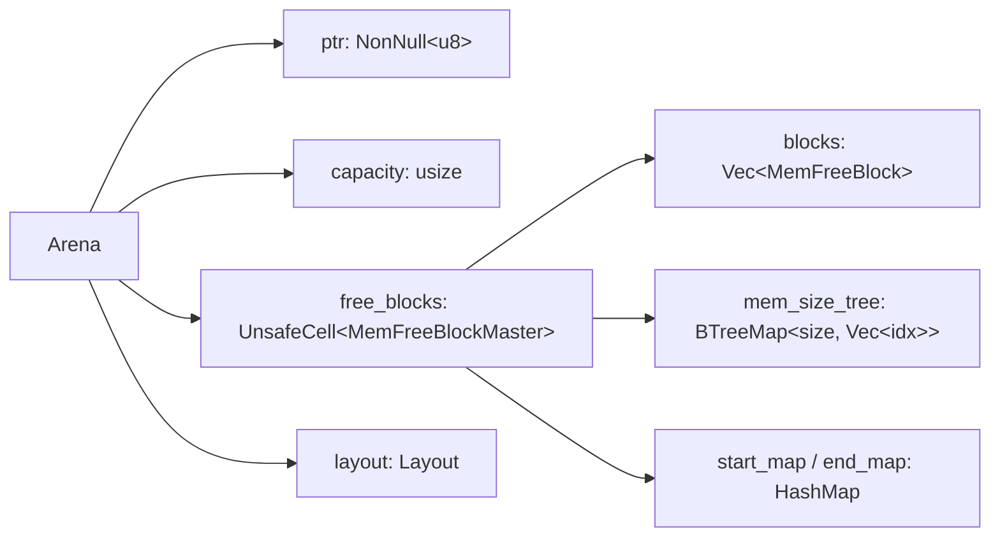
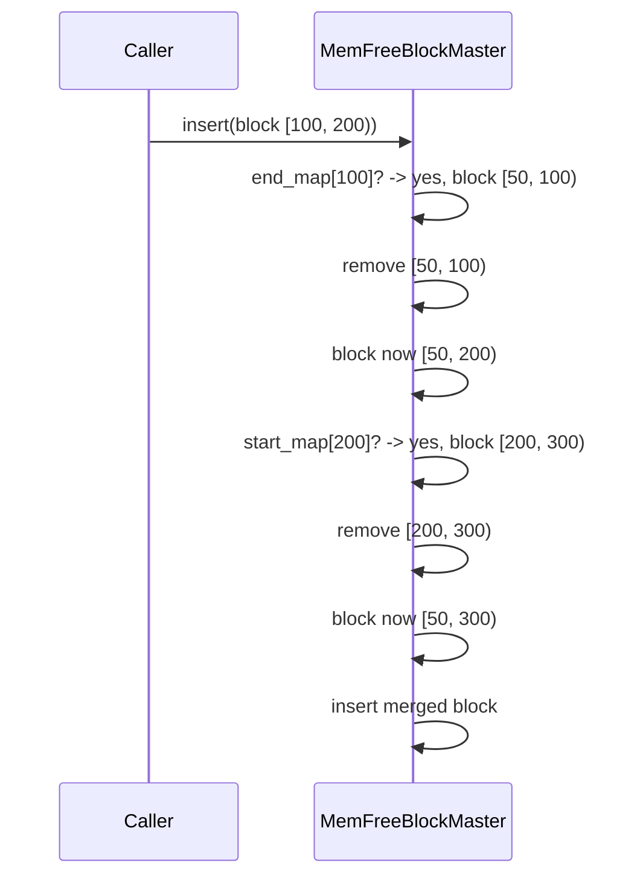

# Arena Allocator

> A pre-allocated, best-fit memory pool that serves all entity and component storage in Boyko Engine. Zero system allocator calls during gameplay.

## Overview

The `Arena` is the foundation of Boyko Engine's memory model. It allocates one large contiguous block (64 MB by default) at startup, then services all subsequent allocation requests from this block using a best-fit free-block tracker.

This design eliminates several classes of performance problems:

- **No `malloc` syscalls** in hot paths — the system allocator is invoked exactly once.
- **Predictable latency** — allocation cost is bounded and measurable.
- **No fragmentation surprises** — coalescing of adjacent free blocks happens automatically.
- **Cache-line alignment** — the arena is aligned to 64 bytes so every allocation can be cache-friendly.

## Layout



The arena owns a raw memory region (`ptr` + `capacity`) and a tracker (`free_blocks`) that knows which sub-regions are currently free. All allocation logic delegates to the tracker.

## Algorithms

### `allocate_layout(layout)`

Finds a free block large enough for `layout.size()` with the alignment required by `layout.align()`, then carves the request out of it.

```rust
pub fn allocate_layout(&self, layout: Layout) -> NonNull<u8> {
    match self.allocate_from_free_blocks(layout) {
        Some(ptr) => ptr,
        None => panic!("Arena out of memory: no suitable free blocks available")
    }
}
```

**Complexity**: O(log n) where n is the number of free blocks (BTreeMap range query).

**Cache behavior**: Three hash/tree lookups (free-block tracker), then a single pointer arithmetic — typically one cache miss in the steady state.

### Best-fit search

The tracker keeps a `BTreeMap<size, Vec<block_index>>`. To find a block of at least `min_size`:

```rust
mem_size_tree.range(min_size..).next()
```

This returns the smallest block satisfying the request — a textbook best-fit strategy.

### Coalescing

When a block is returned to the pool (`insert`), the tracker checks `end_map[block.start]` (left neighbor) and `start_map[block.end]` (right neighbor). Adjacent free blocks are merged into a single larger block, preventing fragmentation:



### Aligned allocation

For aligned requests, the tracker searches for a block of `size + align - 1` bytes, then aligns the start address and returns leftover space (both before and after) back to the pool:

```rust
let required_size = size + align - 1;
let block = find_best_fit(required_size)?;
let aligned_start = align_up(block.start, align);

// Return prefix gap to pool
if aligned_start > block.start {
    insert(MemFreeBlock::new(block.start, aligned_start));
}

// Return suffix gap to pool
if block.end > aligned_start + size {
    insert(MemFreeBlock::new(aligned_start + size, block.end));
}
```

## Construction

```rust
use boyko_ecs::ecs::memory::arena::Arena;

// Default 64 MB arena
let arena = Arena::new();

// Custom size, aligned to 64-byte cache lines
let arena = Arena::with_capacity(128 * 1024 * 1024);
```

The capacity is automatically rounded up to the nearest cache-line boundary via `align_up(capacity, CACHE_LINE_SIZE)`.

## Concurrency

The arena is **not thread-safe** for concurrent allocations. The internal tracker uses `UnsafeCell` for interior mutability, but no synchronization is performed.

Future multi-threaded designs will likely use one of:

- **Per-thread arenas** with merge points at synchronization barriers.
- **Lock-free free-block tracker** built on atomics.
- **Sharded arenas** by component type, isolated from each other.

Until then: assume single-writer, multi-reader.

## Invariants

- The pointer returned by `allocate_layout` is valid for the lifetime of the `Arena`.
- All returned pointers satisfy the alignment of the requested `Layout`.
- Memory is never freed individually — only the arena as a whole (currently never, since `Arena` has no `Drop` implementation).
- Free blocks are non-overlapping and non-adjacent (adjacency is removed by coalescing).

## Performance characteristics

| Operation | Target | Notes |
|-----------|--------|-------|
| `allocate_layout` (no fragmentation) | ≤ 50 ns | BTreeMap lookup + 2 HashMap ops |
| `allocate_layout` (heavy fragmentation) | ≤ 200 ns | More entries in BTreeMap to search |
| `insert` (no coalescing) | ≤ 80 ns | Insert into BTreeMap + 2 HashMaps |
| `insert` (with coalescing both sides) | ≤ 250 ns | 2 removes + 1 insert |
| `defragment` | O(n) in block count | One-time pass |

Numbers are targets, to be validated by `cargo bench`.

## Common pitfalls

- **Don't expect `Drop`** — the arena never releases its system memory back to the OS while the program runs. This is intentional for long-lived engine state, but you must size the arena correctly upfront.
- **Don't allocate temporaries from the arena** — there's no way to free a single allocation. Use the arena for engine-lived data only.
- **Watch for OOM panics** — `allocate_layout` panics on failure. Use `allocate_from_free_blocks` if you need a fallible variant.

## Source

- Arena: [crates/boyko_ecs/src/ecs/memory/arena.rs](https://github.com/bluesteelll/boyko-engine/blob/master/crates/boyko_ecs/src/ecs/memory/arena.rs)
- Free-block tracker: [crates/boyko_ecs/src/ecs/memory/free_mem_block.rs](https://github.com/bluesteelll/boyko-engine/blob/master/crates/boyko_ecs/src/ecs/memory/free_mem_block.rs)
- Alignment helper: [crates/boyko_ecs/src/ecs/memory/utils.rs](https://github.com/bluesteelll/boyko-engine/blob/master/crates/boyko_ecs/src/ecs/memory/utils.rs)

## See also

- [Design Principles](../architecture/principles.md) — why this allocator exists.
- API reference: [`Arena`](https://bluesteelll.github.io/boyko-engine/api/boyko_ecs/ecs/memory/arena/struct.Arena.html)
