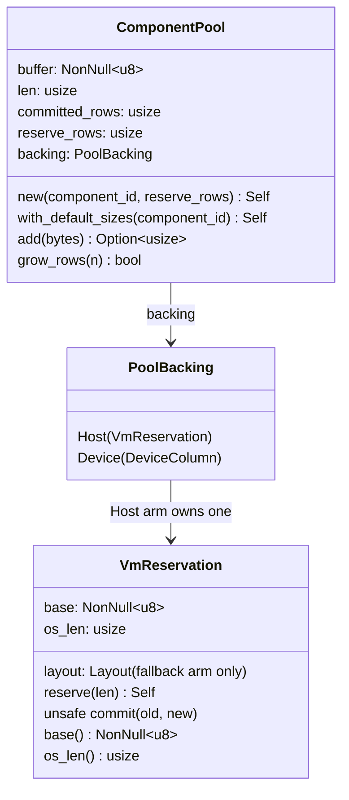
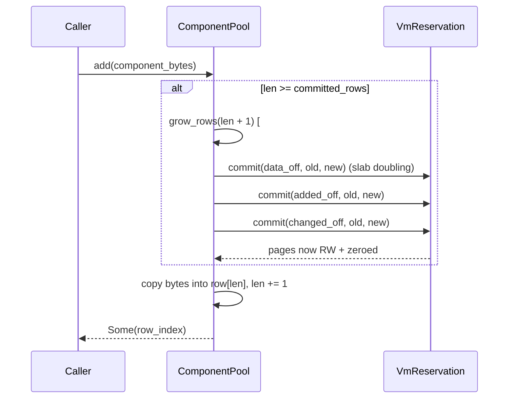

# Per-Pool Virtual Memory

> Boyko Engine has **no shared allocator**. Each component column owns its own virtual-memory reservation, committed lazily at the growth frontier. Zero system-allocator calls during gameplay.

## Overview

There is no central memory pool. The historical shared `Arena` (a best-fit, free-block allocator) was **retired** — both `arena.rs` and `free_mem_block.rs` were deleted once every storage owner gained its own reservation. The module doc in [boyko_memory/src/vm.rs](https://github.com/bluesteelll/boyko-engine/blob/master/crates/boyko_memory/src/vm.rs) records the retirement.

The memory primitives live in their own crate, [`boyko_memory`](https://github.com/bluesteelll/boyko-engine/tree/master/crates/boyko_memory), one layer below the ECS, so a crate below `boyko_ecs` can hold engine storage without depending on the ECS:

- [`VmReservation`](https://github.com/bluesteelll/boyko-engine/blob/master/crates/boyko_memory/src/vm.rs) — the single per-OS reserve / commit / release primitive every kernel store is built on.
- [`VmColumn<T>`](https://github.com/bluesteelll/boyko-engine/blob/master/crates/boyko_memory/src/vm_column.rs) — a typed, address-stable, growable column on one reservation (used, for example, by the entity reservoir's recycled-id stack and the asset tables' edited set).
- [`constants`](https://github.com/bluesteelll/boyko-engine/blob/master/crates/boyko_memory/src/constants.rs) — the commit granularity (`COMMIT_GRANULE`, `COMMIT_PAGE`) and the slab bounds of the commit ladders.
- The commit owners (`CommitOwner`) and the per-owner `committed_bytes` counters.

The memory model is **reserve-then-commit**, per owner:

- Each [`ComponentPool`](https://github.com/bluesteelll/boyko-engine/blob/master/crates/boyko_ecs/src/ecs/memory/component_pool.rs) — one dense column of one component type — owns a private reservation.
- The entity-metadata table (`InlandStore`) owns one too.
- Every reservation reserves a large slice of **address space** up front (1 GiB by default on 64-bit OS arms), but commits **nothing**. Physical pages are committed lazily, one geometric slab at a time, at the row frontier.

This design keeps the wins the old arena had, without a free-block tracker:

- **No `malloc` in hot paths** — appending a row is pointer arithmetic into already-committed memory; the only syscall is a rare `#[cold]` slab commit.
- **Addresses never move** — a reservation's base is write-once, so no realloc-memcpy spikes and no pointer invalidation. Hot-path pointers stay valid for the owner's lifetime.
- **Predictable latency** — there is no fragmentation, no carve-and-coalesce, no best-fit search. Growth is O(1) in live rows.
- **Demand-zero** — freshly committed pages read as zero on first access (the engine relies on this for the tick columns).

## Layout

The bare OS primitive is `VmReservation` — a dumb `(base, os_len)` wrapper. All policy (commit watermark, slab sizing, row count) lives in the owner.


```mermaid
classDiagram
    class VmReservation {
        base: NonNull~u8~
        os_len: usize
        layout: Layout (fallback arm only)
        reserve(len) Self
        unsafe commit(old, new)
        base() NonNull~u8~
        os_len() usize
    }
    class ComponentPool {
        buffer: NonNull~u8~
        len: usize
        committed_rows: usize
        reserve_rows: usize
        backing: PoolBacking
        new(component_id, reserve_rows) Self
        with_default_sizes(component_id) Self
        add(bytes) Option~usize~
        grow_rows(n) bool
    }
    class PoolBacking {
        Host(VmReservation)
        Device(DeviceColumn)
    }
    ComponentPool --> PoolBacking : backing
    PoolBacking --> VmReservation : Host arm owns one
```

`VmReservation` is `pub` in `boyko_memory` (`boyko_memory::vm::VmReservation`); `boyko_ecs` re-exports it only inside its own crate. The `layout` field exists only on the fallback arm (Miri / wasm32 / non-syscall targets); the syscall arms carry just `base` + `os_len`.

A pool's **backing** is either `Host` — its own `VmReservation`, the default — or `Device`, when `boyko_render` switches a GPU-resident component's pool to device memory. Only an empty pool may switch (the switch asserts `len == 0`), so no rows move, and a device-backed pool keeps no host rows. See [GPU-Resident Columns](../rendering/gpu-columns.md).

Within a host pool's reservation, the bytes are laid out as four sub-regions:

```text
[ pad | data | added_ticks | changed_ticks ]
```

- `pad` — a per-pool, cache-line-multiple stagger so element `i` of different columns lands in different L1/L2 cache sets (it avoids a conflict-miss storm in wide SoA loops).
- `data` — the dense component rows, SIMD-aligned (`SIMD_BUFFER_ALIGN = 32`).
- `added_ticks` / `changed_ticks` — the per-row change-detection columns ([Change Detection](../change_detection.md)).

See [`pool_byte_layout`](https://github.com/bluesteelll/boyko-engine/blob/master/crates/boyko_ecs/src/ecs/constants.rs).

## Algorithms

### `VmReservation::reserve(len)`

Reserves `len` bytes of address space, rounded up to a 64 KiB granule (`COMMIT_GRANULE`, the Windows reservation granularity). On the syscall arms it commits **nothing** — `VirtualAlloc(MEM_RESERVE, PAGE_NOACCESS)` on Windows, `mmap(PROT_NONE)` on Unix. On the fallback arm it eagerly `alloc_zeroed`s the whole reservation (commit then becomes a no-op).

Reservation failure is unrecoverable misconfiguration: there is no fallible carve API. It panics loudly.

```rust,ignore
use boyko_memory::vm::VmReservation;

let vm = VmReservation::reserve(64 * 1024 * 1024); // address space only on syscall arms
let _base = vm.base();                              // write-once, stable for the lifetime
```

**Complexity**: O(1) — one reservation syscall.
**Rounding**: the reservation length rounds up to `COMMIT_GRANULE` (64 KiB), *not* to a 64-byte cache line. See [vm.rs](https://github.com/bluesteelll/boyko-engine/blob/master/crates/boyko_memory/src/vm.rs) and [boyko_memory/src/constants.rs](https://github.com/bluesteelll/boyko-engine/blob/master/crates/boyko_memory/src/constants.rs).

### `VmReservation::commit(old, new)`

Makes the byte range `[old, new)` readable/writable and zero-filled (`VirtualAlloc(MEM_COMMIT)` / `mprotect(PROT_READ|PROT_WRITE)`). It is `#[cold]` and never inlined — only reached on growth.

- **It is an `unsafe fn`.** The caller must guarantee `old < new` and `new <= os_len()`; the syscall arms change the protection of memory at `base + old`, which is sound only inside the reservation. The range is checked with `debug_assert!` only, so each caller proves it at its own site.
- **Commits are page-aligned.** Ranges are multiples of `COMMIT_PAGE`: 4 KiB on `x86_64`, and the 64 KiB granule on every other architecture. Only the reservation itself is bound by the 64 KiB granularity; committing inside it is page-granular.
- **It never frees**; the model only ever commits forward.

Every commit is counted under a **commit owner** at one choke point inside `boyko_memory` (`commit_at::<O>`). `VmReservation::commit` is the route for the default owner, `ColumnOwner`, taken by every `ComponentPool`, `InlandStore` and the profiling store. `VmColumn<T, O>` calls `commit_at::<O>` directly; its default owner is also `ColumnOwner`, and a kernel table names its own owner (`VmColumn<T, TableOwner>`). `boyko_memory::committed_bytes::<O>()` reads the running total per owner. The counters only grow, and the extra cost is one relaxed add on the cold commit path. See [vm.rs](https://github.com/bluesteelll/boyko-engine/blob/master/crates/boyko_memory/src/vm.rs) and [owner.rs](https://github.com/bluesteelll/boyko-engine/blob/master/crates/boyko_memory/src/owner.rs).

### `ComponentPool::grow_rows(n)`

The pool grows itself when an append would exceed the committed frontier. There is no best-fit search and no coalescing — growth is geometric slab doubling, clamped to `[POOL_MIN_SLAB, POOL_MAX_SLAB]`, with the request always dominant:

```text
step = clamp(data_committed, POOL_MIN_SLAB, POOL_MAX_SLAB).max(needed - data_committed)
```

- `POOL_MIN_SLAB` is one `COMMIT_PAGE` — **4 KiB** on `x86_64` — so a sparse archetype commits a single page. For a 64-byte component the first rung is 64 rows.
- `POOL_MAX_SLAB` is **64 MiB**; it bounds how far a commit can overshoot the rows actually needed.
- Each sub-region's frontier is measured from its own absolute page floor, so every commit stays page-aligned even with the stagger in front of the data.

The data sub-region and **both** tick sub-regions commit in lockstep. The pool's base never moves, so previously handed-out pointers stay valid.

```rust,ignore
// What actually happens on append (illustrative; grow_rows is pub(crate)):
// if self.len >= self.committed_rows && !self.grow_rows(self.len + 1) {
//     return None; // reserve ceiling exhausted
// }
```

**Complexity**: O(1) in live rows — one (rare) commit syscall, zero bytes copied.
**Branching**: the warm path is a single `len >= committed_rows` compare; the commit is `#[cold]`.

See [component_pool.rs](https://github.com/bluesteelll/boyko-engine/blob/master/crates/boyko_ecs/src/ecs/memory/component_pool.rs), the doubling policy [`pool_commit_step`](https://github.com/bluesteelll/boyko-engine/blob/master/crates/boyko_ecs/src/ecs/constants.rs), and the slab bounds [boyko_memory/src/constants.rs](https://github.com/bluesteelll/boyko-engine/blob/master/crates/boyko_memory/src/constants.rs).


```mermaid
sequenceDiagram
    participant U as Caller
    participant P as ComponentPool
    participant V as VmReservation
    U->>P: add(component_bytes)
    alt len >= committed_rows
        P->>P: grow_rows(len + 1)  [#cold]
        P->>V: commit(data_off, old, new)   (slab doubling)
        P->>V: commit(added_off, old, new)
        P->>V: commit(changed_off, old, new)
        V-->>P: pages now RW + zeroed
    end
    P->>P: copy bytes into row[len], len += 1
    P-->>U: Some(row_index)
```

## Construction

`ComponentPool` and its constructors are public, but **users do not build pools directly**. A pool requires its component to be registered in the global component registry first, and that wiring is done by the engine: you spawn entities through `EcsMaster` / the `App` facade, and the engine creates and grows the right pools for you.

```rust,ignore
use boyko_ecs::prelude::*;
use boyko_macros::Component; // the derive is not in the prelude

#[derive(Component)]
struct Position { x: f32, y: f32, z: f32 }

// User-facing: the engine owns the pools and grows them on demand.
let mut world = EcsMaster::new();
// `world.spawn_one(...)` / `world.create_entity(...)` on the direct API, or
// `Commands::spawn(...)` inside a system, allocate rows in the right pools.
```

For the curious, the internal constructors are:

- `ComponentPool::new(component_id, reserve_rows)` — explicit row ceiling, exactly as given ([component_pool.rs](https://github.com/bluesteelll/boyko-engine/blob/master/crates/boyko_ecs/src/ecs/memory/component_pool.rs)).
- `ComponentPool::with_default_sizes(component_id)` — byte-targeted, row-clamped ceiling: `clamp(POOL_TARGET_DATA_BYTES / stride, POOL_MIN_ROWS, POOL_MAX_ROWS)` ([component_pool.rs](https://github.com/bluesteelll/boyko-engine/blob/master/crates/boyko_ecs/src/ecs/memory/component_pool.rs)).

On the 64-bit syscall arms the default reservation targets **1 GiB** of data address space per pool (`POOL_TARGET_DATA_BYTES`, [constants.rs](https://github.com/bluesteelll/boyko-engine/blob/master/crates/boyko_ecs/src/ecs/constants.rs)) — virtual address space only, with no commit charge until rows are actually used.

## Concurrency

`VmReservation` is `!Send` and `!Sync` via its `NonNull` base. It uses **no** `UnsafeCell`: `commit` takes `&self` only so that a column can grow without an exclusive borrow, but exclusivity is supplied by the *owner*. For example, `EntityMaster` carries its own `unsafe impl Send` plus a documented "no mid-flight realloc" argument (the base never moves, so a worker can read committed rows while the owner holds the exclusive growth path). `VmColumn` follows the same rule: every mutation takes `&mut self`, and owners that cross threads carry their own `unsafe impl Send/Sync` with the argument written beside it.

The per-row tick columns inside a pool *do* use `UnsafeCell<Tick>` to permit shared-`&self` reads alongside the scheduler's per-`(archetype, component)` exclusive writes — but that is a change-detection concern, not the VM primitive.

## Invariants

- A reservation's `base` is **write-once** — never reassigned, so every derived pointer stays valid for the reservation's lifetime.
- Reservation lengths are `COMMIT_GRANULE` multiples; commits are `COMMIT_PAGE` multiples inside them.
- The data base is `SIMD_BUFFER_ALIGN`-aligned (32 B); component types aligned beyond a 4096-byte page are rejected loudly at construction.
- Commits are **monotonic** — the frontier only moves forward; memory is never freed per-row.
- Freshly committed bytes read as zero on first access (the zero-fill contract, relied on by the tick columns).
- The whole reservation **is** released on `Drop` (see below).

## Drop and release

Each `VmReservation` implements `Drop` and releases its **entire** reservation with the deallocator matching the acquisition arm: `VirtualFree(MEM_RELEASE)` on Windows, `munmap` on Unix, `dealloc` on the fallback arm. A `ComponentPool`'s `Host` backing owns the reservation, so the pool releases its memory when it is dropped (after running per-row `drop_fn`s on live rows). Memory *is* returned to the OS when the world tears down. See [vm.rs](https://github.com/bluesteelll/boyko-engine/blob/master/crates/boyko_memory/src/vm.rs).

## Performance characteristics

| Operation | Complexity | Notes |
|-----------|------------|-------|
| Append a row (`add`) | O(1) | One warm compare + a pointer copy; no allocation |
| Grow (`grow_rows`) | O(1) in live rows | `#[cold]` slab commit, zero bytes copied, bases never move |
| Reserve (`reserve`) | O(1) | One syscall at construction; address space only |
| Address row `i` | O(1) | `buffer + i * stride` (no per-row cache) |

Measured comparisons with Bevy — the large single-archetype ramp and the worst per-batch growth spike, where an address-stable commit replaces a realloc-memcpy of the whole column — are published on the [Benchmarks](../reference/benchmarks.md) page.

## Common pitfalls

- **There is no per-row free.** The model only commits forward; you cannot release a single allocation. Memory comes back only when the owning pool / store is dropped.
- **Don't size a pool too tightly.** `ComponentPool::new` takes the row ceiling *exactly* (no clamp); `add` returns `None` when that ceiling is exhausted. Prefer `with_default_sizes` unless you have a measured reason.
- **Reservation failure is fatal.** `reserve` panics on OS failure — there is no fallible carve variant. Treat it as misconfiguration, not a recoverable error.
- **`commit` is `unsafe` for a reason.** If you build your own store on `VmReservation`, prove `old < new <= os_len()` at the call site, the way the kernel's callers do, and keep the range page-aligned (debug-asserted).

## Source

- VM primitive: [crates/boyko_memory/src/vm.rs](https://github.com/bluesteelll/boyko-engine/blob/master/crates/boyko_memory/src/vm.rs)
- Typed column: [crates/boyko_memory/src/vm_column.rs](https://github.com/bluesteelll/boyko-engine/blob/master/crates/boyko_memory/src/vm_column.rs)
- Commit owners: [crates/boyko_memory/src/owner.rs](https://github.com/bluesteelll/boyko-engine/blob/master/crates/boyko_memory/src/owner.rs)
- Component pool: [crates/boyko_ecs/src/ecs/memory/component_pool.rs](https://github.com/bluesteelll/boyko-engine/blob/master/crates/boyko_ecs/src/ecs/memory/component_pool.rs)
- Device column seam: [crates/boyko_ecs/src/ecs/memory/device_column.rs](https://github.com/bluesteelll/boyko-engine/blob/master/crates/boyko_ecs/src/ecs/memory/device_column.rs)
- Entity-metadata store: [crates/boyko_ecs/src/ecs/core/entity/inland_store.rs](https://github.com/bluesteelll/boyko-engine/blob/master/crates/boyko_ecs/src/ecs/core/entity/inland_store.rs)
- Sizing constants: [crates/boyko_memory/src/constants.rs](https://github.com/bluesteelll/boyko-engine/blob/master/crates/boyko_memory/src/constants.rs) (granule, page, slab bounds) and [crates/boyko_ecs/src/ecs/constants.rs](https://github.com/bluesteelll/boyko-engine/blob/master/crates/boyko_ecs/src/ecs/constants.rs) (pool policy)
- Alignment helper `align_up(capacity, cache_line_size)`: [crates/boyko_memory/src/utils.rs](https://github.com/bluesteelll/boyko-engine/blob/master/crates/boyko_memory/src/utils.rs)

## See also

- [Design Principles](../architecture/principles.md) — why minimum-allocation, address-stable storage exists.
- [Storage Trade-offs](../architecture/storage-tradeoffs.md) — how component columns are organized.
- [Entities & Generations](../architecture/entities-and-generations.md) — the `InlandStore` and the reservoir's `VmColumn` stack.
- [Change Detection](../change_detection.md) — the `added` / `changed` tick sub-regions.
