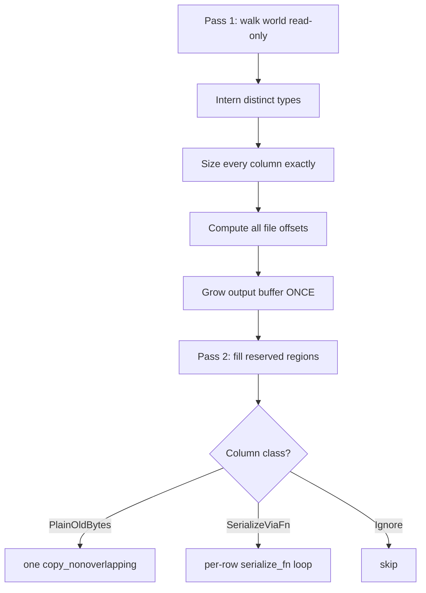

# Serialization

> `boyko_serialize` saves and loads a whole ECS world as a compact custom binary
> snapshot — driven by per-component **codegen** function pointers, with a
> column-blit fast path for plain-old-bytes components.

The `boyko_serialize` crate turns an [`EcsMaster`](../concepts/entities.md) into a
flat byte buffer and back. It is built for the same goal as the rest of the
engine: move bytes in bulk, decide nothing at runtime that can be decided at
compile time, and never trust the input on the way back in.

## Why codegen, not reflection

Most ECS frameworks serialize through a runtime **reflection** layer: a registry
of type descriptors that a generic walker interprets row by row. That is
flexible, but every field read goes through a dynamic dispatch and the hot path
never collapses to a `memcpy`.

boyko-engine takes the other road. Each component's `#[derive(Component)]`
expansion emits the serialization glue at compile time and installs it into a
per-`ComponentId` cold table inside `boyko_ecs`. The serializer reads three
function-pointer slots (`serialize_fn` / `deserialize_fn` / `map_entities_fn`)
and one classification enum, then picks a branch. There is no type-descriptor
interpreter and **no dependency on a reflection crate**.

The decisive payoff is the fast path. A component whose layout is *plain old
bytes* is written and read as **one whole-column `copy_nonoverlapping`** — the
entire SoA buffer for that component in one bulk copy, no per-row call at all.

## Three classifications

The derive classifies every component into one of three
[`Serializability`](https://github.com/bluesteelll/boyko-engine/blob/ecs/crates/boyko_ecs/src/ecs/core/component/component_registry.rs#L1989)
variants automatically — you do not write a registration call:

| Classification | When | How it is stored |
|----------------|------|------------------|
| `PlainOldBytes` | `#[repr(C)]`/`transparent`, `Copy`, every field all-bits-valid, no `Entity` field | whole-column blit (one `memcpy`) |
| `SerializeViaFn` | `Clone`, but owning (`String`/`Vec`/heap), bit-restricted (`bool`/`char`/niche), or entity-bearing | per-element encode/decode loop (enum/union encoding deferred — see caveat below) |
| `Ignore` | not `Clone`, or opted out with `#[component(no_serialize)]` | skipped on save; default-constructed (or excluded) on load |

The classification is resolved by an **autoref-specialization probe** in the
derive: the most specific arm that compiles wins, defaulting downward from
`PlainOldBytes` to `SerializeViaFn` to `Ignore`. You never specify it by hand.

> Caveat (S1.5 gap): the `SerializeViaFn` encode/decode glue is generated only
> for a **plain struct with at least one field** whose fields are all `Wire`
> (`String` / `Vec` / `bool` / `char` / niche-bearing structs). A **top-level
> `enum` or `union` component** classified `SerializeViaFn` currently emits
> neither a `serialize_fn` nor a `deserialize_fn`, so it round-trips as **zero
> bytes** — enum/union wire encoding is a deferred macro phase. A struct field
> that is an enum likewise demotes the whole component to `serialize_fn = None`
> until that phase lands.

### The `SerPod` marker

The blit fast path is gated on an `unsafe` marker trait,
[`SerPod`](https://github.com/bluesteelll/boyko-engine/blob/ecs/crates/boyko_ecs/src/ecs/core/component/component_registry.rs#L2366)
(*serialize-plain-old-data*). Implementing it asserts that **every** bit pattern
of the type's size is a valid value — so a column of it can be read back from
untrusted bytes without validation. The engine implements `SerPod` for the
language primitives that satisfy this (all integers, `f32`/`f64`, raw pointers)
and, crucially, for fixed arrays:

```rust,ignore
// From boyko_ecs (the array impl that keeps transforms on the blit path):
unsafe impl<T: SerPod, const N: usize> SerPod for [T; N] {}
```

A component is `PlainOldBytes` only when **all** its fields are `SerPod`. The
array impl matters in practice: without it, a component with an `[f32; 4]`
transform or vector field is silently demoted from the whole-column blit to the
per-row encode path — correct, but far slower.

> Note: `SerPod` is deliberately *narrower* than "is `Copy`". A `Copy` type with
> a `bool`, `char`, or niche-bearing field is **not** `SerPod`, because those
> bytes are not all-bits-valid on an untrusted load. Such a type falls to
> `SerializeViaFn`, whose decoder validates every restricted field on read. An
> `enum` field is the exception: it also forfeits `SerPod`, but enum encoding is
> not yet generated (see the caveat above), so a component carrying one currently
> demotes to `serialize_fn = None` rather than a working per-element decoder.

## Registering a component (there is no register call)

Deriving `Component` *is* the registration. The serialization metadata is
installed the first time the component's id is materialized — through the same
`component_id()` one-time initialization the ECS already runs. You do not call a
separate `register_serializable` function.

```rust,ignore
use boyko_macros::Component;

// PlainOldBytes: repr(C), Copy, all-bits-valid fields -> whole-column blit.
#[derive(Component, Clone, Copy)]
#[repr(C)]
struct Position {
    x: f32,
    y: f32,
    z: f32,
}

// SerializeViaFn: owns heap data -> per-element encode/decode loop.
#[derive(Component, Clone)]
struct Inventory {
    name: String,
    flags: Vec<u8>,
}

// Ignore: opted out explicitly; saver skips it, loader default-constructs.
#[derive(Component, Clone, Copy)]
#[repr(C)]
#[component(no_serialize)]
struct DebugScratch {
    frame_local: u32,
}
```

The only load-time contract is that every serializable component must have been
**touched at least once** (any prior spawn, or an explicit `C::component_id()`)
before `load_world`, so the loader can resolve the file's stable type names
against registered ids. A file type with no registered match is counted as
skipped, not an error.

### Component attributes

The `#[component(...)]` and `#[entities]` attributes tune serialization:

| Attribute | Effect |
|-----------|--------|
| `#[component(no_serialize)]` | classify `Ignore` — never written, default-constructed on load |
| `#[component(stable_name = "...")]` | override the on-disk type key (defaults to the fully-qualified type name) |
| `#[component(format_version = N)]` | the human-facing version gate (see below) |
| `#[entities]` on a field | opt that `Entity` field into the load-time remap pass |

The **stable name** is the on-disk identity of a type. A `ComponentId` is
process-unstable, so the file keys columns by a stable name (its hash) instead.
Renaming a type without `stable_name` changes its key and the loader will treat
old files as carrying an unknown type.

## A save / load round-trip

The public surface is four free functions plus an options/report pair. Save
borrows the world immutably; load takes it `&mut` and always materializes into
fresh archetypes.

```rust,ignore
use boyko_ecs::ecs::core::component::component::Component;
use boyko_ecs::ecs::core::ecs_master::ecs_master::EcsMaster;
use boyko_serialize::{
    LoadEntityPolicy, SaveOptions, load_world, save_world,
};

// --- Save the source world to a byte buffer ---
let mut src = EcsMaster::new();
let arch = src.get_or_create_archetype(&[
    Position::component_id(),
    Inventory::component_id(),
]);
// ... spawn entities into `src` ...

let mut bytes = Vec::new();
let written = save_world(&src, &SaveOptions::default(), &mut bytes)
    .expect("save");

// --- Load it into a fresh world ---
let mut dst = EcsMaster::new();
// Touch the same component types so the loader can resolve them by name:
Position::component_id();
Inventory::component_id();

let report = load_world(&mut dst, &bytes, LoadEntityPolicy::Remap)
    .expect("load");

assert_eq!(report.entities_loaded as usize, dst.entity_count());
// `report.columns_blitted` counts POB columns restored by one memcpy;
// `report.columns_decoded` counts SerializeViaFn columns.
```

`save_world` appends to your `Vec<u8>` and returns the byte count.
`save_world_to_file` / `load_world_from_file` are the file-path wrappers.
[`LoadReport`](https://github.com/bluesteelll/boyko-engine/blob/ecs/crates/boyko_serialize/src/load.rs#L80)
returns diagnostics: entities loaded, archetypes created, columns blitted vs
decoded, and how many file types were skipped.

### Save options

[`SaveOptions`](https://github.com/bluesteelll/boyko-engine/blob/ecs/crates/boyko_serialize/src/save.rs#L46)
is `Default` and carries:

- `include_filter: Option<fn(ComponentId) -> bool>` — when set, only components
  the predicate accepts are written; the rest are skipped.
- `persist_ticks: bool` — reserved for forward compatibility. The current loader
  always resets change-detection ticks, so this is recorded but not yet acted on.

## How the save runs (two passes)

The save is a **two-pass, single-allocation** writer:



Pass 1 walks the world read-only and computes the **exact** byte size of every
column and every file offset, growing the output buffer exactly once. Pass 2
fills the reserved regions: a `PlainOldBytes` column is blitted with a single
`copy_nonoverlapping`; a `SerializeViaFn` column runs its per-element encoder; an
`Ignore` column is skipped. No reallocation happens mid-fill. The save never
mutates the world.

The performance lever is the blit. On an array-heavy world, restoring the
`[T; N]` array fast path (so transform/vector columns blit whole instead of
encoding per row) measured roughly **8.7x faster save and 2.4x faster load**
versus the per-row fallback — a relative figure for that specific workload, not
an absolute throughput claim.

## Entity references survive a round-trip

Loaded entities receive **fresh** ids — the saved ids are not preserved (that is
the only shipped [`LoadEntityPolicy`](https://github.com/bluesteelll/boyko-engine/blob/ecs/crates/boyko_serialize/src/load.rs#L71):
`Remap`). A naive copy would therefore leave every stored `Entity` reference
pointing at a stale id. The loader fixes this with a dedicated remap pass.

After all archetypes load (with their `Entity` fields still holding the raw saved
ids), a separate whole-world pass rewrites each remappable reference to its
freshly-allocated `Entity` via the recorded saved→fresh map:

- [`ChildOf`](../concepts/hierarchies.md) and the relationship machinery are
  remapped automatically — saved hierarchies reconnect correctly.
- A user `Entity` field is remapped **only** when annotated `#[entities]`. This is
  an explicit opt-in: a plain `Entity` field stays the raw saved id.
- An unmapped saved id is a loud `LoadError`
  (`Decode(UnmappedEntity)`) — never a silent dangling reference.

```rust,ignore
use boyko_ecs::ecs::core::entity::entity::Entity;
use boyko_macros::Component;

#[derive(Component, Clone, Copy)]
#[repr(C)]
struct Targeted {
    n: u32,
    #[entities]      // remapped to the fresh Entity on load
    target: Entity,
}
```

## Versioning

Each serializable component carries a per-component `format_version`
(`#[component(format_version = N)]`, default `0`) plus a derive-computed
**layout fingerprint** — a best-effort hash of size, alignment, repr, and field
offsets.

On load, a `PlainOldBytes` column is only blitted when both the fingerprint and
the `format_version` match the running build. A blittable column whose
`format_version` differs is a hard
[`LoadError::VersionMismatch`](https://github.com/bluesteelll/boyko-engine/blob/ecs/crates/boyko_serialize/src/error.rs#L113) —
never a silent blit of stale bytes, even when the fingerprint still matches (a
same-shape semantic reinterpretation). The `format_version` is the deliberate
human signal that a component's bytes changed meaning; bump it whenever you
change how a component's bytes are interpreted.

`SerializeViaFn` components are re-decoded across a version bump (their decoder
rebuilds the value from the wire structure), so a structural wire change is
caught by the decoder or the fingerprint.

## Untrusted bytes never cause UB

The loader treats its input as **hostile**. This is not a nicety — it is the
crate's central safety contract:

- Every offset, count, and region length is bounds-checked against the input
  slice before use.
- A `PlainOldBytes` column's layout fingerprint is verified before any blit; a
  mismatch with no decoder is a hard error.
- Each per-element decoder validates every bit-restricted field as it reads.
- A forged, oversized count cannot force a giant up-front allocation — the loader
  caps each capacity hint against the bytes that could possibly back it.
- A type id that resolves to an enable-tag (bitset) column in a foreign file is
  skipped rather than fed to a pool that does not exist.

The hardening is enforced by a soundness fuzz: feeding `load_world` **any**
mutation of a valid snapshot must produce only `Ok(report)` or
`Err(LoadError)` — never a panic, an abort, or undefined behavior. On any error
the destination world is left **consistent**: a partially-loaded archetype is
rolled back to empty before the error returns. The fuzz, the round-trip suite,
and the remap suite all run under Miri-TB.

The error surfaces are split by side:
[`SaveError`](https://github.com/bluesteelll/boyko-engine/blob/ecs/crates/boyko_serialize/src/error.rs#L24)
is small (offset overflow, file I/O — save reads an already-valid world), while
[`LoadError`](https://github.com/bluesteelll/boyko-engine/blob/ecs/crates/boyko_serialize/src/error.rs#L74)
is rich (bad magic, unsupported version, endianness or pointer-width mismatch,
truncation, fingerprint mismatch, version mismatch, decode rejection, capacity
overflow).

## Shipped vs deferred

What is shipped today:

- Two-pass save with the `PlainOldBytes` whole-column blit fast path.
- `SerializeViaFn` encode/decode for owning, bit-restricted, and entity-bearing
  **plain-struct** components (every field `Wire`).
- `CopyIntoWorld` + `Remap` load (fresh ids).
- `ChildOf` / `#[entities]` entity remapping.
- Per-component `format_version` + layout-fingerprint version gating.
- Fuzz-hardened, Miri-clean untrusted-input handling.
- Dense (non-fragmenting) **plain-old-bytes** stores round-trip.

Deferred (recorded, not yet available — do not rely on them):

- **`PreserveIds`** load policy — keeping saved entity ids. Only `Remap` ships.
- **`MmapInPlace`** — memory-mapped zero-copy load.
- **Parallel** save/load and a byte-swapping endianness path. v1 is
  native-endian, 64-bit only.
- **Owning dense stores** — a dense column of a `SerializeViaFn` type is
  preserved on disk but skipped on load (counted in the report) until the
  per-member dense decode path lands.
- **`enum` / `union` wire encoding** — a top-level `enum`/`union` component
  classified `SerializeViaFn` (and any component with an enum field) currently
  encodes zero bytes; the encoder is a later macro phase.
- `persist_ticks` — the option exists but the loader still resets ticks.

## See also

- [Components](../concepts/components.md) — what `#[derive(Component)]` and its
  attributes generate.
- [Hierarchies](../concepts/hierarchies.md) — `ChildOf` / `Children`, whose
  references the remap pass restores.
- Source:
  [`boyko_serialize`](https://github.com/bluesteelll/boyko-engine/blob/ecs/crates/boyko_serialize/src/lib.rs) ·
  [`save.rs`](https://github.com/bluesteelll/boyko-engine/blob/ecs/crates/boyko_serialize/src/save.rs#L153) ·
  [`load.rs`](https://github.com/bluesteelll/boyko-engine/blob/ecs/crates/boyko_serialize/src/load.rs#L196)
