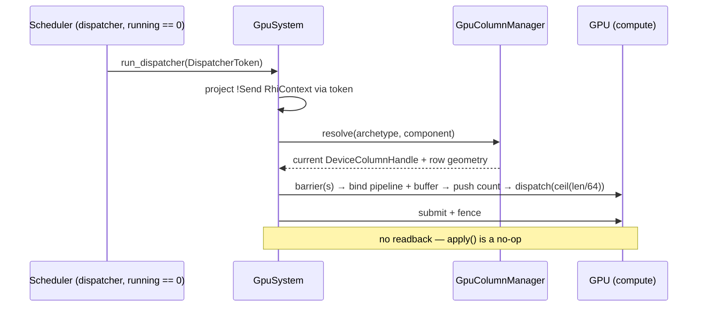
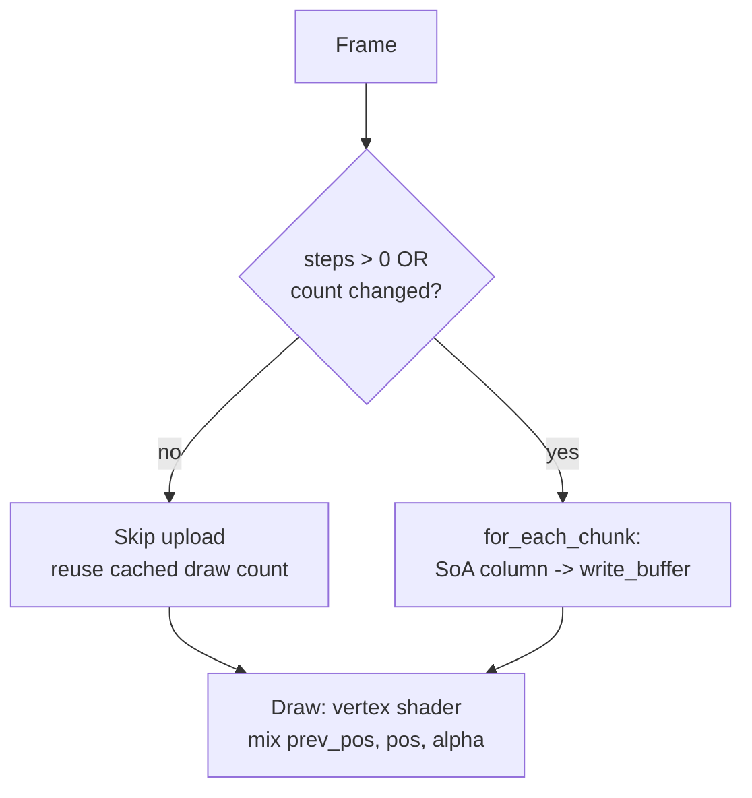

# GPU-Resident Columns

A **GPU-resident column** is an ECS component column whose rows live in VRAM
instead of host memory. The CPU keeps only an opaque handle and the device-side
row counters; the bytes themselves sit in a `DeviceLocal` storage buffer on the
GPU. A dedicated system then dispatches a compute shader **over that column in
place** — the GPU mutates the data where it already is, and **nothing is read
back per frame**.

This is the storage side of boyko-engine's CPU-orchestrate / GPU-execute model:
the CPU decides *what* should run and *on which column*, the GPU does the work,
and the result never makes a round trip across the PCIe bus. It is the same
principle as the rest of the kernel — durable per-entity data lives in the ECS's
own storage, not in a side buffer — extended so that "the ECS's own storage" can
itself be a device buffer.

This page covers two related but distinct mechanisms:

1. **Device-backed columns + `GpuSystem`** — the kernel feature: a component
   column promoted to VRAM, dispatched over by a compute shader with zero
   readback. Built on the in-house [RHI](rhi.md) (raw-FFI Vulkan, no FFI in the
   seam that `boyko_ecs` sees).
2. **The zero-copy upload path** — `for_each_chunk` streaming a contiguous SoA
   column straight into a GPU buffer, plus the 24-byte `GpuInstance` with
   GPU-side interpolation. This is how a *host*-side column reaches the GPU each
   frame without an intermediate AoS copy.

For the surrounding pipeline see the [rendering overview](overview.md).

## Why not copy CPU → GPU every frame

The naive way to render or simulate ECS data on the GPU is to walk the component
columns on the CPU, pack them into a staging array, and upload that array every
frame. That pays three costs the engine refuses:

- **Bus traffic.** Every byte crosses PCIe each frame, even bytes that did not
  change.
- **A redundant copy.** Packing into a staging array is an AoS gather over data
  that is *already* a contiguous SoA column.
- **A round trip when the GPU also writes.** If a compute pass mutates the data,
  reading it back to the CPU to keep an authoritative copy stalls the pipeline.

A GPU-resident column removes all three. The data is *born* in VRAM, the compute
pass mutates it in place, and the CPU never reads it back — its effects "live
entirely in VRAM". The zero-copy upload path (below) removes the redundant copy
for the cases where the authoritative data still lives on the host.

## Device-backed columns

### The handle indirection

`boyko_ecs` is GPU-capable but **graphics-pure**: the kernel names no Vulkan or
RHI type. A device-resident column is referenced only through an opaque
[`DeviceColumnHandle`](https://github.com/bluesteelll/boyko-engine/blob/ecs/crates/boyko_ecs/src/ecs/memory/device_column.rs#L27),
a `#[repr(transparent)]` wrapper over a bare `u64`:

```rust,ignore
#[repr(transparent)]
#[derive(Clone, Copy, PartialEq, Eq, Debug)]
pub struct DeviceColumnHandle(pub u64);
```

Because it is a plain integer with no provenance, a `ComponentPool` carrying one
stays trivially `Send + Sync`, and the handle is Miri-safe. The kernel never
interprets or dereferences it; it is a token a graphics crate packs meaning into.

The render side ([`boyko_render`](https://github.com/bluesteelll/boyko-engine/blob/ecs/crates/boyko_render/src/gpu_column.rs))
packs a generational registry slot into that `u64` via the RHI's `slot_to_u64`
bridge. The crucial property: the durable identity of a column is **not** the
handle — it is the `(ArchetypeId, ComponentId)` pair. A grow reallocates the
device buffer and mints a *new* handle; the old `u64` resolves loudly to `None`
because the registry bumps the freed slot's generation. No CPU code ever caches
a device row pointer, so a realloc can never leave a dangling reference.

### Promoting a column to VRAM

`GpuColumnManager::create_column` allocates a `DeviceLocal` (VRAM) `STORAGE`
buffer through the RHI, records its geometry in a side table keyed by
`(archetype, component)`, and flips the CPU pool to device-backing through the
`Archetype::make_component_device_backed` seam — which also *nulls* the pool's
host column cache so the now-dangling host base is CPU-unreachable.

A column may only be promoted if its component is statically classified
`ResidencyKind::Gpu`; flipping a CPU component would leave a CPU-reachable
dangling column, so the manager asserts the class even in release builds (it is a
setup-time check, off the hot path).

```rust,ignore
// boyko_render: GpuColumnManager::create_column (setup path, abbreviated)
let buffer = device.create_buffer(&BufferDesc {
    size: stride as u64 * cap_rows as u64,
    usage: BufferUsage::STORAGE,
    location: MemoryLocation::DeviceLocal, // VRAM
})?;
let handle = DeviceColumnHandle(slot_to_u64(self.registry.register_buffer(buffer).0));
// Flip the CPU pool to device-backing and null its host column cache.
arch.make_component_device_backed(component, handle);
```

### `GpuSystem` — dispatch with zero readback

A device-backed column is mutated by
[`GpuSystem`](https://github.com/bluesteelll/boyko-engine/blob/ecs/crates/boyko_render/src/gpu_system.rs#L134),
a **hand-written** `boyko_ecs` `System` that records and submits a compute
dispatch over the column. It is hand-written for a reason: routing the `!Send`
RHI context through the ordinary `NonSendResMut` system parameter would force the
system to declare *universal* access and run CPU-exclusive — the opposite of what
a GPU system wants. Instead `GpuSystem`:

- declares **empty** component/resource access — it touches no CPU column, so it
  adds no edges to the scheduler's conflict graph;
- is registered as `SystemKind::GpuCompute`, so the scheduler runs it **solo on
  the dispatcher thread** inside the apply window (when no worker is live);
- reaches the `!Send` RHI context only through a `DispatcherToken`, which the
  scheduler mints solely on that dispatcher-solo path. A worker never sees one,
  which is what makes single-threaded touch of the non-`Send` Vulkan context
  sound.

Each frame the system resolves its target column **indirectly** by
`(ArchetypeId, ComponentId)` (so a grow that rotated the handle is transparent),
then records the dispatch:



The dispatch binds the device buffer as storage binding 0, pushes the live row
count as a push constant, and dispatches `ceil(row_count / 64)` workgroups (the
compute shader is `[numthreads(64,1,1)]` with an `if (i >= count) return;` tail
guard). After submit, `GpuSystem::apply` is a no-op: there is nothing to flush
back into the world because the effect already lives in VRAM. That is the
zero-readback guarantee made concrete.

> **What is shipped vs. demonstration.** The device-column allocate / grow /
> resolve machinery, the `(archetype, component)` indirection, the
> `DispatcherToken` capability, and the dispatch path are real and tested. The
> compute shader currently wired through this path,
> [`gpu_integrate.comp.spv`](https://github.com/bluesteelll/boyko-engine/blob/ecs/crates/boyko_render/src/gpu_system.rs#L64),
> is a **demonstration kernel** (`Data[i] = Data[i] + 100`) that proves the seam
> end to end. The mechanism is the deliverable; production compute systems plug
> their own SPIR-V into the same `GpuSystem` shape. Deferred-wait overlap (a
> non-blocking submit instead of submit+fence per dispatch) is noted in the
> source as a future refinement.

## The zero-copy upload path

Not every column needs to be device-resident. When the host stays authoritative
— for example positions written by a CPU physics step — the data still has to
reach the GPU each frame, and the engine does that **without an intermediate AoS
copy**.

The kernel's chunked iteration (see [iteration](../concepts/iteration.md)) hands
a system one *contiguous column slice per archetype chunk*. For a component that
is also a POD GPU record, that slice is byte-identical to a packed GPU instance
array — so it can be reinterpreted and uploaded directly, with no per-row gather:

```rust,ignore
// Stream every GpuInstance column slice straight into the GPU buffer.
// for_each_chunk yields one contiguous &[GpuInstance] per archetype chunk;
// each is reinterpreted as bytes and written at the running offset.
let mut byte_offset: u64 = 0;
world
    .query::<&GpuInstance, ()>()
    .for_each_chunk(|chunk: &[GpuInstance]| {
        let bytes: &[u8] = bytemuck::cast_slice(chunk); // SoA column -> bytes, no copy of rows
        queue.write_buffer(buffer, byte_offset, bytes);
        byte_offset += bytes.len() as u64;
    });
```

The component is the GPU layout. There is no separate "render data" struct to
gather into — the column *is* the instance array.

### `GpuInstance`: a 24-byte interpolated record

[`GpuInstance`](https://github.com/bluesteelll/boyko-engine/blob/ecs/crates/boyko_demo/src/render/instance.rs#L45)
is both a boyko `Component` and a `#[repr(C)]` POD record matching the vertex
shader's instance attributes. It is 24 bytes with no padding (asserted at compile
time):

```rust,ignore
use boyko_macros::Component;
use bytemuck::{Pod, Zeroable};

#[repr(C)]
#[derive(Component, Clone, Copy, Debug, Pod, Zeroable)]
pub struct GpuInstance {
    pub pos: [f32; 2],      // quad center after the LAST substep   -> @location(2)
    pub scale: f32,         // half-extent                          -> @location(3)
    pub color: u32,         // packed RGBA8                         -> @location(4)
    pub prev_pos: [f32; 2], // quad center after the 2nd-to-last substep -> @location(5)
}
```

The `Component` derive is a pure marker — it assigns a `ComponentId` and adds no
fields — so the type stays `Pod` and the column stays a valid contiguous GPU
instance array. That is exactly what makes the `for_each_chunk` upload above a
straight reinterpret.

### GPU-side interpolation: `mix(prev_pos, pos, alpha)`

The trailing `prev_pos` exists so a fixed-step simulation can render at display
rate **with zero CPU-side lerp work**. The simulation advances at a fixed rate
(e.g. 64 Hz); the renderer may draw more often. Rather than the CPU computing an
interpolated position per entity each frame, every instance carries its last two
substep positions and the **vertex shader** blends them by a per-frame `alpha`:

```wgsl
// shader.wgsl (vertex), abbreviated
let world = in.corner * in.inst_scale
          + mix(in.inst_prev_pos, in.inst_pos, camera.alpha);
```

`alpha` is uploaded once per frame in the camera uniform; the blend itself is a
free vector lerp on hardware that is already running the vertex stage. Spawning
seeds `prev_pos = pos` so a freshly created instance renders pinned at its spawn
point under any alpha. Exactly one site shuffles `prev_pos` per substep, which
keeps the two lerp endpoints honest.

### Substep-gated uploads

Because the GPU already holds the last substep's positions and interpolates on
its own, the instance column only needs re-uploading when the simulation
*actually advanced* — or when the population changed. The upload gate is a single
predicate:

```rust,ignore
// Re-upload only if this frame ran at least one substep, or the
// entity count changed since the last upload.
fn upload_due(steps: u32, entity_count: u64, last_uploaded_count: u64) -> bool {
    steps > 0 || entity_count != last_uploaded_count
}
```

On a frame that expends zero substeps, the upload is skipped entirely: the GPU
buffer still holds the last substep's data, and the shader keeps interpolating it
at the new `alpha`. The draw count is reused from the last fired upload. This is
correct *because* interpolation is GPU-side — the host has nothing new to say
until the next substep. In practice it cuts upload events substantially on
render-heavy / sim-light frames.



> **Where this runs.** The interpolated `GpuInstance` + substep-gated upload path
> ships in the [`boyko_demo`](https://github.com/bluesteelll/boyko-engine/blob/ecs/crates/boyko_demo/src/render/instance.rs)
> sandbox (which targets wgpu for portability, including a wasm build). It
> demonstrates the *pattern* — component-as-GPU-layout, zero AoS gather, GPU-side
> interpolation, gated uploads — on top of the engine's chunked iteration. The
> device-resident column + `GpuSystem` path above is the in-house-RHI mechanism
> for keeping data on the GPU across frames.

## Comparison: the two paths

| | Device-backed column + `GpuSystem` | Zero-copy upload + `GpuInstance` |
|---|---|---|
| Authoritative copy lives | in VRAM | on the host (uploaded per change) |
| Backend | in-house RHI (raw-FFI Vulkan) | wgpu (demo) over engine iteration |
| Per-frame readback | none | none |
| Per-frame upload | none (data stays resident) | only when a substep ran / count changed |
| AoS gather | none — GPU mutates in place | none — column reinterpreted as bytes |
| Mutates data | GPU compute, in place | CPU writes column; GPU only reads + interpolates |

## See also

- [Rendering overview](overview.md) — where these fit in the frame
- [RHI](rhi.md) — the in-house raw-FFI Vulkan layer the device columns build on
- [Iteration](../concepts/iteration.md) — `for_each_chunk` and contiguous column slices
- [Components](../concepts/components.md) — the column model these extend
- Source: [`gpu_column.rs`](https://github.com/bluesteelll/boyko-engine/blob/ecs/crates/boyko_render/src/gpu_column.rs),
  [`gpu_system.rs`](https://github.com/bluesteelll/boyko-engine/blob/ecs/crates/boyko_render/src/gpu_system.rs),
  [`device_column.rs`](https://github.com/bluesteelll/boyko-engine/blob/ecs/crates/boyko_ecs/src/ecs/memory/device_column.rs),
  [`instance.rs`](https://github.com/bluesteelll/boyko-engine/blob/ecs/crates/boyko_demo/src/render/instance.rs)
