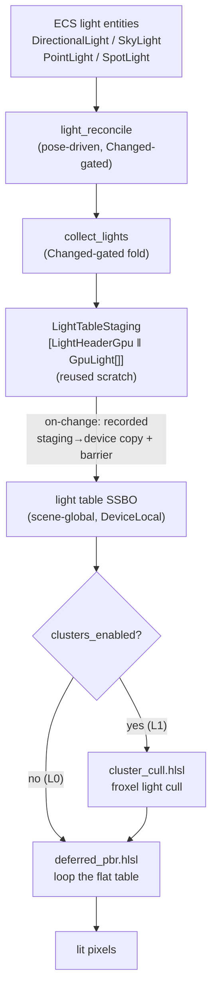
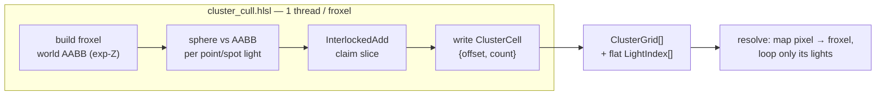

# Lighting

> Lights are ordinary ECS components. A `Changed`-gated system folds them into one
> contiguous GPU light table; the deferred resolve reads that table — optionally through
> a clustered froxel cull — to shade every SDF surface pixel. No parallel light store, no
> per-frame readback.

The engine's lighting follows the same rule as every other subsystem (see
[Principles](../architecture/principles.md)): the *authoritative* data lives in the ECS
itself. A `DirectionalLight`, `PointLight`, `SpotLight` or `SkyLight` is a plain
`#[derive(Component)]` POD on a normal entity. There is **no** `Vec<Light>` or
`HashMap` side store. The GPU light table is a *derived upload* — a projection of the
live light components, rebuilt only when something changes.

This page describes what is **shipped today**: the four light types, the GPU light table,
clustered (froxel) light culling, SDF-native shadow/AO, and the `LightEnabled` O(1) on/off
gate. Baked global illumination (irradiance probe volumes, DDGI) is **planned and
deferred** — see [Status and roadmap](#status-and-roadmap) at the end. Read
[Rendering overview](overview.md) first for how lighting sits in the render pipeline, and
[GPU columns](gpu-columns.md) for the CPU-orchestrate / GPU-execute upload mechanism this
builds on.

## Why this design

Three forces shape the lighting layer:

- **One engine, no side store.** Lights are entities and components. A `collect_lights`
  system reads them with normal queries and folds them into a staging buffer. The ECS is
  the SDK; the GPU table is downstream of it.
- **Zero cost when static.** `collect_lights` is `Changed`-gated. A scene whose lights do
  not move or change does zero collection work and uploads nothing — the recorder records
  no copy on an idle frame.
- **CPU orchestrates, GPU executes, no readback.** The CPU writes the light table into a
  staging buffer and records a staging→device copy plus a barrier. The clustered cull and
  the per-pixel resolve run entirely on the GPU. Nothing is read back to the CPU per frame.

## The four light types

All four are `#[repr(C)]` PODs defined in
[`light.rs`](https://github.com/bluesteelll/boyko-engine/blob/ecs/crates/boyko_render/src/light.rs).
Radiometric values are **LINEAR**.

| Type | Role | Carries | Resolve rung |
|------|------|---------|--------------|
| `DirectionalLight` | The sun: an infinitely-distant parallel beam | `direction`, `color`, `illuminance` (lux) | L0a (no surface position needed) |
| `SkyLight` | Hemisphere ambient — an environment term, no position/direction | `sky_color`, `ground_color` | L0a |
| `PointLight` | Omnidirectional source at a position | `position`, `color`, `power` (Φ lumens), `range` | L0b (needs surface position) |
| `SpotLight` | Point source restricted to a cone | `position`, `direction`, `color`, `power`, `range`, `inner_deg`, `outer_deg` | L0b |

`DirectionalLight`, `PointLight` and `SpotLight` carry `#[require(Transform,
GlobalTransform)]` (see [Required components](../concepts/components.md)) — a positioned or
oriented light always has a pose. `SkyLight` carries no such requirement: it is a pure
environment term.

### Spawning a light

The simplest path is the light component itself; `#[require]` auto-inserts the pose pair.
For a placed, editor-friendly light, the crate ships three preset bundles —
`DirectionalLightObject`, `PointLightObject`, `SpotLightObject` — that pair the
`boyko_scene` pose components with the light.

```rust,ignore
use boyko_ecs::prelude::*;
use boyko_render::light::{DirectionalLight, PointLight, SpotLight, SkyLight};
use boyko_render::bundles::PointLightObject;
use boyko_scene::{Transform, GlobalTransform};
use boyko_math::Vec3;

// A sun: direction TO the light, LINEAR color, illuminance in lux.
// `DirectionalLight::new` normalizes the direction host-side.
world.spawn(DirectionalLight::new([0.3, 1.0, 0.4], [1.0, 0.98, 0.92], 100_000.0));

// Hemisphere ambient — no pose, no `new`-side validation beyond the constructor.
world.spawn(SkyLight::new([0.1, 0.12, 0.18], [0.04, 0.03, 0.02]));

// A point light placed via the preset bundle. `power` is luminous power Φ (lumens),
// `range` is the cull-sphere radius where attenuation reaches ~0.
world.spawn(PointLightObject {
    transform: Transform::from_translation(Vec3::new(2.0, 3.0, 0.0)),
    global: GlobalTransform::default(),
    light: PointLight::new([2.0, 3.0, 0.0], [1.0, 0.6, 0.3], 800.0, 12.0),
});

// A spot light: position, axis, color, power, range, inner/outer cone half-angles (deg).
// `SpotLight::new` normalizes the axis and clamps cos(outer) to keep intensity bounded.
world.spawn(SpotLight::new(
    [0.0, 5.0, 0.0], [0.0, -1.0, 0.0], [1.0, 1.0, 1.0],
    1200.0, 15.0, 20.0, 30.0,
));
```

> Traits such as `Query`/`World` come from `boyko_ecs::prelude::*`; the derive macros
> (`Component`, `Bundle`, `Resource`) come from `boyko_macros`. Light constructors do the
> physical bookkeeping for you: `PointLight` bakes intensity `I = Φ / 4π`, `SpotLight`
> bakes the reflector model `I = Φ / (2π·(1 − cos(outer)))` and packs the cone cosines.

### Pose reconciliation

If a light has a `GlobalTransform`, `light_reconcile` derives its world `position` /
`direction` from that transform each frame, so a parented or animated light tracks its
pose. The write is doubly gated: by `Changed<GlobalTransform>` on the query, and by a
bit-exact per-lane compare — a static light writes nothing and re-triggers no rebuild.
A light without a `GlobalTransform` keeps its self-contained pose. Wiring lives in
[`light_reconcile.rs`](https://github.com/bluesteelll/boyko-engine/blob/ecs/crates/boyko_render/src/light_reconcile.rs).

## The GPU light table

`collect_lights` folds the live light components into one contiguous byte buffer:
`[LightHeaderGpu || GpuLight[]]`. Both POD layouts are `#[repr(C, align(16))]` with clean
16-byte `vec4` lanes — no greedy scalar packing — so the std430 mapping the shaders read is
unambiguous. Const-assert fingerprints pin size, alignment and every field offset, making a
host/shader desync a **build error** rather than silent GPU corruption.

| POD | Size | Contents |
|-----|------|----------|
| `LightHeaderGpu` | 64 B (one cache line, 4×`vec4`) | light count, exposure, split counts, sky ambient, L1 cluster params |
| `GpuLight` | 48 B (3×`vec4`) | a tagged union over the four kinds (direction/position/color/cone + a `kind` tag) |

`GpuLight` is a **tagged union**: one element type holds all four kinds, with a `kind` tag
in `dir_kind.w` (bit-cast `u32`). The resolve dispatches branchlessly on the tag —
directional has no position, point carries position + radius, spot adds the packed cone.
One table means one SSBO, one upload, one cull pass, and a sequential (cache-friendly)
resolve read.

The table is laid out as a **no-`P` front block** (directionals, then sky) followed by the
**point/spot block**. The header stores both counts, so the resolve can loop the front
block (which needs no surface world position) separately from the point/spot block (which
does). This is the rung split below.

### Data flow



`collect_lights` writes into `LightTableStaging`, a single preallocated `Vec<u8>` sized
once for the worst case (`LIGHT_HEADER_BYTES + MAX_LIGHTS * GPU_LIGHT_BYTES`). It is refilled
in place — no per-frame allocation. The first seed uses the fence-waited setup upload; every
on-change re-upload is the fence-free recorded copy. `MAX_LIGHTS` is **1024**, so the entire
worst-case table is ~48 KiB (L2-resident).

### The change channel

`collect_lights`'s `Changed` gate cannot see two events on its own:

- an **O(1) `LightEnabled` toggle** bumps no `Changed` tick (it is a bitset bit flip), and
- a **removed or despawned light** advances no surviving row's tick.

Both are caught by a `LightTableDirty` resource. The enable/disable surface sets it, and an
`on_remove` hook (registered on all four light components) sets it on removal or despawn.
`collect_lights` rebuilds when *either* a `Changed` tick advanced *or* `LightTableDirty` is
set, then consumes the flag. See [Hooks and observers](../concepts/hooks-and-observers.md)
for the hook mechanism.

## Toggling a light: the `LightEnabled` gate

A light can be switched on and off at runtime **without archetype migration**.
`LightEnabled` is a fieldless [enable tag](../concepts/enable-tags.md) — a ZST tagged
`#[component(storage = "bitset")]` — so toggling it is the O(1) `enable` / `disable` bit
flip, not a structural change.

`collect_lights` reads the bit per row through the non-filtering `IsEnabled<LightEnabled>`
query datum: a disabled light is skipped from the table, an enabled one is folded.

```rust,ignore
use boyko_ecs::prelude::*;
use boyko_ecs::ecs::core::ecs_master::ecs_master::EcsMaster;
use boyko_ecs::ecs::core::entity::entity::Entity;
use boyko_render::light_system::{set_light_enabled_now, SetLightEnabledById};

// Immediate (exclusive &mut world) — flips the bit AND marks the table dirty in one call.
fn blackout(world: &mut EcsMaster, lamp: Entity) {
    set_light_enabled_now(world, lamp, false);
}

// Deferred, from inside a system — enqueue the command; it applies in the apply window.
// `lamp` is an Entity you already hold (e.g. resolved from a query or a resource).
fn flicker(mut commands: Commands, lamp: Entity) {
    commands.add(SetLightEnabledById { entity: lamp, enabled: true });
}
```

> **Why a non-filtering datum, not an `Enabled<>` filter.** A never-toggled bitset bit reads
> *disabled* by default. To keep lights spawned without ever touching `LightEnabled` visible,
> a seed pass enables the tag on every not-yet-seeded light. The table read therefore uses
> `IsEnabled<LightEnabled>` (which yields the bit per row) rather than an `Enabled<...>`
> *filter* (which would drop every never-tagged row). Marking the table dirty on a toggle is
> mandatory — the bit flip bumps no `Changed` tick, so without the mark `collect_lights`
> would never observe it.

Use `set_light_enabled_now` from setup/test code and the `LightSeedState` seed; use the
deferred `SetLightEnabledById` command from in-system gameplay.

## Plugin wiring

`LightingPlugin` registers the whole machine in one builder closure: the eviction hooks
(first, before any light component can be archetyped), the `LightTableDirty` resource, and
the `light_reconcile` → seed → `collect_lights` ordering edges.

```rust,ignore
use boyko_ecs::ecs::core::app::App;
use boyko_render::light_plugin::LightingPlugin;

// Add LightingPlugin alongside TransformPlugin / CameraPlugin (it reads the propagated
// GlobalTransform) and BEFORE any light-spawning plugin (the eviction hooks must register
// before a light component is first archetyped).
App::new()
    .add_plugins(LightingPlugin)
    .run();
```

The order in a steady frame is **propagate transforms → reconcile → seed → collect**. The
eviction hooks register only `on_remove` (four hooks): a full despawn fires `on_remove` per
component too, so one registration subsumes both component-remove and whole-entity-despawn.

## The deferred resolve and the rung split

Lighting is resolved in the deferred pass
([`deferred_pbr.hlsl`](https://github.com/bluesteelll/boyko-engine/blob/ecs/crates/boyko_rhi_vulkan/shaders/deferred_pbr.hlsl)),
a Cook-Torrance / GGX shader (D_GGX + height-correlated Smith visibility + Schlick Fresnel +
Lambert diffuse + a Karis analytic environment-BRDF for the sky term). It reads the light
table through the shared decode in
[`light_table.hlsli`](https://github.com/bluesteelll/boyko-engine/blob/ecs/crates/boyko_rhi_vulkan/shaders/light_table.hlsli).

The split exists because **directional and sky lights need no per-pixel surface position**,
while **point and spot lights do**:

- **L0a — directional + sky.** No surface world position required. The resolve loops the
  no-`P` front block `[0 .. l0a_count)`.
- **L0b — point + spot.** Needs the surface world position `P`. The SDF marcher exports the
  exact ray parameter `t` into a dedicated `R32_SFLOAT` G-buffer lane (`gViewT`); the resolve
  reconstructs `P = ray_origin + ray_dir · t` using the shared ray generator and applies
  inverse-square attenuation (and the spot cone falloff).
- **L1 — clustered cull.** A froxel grid restricts each pixel to only the lights in its
  cluster.

A single-default-light scene reproduces the engine's previous compiled-in directional
constant byte-for-byte (the 0%-gate): `LightingConfig::default()` carries `exposure = 1.0`
and the old `SKY_*` ambient constants, so a world that never inserts a custom config renders
the same image as before lights were data-driven.

## SDF-native shadow and ambient occlusion

Shadows and AO are computed **by the SDF marcher against the analytic field**, not by shadow
maps. The marcher writes per-pixel soft-shadow visibility into `gMaterial.r` and ambient
occlusion into `gMaterial.g` (the mask lives in `gMaterial.b`). The deferred resolve reads
those two channels and modulates each light's direct contribution by `NoL · shadow` and the
ambient term by AO. Because the marcher already traces the field, shadows and AO come from
the same field the geometry does — no second geometry representation, no shadow-map pass. See
[SDF rendering](sdf.md) for the field and marcher.

## Clustered (froxel) light culling — L1

Looping every light for every pixel is O(all lights). L1 replaces that with O(lights in the
pixel's cluster), typically a handful. The cull is implemented in
[`cluster_cull.hlsl`](https://github.com/bluesteelll/boyko-engine/blob/ecs/crates/boyko_rhi_vulkan/shaders/cluster_cull.hlsl)
as a single compute dispatch — one invocation per froxel.

The froxel grid is **16×9×24 = 3456** cells (`CLUSTER_DIM_X/Y/Z`), with **exponential-Z**
slices so the depth resolution concentrates near the camera, matching perspective depth
distribution: `view_z(k) = near · (far/near)^(k/dimZ)`. Each froxel thread:

1. **builds its world-space AABB** by unprojecting the froxel's screen-tile corners at the
   slice's near/far view-z (using the same shared ray-gen the resolve uses, so the AABB
   encloses exactly the world points the resolve reconstructs);
2. **culls** each point/spot light's bounding sphere (center = world position, radius =
   `range`) against the AABB via `sqDistPointAABB ≤ r²`. Directional and sky lights are
   *global* — the resolve always loops the front block, so they are not culled here;
3. **atomic-appends** the surviving light indices into a flat index list. One
   `InterlockedAdd` on a global counter claims a disjoint slice base — lock-free, no data
   race — and the thread writes its `{offset, count}` `ClusterCell`.



The resolve maps each pixel to its froxel — `(px, py)` to the tile `(x, y)`, the surface
view-z (from `gViewT`) to the exp-Z slice — reads the `{offset, count}`, and loops only those
indices. The cluster linearization `(y · dimX + x) · dimZ + z` has a single source of truth
(`cluster_index` host-side, mirrored in the shaders), so cull-write and resolve-read agree
exactly.

**Overflow is clamp-and-drop.** A froxel that reaches `MAX_LIGHTS_PER_CLUSTER` (256), or a
claim past the flat list capacity `INDEX_LIST_CAP` (16384 `u32`), drops the extra light. The
atomic bump is clamped — no UB, no overflow. The caps are documented limits, not silent
failure modes; debug builds assert against them.

L1 is **gated, off by default.** `LightingConfig::clusters_enabled` defaults to `false`,
which routes the resolve down the flat L0b loop. When clusters are off, the header is
byte-identical to the L0 header — the L1 0%-gate. The grid dimensions, caps and exp-Z
near/far come from a `ClusterConfig` resource; the defaults reproduce the constants above.

```rust,ignore
use boyko_macros::Resource;
use boyko_render::light::{LightingConfig, ClusterConfig};

// Enable clustered culling and set a manual exposure stop. Leaving these at their
// Default values keeps the L0 flat-table path (the 0%-gate).
fn lighting_config() -> LightingConfig {
    LightingConfig { clusters_enabled: true, exposure: 1.0, ..Default::default() }
}

// The froxel grid + exp-Z near/far. Defaults = 16×9×24, near 0.1, far 50.0.
fn cluster_config() -> ClusterConfig {
    ClusterConfig::default()
}
```

## Intensity, units and exposure

Lights are authored in physical units and the table bakes the radiometric intensity once,
host-side, in `GpuLight::from_*`:

- **Directional:** `color × illuminance` (lux) → premultiplied irradiance.
- **Point:** `I = Φ / 4π` (the point-source normalization).
- **Spot:** `I = Φ / (2π·(1 − cos(outer)))` (the reflector model — a narrower cone is
  brighter for the same lumens). `cos(outer)` is clamped to `SPOT_COS_OUTER_MAX` (0.9999) so
  a pencil beam stays finite.

A single global `exposure` scalar in `LightingConfig` (default `1.0`, identity) is the final
multiply on accumulated linear radiance. It makes physical units usable without a full
auto-exposure / tonemapping pipeline — those are out of scope for L0/L1.

## Performance characteristics

| Aspect | Behavior |
|--------|----------|
| Static scene | `collect_lights` returns immediately (`Changed`-gated); no fold, no upload, no recorded copy |
| On-change CPU cost | O(live lights) fold into a preallocated, reused staging buffer — no frame-path allocation |
| On-change upload | One recorded staging→device copy + a `TRANSFER_WRITE → SHADER_READ` barrier; fence-free (no stall) |
| Light toggle | O(1) bitset bit flip + a dirty mark; no archetype migration |
| L0 resolve | O(all lights) per pixel |
| L1 resolve | O(lights in the pixel's cluster), typically 1–8 |
| Cluster cull | 1 compute dispatch over 3456 froxels |
| Table size | ≤ `MAX_LIGHTS` (1024) × 48 B ≈ 48 KiB |
| 0%-gate | single-default-light == the previous compiled-in constant, byte-identical |

Targets and design rationale are documented in
[`LIGHTING-L0-L1-PLAN.md`](https://github.com/bluesteelll/boyko-engine/blob/ecs/docs/LIGHTING-L0-L1-PLAN.md).

## Status and roadmap

**Shipped:**

- **L0** — directional / sky / point / spot lights as ECS components; the derived GPU light
  table; the deferred Cook-Torrance resolve; SDF-native shadow and AO; the `LightEnabled`
  O(1) on/off gate.
- **L1** — clustered froxel light culling (the 3D exp-Z grid, the compute cull pass, the
  per-cluster resolve loop), gated by `clusters_enabled`.

**Planned / deferred** (designed in the lighting plan, **not** available today):

- **L2** — baked irradiance probe volumes (the owner's core "bake static/dynamic 3D maps"
  ask): a 3D probe grid bakes the frozen field + L0 lights into SH / ambient-cube coefficients
  that the resolve trilinear-samples to light dynamic objects from static bounce.
- **L3** — runtime DDGI updates over the same probe storage.
- **L4** — SDF-native GI capstones (cone-traced GI, radiance cascades, Brixelizer-class
  cascaded SDF, spatial-hash radiance caches).

The roadmap and the open design questions for L2+ live in
[`LIGHTING-PLAN.md`](https://github.com/bluesteelll/boyko-engine/blob/ecs/docs/LIGHTING-PLAN.md).

## See also

- [Rendering overview](overview.md) — where lighting sits in the deferred pipeline
- [GPU columns](gpu-columns.md) — the CPU-orchestrate / GPU-execute upload mechanism
- [SDF rendering](sdf.md) — the field and marcher that produce shadow/AO
- [Enable tags](../concepts/enable-tags.md) — the bitset backend behind `LightEnabled`
- [Hooks and observers](../concepts/hooks-and-observers.md) — the eviction hook mechanism
- [Required components](../concepts/components.md) — the `#[require(Transform, GlobalTransform)]` pose invariant
- Source: [`light.rs`](https://github.com/bluesteelll/boyko-engine/blob/ecs/crates/boyko_render/src/light.rs),
  [`light_system.rs`](https://github.com/bluesteelll/boyko-engine/blob/ecs/crates/boyko_render/src/light_system.rs),
  [`light_plugin.rs`](https://github.com/bluesteelll/boyko-engine/blob/ecs/crates/boyko_render/src/light_plugin.rs),
  [`cluster_cull.hlsl`](https://github.com/bluesteelll/boyko-engine/blob/ecs/crates/boyko_rhi_vulkan/shaders/cluster_cull.hlsl)
