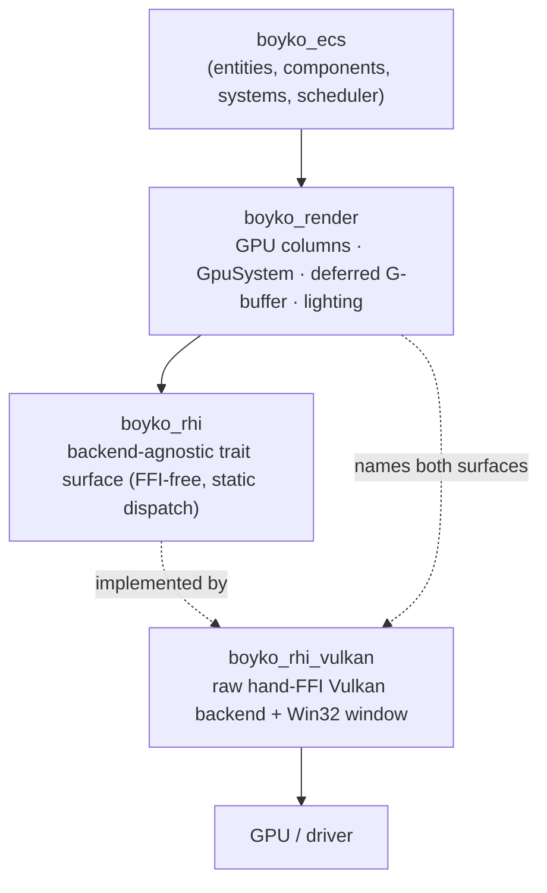
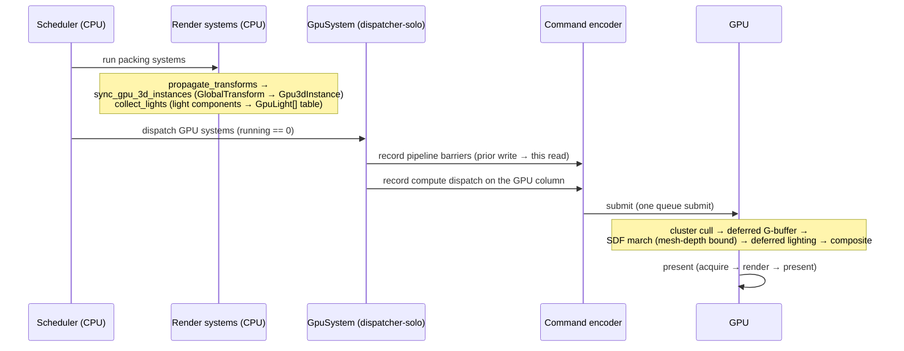

# Rendering Overview

The boyko-engine renderer is an **in-house, FFI-free graphics stack** that treats the
GPU the way the ECS core treats the CPU: data lives in contiguous, address-stable
columns, work is recorded once and executed in bulk, and nothing crosses a virtual
dispatch boundary on the hot path. There is no `wgpu`, no `ash`, no `vulkano` — the
whole pipeline, down to the raw Vulkan loader and the Win32 window, is hand-written.

This page is the map. It explains the three layers of the stack, the
CPU-orchestrate / GPU-execute philosophy that ties them together, and how one frame
flows through them. Each subsystem then has its own page:

- [The RHI](rhi.md) — the backend-agnostic, static-dispatch hardware interface.
- [GPU-resident columns](gpu-columns.md) — ECS component columns that live in VRAM.
- [SDF rendering](sdf.md) — the analytic sphere-tracer and the hybrid mesh↔SDF path.
- [The shader eDSL](shader-edsl.md) — single-sourcing field math between CPU and GPU.
- [Lighting](lighting.md) — ECS light entities, the GPU light table, clustered cull.

## Why in-house

The engine's first principle is that **`boyko_ecs` is the one SDK for both logic and
data** — every subsystem is components + systems on the ECS's own storage, never a
thing glued on the side with its own data structures. Rendering is held to the same
bar. A render entity's pose, its material, a light's color, the SDF edit list — all of
it is ordinary ECS data. The GPU buffer is a *derived view* of that data, not a
parallel store.

Building on a third-party HAL would have forced a parallel data system: their resource
model, their command abstraction, their `dyn`-dispatched encoder. Instead the stack is
three thin layers we own end to end, so the ECS storage discipline (SoA, cache-line
alignment, lock-free, zero allocation on the frame path) reaches all the way to the
driver.

## The three layers

### `boyko_rhi` — the interface

[`boyko_rhi`](https://github.com/bluesteelll/boyko-engine/blob/ecs/crates/boyko_rhi/src/lib.rs)
is the backend-agnostic Render Hardware Interface: an umbrella `RhiApi` trait with
associated owned-resource types, operational traits (`RhiDevice`, `RhiQueue`,
`RhiCommandEncoder`), thin enums and descriptors, and a generational handle registry
(`ResourceRegistry`).

The defining choice is **static dispatch**. `RhiApi` is intentionally *not*
object-safe; backends implement the traits over their own concrete resources, so every
call monomorphizes to a direct, non-virtual call — zero abstraction overhead versus the
backend's inherent methods. There is no `dyn`, no `Box`, no `HashMap` anywhere in the
crate. Its only dependency is `boyko_utils` (for the generational `Slot` handles); it
does **not** depend on `boyko_ecs`, which keeps the dependency graph acyclic. See
[The RHI](rhi.md).

### `boyko_rhi_vulkan` — the backend

[`boyko_rhi_vulkan`](https://github.com/bluesteelll/boyko-engine/blob/ecs/crates/boyko_rhi_vulkan/src/lib.rs)
implements the RHI traits over a **raw, hand-FFI Vulkan** backend. The INVIOLABLE rule
here is specific: every `vk*` call is hand-declared raw FFI resolved through
`vkGetInstanceProcAddr` / `vkGetDeviceProcAddr` — there is **no `ash`, no `vulkano`**
in the Vulkan path. It hand-rolls the Vulkan loader, instance, and device (`device`), a
`VkDeviceMemory` sub-allocator with coalescing (`memory`, `suballocator`), compute
pipelines from committed SPIR-V (`compute`), and the command-encoder lowering
(`rhi_impl::VulkanCommandEncoder`).

The OS windowing / Raw-Input layer is the one approved exception. `window::Window` is a
raw Win32 window: the class/window/message calls (`RegisterClassExW`, `CreateWindowExW`,
the `WndProc` message loop) are hand-declared `extern "system"` against `user32` /
`kernel32`, while the window-handle accessors, the Raw-Input calls, and the `RAWINPUT*`
structs / `WM_*` constants come from the official, Microsoft-maintained
[`windows-sys`](https://crates.io/crates/windows-sys) raw bindings — re-exported through
[`ffi::os`](https://github.com/bluesteelll/boyko-engine/blob/ecs/crates/boyko_rhi_vulkan/src/ffi.rs#L37).
`windows-sys` is target-gated to `cfg(windows)`, so non-Windows builds pull nothing, and
it never touches a `vk*` symbol. On top of that window, `swapchain` brings up the
surface, a FIFO swapchain, and a Vulkan 1.3 dynamic-rendering present loop
(`vkCmdBeginRendering` / `vkCmdEndRendering`, no `VkRenderPass` / `VkFramebuffer`), two
frames in flight. Every `unsafe` block carries a concrete `// SAFETY:` comment, and the
`VK_LAYER_KHRONOS_validation` messenger — asserted to zero messages — is the soundness
oracle that stands in for Miri on the raw-FFI path.

### `boyko_render` — the bridge

[`boyko_render`](https://github.com/bluesteelll/boyko-engine/blob/ecs/crates/boyko_render/src/lib.rs)
is the **only** crate allowed to name both the ECS and the RHI. It depends directly on
`boyko_ecs`, `boyko_rhi`, `boyko_rhi_vulkan`, and `boyko_utils`, with no cycle, so the
graphics-aware types live here and never leak into the graphics-pure ECS core. It
holds:

- **GPU-resident columns** — `GpuColumnManager` mints DeviceLocal (VRAM) SSBOs and
  packs each into the opaque `DeviceColumnHandle` the ECS core stores. See
  [GPU-resident columns](gpu-columns.md).
- **`GpuSystem`** — a hand-written `impl System` that records and submits compute
  dispatches *on* a GPU-resident column, fully inside the engine's scheduler.
- **Lighting** — ECS light components folded into a GPU `GpuLight[]` table plus the
  clustered froxel cull. See [Lighting](lighting.md).
- **3D instancing** — `Render3dPlugin` packs each visible entity's `GlobalTransform`
  into a `Gpu3dInstance` column for the instance buffer.

## CPU-orchestrate / GPU-execute

The dividing line that shapes the whole stack:

> The **CPU drives the ECS and records work**; the **GPU executes** it. Render and
> large-N data-parallel work run on the GPU; rigid-body resolve stays on the CPU.

The CPU runs systems on the scheduler, folds ECS data into GPU-shaped buffers, and
records command buffers. The GPU then executes those commands. Crucially, results that
feed the next GPU pass **stay on the GPU** — chained passes are synchronized with
`vkCmdPipelineBarrier`, not with a readback to host memory.

This is why rigid-body physics resolve stays on the CPU: it is latency-bound,
branch-heavy, and needs its result the same frame, so a GPU round-trip would lose more
to readback latency than it gains. The GPU owns rendering and large-N regimes
(particles, instances) where the arithmetic intensity pays for the dispatch. (Physics
is covered under [Simulation](../simulation/physics.md).)

### Zero per-frame readback

The GPU-column path is built so that **no buffer is read back to the CPU during a
normal frame**. A `GpuSystem` records its compute dispatch, submits it, and the GPU's
output remains a device-local buffer that the next pass reads directly. The one
readback that exists in `GpuColumnManager` is `readback_for_test` — a *test oracle*
used to diff GPU output against a CPU golden, not a per-frame code path.

This matters because a readback stalls the pipeline: the CPU must wait for the GPU to
finish before it can see the bytes. Keeping data resident turns a serial CPU↔GPU
ping-pong into a one-way stream of recorded work.

### Sound `!Send` GPU access

The Vulkan context is `!Send` / `!Sync` — it must be touched from a single thread.
`GpuSystem` declares **empty** ECS access and is scheduled as `SystemKind::GpuCompute`,
which runs it *solo on the dispatcher thread* during the apply window (`running == 0`).
It reaches the `!Send` `RhiContext` through a dispatcher-only `DispatcherToken`, whose
`&mut self` projection lifetime makes a second mutable alias un-aliasable. A concurrent
worker can never mint that token, so the single-thread-touch discipline is
compiler-enforced rather than convention. The
[GPU-resident columns](gpu-columns.md) page covers this in detail.

## How a frame flows

A representative frame, from ECS data to a presented image:

Step by step:

1. **Pack (CPU systems).** Ordinary scheduled systems fold ECS data into GPU-shaped
   columns: `sync_gpu_3d_instances` packs propagated `GlobalTransform`s into the
   `Gpu3dInstance` column (it must run after `propagate_transforms`); `collect_lights`
   folds light components into one contiguous `[LightHeaderGpu || GpuLight[]]` staging
   slice. These are alloc-free transform-and-write passes.

2. **Upload / record (GPU systems).** During the apply window, `GpuSystem`-style work
   runs solo on the dispatcher. It resolves its target column by
   `(ArchetypeId, ComponentId)` (so a buffer that grew and rotated its handle is
   transparent), records the necessary pipeline barriers, then records the compute
   dispatch into the same encoder and submits.

3. **Execute (GPU).** On the swapchain present path
   ([`render_gbuffer_frame`](https://github.com/bluesteelll/boyko-engine/blob/ecs/crates/boyko_rhi_vulkan/src/swapchain.rs#L2169)),
   the GPU runs the deferred pipeline: an optional clustered light cull, a rasterized
   G-buffer pass that produces a depth image, an SDF compute march bounded by that
   depth (the **hybrid mesh↔SDF** occlusion — meshes and SDF share one depth so each
   correctly occludes the other), a deferred lighting resolve over the G-buffer, and a
   composite blit into the acquired swapchain image.

4. **Present.** Acquire → record (barrier → `vkCmdBeginRendering` clear →
   `vkCmdEndRendering` → barrier) → submit → present, two frames in flight.

No stage reads a buffer back to the CPU. Each GPU pass consumes the previous pass's
device-local output, synchronized by barriers.

## What is shipped vs. deferred

This stack is a deliberately staged ladder. To be precise about what runs today:

**Shipped:**

- The FFI-free RHI trait surface and the raw-FFI Vulkan backend (headless compute +
  on-screen present).
- GPU-resident DeviceLocal columns + the `GpuSystem` zero-readback compute path.
- The deferred G-buffer present path with the hybrid mesh↔SDF shared-depth bound.
- Analytic SDF sphere-tracing with Keinert over-relaxation (B1, ω = 1.2), mesh-depth
  bound, soft shadows, and AO.
- Lighting **L0** (ECS lights → GPU `GpuLight[]` table) and **L1** (clustered froxel
  cull, a 16×9×24 exponential-Z grid).

**Deferred / parked (not available today — do not assume these exist):**

- **The P9 GPU-resident brick atlas.** The SDF renderer is, by design, a *brute-force*
  per-pixel analytic sphere-tracer: every march step re-folds the entire edit list with
  no distance cache, no brick map, and no BVH, bounded today only by
  `MAX_SDF_EDITS = 16`. The cache-and-interpolate hierarchy is pre-cut behind the
  `field_distance` shader seam but **not implemented**. See [SDF rendering](sdf.md) and
  the audit in
  [docs/SDF-PERF-AUDIT.md](https://github.com/bluesteelll/boyko-engine/blob/ecs/docs/SDF-PERF-AUDIT.md).
- **The P4b coarse tile-cull.** Built and golden-proven, but *disabled on the windowed
  present* (`coarse_enabled = 0`) — it currently runs only in the offscreen golden test.
- **Baked / runtime global illumination (lighting L2+).** Irradiance volumes, DDGI, and
  SDF-native GI capstones are planned, not shipped.
- **VRAM brick streaming (M5b)** and half-resolution / temporal march seeding — owner-
  deferred optimizations.

For the honest, caveat-by-caveat breakdown of what the SDF renderer does and does not
do, the page to read is [SDF rendering](sdf.md).

## See also

- [The RHI](rhi.md) — the FFI-free, static-dispatch interface and its backend.
- [GPU-resident columns](gpu-columns.md) — VRAM-backed ECS columns and `GpuSystem`.
- [SDF rendering](sdf.md) — the analytic marcher, the hybrid path, and the deferred ladder.
- [The shader eDSL](shader-edsl.md) — one source of truth for CPU and GPU field math.
- [Lighting](lighting.md) — light entities, the GPU table, and clustered cull.
- Source: [`boyko_render`](https://github.com/bluesteelll/boyko-engine/blob/ecs/crates/boyko_render/src/lib.rs),
  [`boyko_rhi`](https://github.com/bluesteelll/boyko-engine/blob/ecs/crates/boyko_rhi/src/lib.rs),
  [`boyko_rhi_vulkan`](https://github.com/bluesteelll/boyko-engine/blob/ecs/crates/boyko_rhi_vulkan/src/lib.rs).
