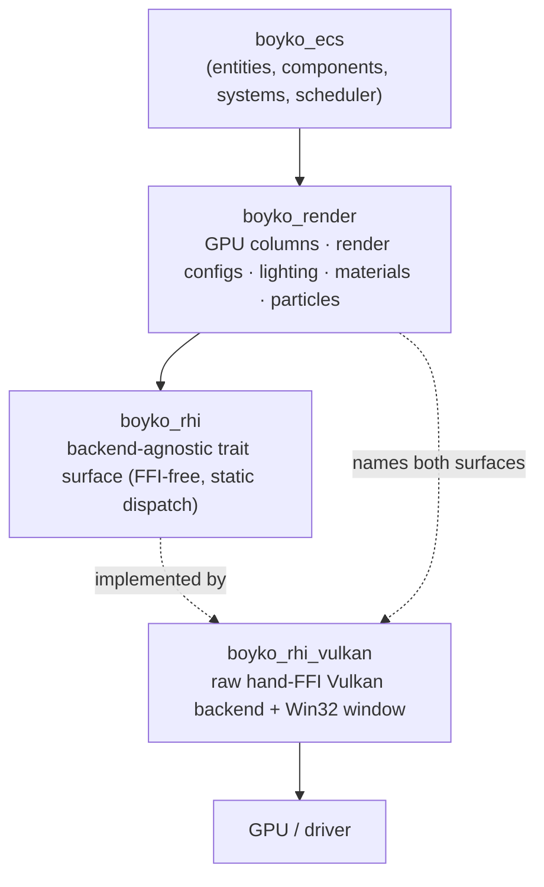
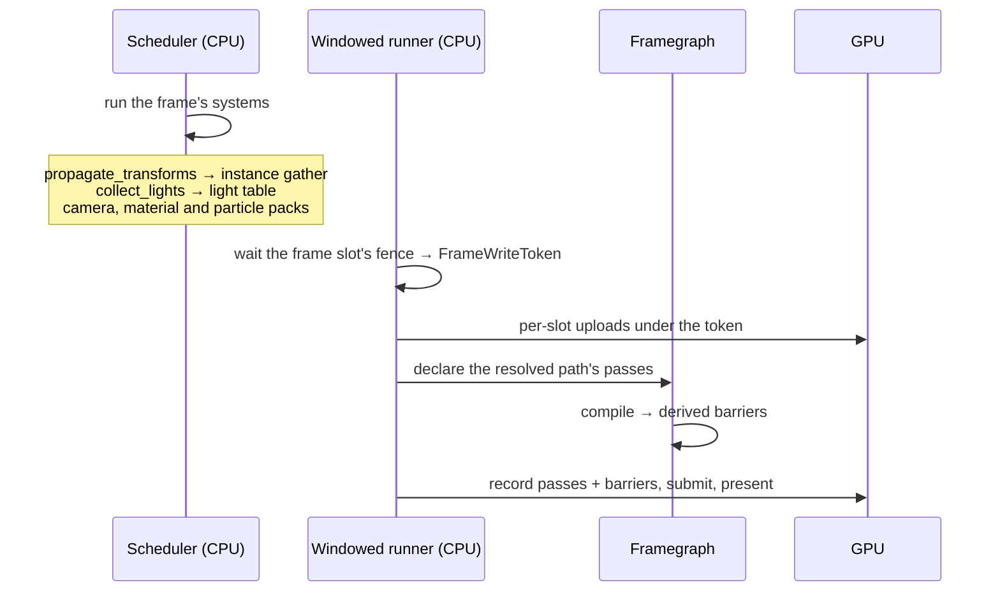

# Rendering Overview

The boyko-engine renderer is an **in-house, FFI-free graphics stack** that treats the
GPU the way the ECS core treats the CPU: data lives in contiguous, address-stable
columns, work is recorded once and executed in bulk, and nothing crosses a virtual
dispatch boundary on the hot path. There is no `wgpu`, no `ash`, no `vulkano` — the
whole pipeline, down to the raw Vulkan loader and the Win32 window, is hand-written.

This page is the map. It explains the three layers of the stack, the
CPU-orchestrate / GPU-execute philosophy that ties them together, how one frame
flows through them, and what ships today. Each subsystem then has its own page:

- [Render paths](render-paths.md) — Deferred, Forward, Forward+ and the Visibility
  Buffer, crossed with the mesh and SDF geometry legs.
- [The RHI](rhi.md) — the backend-agnostic, static-dispatch hardware interface.
- [The framegraph](framegraph.md) — the render dependency graph that derives every
  barrier.
- [GPU-resident columns](gpu-columns.md) — ECS component columns that live in VRAM.
- [Meshes and loaders](meshes-and-loaders.md) and
  [materials and textures](materials-and-textures.md) — assets, textured PBR, bindless
  textures.
- [Lighting](lighting.md) — ECS light entities, the GPU light table, clustered cull,
  tonemapping.
- [Shadows and ambient occlusion](shadows-and-ao.md),
  [global illumination](global-illumination.md),
  [anti-aliasing](anti-aliasing.md) and [GPU particles](particles.md).
- [SDF rendering](sdf.md) — the analytic sphere-tracer and the hybrid mesh↔SDF path.
- [The shader eDSL](shader-edsl.md) — single-sourcing shader math between CPU and GPU.

## Why in-house

The engine's first principle is that **`boyko_ecs` is the one SDK for both logic and
data** — every subsystem is components + systems on the ECS's own storage, never a
thing glued on the side with its own data structures. Rendering is held to the same
bar. A render entity's pose, its material, a light's color, the SDF edit list — all of
it is ordinary ECS data. The GPU buffer is a *derived view* of that data, not a
parallel store.

Building on a third-party HAL would have forced a parallel data system: their resource
model, their command abstraction, their `dyn`-dispatched encoder. Instead the stack is
three thin layers we own end to end, so the ECS storage discipline (SoA, cache-line
alignment, lock-free, zero allocation on the frame path) reaches all the way to the
driver.

## The three layers

```mermaid
flowchart TD
    ECS["boyko_ecs<br/>(entities, components, systems, scheduler)"]
    R["boyko_render<br/>GPU columns · render configs · lighting · materials · particles"]
    RHI["boyko_rhi<br/>backend-agnostic trait surface (FFI-free, static dispatch)"]
    VK["boyko_rhi_vulkan<br/>raw hand-FFI Vulkan backend + Win32 window"]
    GPU["GPU / driver"]

    ECS --> R
    R --> RHI
    RHI -. "implemented by" .-> VK
    VK --> GPU
    R -.->|"names both surfaces"| VK
```

### `boyko_rhi` — the interface

[`boyko_rhi`](https://github.com/bluesteelll/boyko-engine/blob/master/crates/boyko_rhi/src/lib.rs)
is the backend-agnostic Render Hardware Interface: an umbrella `RhiApi` trait with
associated owned-resource types, operational traits (`RhiDevice`, `RhiQueue`,
`RhiCommandEncoder`), thin enums and descriptors, and a generational handle registry
(`ResourceRegistry`).

The defining choice is **static dispatch**. `RhiApi` is intentionally *not*
object-safe; backends implement the traits over their own concrete resources, so every
call monomorphizes to a direct, non-virtual call — zero abstraction overhead versus the
backend's inherent methods. There is no `dyn`, no `Box`, no `HashMap` anywhere in the
crate. It depends on two engine crates: `boyko_utils` (for the generational `Slot` handles)
and `boyko_log` (its diagnostic channel). It does **not** depend on `boyko_ecs`, which keeps
the dependency graph acyclic. See
[The RHI](rhi.md).

### `boyko_rhi_vulkan` — the backend

[`boyko_rhi_vulkan`](https://github.com/bluesteelll/boyko-engine/blob/master/crates/boyko_rhi_vulkan/src/lib.rs)
implements the RHI traits over a **raw, hand-FFI Vulkan** backend. The INVIOLABLE rule
here is specific: every `vk*` call is hand-declared raw FFI resolved through
`vkGetInstanceProcAddr` / `vkGetDeviceProcAddr` — there is **no `ash`, no `vulkano`**
in the Vulkan path. It hand-rolls the Vulkan loader, instance, and device (`device`), a
`VkDeviceMemory` sub-allocator with coalescing (`memory`, `suballocator`), compute and
graphics pipelines from committed SPIR-V, bindless descriptor sets (`bindless`),
ray-tracing acceleration structures (`accel`), the framegraph (`framegraph`), and the
command-encoder lowering (`rhi_impl::VulkanCommandEncoder`).

The OS windowing / Raw-Input layer is the one approved exception. `window::Window` is a
raw Win32 window: the class/window/message calls (`RegisterClassExW`, `CreateWindowExW`,
the `WndProc` message loop) are hand-declared `extern "system"` against `user32` /
`kernel32`, while the window-handle accessors, the Raw-Input calls, and the `RAWINPUT*`
structs / `WM_*` constants come from the official, Microsoft-maintained
[`windows-sys`](https://crates.io/crates/windows-sys) raw bindings — re-exported through
[`ffi::os`](https://github.com/bluesteelll/boyko-engine/blob/master/crates/boyko_rhi_vulkan/src/ffi.rs).
`windows-sys` is target-gated to `cfg(windows)`, so non-Windows builds pull nothing, and
it never touches a `vk*` symbol. On top of that window, the `present` module brings up
the surface, the swapchain, and a Vulkan 1.3 dynamic-rendering present loop
(`vkCmdBeginRendering` / `vkCmdEndRendering`, no `VkRenderPass` / `VkFramebuffer`), two
frames in flight. The swapchain takes a present mode: FIFO (the default), Immediate or
Mailbox, each probed with a fallback to FIFO (`Swapchain::new_with_present_mode`). The
windowed host presents with FIFO.

Every `unsafe` block carries a concrete `// SAFETY:` comment, and the
`VK_LAYER_KHRONOS_validation` layer is the soundness oracle that stands in for Miri on
the raw-FFI path. Two gates use it:

- **The absolute validation gate** (`crates/boyko_app/tests/boot_validation_clean.rs`)
  boots the full engine with the layer armed, renders a few frames, and fails on any
  error or validation warning. In an ordinary run the layer is opt-in:
  `BOYKO_ENABLE_VALIDATION` arms it.
- **The SPIR-V capability census** (`spirv_capability_census.rs`) needs no device. It
  checks that every capability a committed shader declares is licensed by a device
  feature the backend enables.

### `boyko_render` — the bridge

[`boyko_render`](https://github.com/bluesteelll/boyko-engine/blob/master/crates/boyko_render/src/lib.rs)
is the bridge between the ECS and the RHI. It depends directly on `boyko_ecs`, `boyko_rhi`
and `boyko_rhi_vulkan`, with no cycle, so the graphics-aware types live here and never leak
into the graphics-pure ECS core. Only it and the host layer above it (`boyko_app`) name both
sides. It
holds:

- **GPU-resident columns** — `GpuColumnManager` mints DeviceLocal (VRAM) SSBOs and
  packs each into the opaque `DeviceColumnHandle` the ECS core stores. See
  [GPU-resident columns](gpu-columns.md).
- **`GpuSystem`** — a hand-written `impl System` that records and submits compute
  dispatches *on* a GPU-resident column, fully inside the engine's scheduler.
- **The render configs** — one owner-set resource per feature (`RenderPathConfig`,
  `AaConfig`, `SsaoConfig`, `CsmConfig`, `ShadowConfig`, `DdgiConfig`,
  `ShadowDenoiseConfig`, `HzbConfig`, `OcclusionConfig`, `ParticleConfig`), each with a
  plugin that inserts its default. See the table [below](#what-ships-today).
- **Lighting** — ECS light components folded into a GPU `GpuLight[]` table plus the
  clustered froxel cull and the tonemapper choice. See [Lighting](lighting.md).
- **Meshes, materials and textures** — `Assets<MeshGpu>`, the material table, bindless
  textures, and the asset loaders (OBJ, glTF 2.0 binary, PNG, RON material).
- **3D instancing** — `Render3dPlugin` packs each visible entity's `GlobalTransform`
  into a `Gpu3dInstance` column for the instance buffer.
- **GPU particles** and the **UI render pack** (`boyko_render::ui`).

## CPU-orchestrate / GPU-execute

The dividing line that shapes the whole stack:

> The **CPU drives the ECS and records work**; the **GPU executes** it. Render and
> large-N data-parallel work run on the GPU; rigid-body resolve stays on the CPU.

The CPU runs systems on the scheduler, folds ECS data into GPU-shaped buffers, and
records command buffers. The GPU then executes those commands. Crucially, results that
feed the next GPU pass **stay on the GPU** — chained passes are synchronized with
`vkCmdPipelineBarrier` barriers that the [framegraph](framegraph.md) derives, not with a
readback to host memory.

This is why rigid-body physics resolve stays on the CPU: it is latency-bound,
branch-heavy, and needs its result the same frame, so a GPU round-trip would lose more
to readback latency than it gains. The GPU owns rendering and large-N regimes
(particles, instances) where the arithmetic intensity pays for the dispatch. (Physics
is covered under [Simulation](../simulation/physics.md).)

### Zero per-frame readback

The GPU-column path is built so that **no buffer is read back to the CPU during a
normal frame**. A `GpuSystem` records its compute dispatch, submits it, and the GPU's
output remains a device-local buffer that the next pass reads directly. The one
readback that exists in `GpuColumnManager` is `readback_for_test` — a *test oracle*
used to diff GPU output against a CPU golden, not a per-frame code path.

This matters because a readback stalls the pipeline: the CPU must wait for the GPU to
finish before it can see the bytes. Keeping data resident turns a serial CPU↔GPU
ping-pong into a one-way stream of recorded work.

### Sound `!Send` GPU access

The Vulkan context is `!Send` / `!Sync` — it must be touched from a single thread.
`GpuSystem` declares **empty** ECS access and is scheduled as `SystemKind::GpuCompute`,
which runs it *solo on the dispatcher thread* during the apply window (`running == 0`).
It reaches the `!Send` `RhiContext` through a dispatcher-only `DispatcherToken`, whose
`&mut self` projection lifetime makes a second mutable alias un-aliasable. A concurrent
worker can never mint that token, so the single-thread-touch discipline is
compiler-enforced rather than convention. The
[GPU-resident columns](gpu-columns.md) page covers this in detail.

## How a frame flows

The renderer makes one decision at boot and runs one loop per frame.

**At boot.** The windowed runner calls `resolve_render_path` once. It reads the
owner's `RenderPathConfig` (a `RenderPath` × `GeometryLegs` pair), the features that
need inputs from before lighting (SSAO, DDGI, the shadow denoiser, TAA), and the
device's capabilities. The result is a frozen `ResolvedRenderPath`.

- A request the device cannot serve degrades to one it can, with a logged reason; it
  never panics. For example, the Visibility Buffer falls back to Deferred on a device
  without `shaderStorageBufferArrayNonUniformIndexing`.
- There is no live toggle. Changing the path means booting again.

**Every frame:**

```mermaid
sequenceDiagram
    participant Sched as Scheduler (CPU)
    participant Run as Windowed runner (CPU)
    participant FG as Framegraph
    participant GPU as GPU

    Sched->>Sched: run the frame's systems
    Note over Sched: propagate_transforms → instance gather<br/>collect_lights → light table<br/>camera, material and particle packs
    Run->>Run: wait the frame slot's fence → FrameWriteToken
    Run->>GPU: per-slot uploads under the token
    Run->>FG: declare the resolved path's passes
    FG->>FG: compile → derived barriers
    Run->>GPU: record passes + barriers, submit, present
```

Step by step:

1. **Pack (CPU systems).** Ordinary scheduled systems fold ECS data into GPU-shaped
   buffers. `propagate_transforms` runs first; the mesh-draw gather packs instances,
   and `collect_lights` folds light components into one contiguous
   `[LightHeaderGpu || GpuLight[]]` staging slice. These are alloc-free
   transform-and-write passes.
2. **Fence and upload.** `wait_frame_in_flight` waits the fence of the frame slot about
   to be reused and returns a `FrameWriteToken`, a compile-time proof that the slot is
   safe to write. Every per-slot host write (the UI instance ring, the interpolation
   pair ring, the camera ring) takes the token, and the submit consumes it. A write after the submit is
   a compile error, not a convention.
3. **Declare and compile.** The resolved path picks the declarator:
   `declare_deferred_graph`, `declare_forward_graph` (Forward and Forward+) or
   `declare_vb_graph`. Each pass declares what it reads and writes, and
   `FrameGraph::compile` derives the barrier set.
4. **Record, submit, present.** Two frames in flight.

**The Deferred path, as one example**
([`frame_driver.rs`](https://github.com/bluesteelll/boyko-engine/blob/master/crates/boyko_rhi_vulkan/src/present/frame_driver.rs)):
a rasterized G-buffer pass that produces a depth image; an SDF compute march bounded by
that depth (the **hybrid mesh↔SDF** occlusion — meshes and SDF share one depth, so each
correctly occludes the other); a deferred lighting resolve over the G-buffer; the
enabled post passes; and a present blit into the acquired swapchain image.

No stage reads a buffer back to the CPU. Each GPU pass consumes the previous pass's
device-local output, synchronized by the derived barriers.

## What ships today

The table lists each feature with its default and its switch. The base frame needs no
configuration: the Deferred path with both geometry legs, meshes, textured PBR, lights, ACES
tonemapping and, with the SDF leg, SDF tracing are on by default. Every **opt-in** feature
defaults to **off**, so an unconfigured world renders without it. (The exception, ray-traced
shadows, exists only in `hwrt` builds, where the boot selects it on a ray-query GPU.) Most
opt-in features have an owner-set config resource: to turn one on, overwrite its config
**after** `add_plugins(EnginePlugins::…)`, because the plugins insert the defaults. Some also
need a marker component on the entities they apply to, as the Knob column notes.

| Feature | Crate | Default | Knob |
|---------|-------|---------|------|
| [Render paths](render-paths.md): Deferred, Forward, Forward+, Visibility Buffer | `boyko_render`, `boyko_rhi_vulkan` | Deferred | `RenderPathConfig::path` (boot-fixed) |
| [Geometry legs](render-paths.md): meshes, SDF, or both | `boyko_render`, `boyko_rhi_vulkan` | both | `RenderPathConfig::legs` (boot-fixed) |
| [Framegraph](framegraph.md) barrier derivation | `boyko_rhi_vulkan` | always on | — |
| [Meshes](meshes-and-loaders.md): `Assets<MeshGpu>`, OBJ and glTF 2.0 binary loaders | `boyko_render` | on | — |
| [Textured PBR, bindless textures, PNG decoding](materials-and-textures.md) | `boyko_render`, `boyko_image` | on | — |
| [Lights](lighting.md): directional, point, spot, sky ambient | `boyko_render` | on | `LightingConfig` |
| [Clustered light cull](lighting.md) | `boyko_render` | off; Visibility Buffer path only | `LightingConfig::clusters_enabled` / `cluster_select` |
| [Tonemapping](lighting.md): ACES, Neutral, Reinhard-Jodie | `boyko_render` | ACES | `LightingConfig::tonemapper` |
| [SDF sphere-tracing](sdf.md), its soft shadow and AO | `boyko_rhi_vulkan` | on with the SDF leg | — |
| [Cascaded sun shadows](shadows-and-ao.md) | `boyko_render`, `boyko_app` | off | `CsmConfig::cascade_count` > 0, plus `ShadowCaster` on the casting meshes |
| [Spot/point shadow atlas](shadows-and-ao.md) | `boyko_render`, `boyko_app` | off | `ShadowConfig::enabled`, plus `CastsPunctualShadow` on the lights and `ShadowCaster` on the casting meshes |
| [Ray-traced mesh shadows](shadows-and-ao.md) (ray query) | `boyko_render`, `boyko_app` | only in `--features hwrt` builds on a ray-query GPU, where the boot selects it | `RayShadowConfig` (tuning); `BOYKO_FORCE_SOFTWARE=1` forces the non-ray-traced path |
| [Shadow denoiser](shadows-and-ao.md), spatial and temporal | `boyko_render`, `boyko_app` | off; `hwrt` builds only | `ShadowDenoiseConfig::mode` |
| [SSAO](shadows-and-ao.md) | `boyko_render` | off | `SsaoConfig::quality` |
| [SDF DDGI global illumination](global-illumination.md) | `boyko_render` | off | `DdgiConfig::ddgi_indirect` |
| [Anti-aliasing](anti-aliasing.md): FXAA, SMAA, TAA, RCAS sharpen | `boyko_render` | off | `AaConfig::mode`, `TaaConfig::sharpen` |
| [2× SSAA](anti-aliasing.md) | `boyko_render`, `boyko_app` | off (boot-fixed) | `EnginePlugins::with_ssaa_scale(2)` |
| [Two-phase HZB occlusion culling](render-paths.md) | `boyko_render`, `boyko_app` | off; Visibility Buffer path only | `OcclusionConfig::mode`, plus `OcclusionCulling` on each instance to test (`HzbConfig` builds the depth pyramid on its own) |
| [GPU particles](particles.md) | `boyko_render` | off | `ParticleConfig::mode` |

Some features depend on the render path. Under Forward and Forward+, SSAO, DDGI, the
shadow denoiser and TAA are capped off at boot, with a logged reason: those paths
produce none of the inputs they read.

**Not shipped (do not assume these exist):**

- **The brick atlas in the windowed host.** The brick-atlas accelerator and its
  incremental re-bake exist in `boyko_rhi_vulkan`, but the windowed host binds an empty
  placeholder and never arms them. See [SDF rendering](sdf.md).
- **The coarse tile-cull** on screen: built and golden-proven, never armed by the
  windowed host.
- **VRAM brick streaming (M5b)**, half-resolution or temporal march seeding, and the SDF
  geometry/shading split.
- **Auto-exposure.** Exposure is a fixed `LightingConfig::exposure` multiply.

The renderer has no frame-time benchmark yet. Measured results for the rest of the
engine are on the [Benchmarks](../reference/benchmarks.md) page.

For the honest, caveat-by-caveat breakdown of what the SDF renderer does and does not
do, the page to read is [SDF rendering](sdf.md).

## See also

- [Render paths](render-paths.md) — the four paths, the geometry legs, the boot-time resolve.
- [The RHI](rhi.md) — the FFI-free, static-dispatch interface and its backend.
- [The framegraph](framegraph.md) — barrier derivation and `FrameWriteToken`.
- [GPU-resident columns](gpu-columns.md) — VRAM-backed ECS columns and `GpuSystem`.
- [Windowed host](../app/windowed-host.md) — `EnginePlugins` and the renderer knobs.
- [SDF rendering](sdf.md) — the analytic marcher, the hybrid path, and the deferred ladder.
- [The shader eDSL](shader-edsl.md) — one source of truth for CPU and GPU field math.
- [Lighting](lighting.md) — light entities, the GPU table, and clustered cull.
- Source: [`boyko_render`](https://github.com/bluesteelll/boyko-engine/blob/master/crates/boyko_render/src/lib.rs),
  [`boyko_rhi`](https://github.com/bluesteelll/boyko-engine/blob/master/crates/boyko_rhi/src/lib.rs),
  [`boyko_rhi_vulkan`](https://github.com/bluesteelll/boyko-engine/blob/master/crates/boyko_rhi_vulkan/src/lib.rs).
