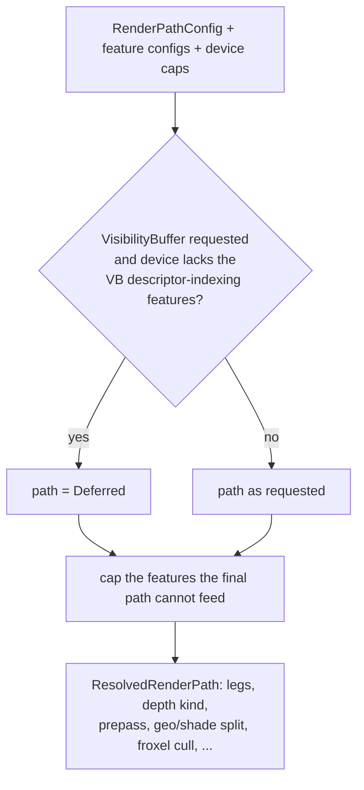

# Render Paths & Visibility Buffer

> The renderer has four render paths and three geometry-leg sets. You pick one of each before the
> app runs; the host resolves the pair once at boot against the device and the enabled features.

## What it is

Two independent choices decide how a frame is built. Both live in `RenderPathConfig`, a resource of
`boyko_render`
([`render_path_config.rs`](https://github.com/bluesteelll/boyko-engine/blob/master/crates/boyko_render/src/render_path_config.rs)).

**`RenderPath`: how geometry becomes lit pixels.**

| Path | Idea | Depth |
|------|------|-------|
| `Deferred` (default) | A fat G-buffer, then a compute resolve shades every pixel. | custom linear |
| `Forward` | The raster fragment shader shades against every light inline. | hardware reverse-Z |
| `ForwardPlus` | Forward with a depth prepass, then shading with a `DEPTH_EQUAL` test, so each pixel is shaded once. | hardware reverse-Z |
| `VisibilityBuffer` | Raster writes only instance and triangle ids; compute passes fetch the geometry and shade. | hardware reverse-Z |

**`GeometryLegs`: which geometry producers exist.**

| Legs | Producers |
|------|-----------|
| `Both` (default) | Mesh raster and the SDF ray marcher, composited into one image. |
| `Mesh` | Mesh raster only: no marcher dispatch. |
| `Sdf` | The SDF marcher only: no vertex pipelines, no instance rings. |

A disabled leg allocates no images, builds no pipelines and records no passes. There is no "no
geometry" option: an app without 3D content does not add the render plugins.

## Choosing a path

Insert the config after `add_plugins` and before `run`:

```rust,ignore
use boyko_app::prelude::*;
use boyko_render::{GeometryLegs, RenderPath, RenderPathConfig};

fn main() {
    let mut app = App::new();
    app.add_plugins(EnginePlugins::window("paradigm", 1280, 720));
    app.insert_resource(RenderPathConfig {
        path: RenderPath::VisibilityBuffer,
        legs: GeometryLegs::Both,
    });
    app.add_startup_system(setup);
    app.run();
}
# fn setup() {}
```

The choice is read once, when the host boots the device. A startup system runs after that point,
so it is too late to change the path. The same holds for the feature configs the resolve reads
(`SsaoConfig`, `DdgiConfig`, `AaConfig`, `LightingConfig`, ...): insert them on the `App` before
`run`.

For experiments without editing code, the windowed host reads two environment variables:

| Variable | Values |
|----------|--------|
| `BOYKO_RENDER_PATH` | `deferred`, `forward`, `forwardplus` (also `forward+`, `clustered`), `vb` (also `visibilitybuffer`) |
| `BOYKO_GEOMETRY_LEGS` | `both`, `mesh`, `sdf` |

They apply while `EnginePlugins` builds, so a `RenderPathConfig` inserted later in code wins. An
unrecognised value falls back to the default for that axis and logs `boyko-W3009`.
`scripts\run-scene.ps1 -Scene paradigm_lab -Path vb -Legs both` sets both for you.

## The boot-time resolve

`resolve_render_path` turns the request into a `ResolvedRenderPath` resource. It never panics: an
unsupported combination degrades, and every degrade is logged as `boyko-W3006`.



The features a path can feed:

| Feature | Deferred | Forward, ForwardPlus | VisibilityBuffer |
|---------|----------|----------------------|------------------|
| SSAO | yes | forced off | needs the mesh leg |
| SDF DDGI | needs the SDF leg | forced off | needs `Both` legs |
| RT shadow denoiser (`hwrt`) | yes | forced off | needs the mesh leg |
| TAA | yes | forced off | yes |
| FXAA, SMAA, SSAA | yes | off: the Forward recorder has no AA pass | yes |
| Froxel light culling | no | no | yes, with `LightingConfig::clusters_enabled` |
| Two-phase HZB occlusion | no | no | yes, mesh leg |

"Forced off" means the request is dropped for the whole run and a `boyko-W3006` names the reason.
The post-process AA modes are switched off on the Forward paths without that warning.
The feature pages ([Shadows & AO](shadows-and-ao.md), [Global Illumination](global-illumination.md),
[Anti-Aliasing](anti-aliasing.md)) describe each knob.

`ResolvedRenderPath` is inserted into the world after boot, so systems can read what was actually
chosen.

## The Visibility Buffer path

The Visibility Buffer writes as little as possible during raster and does the rest in compute:

1. **Cull.** `vb_batch_cull` (compute) tests each instance batch's bounding box against the view
   frustum, rewrites its indirect draw arguments and compacts the survivors.
2. **Raster.** `vb_raster` writes two ids per pixel into an `R32G32_UINT` image (the instance and
   the primitive) plus hardware depth. Nothing else is written.
3. **Shade.** One of three compute shapes produces the lit image:
   - **fused** `vb_resolve`, for flat (untextured) frames;
   - **classified**: `vb_classify_count` / `scan` / `scatter` group pixels by material, then
     `vb_shade` shades them. This shape runs on frames where a Visibility Buffer instance uses a
     textured material;
   - **split**: `vb_geo` reconstructs the surface into thin auxiliary images, then
     `vb_shade_split` shades. The split runs when a feature needs the surface before lighting
     (SSAO, DDGI, the RT shadow denoiser) or when the SDF-on-mesh term is requested.

The geometry comes from a bindless per-mesh table, which is why the path needs
`shaderStorageBufferArrayNonUniformIndexing` and `descriptorBindingStorageBufferUpdateAfterBind`.
Without them the boot falls back to `Deferred`.

The SDF leg works on this path too: `VisibilityBuffer` accepts `Both`, `Mesh` and `Sdf`.

### Two-phase occlusion culling

The Visibility Buffer can skip instances hidden behind last frame's depth. It is off by default and
opt-in per entity:

```rust,ignore
use boyko_render::{OcclusionConfig, OcclusionCulling, OcclusionMode};

app.insert_resource(OcclusionConfig { mode: OcclusionMode::TwoPhase });

// In a startup system, in the same command flush as the spawn:
let e = commands.spawn(MeshBundle::new(mesh, transform)).id();
commands.entity(e).insert(OcclusionCulling);
```

The early phase tests each marked instance against the previous frame's hierarchical-Z pyramid and
defers the ones it rejects. The pyramid is then rebuilt from the early depth, and a late phase
re-tests and draws the deferred instances. An entity without `OcclusionCulling` is always drawn,
so forgetting the marker costs a draw, never a missing object. `HzbConfig` controls the pyramid on
its own; `TwoPhase` builds one even when `HzbConfig` is `Off`.

## Trade-offs

- **Boot-time only.** Switching paths would reallocate fixed-size images and pipelines, so the
  choice is frozen for the run.
- **Feature coverage differs.** Forward and Forward+ have no thin auxiliary images yet, which is
  why SSAO, DDGI, the denoiser and TAA are forced off there.
- **Classification has a cost.** The Visibility Buffer pays the classify passes only on frames
  with textured materials; flat frames take the fused shader.
- **Rendering has no frame-time benchmark**, so this book does not rank the paths by speed. The
  `RenderPath` docs state each path's intended niche: few lights, many lights, or dense geometry.

## See also

- [Overview](overview.md): the renderer's crates and frame flow.
- [Framegraph](framegraph.md): how each path's passes are declared and synchronised.
- [SDF Rendering](sdf.md): the marcher behind the SDF leg.
- [Windowed Host](../app/windowed-host.md): `EnginePlugins` and the other launch variables.
- Source: [`render_path_config.rs`](https://github.com/bluesteelll/boyko-engine/blob/master/crates/boyko_render/src/render_path_config.rs),
  [`present/graph_bridge.rs`](https://github.com/bluesteelll/boyko-engine/blob/master/crates/boyko_rhi_vulkan/src/present/graph_bridge.rs),
  [`occlusion_config.rs`](https://github.com/bluesteelll/boyko-engine/blob/master/crates/boyko_render/src/occlusion_config.rs).
