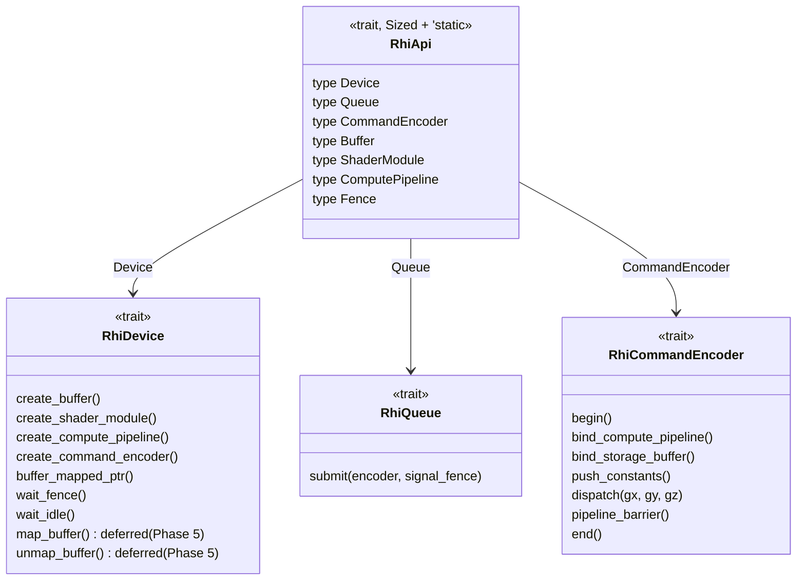
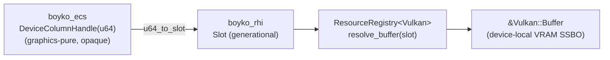
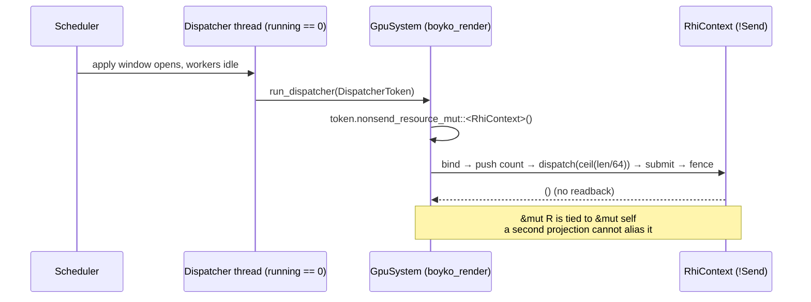

# RHI & Vulkan Backend

> Boyko Engine talks to the GPU through its **own** Render Hardware Interface (RHI) — a static-dispatch trait seam with no `dyn`, no `Box`, and no foreign FFI leaking through the public surface — implemented by a hand-rolled, raw-FFI Vulkan backend (no `ash`, no `vulkano`).

## What it is

Two crates form the GPU boundary:

- [`boyko_rhi`](https://github.com/bluesteelll/boyko-engine/blob/ecs/crates/boyko_rhi/src/lib.rs) — the **backend-agnostic seam**. It declares device, queue, encoder, resource, and handle abstractions as traits and POD descriptors. It names no Vulkan type and links no FFI.
- [`boyko_rhi_vulkan`](https://github.com/bluesteelll/boyko-engine/blob/ecs/crates/boyko_rhi_vulkan/src/lib.rs) — the **Vulkan backend**, hand-declared raw FFI over the Vulkan loader. It implements the `boyko_rhi` traits.

The split exists so the rest of the engine compiles against the seam, never against Vulkan. A second backend (DX12 / Metal) would slot in by implementing the same traits, with no change to callers. See [Rendering Overview](overview.md) for where this sits in the frame, and [GPU Columns](gpu-columns.md) for the ECS-resident storage that rides on top.

## Why in-house, not wgpu

The engine's first principle is **zero abstraction overhead on the hot path**. A `dyn`-based HAL (wgpu-hal's object-safe `trait Api`) pays a virtual call per command. Boyko's seam is deliberately **not object-safe**: every call monomorphizes to a direct, non-virtual call, so the abstraction costs the same as calling the backend's inherent method. The module doc states this directly — "every call monomorphizes to a direct, non-virtual call, so there is zero abstraction overhead vs the backend's inherent methods" ([lib.rs:8-11](https://github.com/bluesteelll/boyko-engine/blob/ecs/crates/boyko_rhi/src/lib.rs#L8-L11)).

The Vulkan FFI is hand-rolled for the same reason a third-party allocator was rejected for [memory](../memory/arena.md): the engine wants full control of the calling convention, the loader dispatch, and the soundness story, with no transitive supply-chain surface. The Vulkan command functions are not even linked at build time — they are resolved at runtime through `vkGetInstanceProcAddr` / `vkGetDeviceProcAddr`, mirroring the `vm.rs` virtual-memory FFI idiom ([ffi.rs:1-14](https://github.com/bluesteelll/boyko-engine/blob/ecs/crates/boyko_rhi_vulkan/src/ffi.rs#L1-L14)).

> **Honest scope note.** "No FFI through the seam" applies to `boyko_rhi`, which is FFI-free. The Vulkan *path* in `boyko_rhi_vulkan` is 100% in-house FFI (no `ash` / `vulkano` / `libc`). The one exception is **OS windowing and Raw-Input**, which use the official Microsoft `windows-sys` bindings (`SetWindowLongPtrW`, `RegisterRawInputDevices`, the `RAWINPUT*` structs, `WM_*` constants), target-gated to `cfg(windows)` ([Cargo.toml:22-38](https://github.com/bluesteelll/boyko-engine/blob/ecs/crates/boyko_rhi_vulkan/Cargo.toml#L22-L38)). The `vk*` surface itself never touches `windows-sys`.

## The seam: `RhiApi` and the operational traits

The seam is shaped after `wgpu-hal`'s `Api` marker, minus the `dyn`. One umbrella trait gathers every backend resource type; the operational traits are separate and reference `A: RhiApi`.



- [`RhiApi`](https://github.com/bluesteelll/boyko-engine/blob/ecs/crates/boyko_rhi/src/api.rs#L26) — the umbrella marker, bound `Sized + 'static`. A backend is a **zero-sized struct** (`struct Vulkan;`) that implements it. Its associated types name the backend's owned resources (`Buffer`, `ShaderModule`, `ComputePipeline`, `Fence`) and its operational types (`Device`, `Queue`, `CommandEncoder`).
- [`RhiDevice`](https://github.com/bluesteelll/boyko-engine/blob/ecs/crates/boyko_rhi/src/device.rs#L243) — resource lifecycle and synchronization: create/destroy buffers, shaders, compute pipelines, fences, and encoders; expose a host-visible buffer's persistent CPU pointer via [`buffer_mapped_ptr`](https://github.com/bluesteelll/boyko-engine/blob/ecs/crates/boyko_rhi/src/device.rs#L265) (returns `Option<NonNull<u8>>`, `None` when the buffer is not host-mappable); wait/reset fences; `wait_idle`. The `map_buffer` / `unmap_buffer` pair ([device.rs:485-496](https://github.com/bluesteelll/boyko-engine/blob/ecs/crates/boyko_rhi/src/device.rs#L485-L496)) is a **deferred Phase-5 seam** for non-coherent device-local staging — both carry `#[cold] #[inline(never)]` default bodies that return `Err(RhiError::unsupported(...))` until a backend overrides them.
- [`RhiQueue`](https://github.com/bluesteelll/boyko-engine/blob/ecs/crates/boyko_rhi/src/queue.rs#L15) — submission. The headless path's only sync point is a signaled `Fence`; there are no semaphores in this phase ([queue.rs:31-35](https://github.com/bluesteelll/boyko-engine/blob/ecs/crates/boyko_rhi/src/queue.rs#L31-L35)).
- [`RhiCommandEncoder`](https://github.com/bluesteelll/boyko-engine/blob/ecs/crates/boyko_rhi/src/encoder.rs#L20) — the hot recording path: `begin` → `bind_compute_pipeline` → `bind_storage_buffer` → `push_constants` → `dispatch` → `pipeline_barrier` → `end`. Each method lowers to a direct `(fns.cmd_*)` indirect call — byte-identical codegen to a hand-written inherent Vulkan method ([encoder.rs:1-6](https://github.com/bluesteelll/boyko-engine/blob/ecs/crates/boyko_rhi/src/encoder.rs#L1-L6)).

Errors flow through one unified [`RhiError`](https://github.com/bluesteelll/boyko-engine/blob/ecs/crates/boyko_rhi/src/error.rs); each operational trait carries an associated `Error: From<RhiError>` so the backend can widen it.

### Current scope: headless compute first

The seam abstracts exactly the **headless compute path** today: device, sub-allocated buffers, host-visible mapping, a compute pipeline from SPIR-V, command encoding (begin/end/bind/dispatch/buffer-barrier), submit, and fence ([lib.rs:13-23](https://github.com/bluesteelll/boyko-engine/blob/ecs/crates/boyko_rhi/src/lib.rs#L13-L23)).

The on-screen path, SDF textures, graphics pipelines, bind groups, and indirect dispatch are **declared but deferred** seams: `RhiApi` lists `Surface`, `Swapchain`, `Semaphore`, `Texture`, `Sampler`, `GraphicsPipeline`, `BindGroup`, and `BindGroupLayout` as *plain unbounded* associated types so the trait surface is ABI-stable across phases ([api.rs:46-67](https://github.com/bluesteelll/boyko-engine/blob/ecs/crates/boyko_rhi/src/api.rs#L46-L67)). Deferred-seam methods carry `#[cold]` default bodies returning `Unsupported`; a backend overrides them only when the feature lands. In the **Vulkan backend** the concrete on-screen path ([`window`](https://github.com/bluesteelll/boyko-engine/blob/ecs/crates/boyko_rhi_vulkan/src/window.rs) + [`swapchain`](https://github.com/bluesteelll/boyko-engine/blob/ecs/crates/boyko_rhi_vulkan/src/swapchain.rs)) and the SDF/graphics passes are already implemented and used *directly* off the concrete types, ahead of being routed through the seam.

## Handles: generational, `u64`-bridgeable

Owned GPU resources are not handed around by reference. Each lives in a [`ResourceRegistry`](https://github.com/bluesteelll/boyko-engine/blob/ecs/crates/boyko_rhi/src/handle.rs#L165) behind a typed, generational handle.

- [`BufferHandle`](https://github.com/bluesteelll/boyko-engine/blob/ecs/crates/boyko_rhi/src/handle.rs#L25), [`ComputePipelineHandle`](https://github.com/bluesteelll/boyko-engine/blob/ecs/crates/boyko_rhi/src/handle.rs#L30), `ShaderHandle`, `FenceHandle` — each is `#[repr(transparent)]` over a [`Slot`](https://github.com/bluesteelll/boyko-engine/blob/ecs/crates/boyko_utils/src/identifiers/slot.rs#L6) (generational index). The handle *is* the index; it carries no extra footprint.
- The registry stores one `SparseSlotMap` per resource kind (struct-of-arrays). `resolve_*` is a generation-checked array index — the same ~3 ns lookup the [entity store](../architecture/entities-and-generations.md) uses — with no `dyn`, no `Box`, no `HashMap`.
- A stale handle (one whose generation no longer matches) resolves to `None` instead of aliasing a recycled slot. This is the ABA guarantee that makes recycling safe.

### The `u64` bridge to the ECS

The ECS core (`boyko_ecs`) is **graphics-pure** — it names no Vulkan or RHI type. A GPU-resident column stores its rows behind an opaque [`DeviceColumnHandle`](https://github.com/bluesteelll/boyko-engine/blob/ecs/crates/boyko_ecs/src/ecs/memory/device_column.rs#L29): a bare `#[repr(transparent)] u64` that the engine "neither interprets nor dereferences" ([device_column.rs:16-29](https://github.com/bluesteelll/boyko-engine/blob/ecs/crates/boyko_ecs/src/ecs/memory/device_column.rs#L16-L29)).

The render side packs a registry `Slot` into that `u64` and back through the seam's bridge functions [`slot_to_u64`](https://github.com/bluesteelll/boyko-engine/blob/ecs/crates/boyko_rhi/src/handle.rs#L51) / [`u64_to_slot`](https://github.com/bluesteelll/boyko-engine/blob/ecs/crates/boyko_rhi/src/handle.rs#L63) (generation in the high 32 bits, index in the low 32). This keeps two invariants at once: the RHI trait never names `u64`, and the ECS never names the registry.



Because the `u64` is a `Copy` POD — never a pointer — a `ComponentPool` carrying one is trivially `Send + Sync` with respect to that field, and the handle may even change on a device-side grow without invalidating any cached CPU pointer (no CPU code caches a device row pointer).

## Why a `DeviceColumnHandle` is a bare `u64`

This is the seam that lets a component column live in **VRAM** while the ECS stays graphics-pure. A device-resident `ComponentPool` keeps its host-side `len` at `0` for its whole life — the live device row count lives only on the device side — so the CPU drop loop is a no-op and nothing on the CPU dereferences device memory. The backend allocates a **device-local SSBO**, and the ECS holds only the opaque token. The full storage story is in [GPU Columns](gpu-columns.md).

## Making `!Send` GPU access compiler-enforced

A Vulkan context is `!Send + !Sync` by construction — the queue and encoder hold raw `*const DeviceFns` into the owning context and must be touched from a single thread ([rhi_impl.rs:21-26](https://github.com/bluesteelll/boyko-engine/blob/ecs/crates/boyko_rhi_vulkan/src/rhi_impl.rs#L21-L26)). The engine runs systems in parallel across a work-stealing pool, so the open question is: *how does a parallel scheduler ever touch a `!Send` resource without unsafe-by-convention?*

The answer is the **DispatcherToken** (the "Option C" design in [`boyko_ecs`](https://github.com/bluesteelll/boyko-engine/blob/ecs/crates/boyko_ecs/src/ecs/core/system/dispatcher_token.rs)). It is a dispatcher-only capability that projects a `!Send` resource, and it makes the soundness story a **compiler check** rather than a comment:

- **A worker can never reach one.** The token is minted *only* by the scheduler on the dispatcher-solo path (when `running == 0`, no worker live) and by `EcsMaster::run_system_once`. It is passed by value to `System::run_dispatcher`; CPU systems use the default forwarder and never see it. The `!Send` projection is structurally unreachable from a worker thread ([dispatcher_token.rs:83-104](https://github.com/bluesteelll/boyko-engine/blob/ecs/crates/boyko_ecs/src/ecs/core/system/dispatcher_token.rs#L83-L104)).
- **No two live `&mut R` can alias.** `DispatcherToken::nonsend_resource_mut` ties the returned `&mut R` to `&mut self`, *not* to the world's lifetime. A second projection cannot alias the first — the borrow checker forbids holding two `&mut self` borrows of the token at once ([dispatcher_token.rs:125-151](https://github.com/bluesteelll/boyko-engine/blob/ecs/crates/boyko_ecs/src/ecs/core/system/dispatcher_token.rs#L125-L151)).
- **The token is neither `Copy` nor `Clone`**, deliberately: a `Copy` token would let a system mint two independent handles and re-open the aliasing hole ([dispatcher_token.rs:56-62](https://github.com/bluesteelll/boyko-engine/blob/ecs/crates/boyko_ecs/src/ecs/core/system/dispatcher_token.rs#L56-L62)).
- A debug-only `owning_thread` stamp trips an `assert_eq!` if a projection ever runs off the minting thread — a release-free tripwire for a routing mistake.



The render-side consumer is [`GpuSystem`](https://github.com/bluesteelll/boyko-engine/blob/ecs/crates/boyko_render/src/gpu_system.rs#L134) — a hand-written `boyko_ecs` `System` that declares **empty** component/resource access (no conflict-graph edges), is scheduled as `SystemKind::GpuCompute` so it runs solo on the dispatcher inside the apply window, and reaches the `!Send` `RhiContext` only through the token ([gpu_system.rs:27-43](https://github.com/bluesteelll/boyko-engine/blob/ecs/crates/boyko_render/src/gpu_system.rs#L27-L43)). It stores a `(ArchetypeId, ComponentId)` target key, never a raw `DeviceColumnHandle`, so a device grow that rotates the handle is transparent. This is the engine's **CPU-orchestrate / GPU-execute, zero-readback** discipline: the CPU records and submits; the GPU column is never copied back per frame.

The capability is enforced by `compile_fail` tests — e.g. [`token_double_mut_aliases_rejected.rs`](https://github.com/bluesteelll/boyko-engine/blob/ecs/crates/boyko_ecs/tests/compile_fail_dispatcher_token/token_double_mut_aliases_rejected.rs) asserts that minting two aliasing `&mut R` from one token does not compile.

## A compute dispatch through the seam

The headless compute path is exercised end to end against the seam. The following sketch shows the real method names; mark it `ignore` because booting a device needs a GPU and the exact wiring lives in the backend's tests.

```rust,ignore
use boyko_rhi_vulkan::device::{InstanceConfig, VulkanContext};
use boyko_rhi_vulkan::memory::HostVisibleBlock;
use boyko_rhi_vulkan::ffi::VK_BUFFER_USAGE_STORAGE_BUFFER_BIT;

// Boot a headless device (returns Err on a GPU-less machine).
let ctx = VulkanContext::boot(InstanceConfig::default()).expect("no GPU");

// Sub-allocate a host-visible storage buffer from one large block.
let mut block = HostVisibleBlock::new(
    ctx.device(),
    ctx.device_fns(),
    ctx.memory_properties(),
    16 * 1024 * 1024,
)
.expect("alloc");
let bound = block
    .create_bound_buffer(4096, VK_BUFFER_USAGE_STORAGE_BUFFER_BIT)
    .expect("buffer");
// `bound.mapped` is `Some(ptr)` for a host-visible block: the CPU pointer to the
// buffer's first byte (a device-local block carries `None`).
let _ = bound;
```

The hot recording sequence on the encoder (begin → `bind_compute_pipeline` → `bind_storage_buffer` → `push_constants` → `dispatch(ceil(count / 64), 1, 1)` → `pipeline_barrier` → end), then `queue.submit(&encoder, &fence)` and `device.wait_fence(&fence)`, is recorded once and submitted once. In production the single readback used by the backend's tests is **only** a test oracle — the per-frame path never reads device memory back.

## Soundness on the raw-FFI path

Miri cannot execute raw Vulkan syscalls, so the backend substitutes the `VK_LAYER_KHRONOS_validation` messenger as the soundness oracle: tests assert **zero** validation messages ([lib.rs:21-24](https://github.com/bluesteelll/boyko-engine/blob/ecs/crates/boyko_rhi_vulkan/src/lib.rs#L21-L24)). Every `unsafe` FFI block carries a concrete `// SAFETY:` ABI comment, per [Principle 8](../architecture/principles.md). On the ECS side the device column is `#[cfg(not(miri))]` and collapses to a Miri-modelable host-only fallback, so the rest of the kernel stays Miri-clean.

## Resource teardown is a hard invariant

A backend resource needs `&Device` to be destroyed, so owned resources cannot self-`Drop`. The owner **must** call [`ResourceRegistry::destroy_all`](https://github.com/bluesteelll/boyko-engine/blob/ecs/crates/boyko_rhi/src/handle.rs#L292) before dropping the registry — a structural, release-present teardown step. Dropping a non-empty registry leaks every live GPU resource; `Drop` emits a release-surviving hard-error diagnostic plus a test-failing `debug_assert!` as tripwires (not the primary guard) ([handle.rs:356-390](https://github.com/bluesteelll/boyko-engine/blob/ecs/crates/boyko_rhi/src/handle.rs#L356-L390)).

## See also

- [Rendering Overview](overview.md) — how the RHI fits the frame
- [GPU Columns](gpu-columns.md) — VRAM-resident ECS storage behind `DeviceColumnHandle`
- [SDF Rendering](sdf.md) and [Lighting](lighting.md) — the passes the backend drives
- [Scheduler](../scheduler.md) — where the dispatcher-solo apply window comes from
- Source: [`boyko_rhi`](https://github.com/bluesteelll/boyko-engine/blob/ecs/crates/boyko_rhi/src/lib.rs), [`boyko_rhi_vulkan`](https://github.com/bluesteelll/boyko-engine/blob/ecs/crates/boyko_rhi_vulkan/src/lib.rs), [`dispatcher_token.rs`](https://github.com/bluesteelll/boyko-engine/blob/ecs/crates/boyko_ecs/src/ecs/core/system/dispatcher_token.rs)
