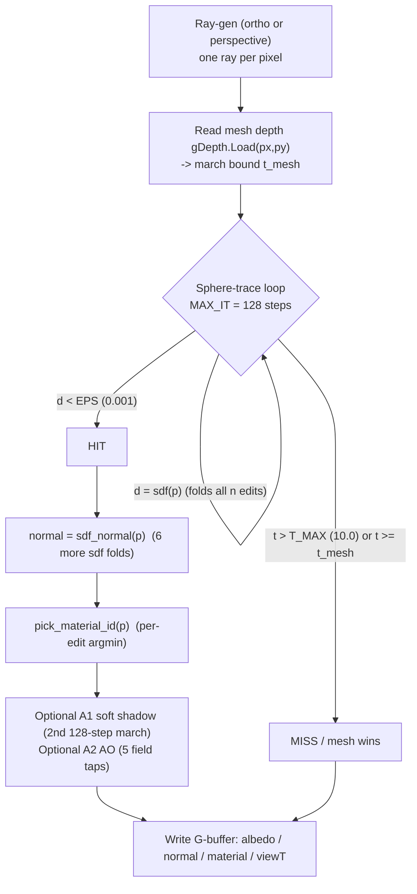
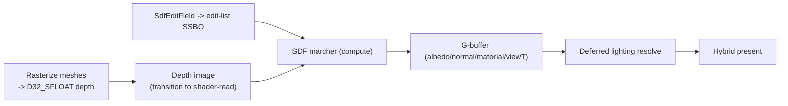

# SDF Rendering

The SDF renderer draws solids by **sphere-tracing a signed-distance field** instead of
rasterizing triangles. The scene is an ordered **CSG edit list** — spheres and boxes
combined by union / subtraction / intersection, optionally smoothed — and every pixel
marches a ray through that field until it hits a surface. The result composites with
ordinary rasterized meshes through a **shared depth buffer**, so SDF geometry and
triangle meshes occlude each other correctly in one image.

This page describes what is actually shipped. The default on-screen path is **brute-force,
per-pixel analytic sphere-tracing** — exact, sharp-edged, and bit-identical to the CPU
field used by physics. A GPU brick-atlas accelerator (empty-space skip + a sampled
surface cache + clip-map LOD) is also shipped, but it is **opt-in and OFF by default**;
its later rungs (VRAM-resident streaming) are deferred. The honest performance story is
in [Performance and the brick atlas](#performance-and-the-brick-atlas) below.

For the field math itself (the smooth-min polynomials, the normal, the determinism
contract) see [Shader eDSL](shader-edsl.md). For where this sits in the frame see
[Rendering Overview](overview.md).

## Why this design

- **CPU-orchestrate / GPU-execute.** The CPU owns the edit list (the authority). The GPU
  marches it. There is **no per-frame readback** of the rendered image into engine logic.
- **One field, shared by render and physics.** The exact same arithmetic folds on the GPU
  marcher, on a CPU "golden" mirror used as a test oracle, and in the physics
  narrowphase. Physics never reads back the GPU — it samples the *same analytic field* on
  the CPU. See [Physics](../simulation/physics.md).
- **Exact CSG.** Because the field is evaluated analytically (not sampled from a voxel
  grid), edges stay infinitely sharp. Brick-based engines round corners to voxel size to
  get their cache; the default path here keeps them exact.
- **In-house, no FFI in the seam.** The marcher is a compute shader on the engine's own
  RHI over raw-FFI Vulkan. See [RHI](rhi.md).

## The scene model: the SDF edit list

A scene is an ordered list of [`SdfEdit`]s. Each edit is a primitive (sphere or box), a
center, size parameters, a boolean op, and an optional `smoothness` (the smooth-min /
smooth-max blend radius; `0.0` = a hard boolean). The list is folded in order: edit `0`
seeds the accumulated distance, each later edit `combine`s into it.

The list capacity is fixed at compile time:
[`MAX_SDF_EDITS = 16`](https://github.com/bluesteelll/boyko-engine/blob/ecs/crates/boyko_sdf_math/src/lib.rs#L101).
This cap is what bounds the brute-force cost today (see below).

The authority that owns the edits is [`SdfEditField`] — a `#[repr(C)]` block whose hot
`[SdfEdit; 16]` array is byte-identical to the layout the GPU reads and the layout the
physics kernel streams. Building one is plain host code:

```rust,ignore
use boyko_sdf_math::{SdfEdit, SdfEditField, sdf_op};

// A rounded "peanut": two spheres joined by a smooth-min, minus a box bite.
let mut field = SdfEditField::new();

field.push(SdfEdit::sphere(
    [-0.4, 0.0, 0.0], // center
    0.5,              // radius
    sdf_op::UNION,
    0.0,              // hard union (first edit seeds the field)
));
field.push(SdfEdit::sphere(
    [0.4, 0.0, 0.0],
    0.5,
    sdf_op::UNION,
    0.25,             // smoothness > 0 -> the two spheres blend (smooth-min)
));
field.push(SdfEdit::box_shape(
    [0.0, 0.5, 0.0],
    [0.3, 0.3, 0.3],  // half-extents
    sdf_op::SUBTRACT, // carve a box out of the top
    0.0,
));

assert_eq!(field.edits().len(), 3);
```

`SdfEditField` also exposes [`set_edit`], [`move_edit`], and [`clear_dirty`]. Mutations
bump a generation stamp and track a per-edit "swept" AABB (the union of an edit's old and
new bounds), which is what feeds the optional brick re-bake — see below. The kernel-hot
`edits` array stays first and untouched; the AABB bookkeeping is cold metadata that the
field-fold hot path never reads.

> The edit list is fed at the `boyko_sdf_math` authority level. There is no high-level ECS
> "SdfEdit component" wrapper yet — the renderer consumes the `SdfEditField` authority and
> uploads it into the GPU edit-list buffer.

## The marcher

The production marcher is the compute shader
[`sdf_gbuffer_composite.hlsl`](https://github.com/bluesteelll/boyko-engine/blob/ecs/crates/boyko_rhi_vulkan/shaders/sdf_gbuffer_composite.hlsl)
— **one compute thread per pixel**, writing an offscreen MRT G-buffer (albedo, normal,
material, and a view-`t` lane). It pulls the field math from the shared header
[`sdf_field.hlsli`](https://github.com/bluesteelll/boyko-engine/blob/ecs/crates/boyko_rhi_vulkan/shaders/sdf_field.hlsli),
the single field gateway for the whole engine.

The per-pixel flow:



Key facts, all from the shader:

- **Sphere-tracing (Hart).** Each step advances by the field distance `d`, the classic
  adaptive empty-space skip. The hit threshold is `EPS = 0.001`, the miss bound
  `T_MAX = 10.0`, the step ceiling `MAX_IT = 128`.
- **Over-relaxation (Keinert, B1).** The live step is `t += ω·d` with `ω = 1.2`
  ([`DEFAULT_MARCHER_OMEGA`](https://github.com/bluesteelll/boyko-engine/blob/ecs/crates/boyko_rhi_vulkan/src/compute.rs)),
  with an exact-retreat safeguard so an overshoot falls back to a provably hole-free plain
  re-march. At `ω = 1.0` the loop is textually the frozen plain sphere-trace.
- **Analytic shadows and AO.** `lighting_flags` gate two consumers: A1 soft shadows
  (`sdf_soft_shadow`, a Quilez clamped-step penumbra — a *second* up-to-128-step march per
  lit pixel) and A2 ambient occlusion (`sdf_ao`, five field taps along the normal). Both
  call the frozen `field_distance`; they never touch the field math itself. These are the
  analytic shadow/AO referenced by the audit — there is no baked GI.
- **Normals** come from central differences of the whole edit-list field
  (`sdf_normal`), so a hit costs six more field folds; the normal is octahedral-encoded
  into the G-buffer.

The lit shading then runs in a separate deferred resolve pass, not in the marcher — see
[Lighting](lighting.md).

## Mesh ↔ SDF shared depth (hybrid present)

SDF solids and rasterized triangle meshes compose into one image through a **shared depth
buffer**. A real GPU-rasterized mesh writes its depth into a `D32_SFLOAT` attachment; the
marcher reads that depth per pixel (`gDepth.Load(...)`) and uses it as the march's far
bound `t_mesh`. If the SDF ray reaches `t_mesh` before it hits, the mesh wins that pixel;
if the SDF hits closer, the SDF wins. The two occlude each other for free, and the mesh
depth also kills rays early (a cheap upper bound on march length).



The image-based marcher (`sdf_gbuffer_composite.hlsl`) is the production form; it is a
verbatim derivative of the earlier packed-buffer rung
([`sdf_depth_composite.hlsl`](https://github.com/bluesteelll/boyko-engine/blob/ecs/crates/boyko_rhi_vulkan/shaders/sdf_depth_composite.hlsl)),
which carried depth and pixels inside one structured buffer. The field math is identical
between them; only the I/O (sampled depth image + storage-image G-buffer vs. packed buffer
regions) differs.

## Performance and the brick atlas

Be clear about the default cost. The on-screen path is **brute-force**: every march step
calls `sdf(p)`, which re-folds the **entire edit list** from scratch. There is no distance
cache between pixels, steps, or frames, and no BVH or per-edit skip inside the fold — every
step touches all `n` edits. Per-pixel cost is therefore roughly:

```text
O(pixels × march_steps × edits)
```

A worst-case fully-lit pixel folds the field on the order of ~128 (primary march) + 6
(normal) + up to 128 (A1 shadow) + 5 (A2 AO) times, each over up to `n` edits. This is
bounded today only because `MAX_SDF_EDITS = 16`. It is a deliberate, documented trade — it
buys exact CSG and the one shared field — not an oversight. See
[`docs/SDF-PERF-AUDIT.md`](https://github.com/bluesteelll/boyko-engine/blob/ecs/docs/SDF-PERF-AUDIT.md).

| Path | Per-step field cost | Status |
|------|--------------------|--------|
| Analytic fold (`sdf`) | `O(edits)`, re-folded every step | **Default, on-screen** |
| Hart sphere-trace (step by `d`) | — | Shipped |
| Keinert over-relaxation (`ω = 1.2`) | — | Shipped (on by default) |
| Mesh-depth march bound | — | Shipped (on by default) |
| A1 soft shadows / A2 AO (analytic) | extra field marches/taps | Shipped (flag-gated, on in the demo) |
| P4b coarse tile-cull (`sdf_tile_cull.hlsl`) | skip empty 8×8 tiles, seed `near_t` | Built + golden; **OFF in the windowed present** |
| Brick atlas (M1/M2/M4) | `O(1)` fetch inside surface bricks; skip empty bricks | Shipped, **opt-in, OFF by default** |
| VRAM-resident brick streaming (M5b) | — | **Deferred** |

### The coarse tile-cull (built but off on screen)

A conservative 1/8-resolution coarse cone-cull pre-pass
([`sdf_tile_cull.hlsl`](https://github.com/bluesteelll/boyko-engine/blob/ecs/crates/boyko_rhi_vulkan/shaders/sdf_tile_cull.hlsl))
computes a per-8×8-tile `near_t` / empty flag; the fine marcher can then skip empty tiles
and seed `t = near_t`. It is built, tested, and golden-proven conservative — but the
windowed present hard-codes `coarse_enabled = 0`, so on-screen it is currently inactive.
Flipping it on is the lowest-effort real win available.

### The brick atlas (shipped, opt-in)

The brick atlas is the cache-and-interpolate accelerator behind the stable
`field_distance` swap-point. It is shipped as **runtime-gated** code in the marcher, with
every gate **OFF by default** so the windowed present stays byte-identical to the pure
analytic path. It turns on per-frame (no pipeline re-record) when a baked brick clipmap is
bound and the push gates are set — the owner's A/B toggle.

What is shipped:

- **M1 — empty-space skip.** A dense pointer grid of [`BrickClass`] codes
  (`EmptyOutside` / `EmptyInside` / `Surface`), built CPU-side by
  [`build_pointer_grid`] from the one edit authority via a **conservative classifier**
  ([`classify_brick`]): a brick is called empty only when no edit AABB overlaps it. The
  marcher skips an `EmptyOutside` brick straight to its AABB exit. Hit and normal stay
  analytic.
- **M2 — sampled surface cache + exact cubic.** Inside a `Surface` brick the marcher
  reads an 8³ narrow-band `R8_SNORM` atlas (with a 1-voxel apron) and finds the ray ↔
  trilinear-isosurface crossing with the **JCGT-2022 cubic** + Marmitt root-finder, then
  validates the candidate against the exact analytic field (the exact-CSG fallback).
- **M4 — clip-map LOD.** Nested camera-centered pointer grids / atlases at coarser levels.
- **M5a — toroidal streaming math.** The CPU-side scroll math ([`toroidal_slot`] and the
  revealed-cell slab) so a level can scroll and re-bake only the cells a move reveals.

> **A note on trilinear-as-lower-bound.** An early plan stored trilinear samples as a
> *conservative lower bound* on the field so the marcher could sphere-trace the sampled
> grid directly. That approach was **falsified** near curved and creased surfaces and
> abandoned. The shipped M2 path instead intersects the trilinear *isosurface* analytically
> (the JCGT cubic) and falls back to the exact field at creases — it does not treat a raw
> sample as a distance bound.

What is **deferred**:

- **M5b — VRAM-resident brick streaming** (keeping the atlas live in device memory across
  scrolls) is not shipped.
- **No baked global illumination**, no BVH over edits, no incremental per-frame brick
  re-bake budget in the live present.

When the brick atlas is enabled, the host bakes the bricks from the **same**
[`SdfEditField`] authority (principle 0 — no parallel field store), uploads them, and the
marcher fetches them; the analytic `field_distance` remains the frozen reference and the
physics source of truth. Baking/uploading is `boyko_rhi_vulkan`'s
`brick_atlas::BrickClipmap` (`rebake(&ctx, &field)`).

## Determinism and the shared field

The arithmetic in `sdf_field.hlsli` is byte-shared across the GPU marcher, the CPU golden
mirror, and the CPU physics evaluator
([`boyko_sdf_math::sdf_edit_list`]). No fast-math, no reordered FMA, no `rsqrt`. Any
divergence would break the golden-image test gate *and* the render↔physics geometric
agreement. The smooth-min / smooth-max bodies in that header are machine-generated from a
single Rust source (the [Shader eDSL](shader-edsl.md)) so the HLSL and Rust field can never
silently drift.

A second invariant the marcher relies on: every op composing `field_distance` returns a
**conservative lower bound** on the true Euclidean distance (the Hart precondition), so a
march step can never overshoot the surface. The analytic primitives are exact; smooth-min /
smooth-max under-report inside the blend band, so the bound holds. Cone-trace consumers
(shadow / AO) further divide the reported distance by a √2 Lipschitz constant
(`FIELD_LIPSCHITZ_L`) to stay conservative under the super-Lipschitz smooth-min.

## See also

- [Shader eDSL](shader-edsl.md) — the single-sourced field math (smooth-min, normal, the
  cubic) and the determinism contract.
- [Rendering Overview](overview.md) — where the SDF marcher sits in the frame.
- [Lighting](lighting.md) — the deferred resolve that shades the SDF G-buffer.
- [Physics](../simulation/physics.md) — the CPU narrowphase that samples the same field.
- [RHI](rhi.md) — the in-house Vulkan layer the marcher runs on.
- Source: [`sdf_gbuffer_composite.hlsl`](https://github.com/bluesteelll/boyko-engine/blob/ecs/crates/boyko_rhi_vulkan/shaders/sdf_gbuffer_composite.hlsl),
  [`sdf_field.hlsli`](https://github.com/bluesteelll/boyko-engine/blob/ecs/crates/boyko_rhi_vulkan/shaders/sdf_field.hlsli),
  [`boyko_sdf_math`](https://github.com/bluesteelll/boyko-engine/blob/ecs/crates/boyko_sdf_math/src/lib.rs),
  [`brick.rs`](https://github.com/bluesteelll/boyko-engine/blob/ecs/crates/boyko_sdf_math/src/brick.rs),
  [`SDF-PERF-AUDIT.md`](https://github.com/bluesteelll/boyko-engine/blob/ecs/docs/SDF-PERF-AUDIT.md).

[`SdfEdit`]: https://github.com/bluesteelll/boyko-engine/blob/ecs/crates/boyko_sdf_math/src/lib.rs#L122
[`SdfEditField`]: https://github.com/bluesteelll/boyko-engine/blob/ecs/crates/boyko_sdf_math/src/lib.rs#L285
[`set_edit`]: https://github.com/bluesteelll/boyko-engine/blob/ecs/crates/boyko_sdf_math/src/lib.rs#L445
[`move_edit`]: https://github.com/bluesteelll/boyko-engine/blob/ecs/crates/boyko_sdf_math/src/lib.rs#L462
[`clear_dirty`]: https://github.com/bluesteelll/boyko-engine/blob/ecs/crates/boyko_sdf_math/src/lib.rs#L477
[`BrickClass`]: https://github.com/bluesteelll/boyko-engine/blob/ecs/crates/boyko_sdf_math/src/lib.rs#L313
[`classify_brick`]: https://github.com/bluesteelll/boyko-engine/blob/ecs/crates/boyko_sdf_math/src/brick.rs#L763
[`build_pointer_grid`]: https://github.com/bluesteelll/boyko-engine/blob/ecs/crates/boyko_sdf_math/src/brick.rs#L913
[`toroidal_slot`]: https://github.com/bluesteelll/boyko-engine/blob/ecs/crates/boyko_sdf_math/src/brick.rs#L421
[`boyko_sdf_math::sdf_edit_list`]: https://github.com/bluesteelll/boyko-engine/blob/ecs/crates/boyko_sdf_math/src/lib.rs#L668
