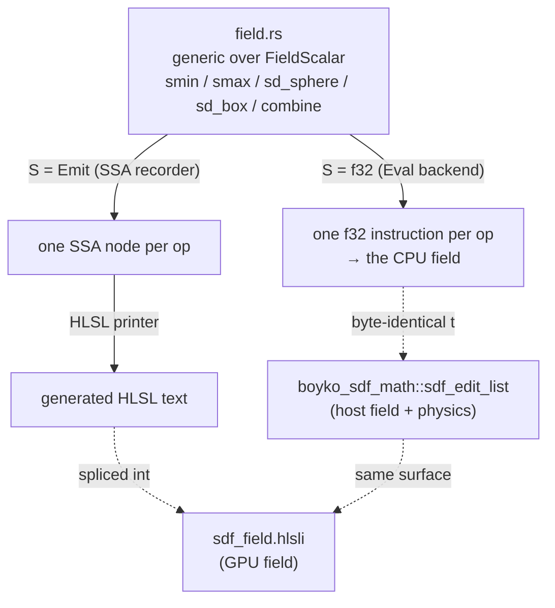
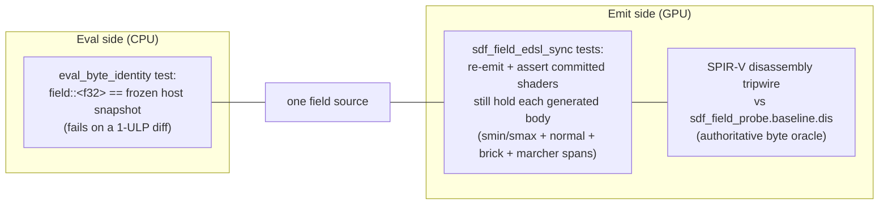

# Shader eDSL

`boyko_shaderdsl` is the in-house Rust shader embedded DSL that lets the engine
author the SDF *field math* — and the SDF *marcher control flow* — **once** and run
it in two places: on the CPU as plain `f32` machine code, and on the GPU as
generated HLSL, with a guarantee that the two can never silently drift apart.

The field math (sphere/box distances, the polynomial smooth-min/-max, the CSG
fold) is the geometric source of truth shared by the [SDF renderer](sdf.md), the
host golden-image oracle, and the CPU physics evaluator (`boyko_sdf_math`). When
that math lives in two hand-written copies — a Rust copy and an HLSL copy — they
drift: an operand reordered on one side, a `lerp` rewritten on the other, and the
GPU surface no longer matches what physics thinks the surface is. That class of
bug (black surfaces, ambient-occlusion craters) cost the project roughly five
separate field-drift fixes before this crate existed.

The eDSL kills the duplication at the root. There is **one** generic field body.
You instantiate it over a `f32` backend to get the CPU field, or over an `Emit`
backend to *print* the HLSL. Same source, two outputs.

> **Status.** Two stages ship today, both enforced in CI. **Stage 1 — the FIELD
> math** (`smin`/`smax`, the primitive distances, the CSG fold) is the foundation:
> one generic body, an Eval (`f32`) instantiation and an Emit (HLSL) instantiation.
> **The marcher control-flow stage** is also shipped — a `cf` control-flow backend
> (`cf::{Cf, EvalCf, Flow, LoopOp}`) drives generated runtime-`[loop]` GPU spans
> for the soft-shadow penumbra march, the surface-hit refine, the brick-exit
> empty-skip, the regula-falsi root refine, the B1 over-relaxation spans, the
> clip-map level selector, and the brick-AABB ray-span clip. Every one of those
> spans is checked verbatim against the committed shader by a per-leaf drift test.
> The one piece that stays deliberately hand-written is the **host-side** marchers
> (the "firewall" — see [What is in scope](#what-is-in-scope--and-what-is-not-honesty));
> only the GPU spans are generated from the eDSL.

## The core idea: dual instantiation, no transpiler

The pattern is operator overloading over a scalar trait. There is **no runtime
AST and no transpiler** — the generic field body is ordinary monomorphized Rust.

- The `f32` instantiation **is the machine code.** Each op lowers to one hardware
  `f32` instruction; the monomorphized field collapses to exactly the code the
  hand-written field would have been.
- The `Emit` instantiation **is the codegen.** Each op appends one SSA node to a
  build-time arena; a printer walks the arena into HLSL text.



The single source is
[`crates/boyko_shaderdsl/src/field.rs`](https://github.com/bluesteelll/boyko-engine/blob/ecs/crates/boyko_shaderdsl/src/field.rs).
The frozen GPU reference it reproduces is
[`crates/boyko_rhi_vulkan/shaders/sdf_field.hlsli`](https://github.com/bluesteelll/boyko-engine/blob/ecs/crates/boyko_rhi_vulkan/shaders/sdf_field.hlsli).

## The `FieldScalar` backend

[`scalar::FieldScalar`](https://github.com/bluesteelll/boyko-engine/blob/ecs/crates/boyko_shaderdsl/src/scalar.rs#L36)
is the scalar abstraction the field body is written against. It exposes *exactly*
the op-set the SDF edit-list field needs — no general-purpose math library, just
the ops the frozen field folds: `add`/`sub`/`mul`/`div`/`neg`, `min`/`max`,
`clamp01`, `lerp`, `abs`, `sqrt`, a value `select` plus the comparison masks, the
op-discriminant equality, and the two backend-specific hooks `grad_offsets` and
`v_normalize` for the surface normal. Each backend also supplies a `Vec3`
associated type (`[Self; 3]` for both) and a `Mask` type (`bool` for Eval, an SSA
node for `Emit`).

```rust,ignore
pub trait FieldScalar: Copy {
    type Vec3: Copy;
    type Mask: Copy;
    type Int: Copy;

    fn lit(x: f32) -> Self;
    fn add(self, rhs: Self) -> Self;
    fn sub(self, rhs: Self) -> Self;
    fn mul(self, rhs: Self) -> Self;
    fn div(self, rhs: Self) -> Self;
    fn min(self, rhs: Self) -> Self;
    fn max(self, rhs: Self) -> Self;
    fn clamp01(self) -> Self;                 // clamp(_, 0.0, 1.0)
    fn lerp(self, a: Self, h: Self) -> Self;  // self + (a - self) * h
    fn sqrt(self) -> Self;
    fn select(cond: Self::Mask, t: Self, e: Self) -> Self;
    fn gt(self, rhs: Self) -> Self::Mask;
    // ... and the rest of the audited op-set
}
```

Every method is `#[inline]`. Inlining is what lets the monomorphized field
collapse to the hand-written code on the Eval side — the zero-cost guarantee.

### The Eval backend (`S = f32`)

[`impl FieldScalar for f32`](https://github.com/bluesteelll/boyko-engine/blob/ecs/crates/boyko_shaderdsl/src/scalar.rs#L214)
is a literal byte-mirror of the frozen field arithmetic. `add` is `self + rhs`;
`min` is `f32::min`; `clamp01` is `self.clamp(0.0, 1.0)`; `lerp` is
`self + (a - self) * h` — the exact two-rounding form the frozen `smin` writes.
The comparison ops return `bool`; `select` is a plain `if cond { t } else { e }`
(a branchless CMOV — both arms are already computed, so there is no UB and no
data-dependent control flow).

Operand order is load-bearing. The determinism contract on the frozen field
forbids any reassociation: no fast-math, no contracted FMA, no `rsqrt`/`rcp`,
plain IEEE only. A single reordered operand could push a committed GPU golden
past its `±2/255` tolerance. So the Eval body writes operands in the same order
as the frozen reference — making it a *refactor*, not a rewrite. `boyko_sdf_math`
then **delegates** its host field to this generic body, so the CPU field and the
physics field are literally this code.

### The Emit backend (`S = Emit`)

[`emit::Emit`](https://github.com/bluesteelll/boyko-engine/blob/ecs/crates/boyko_shaderdsl/src/emit.rs#L372)
is a `#[repr(transparent)]` `u32` — a handle into a build-time SSA arena. Each
`FieldScalar` op pushes one `Node` (e.g. `Node::Add(a, b)`, `Node::Lerp(s, a, h)`)
and returns its arena index, so the arena is a topologically-ordered DAG (a node
only ever references strictly-smaller indices). The printer then walks the arena,
materializing each node as one `float tN = …;` SSA temp and emitting shared
subtrees once.

The arena is a thread-local `Vec<Node>`, so the by-value `FieldScalar` ops can
append without threading a `&mut arena` through the generic field signature. This
is build-time codegen tooling, **not** a hot path — the engine's no-alloc /
lock-free rules do not apply to it, and a physics build never links it (see the
feature gating below).

## What is generated

Running the `emit_field` bin prints every generated HLSL body — the field math
(`smin`/`smax`), the surface-normal leaf, the brick decode/cubic leaves, and the
marcher control-flow spans:

```powershell
cargo run -p boyko_shaderdsl --features emit --bin emit_field
```

The control-flow spans are traced over a second backend,
[`cf::Cf`](https://github.com/bluesteelll/boyko-engine/blob/ecs/crates/boyko_shaderdsl/src/cf.rs),
which records loops, breaks, continues, and early returns the same way
`FieldScalar` records arithmetic: `EvalCf` runs them on the CPU, `EmitCf` prints
them as HLSL `[loop]`/`[unroll]` control flow. The host-side marchers stay
hand-written behind that seam (see [What is in scope](#what-is-in-scope--and-what-is-not-honesty)).

For example, the generic `smin`
([`field::smin`](https://github.com/bluesteelll/boyko-engine/blob/ecs/crates/boyko_shaderdsl/src/field.rs#L76)) —

```rust,ignore
// hh = clamp(0.5 + 0.5 * (b - a) / k, 0, 1)
let hh = half.add(half.mul(b.sub(a)).div(k)).clamp01();
// lerp(b, a, hh) - k * hh * (1 - hh)
b.lerp(a, hh).sub(k.mul(hh).mul(one.sub(hh)))
```

— traces, over `Emit`, into the HLSL spliced verbatim into `sdf_field.hlsli`:

```hlsl
// generated — do not hand-edit; edit boyko_shaderdsl::field and re-emit
float smin(float a, float b, float k) {
    float t0 = b - a;
    float t1 = 0.5 * t0;
    float t2 = t1 / k;
    float t3 = 0.5 + t2;
    float t4 = clamp(t3, 0.0, 1.0);
    float t5 = lerp(b, a, t4);
    float t6 = k * t4;
    float t7 = 1.0 - t4;
    float t8 = t6 * t7;
    float t9 = t5 - t8;
    return t9;
}
```

The generated bodies are pasted between `// === GENERATED FIELD MATH BEGIN/END ===`
sentinels in the header. The bin only **prints** — it does not splice or
recompile any `.spv`; a developer re-splices and re-runs DXC.

## What is in scope — and what is not (honesty)

The CI-enforced generated surface spans both stages:

- **Field math** — `smin` and `smax` (and `combine`'s calls to them). These are
  byte-identical to the committed `sdf_field.hlsli`.
- **The surface-normal leaf** — `sdf_normal`, the central-difference gradient of
  the whole edit-list field.
- **The brick decode/cubic leaves** — `m2_decode` (`decode_snorm8`), `m2_cubic_eval`
  (Horner), and `m2_jcgt_cubic_coeffs` (the trilinear → cubic-coefficient fold).
- **The marcher control-flow spans** — `dist_to_brick_exit`, `brick_cell_class`,
  `m2_regula_falsi`, `sdf_soft_shadow`, `m2_surface_hit_refine`, `b1_accept_refine`,
  `b1_decl_hit`/`b1_decl_exhausted`, `b1_exhaustion_remarch`, `b1_sor_retreat`,
  `select_level`, and `m2_brick_span`.

Each of those is asserted against the committed shader by its own drift test in
[`sdf_field_edsl_sync.rs`](https://github.com/bluesteelll/boyko-engine/blob/ecs/crates/boyko_rhi_vulkan/tests/sdf_field_edsl_sync.rs)
(the `*_matches_edsl_emit` tests).

Some deliberate exclusions remain:

- **`combine` stays hand-written.** Its `(k > 0.0) ? smooth : hard` choice is a
  *lazy* ternary that lowers to `OpBranchConditional`/`OpPhi`; the eager
  `OpSelect` the `Emit` backend would record forks the committed SPIR-V. `combine`
  carries no polynomial field math — only calls to the generated `smin`/`smax` —
  so leaving it hand-written keeps the `.spv` byte-stable. This is a recorded
  decision, not a gap.
- **No `precise` qualifier is emitted.** The printer emits plain `float` temps to
  match the frozen, non-`precise` header, so the generated SSA compiles to SPIR-V
  byte-identical to the prior hand-frozen bodies.
- **The host-side marchers stay hand-written (the firewall).** The eDSL generates
  only the **GPU** spans. The matching *host* routines —
  `boyko_sdf_math::brick::dist_to_brick_exit`, `host_brick_cell`,
  `boyko_sdf_math::brick::regula_falsi`, the host soft-shadow march (kept analytic,
  per the C1 decision), and the host B1 marcher — are intentionally not generated;
  each is checked against a frozen GPU-shape oracle instead. This is the "firewall
  option B" recorded in the generator modules, not a gap.

## The CI drift-guard

The whole point is that the CPU field and the GPU field cannot drift. Two
independent guards enforce it:



1. **Eval byte-identity** —
   [`tests/eval_byte_identity.rs`](https://github.com/bluesteelll/boyko-engine/blob/ecs/crates/boyko_shaderdsl/tests/eval_byte_identity.rs)
   snapshots the pre-refactor `boyko_sdf_math` field verbatim and asserts the
   generic `field::sdf_field_body::<f32>` is byte-identical to it across empty/
   full/over-cap edit lists, every op, hard and smooth blends, and non-finite
   inputs. It fails on a one-ULP divergence.
2. **Emit text-sync** —
   [`crates/boyko_rhi_vulkan/tests/sdf_field_edsl_sync.rs`](https://github.com/bluesteelll/boyko-engine/blob/ecs/crates/boyko_rhi_vulkan/tests/sdf_field_edsl_sync.rs)
   re-runs the generator and asserts the committed shaders still contain each
   generated body verbatim — one `*_matches_edsl_emit` test per leaf, covering the
   `smin`/`smax` field math, the `sdf_normal` leaf, the brick decode/cubic leaves,
   and every marcher control-flow span (`m2_regula_falsi`, `sdf_soft_shadow`,
   `m2_surface_hit_refine`, the `b1_*` spans, `select_level`, `m2_brick_span`, …).
   So if someone hand-edits a spliced HLSL span without re-emitting, CI fails
   loudly. The authoritative byte-level oracle behind it is the compiled SPIR-V: a
   disassembly tripwire compares the shader's `.spv` against the frozen
   `sdf_field_probe.baseline.dis` baseline.

By construction the two backends instantiate the same `field` body, so they
*cannot* diverge — the guards exist only to catch a human bypassing the
generator.

## `no_std`, `nightly`, and the `emit` feature

The crate is structured so a physics build never pulls in codegen machinery. Two
features, both off by default
([`Cargo.toml`](https://github.com/bluesteelll/boyko-engine/blob/ecs/crates/boyko_shaderdsl/Cargo.toml)):

- **`nightly`** — the Eval path (`scalar` + `field`) is the physics leaf and is
  `#![no_std]`-clean. The one op stable `core` lacks is `sqrt`. With `nightly`
  the crate is strictly `no_std`, using `core::intrinsics::sqrtf32`; the default
  build links `std` *solely* for `f32::sqrt`. Both lower to the same hardware
  `sqrtss`, so the Eval result is bit-identical either way — the GPU goldens are
  unaffected by the choice.
- **`emit`** — gates the entire std/codegen side: the `Emit` SSA recorder, the
  HLSL printer, and the `emit_field` bin (the bin's `required-features`). With
  `emit` off, the crate is the lean Eval-only leaf; with it on, the std-side arena
  `Vec`/`String` machinery comes in.

The crate has **zero third-party dependencies** — no `rust-gpu`, no `naga`, no
`spirv-builder`. The eDSL is plain Rust generics and a hand-written text printer,
in keeping with the engine's in-house, no-FFI-in-the-seam stance.

## See also

- [SDF rendering](sdf.md) — where the generated field is consumed (the
  sphere-trace marcher, the `field_distance` gateway, the brick backend).
- [Rendering overview](overview.md) — the CPU-orchestrate / GPU-execute,
  zero-readback rendering model.
- [Simulation: SDF math](../simulation/math.md) — `boyko_sdf_math`, whose host
  field delegates to the eDSL's Eval backend (the same field physics evaluates).
