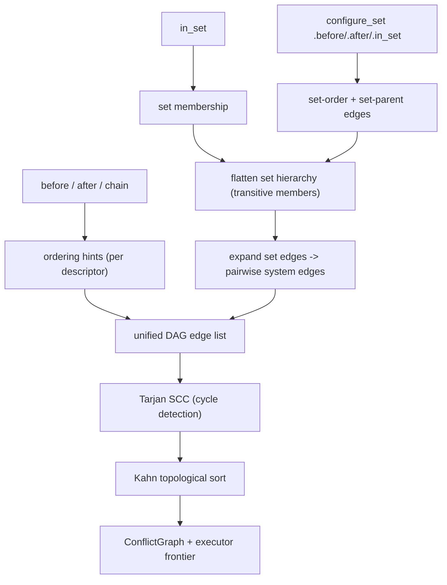

# System Ordering & Sets

By default the scheduler is free to run any two systems in parallel and in any
relative order — that freedom is where the engine's throughput comes from. When
two systems *do* have a real data dependency that the access analysis cannot see,
you constrain them explicitly: `.before(key)`, `.after(key)`, and `.in_set(set)`
add ordering edges; `configure_set` orders whole groups at once.

These constraints are not a runtime cost. They are consumed once, at
[`ScheduleBuilder::build`](https://github.com/bluesteelll/boyko-engine/blob/ecs/crates/boyko_ecs/src/ecs/core/schedule/schedule_builder.rs#L313),
and baked into a topological order. At frame time the executor already knows the
layout — there is no per-frame sorting, no dynamic dependency check.

If you come from Bevy the shape will be familiar. The difference is the *handle*:
ordering targets a `SystemKey` returned by `add_system`, not a system function or
a label type. See [Systems](../concepts/systems.md) for what a system is and
[The Scheduler](../scheduler.md) for how the conflict graph and executor turn
this DAG into parallel work.

## Why you rarely need ordering

The scheduler derives a [conflict graph](../scheduler.md) from each system's
declared `Access` (which components/resources it reads and writes). Two systems
that touch disjoint data, or that only read shared data, are independent and may
run concurrently. Two systems that write the same column conflict, and the
executor serializes them automatically — in *some* order, but a valid one.

So you reach for explicit ordering only when the order is part of your logic, not
your data layout. Classic cases:

- a system that *produces* state another must *consume* in the same frame
  (input -> intent -> movement);
- a setup system that must run before everything in a group;
- ordering across an [event](../concepts/events.md) hand-off where the access
  analysis sees no conflict but your semantics demand "writer first".

When you don't add an edge, you are telling the scheduler "either order is
correct" — which is the fast path. Add edges deliberately.

## The `SystemKey` handle

`ScheduleBuilder::add_system` returns a
[`SystemConfig`](https://github.com/bluesteelll/boyko-engine/blob/ecs/crates/boyko_ecs/src/ecs/core/schedule/system_config.rs#L41),
a single-use fluent handle for the system you just registered. Call
[`.key()`](https://github.com/bluesteelll/boyko-engine/blob/ecs/crates/boyko_ecs/src/ecs/core/schedule/system_config.rs#L55)
to extract that system's `SystemKey` — a stable, opaque pre-build id you pass into
a *sibling's* `.before(...)` / `.after(...)`.

> The handle method is `.key()`, returning a `SystemKey`. There is **no** `.id()`
> on `SystemConfig`. (`.id()` exists only on `ConfigureSet`, where it returns a
> `SystemSetId`.) `.before()` / `.after()` / `.chain()` each take a `SystemKey`.

```rust,ignore
use boyko_ecs::prelude::*;

fn read_input() {}
fn apply_movement() {}

let mut app = App::new();
app.add_systems_cfg(|builder| {
    // Register the upstream system and grab its key.
    let input = builder.add_system(read_input).key();

    // Order the downstream system relative to that key.
    builder.add_system(apply_movement).after(input);
});
```

`add_systems_cfg` hands you the raw `&mut ScheduleBuilder` so the full chaining
API is available verbatim. `App::add_systems(system)` is the shorthand for a
single system with no ordering — it discards the returned `SystemConfig`. See
[Plugins & App](../app/plugins.md) for where the builder lives in the App
lifecycle.

## Pairwise ordering: `before` / `after` / `chain`

All three register one DAG edge against the *same* graph the topological sort
consumes. They differ only in direction and in how a cycle is reported.

| Method | Reads as | DAG edge |
|--------|----------|----------|
| `a_cfg.before(b)` | `a` finishes before `b` starts | `a -> b` |
| `a_cfg.after(b)` | `a` starts after `b` finishes | `b -> a` |
| `a_cfg.chain(b)` | strict serial `a -> b` | `a -> b` |

`before` and `after` are symmetric — `x.before(y)` and `y.after(x)` produce the
identical edge. `chain` is the same graph edge as `before` but kept as a distinct
variant so a cycle-diagnostic message can name the exact builder call you wrote.

Chaining is fluent and each call returns the handle, so you can stack edges:

```rust,ignore
use boyko_ecs::prelude::*;

fn spawn_world() {}
fn build_index() {}
fn run_ai() {}
fn integrate() {}

let mut app = App::new();
app.add_systems_cfg(|builder| {
    let spawn = builder.add_system(spawn_world).key();
    let index = builder.add_system(build_index).after(spawn).key();

    // `run_ai` must run after the index is built but before integration.
    let integrate_key = builder.add_system(integrate).key();
    builder
        .add_system(run_ai)
        .after(index)
        .before(integrate_key);
});
```

Order your `add_system` calls so the key you need already exists. A key is the
descriptor's insertion index, valid only for the builder that produced it —
passing a key into the wrong builder is rejected at build with `boyko-B9005`.

## System sets

A **system set** is a named group. Instead of wiring N×M pairwise edges between
two phases, you order the *sets* and let `build` expand the membership into the
concrete edges for you. A set is any `Send + Sync + 'static` type that implements
[`SystemSet`](https://github.com/bluesteelll/boyko-engine/blob/ecs/crates/boyko_ecs/src/ecs/core/schedule/system_set.rs#L56);
the ergonomic way to make one is `#[derive(SystemSet)]`.

### Defining sets with `#[derive(SystemSet)]`

```rust,ignore
use boyko_ecs::prelude::*;     // the SystemSet *trait*
use boyko_macros::SystemSet;   // the *derive* — NOT in the prelude

// A unit struct = one set (the recommended single-label shape).
#[derive(SystemSet)]
struct Physics;

// A fieldless enum = one set *per variant*, each with a distinct name.
#[derive(SystemSet)]
enum Combat {
    Target,
    Damage,
    Cleanup,
}
```

> **Import split (important).** The `SystemSet` *trait* comes from
> `boyko_ecs::prelude`. The `#[derive(SystemSet)]` *macro* lives in `boyko_macros`
> and is **not** re-exported by the prelude — import it explicitly. The same split
> applies to every derive (`Component`, `Resource`, `Bundle`, ...). See
> [Components](../concepts/components.md) for the rationale.

The derive accepts unit structs and *fieldless* enums only. Generics, unions,
data-carrying variants, and field-bearing structs are rejected at compile time —
set identity is the pair `(TypeId, discriminant)`, which a per-instance value
cannot represent.

### Joining a set with `.in_set`

```rust,ignore
use boyko_ecs::prelude::*;
use boyko_macros::SystemSet;

#[derive(SystemSet)]
struct Physics;

fn broad_phase() {}
fn solve_contacts() {}
fn integrate() {}

let mut app = App::new();
app.add_systems_cfg(|builder| {
    builder.add_system(broad_phase).in_set(Physics);
    builder.add_system(solve_contacts).in_set(Physics);
    builder.add_system(integrate).in_set(Physics);
});
```

Membership *alone* adds no ordering — three systems in `Physics` still run in any
order relative to each other. What membership buys you is a single name to order
against: order `Physics` relative to another set or system, and every member
inherits the constraint.

### Ordering sets with `configure_set`

[`configure_set(set)`](https://github.com/bluesteelll/boyko-engine/blob/ecs/crates/boyko_ecs/src/ecs/core/schedule/schedule_builder.rs#L206)
returns a
[`ConfigureSet`](https://github.com/bluesteelll/boyko-engine/blob/ecs/crates/boyko_ecs/src/ecs/core/schedule/schedule_builder.rs#L708)
handle to order one set relative to another (`.before` / `.after`), nest it in a
parent (`.in_set`), or gate the whole set with a
[run condition](run-conditions.md) (`.run_if`). All targets are taken **by value**,
so enum-variant sets work exactly like unit-struct sets.

```rust,ignore
use boyko_ecs::prelude::*;
use boyko_macros::SystemSet;

#[derive(SystemSet)]
struct Input;
#[derive(SystemSet)]
struct Physics;
#[derive(SystemSet)]
struct Render;

fn read_input() {}
fn integrate() {}
fn draw() {}

let mut app = App::new();
app.add_systems_cfg(|builder| {
    // Phase order: Input runs before Physics, Physics before Render.
    builder.configure_set(Physics).after(Input).before(Render);

    builder.add_system(read_input).in_set(Input);
    builder.add_system(integrate).in_set(Physics);
    builder.add_system(draw).in_set(Render);
});
```

`X.before(Y)` means *every* member of `X` runs before *every* member of `Y`.
At build, this single set edge expands into the pairwise system edges over the
transitive membership of each set — `read_input -> integrate`,
`integrate -> draw`. Within a phase, members are still unordered and free to run
in parallel.

`.after(set)` is the mirror of `.before(set)` (it records the same edge with the
endpoints swapped). On the system side, `SystemConfig` also has `before_set(set)`
and `after_set(set)` for ordering a single system against a whole set without
joining it.

### Nesting sets

A set can live inside a parent set via `ConfigureSet::in_set`. Members of the
child transitively join the parent, so an order placed on the parent also governs
the child's members.

```rust,ignore
use boyko_ecs::prelude::*;
use boyko_macros::SystemSet;

#[derive(SystemSet)]
enum Combat {
    Damage,
    Cleanup,
}
#[derive(SystemSet)]
struct Simulation;

let mut app = App::new();
app.add_systems_cfg(|builder| {
    // Both Combat variants nest inside Simulation.
    builder.configure_set(Combat::Damage).in_set(Simulation);
    builder.configure_set(Combat::Cleanup).in_set(Simulation);

    // Within Combat, Damage runs before Cleanup.
    builder.configure_set(Combat::Damage).before(Combat::Cleanup);
});
```

`build` flattens the hierarchy transitively (a child's members become the
parent's members) before it expands set edges, so an ordering on `Simulation`
reaches every system in either `Combat` variant.

## How an edge becomes a schedule

Every ordering call records a hint; nothing is sorted until `build`. The build
pipeline turns hints into a static, validated plan:



The expanded set edges enter the **same** edge list that pairwise
`before/after/chain` edges do. Sets are never graph nodes — they vanish after
expansion, so the executor and the conflict graph see only systems. The order
edges and the access-derived conflicts together define the partial order; the
executor runs anything whose predecessors are done, in parallel, every frame.

Because the work happens once at build time, an ordering edge costs you nothing
per frame. The trade-off you *do* pay is concurrency: an edge that isn't required
by your logic needlessly serializes two systems that could have overlapped.

## Build-time validation

`build` panics on a malformed schedule; `try_build` returns a
[`ScheduleBuildError`](https://github.com/bluesteelll/boyko-engine/blob/ecs/crates/boyko_ecs/src/ecs/core/schedule/schedule_builder.rs#L339)
instead. These are author errors caught up front, never at frame time:

| Error | Code | Meaning |
|-------|------|---------|
| Ordering cycle | `boyko-B9001` | `before/after/chain` + expanded set edges form a cycle (an SCC with > 1 node). The message lists the systems in the cycle. |
| Set-hierarchy cycle | `boyko-B9002` | `configure_set(A).in_set(B)` and `configure_set(B).in_set(A)`. |
| Shared member of ordered sets | `boyko-B9004` | One system is a member of two sets that are ordered against each other. |
| Out-of-range key/set | `boyko-B9005` | A `before/after`/`before_set` target indexes outside this builder (e.g. a key from a different builder). |

A cycle is the common one: `a.before(b)` together with `b.before(a)`, possibly
hidden through a set. The Tarjan pass finds it and names every system involved,
so you don't have to trace the graph by hand.

## Common mistakes

- **Using `.id()` on a system handle.** It doesn't exist — `SystemConfig` exposes
  `.key()`. `.id()` is the `ConfigureSet` method (it returns a `SystemSetId`).
- **Expecting `.in_set` to order members.** Membership is grouping, not ordering.
  Order the *set* with `configure_set(...).before(...)`, or order systems
  pairwise.
- **Forgetting the derive import.** `#[derive(SystemSet)]` needs
  `use boyko_macros::SystemSet;`; the prelude gives you only the trait.
- **Referencing a key before it exists.** A `SystemKey` is valid only after its
  `add_system` call and only within that builder. Register the upstream system
  first.
- **Over-constraining.** Every edge you add removes a parallelism opportunity.
  Add an edge only when the order is part of your logic, not to "be safe".

## See also

- [The Scheduler](../scheduler.md) — conflict graph, topological sort, executor.
- [Systems](../concepts/systems.md) — what a system is and how access is derived.
- [Run Conditions](run-conditions.md) — gate a system or a whole set with
  `.run_if`.
- [States](states.md) — `OnEnter` / `OnExit` set ordering built on this layer.
- [Plugins & App](../app/plugins.md) — where `add_systems_cfg` lives.
- Source:
  [system_config.rs](https://github.com/bluesteelll/boyko-engine/blob/ecs/crates/boyko_ecs/src/ecs/core/schedule/system_config.rs),
  [system_set.rs](https://github.com/bluesteelll/boyko-engine/blob/ecs/crates/boyko_ecs/src/ecs/core/schedule/system_set.rs),
  [schedule_builder.rs](https://github.com/bluesteelll/boyko-engine/blob/ecs/crates/boyko_ecs/src/ecs/core/schedule/schedule_builder.rs).
