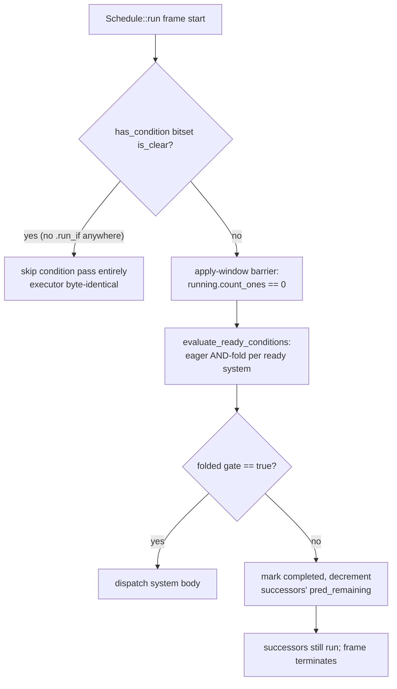

# Run Conditions

A **run condition** is a read-only predicate attached to a system (or a whole
set) that decides, every frame, whether the system's body runs. If the
predicate returns `false`, the body is skipped — but the schedule still
terminates correctly and the skipped system's successors still run.

If you come from Bevy, this is `.run_if(...)` and it behaves the way you expect.
Where boyko-engine differs is *under the hood*: conditions are evaluated in an
**isolated, single-threaded pass** at the apply-window barrier, gated by a
`has_condition` bitset so a schedule that uses no conditions pays **literally
zero** for the feature.

## A condition is just a system that returns `bool`

There is no separate "condition" type. A condition is any
`impl IntoSystem<(), bool, M>` — it reuses the entire `SystemParam` /
`FunctionSystem` machinery. That means a plain function works, and so does one
that pulls data out of the world:

```rust,ignore
use boyko_ecs::prelude::*;       // EcsMaster, ScheduleBuilder, Res, run_once, ...
use boyko_macros::Resource;      // derives are NOT in the prelude

#[derive(Resource)]
struct Paused(bool);

// A zero-arg condition.
fn always() -> bool {
    true
}

// A condition that reads a resource. `Res<T>` makes it read-only.
fn not_paused(paused: Res<Paused>) -> bool {
    !paused.0
}
```

Conditions can read anything a system param can read — `Res<T>`, a `Query<...>`,
`Local<T>` — as long as they declare **no writes**. (More on that below.)

## Attaching a condition: `.run_if`

`ScheduleBuilder::add_system` returns a [`SystemConfig`] handle. Call
[`.run_if(condition)`][run_if] on it. The body runs in a frame only if the
condition returns `true`.

```rust,ignore
use boyko_ecs::prelude::*;
use boyko_macros::Resource;

#[derive(Resource)]
struct Paused(bool);

fn step_physics() { /* ... */ }
fn not_paused(paused: Res<Paused>) -> bool { !paused.0 }

let pool = ThreadPoolBuilder::new().num_threads(4).build();
let mut builder = ScheduleBuilder::new(pool);

// Inline closure...
builder.add_system(step_physics).run_if(|paused: Res<Paused>| !paused.0);

// ...or a named fn — both are `IntoSystem<(), bool, M>`.
builder.add_system(step_physics).run_if(not_paused);

let mut world = EcsMaster::new();
world.insert_resource(Paused(false));
let mut schedule = builder.build(&mut world);
schedule.run(&mut world); // step_physics runs because Paused.0 == false
```

Through the [`App`](../app/plugins.md) facade you reach the same handle via
`add_systems_cfg`, whose closure hands you the raw `&mut ScheduleBuilder`:

```rust,ignore
use boyko_ecs::prelude::*;
use boyko_macros::Resource;

#[derive(Resource)]
struct Paused(bool);

fn step_physics() {}

let mut app = App::new();
app.insert_resource(Paused(false));
app.add_systems_cfg(|b| {
    b.add_system(step_physics)
        .run_if(|paused: Res<Paused>| !paused.0);
});
```

> The chaining handle's method is `.key() -> SystemKey`, not `.id()`. When you
> need to reference one system from another's `.before(...)` / `.after(...)`,
> capture the `SystemKey`. See [Ordering & Sets](./ordering-and-sets.md).

## `run_once`: run the body on exactly one frame

[`run_once`] is the one general-purpose built-in shipped from the
`common_conditions` module (it is re-exported from the prelude). It returns
`true` the first frame it is *evaluated* and `false` forever after — ideal for
one-shot setup that you still want inside the regular schedule.

```rust,ignore
use boyko_ecs::prelude::*; // run_once is re-exported here

fn spawn_world() { /* expensive one-time setup */ }

let pool = ThreadPoolBuilder::new().num_threads(1).build();
let mut builder = ScheduleBuilder::new(pool);
builder.add_system(spawn_world).run_if(run_once);
// spawn_world runs on frame 1 only.
```

It works by holding a `Local<bool>` inside the condition's own
`FunctionSystem::state`, which persists across frames. The flag flips to `true`
on the first evaluation; subsequent evaluations see it already set and return
`false`.

## State conditions: `in_state` / `on_enter` / `on_exit` / `on_transition`

The state machine ([States](./states.md)) ships four condition *constructors*.
Each takes the target state value(s) and returns a ready-to-use condition. They
are re-exported from the prelude:

```rust,ignore
use boyko_ecs::prelude::*; // in_state, on_enter, on_exit, on_transition, States

#[derive(Clone, PartialEq, Eq, Hash, Debug)]
enum AppState { Menu, InGame }

// `States` is a hand-implemented marker trait (no derive).
impl States for AppState {}

fn run_gameplay() {}
fn spawn_level() {}
fn teardown_menu() {}
fn fade_in() {}

let pool = ThreadPoolBuilder::new().num_threads(1).build();
let mut builder = ScheduleBuilder::new(pool);

// Holds while the current state equals the target.
builder.add_system(run_gameplay).run_if(in_state(AppState::InGame));

// Fire once, on the exact frame of the matching transition.
builder.add_system(spawn_level).run_if(on_enter(AppState::InGame));
builder.add_system(teardown_menu).run_if(on_exit(AppState::Menu));
builder.add_system(fade_in).run_if(on_transition(AppState::Menu, AppState::InGame));
```

`in_state` reads `Res<State<S>>` (shared), so any number of `in_state`-gated
systems coexist without conflicting. `on_enter` / `on_exit` / `on_transition`
read the per-`S` transition record and fire on the single frame the state
machine records the matching edge — including the synthesized initial
`none → target` transition on the first frame.

> All four panic if `State<S>` was never registered. Call
> `init_state::<S>()` / `insert_state(...)` before adding any state-gated system.
> See [States](./states.md) for the full lifecycle.

The full set of built-ins lives in
[`common_conditions.rs`](https://github.com/bluesteelll/boyko-engine/blob/ecs/crates/boyko_ecs/src/ecs/core/schedule/common_conditions.rs#L1).
Resource-existence and typed `.and`/`.or`/`.not` combinators are intentionally
not shipped yet — AND-via-chaining (next section) covers the common case.

## Multiple conditions: the eager AND-fold

Chaining `.run_if` accumulates: every condition must return `true` for the body
to run. The result is a logical AND.

```rust,ignore
use boyko_ecs::prelude::*;
use boyko_macros::Resource;

#[derive(Resource)]
struct Paused(bool);

fn save_game() {}

let pool = ThreadPoolBuilder::new().num_threads(1).build();
let mut builder = ScheduleBuilder::new(pool);

// Runs only on the FIRST frame where the game is also not paused.
builder
    .add_system(save_game)
    .run_if(run_once)
    .run_if(|paused: Res<Paused>| !paused.0);
```

The fold is **eager — there is no short-circuit**. Every condition body runs
every frame the system is reached, even if an earlier condition already returned
`false`. Internally the executor does `should_run &= r` over materialized bools,
never a control-flow `&&`.

Why eager matters: a *stateful* condition like `run_once` mutates its own
`Local` when it runs. If the fold short-circuited, an earlier `false` could
suppress `run_once`'s evaluation on some frames — and `run_once` would then fire
on a later frame instead of the first one. Evaluating every condition keeps
stateful predicates advancing on schedule. The trade-off: you cannot rely on a
cheap condition guarding an expensive one. Put cheap, side-effect-free
predicates first only for clarity; both still run.

## Conditions on a whole set

Gate a group of systems at once by attaching the condition to a
[set](./ordering-and-sets.md) via `configure_set(...).run_if(...)`. A set
condition is evaluated **once per frame** (memoized), and its result gates every
member.

```rust,ignore
use boyko_ecs::prelude::*;
use boyko_macros::{Resource, SystemSet};

#[derive(SystemSet)]
struct Gameplay;

#[derive(Resource)]
struct Paused(bool);

fn movement() {}
fn combat() {}

let pool = ThreadPoolBuilder::new().num_threads(1).build();
let mut builder = ScheduleBuilder::new(pool);

builder.add_system(movement).in_set(Gameplay);
builder.add_system(combat).in_set(Gameplay);

// One condition, evaluated once, gating BOTH members.
builder
    .configure_set(Gameplay)
    .run_if(|paused: Res<Paused>| !paused.0);
```

A system is gated by the AND of its own conditions and the conditions of every
(nested) set it belongs to. Set conditions follow the same eager-fold rule, but
their single per-frame result is cached and shared across all members rather
than re-evaluated per member.

## How it runs: the isolated, gated pass

This is where boyko-engine departs from a naive implementation, and the reason
the feature is free when unused.



Two properties carry the design:

- **0%-regression when unused.** The schedule holds a `has_condition` bitset:
  bit `i` is set iff system `i` has any own condition *or* belongs to a
  conditioned set. At the top of the per-frame executor loop a single
  `is_clear()` test (a few word ORs on a small bitset) decides whether the
  condition pass runs at all. With no `.run_if` anywhere the branch is
  predicted-not-taken across the whole run, and the dispatch hot path stays
  byte-for-byte identical to a condition-free schedule.

- **Single-threaded evaluation at the apply-window barrier.** Conditions are
  evaluated only when `running.count_ones() == 0` — no worker is live. The
  evaluator holds the dispatcher's exclusive `&mut EcsMaster`, so reading the
  world during evaluation cannot race a system. A `false` gate marks the system
  completed and decrements its successors' `pred_remaining` exactly as a real
  completion would, so ordering (`before`/`after`) and frame termination are
  unaffected.

Source:
[`schedule.rs` `evaluate_ready_conditions`](https://github.com/bluesteelll/boyko-engine/blob/ecs/crates/boyko_ecs/src/ecs/core/schedule/schedule.rs#L779),
[`system_config.rs` `run_if`](https://github.com/bluesteelll/boyko-engine/blob/ecs/crates/boyko_ecs/src/ecs/core/schedule/system_config.rs#L183).

## Conditions must be read-only

A condition must declare no component or resource writes. This is
`debug_assert!`ed at build time. The mechanics make a writing condition *sound*
(it runs single-threaded at the barrier holding the exclusive borrow), but it is
an API misuse — and crucially, **deferred work from a condition is dropped, not
applied**. Do not use `Commands` or `EventWriter` inside a condition: their
queued effects never reach the world. Keep conditions pure predicates; do the
mutation in the gated system.

## The tick-aware-condition footgun

A condition can use [change detection](../change_detection.md) — `Changed<T>`,
`Added<T>`, `Ref<T>` — to fire only when data actually changed. boyko-engine
handles the tick bookkeeping correctly, but the semantics have a sharp edge
worth understanding.

A change-detection window is `(last_run, this_run]`: "what changed since I last
*actually ran*". A condition's window advances **only on a frame it is
evaluated**, and a gated system's ticks advance **only on a frame it runs**. So
a condition that is dormant for N frames — because an earlier condition, a set
gate, or a `false` state gate kept it from being reached — resumes observing the
*entire* accumulated window when it next evaluates. It will report everything
that changed across the whole gap, not just the latest frame.

On the **first** frame, a condition observes every pre-existing value as
"changed" (its initial `last_run` is `current - MAX_CHANGE_AGE`), identical to
how a late-added system's `Changed<T>` query behaves on its first run. Don't
assume a `Changed<T>` condition is silent on frame 1.

```rust,ignore
use boyko_ecs::prelude::*;
use boyko_ecs::ecs::core::iters::query::Changed; // not in the prelude
use boyko_macros::Component;

#[derive(Component)]
struct Health(f32);

fn react_to_damage() {}

let pool = ThreadPoolBuilder::new().num_threads(1).build();
let mut builder = ScheduleBuilder::new(pool);

// Reads "did any Health change since this condition last ran?"
// Beware: dormant frames accumulate; frame 1 sees all existing Health as changed.
builder
    .add_system(react_to_damage)
    .run_if(|q: Query<(), Changed<Health>>| !q.is_empty());
```

The fix for "I missed events while gated" is not at the condition layer: route
state-spanning or gap-spanning signals through a system that is *not* gated, or
that gates on something coarser. The tick model is doing exactly what it
promises — it just promises "since I last ran", not "since last frame".

## See also

- [States](./states.md) — `in_state` / `on_enter` / `on_exit` / `on_transition`
  and the transition pass that drives them.
- [Ordering & Sets](./ordering-and-sets.md) — `before`/`after`/`in_set`,
  `configure_set`, and `SystemKey`.
- [Change Detection](../change_detection.md) — the `(last_run, this_run]` tick
  window behind tick-aware conditions.
- [Resources](../concepts/resources.md) — `Res<T>` / `ResMut<T>`; conditions may
  read resources but must not write.
