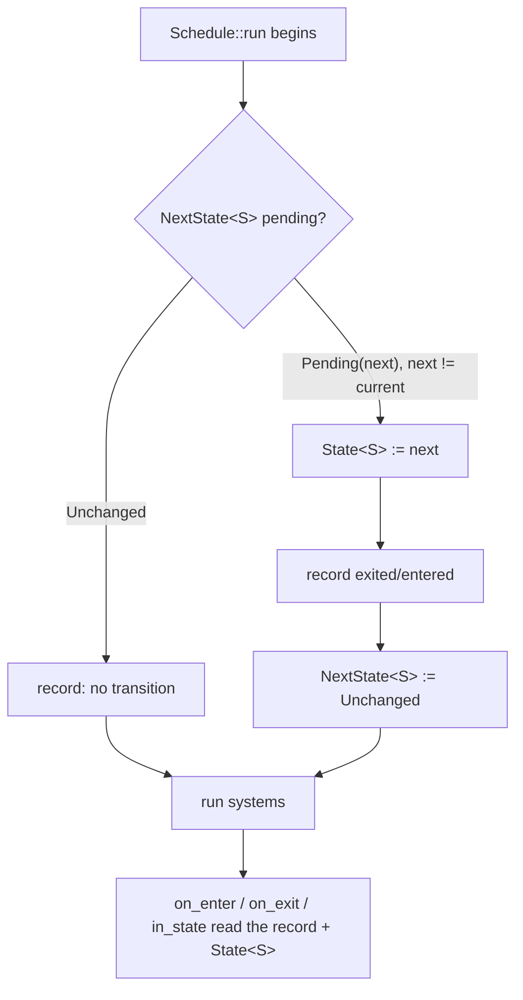

# States

A **state** is a small, world-global value that says "what mode is the game in right now" — `Menu`, `Playing`, `Paused`, `Loading`. States let you gate whole groups of systems on that mode without sprinkling `if` checks through every function: a system tagged `.run_if(in_state(Playing))` simply does not run while you sit in the menu.

boyko-engine implements states the Bevy way — as ordinary [resources](../concepts/resources.md) plus a built-in per-frame **transition pass** — but with no separate `OnEnter`/`OnExit` schedule objects. There is one [`Schedule`](../scheduler.md); enter/exit logic is just a normal system carrying an `on_enter(...)` / `on_exit(...)` [run condition](run-conditions.md). If you already know Bevy states, the mental model transfers directly; the wiring is leaner.

## The pieces

| Type / fn | Role | Lives in |
|-----------|------|----------|
| `States` (trait) | Marker your state enum implements | prelude |
| `State<S>` | Resource holding the **current** value of `S` | prelude |
| `NextState<S>` | Resource holding a **queued** transition request | prelude |
| `in_state(s)` | Run condition: true while the current value equals `s` | prelude |
| `on_enter(s)` | Run condition: true on the one frame `S` transitions *into* `s` | prelude |
| `on_exit(s)` | Run condition: true on the one frame `S` transitions *out of* `s` | prelude |
| `on_transition(a, b)` | Run condition: true on the one frame `S` goes exactly `a → b` | prelude |

All seven come straight from `use boyko_ecs::prelude::*;`. The state enum needs no derive macro at all (see below), so this is one of the rare features where the prelude glob is genuinely all you import.

## Defining a state type

`States` is a hand-implemented marker — there is intentionally **no** `#[derive(States)]`. A plain state enum enumerates nothing, so a derive would emit only a bound check with zero codegen. Write the `impl` yourself:

```rust,ignore
use boyko_ecs::prelude::*;

/// The top-level game mode. `Default == Menu`, so `init_state` boots here.
#[derive(Clone, Copy, PartialEq, Eq, Hash, Default, Debug)]
enum AppState {
    #[default]
    Menu,
    Playing,
    Paused,
}

// The whole trait body is empty — `States` is a pure marker.
impl States for AppState {}
```

The bounds `States: Send + Sync + Clone + PartialEq + Eq + Hash + 'static` exist for concrete reasons:

- **`PartialEq + Eq`** — the transition pass compares the queued value against the current one (`next != current`).
- **`Clone`** — the value moves `Pending(s) → State<S>` and is captured by value into the `in_state` / `on_enter` / `on_exit` / `on_transition` closures.
- **`Hash`** — reserved for future computed/sub-state maps; it costs nothing today (the value is never hashed at runtime) and mirrors Bevy's `States: Hash` so adding those maps stays non-breaking.
- **`Send + Sync + 'static`** — `State<S>` and `NextState<S>` are resources read across the parallel scheduler's worker threads.

A fieldless `enum` is the idiomatic shape, but any type meeting the bounds works.

## Registering a state

Register the state on the [`ScheduleBuilder`](../scheduler.md). Two entry points:

```rust,ignore
use boyko_ecs::prelude::*;
use boyko_ecs::ecs::core::schedule::ScheduleBuilder;
# fn build(pool: std::sync::Arc<ThreadPool>) {
let mut builder = ScheduleBuilder::new(pool);

// Boot at `S::default()` (requires `S: Default`).
builder.init_state::<AppState>();      // starts at Menu

// ...or pick the initial value explicitly (no `Default` needed).
// builder.insert_state::<AppState>(AppState::Playing);
# }
```

`init_state::<S>()` is shorthand for `insert_state(S::default())`. Either call inserts all three backing resources for `S` — `State<S>`, `NextState<S>` (`Unchanged`), and the internal transition record — and wires the transition pass for `S` into the schedule. Registering the same `S` twice on one builder is idempotent: the **first** registration's initial value wins, the duplicate is ignored.

You can register several orthogonal states on one schedule (say `AppState` and a `NetState`); each gets its own independent record and pass.

## Requesting a transition

A system queues a transition by writing `NextState<S>`. It does **not** change the current state immediately — the request is drained by the transition pass at the top of the *next* `Schedule::run`. This deferral is deliberate: a frame sees one stable `State<S>` value from start to finish, so two systems can never disagree about the current mode mid-frame.

```rust,ignore
use boyko_ecs::prelude::*;

/// Pressing "start" in the menu queues the jump into gameplay.
fn start_game(mut next: ResMut<NextState<AppState>>) {
    // `set` is last-write-wins within a frame: the pass drains exactly one
    // transition, so the final `set` of the frame is the one that lands.
    next.set(AppState::Playing);
}
```

From outside a system — setup code, tests, an event callback holding `&mut EcsMaster` — use the direct API instead:

```rust,ignore
# use boyko_ecs::prelude::*;
# fn drive(world: &mut EcsMaster) {
world.set_next_state::<AppState>(AppState::Paused); // applied on the next run
let current: &AppState = world.state::<AppState>();  // read the current value
# let _ = current;
# }
```

## The transition pass

Each registered `S` contributes one transition pass that runs **once per `Schedule::run`, before the executor loop**. The pass:

1. Reads `NextState<S>`. If it is `Unchanged`, it records "no transition this frame" and stops.
2. If it is `Pending(next)` and `next != current`, it swaps `State<S>` to `next`, records the `exited`/`entered` pair into the per-`S` transition record, and resets `NextState<S>` to `Unchanged`.



Because the swap happens *before* any system runs, every `on_enter`/`on_exit`-gated system observes the correct record regardless of its topological position in the conflict graph — no extra ordering edge is needed for correctness.

The pass is **fully zero-cost when unused**: a schedule with no registered states has an empty pass list and skips it entirely (a `state_entries.is_empty()` gate). You pay only for states you register.

### The startup `on_enter`

On the first `run`, the pass synthesizes an initial `none → initial` transition. So `on_enter(initial)` **fires exactly once at startup** — e.g. `on_enter(AppState::Menu)` runs your menu-setup system on frame 1 even though no system requested a transition. `on_exit` is naturally false on frame 1 (the synthesized transition has no `exited` value).

One subtlety: if you `set_next_state::<S>(other)` **before the first `run`**, the synthesized `none → initial` is overwritten in the same frame, so the startup `on_enter(initial)` is suppressed and you enter `other` instead.

## The run conditions

Each condition takes the target value **by value** and returns `impl System<Out = bool>`, ready to drop into `.run_if(...)` (see [Run conditions](run-conditions.md)):

```rust,ignore
use boyko_ecs::prelude::*;

# fn render_menu() {}
# fn step_physics() {}
# fn fade_out_menu() {}
# fn fade_in_world() {}
# fn jump_to_credits() {}
# fn wire(builder: &mut boyko_ecs::ecs::core::schedule::ScheduleBuilder) {
// Runs every frame the current state is Menu.
builder.add_system(render_menu)
    .run_if(in_state(AppState::Menu));

// Runs every frame the current state is Playing.
builder.add_system(step_physics)
    .run_if(in_state(AppState::Playing));

// Runs on the single frame we leave Menu.
builder.add_system(fade_out_menu)
    .run_if(on_exit(AppState::Menu));

// Runs on the single frame we enter Playing.
builder.add_system(fade_in_world)
    .run_if(on_enter(AppState::Playing));

// Runs only on the exact Playing -> Paused edge (not Menu -> Paused).
builder.add_system(jump_to_credits)
    .run_if(on_transition(AppState::Playing, AppState::Paused));
# }
```

Mechanically, `in_state(s)` reads `Res<State<S>>` and compares; `on_enter`/`on_exit`/`on_transition` read the per-`S` transition record (a shared resource) and match the `entered`/`exited` endpoints. All four are plain shared-read systems, so they never serialize the scheduler against each other.

## Worked example: Menu / Playing / Paused

A complete, runnable state machine. Setup runs on enter, gameplay runs while playing, and a system toggles into pause.

```rust,ignore
use std::sync::Arc;
use boyko_ecs::prelude::*;
use boyko_ecs::ecs::core::schedule::ScheduleBuilder;

#[derive(Clone, Copy, PartialEq, Eq, Hash, Default, Debug)]
enum AppState {
    #[default]
    Menu,
    Playing,
    Paused,
}
impl States for AppState {}

// --- enter / exit: fire once per edge ---
fn setup_menu()    { /* build menu entities */ }
fn teardown_menu() { /* despawn menu entities */ }
fn setup_world()   { /* spawn the level */ }

// --- per-frame logic, gated on the current mode ---
fn step_gameplay() { /* physics, input, AI */ }
fn draw_pause_overlay() { /* dim screen + "Paused" */ }

// --- a transition request: leave the menu the first frame we're in it ---
fn leave_menu(mut next: ResMut<NextState<AppState>>) {
    next.set(AppState::Playing);
}

fn main() {
    let pool = ThreadPoolBuilder::new().num_threads(4).build();
    let mut builder = ScheduleBuilder::new(pool);

    // Boot at Menu (the Default). Frame 1 synthesizes `none -> Menu`,
    // so `on_enter(Menu)` fires once.
    builder.init_state::<AppState>();

    builder.add_system(setup_menu).run_if(on_enter(AppState::Menu));
    builder.add_system(leave_menu).run_if(in_state(AppState::Menu));
    builder.add_system(teardown_menu).run_if(on_exit(AppState::Menu));

    builder.add_system(setup_world).run_if(on_enter(AppState::Playing));
    builder.add_system(step_gameplay).run_if(in_state(AppState::Playing));

    builder.add_system(draw_pause_overlay).run_if(in_state(AppState::Paused));

    let mut world = EcsMaster::new();
    let mut schedule = builder.build(&mut world);

    // Frame 1: pass synthesizes none->Menu; setup_menu + leave_menu run.
    //          leave_menu queues NextState=Playing.
    schedule.run(&mut world);
    assert_eq!(*world.state::<AppState>(), AppState::Menu);

    // Frame 2: pass drains the request -> Menu exits, Playing enters.
    //          teardown_menu + setup_world fire (once); step_gameplay starts.
    schedule.run(&mut world);
    assert_eq!(*world.state::<AppState>(), AppState::Playing);

    // From here, a gameplay system writing NextState=Paused (or a direct
    // `world.set_next_state::<AppState>(AppState::Paused)`) drops us into the
    // pause overlay on the following frame.
}
```

## How `State<S>` gets a stable resource id

`State<S>` and `NextState<S>` are generic resources, and every resource needs a unique `ResourceId`. The obvious implementation — a `static ID: OnceLock<ResourceId>` inside the `resource_id()` body — is **unsound here**, because a `static` declared in a *generic* function is not monomorphised: every instantiation shares the one static ([rust-lang/rust#22991](https://github.com/rust-lang/rust/issues/22991)). That would silently collapse `State<AppState>` and `State<NetState>` onto the same resource slot.

boyko-engine instead mints ids through a process-global `TypeId → ResourceId` registry — the same pattern the query-type registry already uses for `(D, F)` pairs. The cold path probes a `HashMap` keyed on `TypeId::of::<State<S>>()` and mints exactly once per concrete type. It is paid at most once per type per process; every per-frame `in_state` read goes through the id cached on the system's resource state, with zero map traffic on the hot path. Distinct state types are guaranteed distinct ids — a regression test asserts this directly.

You never touch this machinery; it is the reason `State<AppState>` and `State<NetState>` coexist correctly.

## Ordering state systems

State enter/exit systems are ordinary systems, so order them with the usual [`.before` / `.after` / `.in_set`](ordering-and-sets.md) tools. The crate also exposes an **opt-in** `StateTransitionSet` marker (`boyko_ecs::ecs::core::state::StateTransitionSet`) you can drop your enter/exit systems into and then order *that set* relative to your gameplay set. It is not auto-wired: forcing a global "all enter/exit before everything" edge would duplicate the [scheduling](ordering-and-sets.md) machinery and perturb every state-using schedule's conflict graph, so the choice is left to you. Unused, it costs nothing.

## Differences from Bevy

- **No `OnEnter`/`OnExit` schedules.** There is one `Schedule`; enter/exit is a run condition on a normal system. Fewer moving parts, one conflict graph.
- **The transition pass is a zero-cost no-op when no states are registered** — gated on an empty list, so non-state schedules pay nothing.
- **Deferred application** matches Bevy's "apply at the top of the next run" timing, giving a single stable `State<S>` value per frame.

## See also

- [Run conditions](run-conditions.md) — the `.run_if(...)` mechanism every state condition rides on.
- [Resources](../concepts/resources.md) — `State<S>` / `NextState<S>` are ordinary resources you can read with `Res` / `ResMut`.
- [Scheduler](../scheduler.md) — where the transition pass runs and how systems are dispatched.
- [Ordering & sets](ordering-and-sets.md) — for sequencing enter/exit systems via `StateTransitionSet`.
- Source: [`state/states.rs`](https://github.com/bluesteelll/boyko-engine/blob/ecs/crates/boyko_ecs/src/ecs/core/state/states.rs#L37), [`state/state.rs`](https://github.com/bluesteelll/boyko-engine/blob/ecs/crates/boyko_ecs/src/ecs/core/state/state.rs#L18), [`state/next_state.rs`](https://github.com/bluesteelll/boyko-engine/blob/ecs/crates/boyko_ecs/src/ecs/core/state/next_state.rs#L19), [`common_conditions.rs`](https://github.com/bluesteelll/boyko-engine/blob/ecs/crates/boyko_ecs/src/ecs/core/schedule/common_conditions.rs#L82), [`state_resource_registry.rs`](https://github.com/bluesteelll/boyko-engine/blob/ecs/crates/boyko_ecs/src/ecs/core/state/state_resource_registry.rs#L67).
