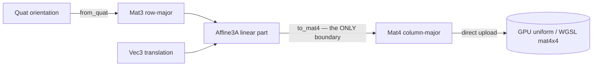

# Math

> `boyko_math` is the single SIMD-aligned, bit-deterministic POD math vocabulary every world-space subsystem builds on.

## What it is

`boyko_math` is the engine's math primitive crate: the vectors, quaternion, matrices, an affine transform, and a small ray vocabulary that physics, scene/transforms, rendering, and the world-space UI all share. There is exactly **one** of each type — no per-crate redefinition, no conversion seams between subsystems.

Every type is **plain old data**: `#[repr(C)]`, `Copy`, no `Drop`, no interior pointers. That is deliberate. A `Vec3` rides inside an ECS `ComponentPool` column, a contact manifold, and a GPU instance buffer without a single layout adapter. A `Vec4` *is* one SIMD lane and one `std140`/WGSL `vec4` slot. The byte layout you get on the CPU is the byte layout the GPU reads.

The crate is a **leaf root crate with zero third-party dependencies**. That is enforced in `Cargo.toml`, and it is the reason boyko-engine reimplements these types instead of taking [glam](https://github.com/bitshifter/glam-rs) as a dependency — see [Why in-house, not glam](#why-in-house-not-glam) below.

## Why in-house, not glam

Two non-negotiable contracts drive the decision:

- **Bit-determinism.** The engine runs bit-deterministic physics. `Vec3`, `Quat`, and `Mat3` are lifted **verbatim** — algorithm- and instruction-identical — from the physics foundation, so the migrated physics is bit-for-bit unchanged. Concretely:
  - Normalization is literally `len_sq.sqrt().recip()` — an **exact `sqrt`** followed by a reciprocal, **not** a hardware `rsqrt`.
  - There is **no** `f32::mul_add`/FMA, no `*_rsqrt`/`*_rcp` approximation, and no `fast-math`/`float_algebraic` anywhere in the crate. Every multiply-then-add is written as separate statements so default Rust codegen does not contract them into an FMA.
  - The newer types (`Vec2`, `Vec4`, `Mat4`, `Affine3A`) follow the same no-FMA / exact-`sqrt` discipline, even though most of them are off the physics determinism path.

- **Layout control.** `#[repr(C)]` (and `align(16)` where a SIMD lane / GPU slot matters) is part of the type contract, not an implementation detail. The math types double as the on-disk and on-GPU representation, so their byte layout must be stable and chosen by us.

A general-purpose math dependency optimizes for throughput on a single machine and is free to use FMA/`rsqrt` and to change its layout. Both would break the contracts above. Adding any dependency or a fast-math feature is called out in the crate as a contract violation.

## The type vocabulary

`boyko_math` exports the following from its prelude-style root (`boyko_math::{...}`):

| Type | Layout | Convention / role |
|------|--------|-------------------|
| `Vec2` | `#[repr(C)]`, 8 B (natural `f32` align) | 2D point / vector |
| `Vec3` | `#[repr(C)]`, 12 B | 3D point / vector — lifted verbatim, bit-deterministic |
| `Vec4` | `#[repr(C, align(16))]`, 16 B | one SIMD lane / one std140 `vec4` |
| `Quat` | `#[repr(C)]` | unit quaternion, `(x, y, z, w)` order (`w` last) |
| `Mat3` | `#[repr(C)]`, `[Vec3; 3]` | **row-major** (`rows[i]` is row `i`) — lifted verbatim |
| `Mat4` | `#[repr(C, align(16))]`, `[Vec4; 4]` | **column-major** (`cols[i]` is column `i`) — WGSL `mat4x4` |
| `Affine3A` | `#[repr(C, align(16))]`, 48 B | row-major `Mat3` linear part + `Vec3` translation |
| `Ray` | `#[repr(C)]` | parametric `origin + t·dir` |

Plus the free intersectors `ray_sphere` and `ray_aabb`, also re-exported from the root. The degenerate-direction guard constant `RAY_DIR_MIN_SQ` is **not** re-exported — it lives in its module at `boyko_math::ray::RAY_DIR_MIN_SQ` and is the threshold the two intersectors test against internally (a `dir` with `length_squared() <= RAY_DIR_MIN_SQ` is always a miss).

### The matrix convention split (important)

The crate intentionally carries **two** matrix conventions, and documents them precisely:

- `Mat3` is **row-major** — the lifted physics convention, kept exactly. It holds a body's inverse inertia tensor, and it is the linear part of `Affine3A`.
- `Mat4` is **column-major** — the WGSL `mat4x4` convention, so a `Mat4` uploads directly to a GPU uniform with no transpose.
- The row-major ↔ column-major boundary is crossed in **exactly one place**: `Affine3A::to_mat4` / `Mat4::from_affine`. Everywhere else, each type stays in its own convention. This keeps the "transpose bug" surface to a single, heavily-tested function.



## Common operations

All math types are POD, so you build and combine them by value. The examples below use only the real exported API.

```rust,ignore
use boyko_math::{Vec3, Quat, Mat3, Mat4, Affine3A};

// Vectors: construction + the usual products.
let a = Vec3::new(1.0, 0.0, 0.0);
let b = Vec3::new(0.0, 1.0, 0.0);
let dot = a.dot(b);            // 0.0
let cross = a.cross(b);        // (0, 0, 1) — right-handed
let len = (a + b).length();    // exact sqrt, no rsqrt
let unit = (a + b).normalize();// len_sq.sqrt().recip(), guarded at zero length

// Constants and component-wise helpers.
let zero = Vec3::ZERO;
let one = Vec3::ONE;           // the default scale
let scaled = a.componentwise_mul(Vec3::new(2.0, 3.0, 4.0));
```

```rust,ignore
use boyko_math::{Vec3, Quat};

// Quaternions: a unit orientation, composition, and rotating a vector.
let q = Quat::IDENTITY;                       // no rotation
let v = q.rotate(Vec3::new(1.0, 0.0, 0.0));   // v' = q · v · q⁻¹
let inv = q.conjugate();                       // inverse rotation (unit q)
let composed = q.mul(inv);                     // Hamilton product (== q * inv)

// First-order integration by an angular velocity over dt (re-normalizes).
let omega = Vec3::new(0.0, 1.0, 0.0);          // rad/s, world frame
let next = q.integrate(omega, 1.0 / 60.0);
```

```rust,ignore
use boyko_math::{Vec3, Quat, Mat3, Mat4, Affine3A};

// An affine world pose from translation, rotation, and non-uniform scale.
let pose = Affine3A::from_translation_rotation_scale(
    Vec3::new(0.0, 2.0, 0.0),   // translation
    Quat::IDENTITY,             // rotation
    Vec3::ONE,                  // scale
);

let world_point = pose.transform_point(Vec3::ZERO);   // matrix3 · p + t
let world_dir = pose.transform_vector(Vec3::new(0.0, 0.0, 1.0)); // ignores t

// Compose parent ∘ child (apply child first). Note: a named method, not `*`.
let child = Affine3A::IDENTITY;
let global = pose.mul(child);

// Cross the convention boundary once to feed the GPU.
let gpu_matrix: Mat4 = global.to_mat4();       // row-major -> column-major

// A right-handed perspective matrix already in WGSL/Vulkan [0,1] depth.
let proj = Mat4::perspective_rh(60f32.to_radians(), 16.0 / 9.0, 0.1, 1000.0);
let view_proj = proj * Mat4::from_affine(global.inverse().unwrap());
```

```rust,ignore
use boyko_math::{Vec3, Ray, ray_sphere, ray_aabb};

// CPU ray picks (used by the world-space UI cursor). `dir` must be normalized
// for `t` to read as a Euclidean distance.
let ray = Ray::new(Vec3::ZERO, Vec3::new(0.0, 0.0, -1.0));
let hit_sphere: Option<f32> = ray_sphere(ray, Vec3::new(0.0, 0.0, -5.0), 1.0);
let hit_box: Option<f32> = ray_aabb(ray, Vec3::new(0.0, 0.0, -5.0), Vec3::ONE);
```

A degenerate (zero / near-zero) ray direction is **always** treated as a miss by both intersectors — including the origin-inside case — guarded by `RAY_DIR_MIN_SQ`.

## Degenerate-input discipline

The math types never hand back a `NaN` on a degenerate input. Instead they substitute a valid default:

- `Vec2::normalize` / `Vec3::normalize` return `ZERO` when the input is (near) zero-length.
- `Quat::normalize` returns `Quat::IDENTITY` on a near-zero quaternion; `Quat::default()` is `IDENTITY`, not all-zero.
- `Affine3A::look_at_rh` guards the `eye == target` and pole (`up ∥ back`) cases, preserving chirality (`det(matrix3) ≈ +1`) rather than producing a `NaN` basis.
- `Mat3::inverse` / `Affine3A::inverse` return `Option` and yield `None` on a singular linear part.

These guards exist because the physics narrowphase feeds the solver from this code: a single `NaN`-normal contact would poison the solver, so a degenerate gradient is rejected at the source.

## Performance characteristics

The crate is built for layout and SIMD-friendliness, not for clever scalar tricks:

| Property | Detail |
|----------|--------|
| Allocation | None. Every type is `Copy` POD, lives on the stack / inside columns. |
| Alignment | `Vec4` / `Mat4` / `Affine3A` are 16-aligned, enabling aligned SIMD loads and direct std140 / WGSL packing. |
| Inlining | Trivial cross-crate methods are `#[inline]` so LTO can see the bodies. |
| FMA / rsqrt | Deliberately **absent** — bit-determinism over peak throughput on the physics types. |
| GPU upload | A `Mat4` / `Vec4` is a direct byte copy into a uniform; no per-frame conversion. |

These choices follow the engine's [SIMD-friendly layout](../architecture/principles.md) principle: data is laid out ready for vectorization (struct fields in lane order, 16-byte alignment) rather than relying on the optimizer to fix a hostile layout after the fact.

## See also

- [Transforms](transforms.md) — how `Affine3A` / `Quat` / `Vec3` become `Transform` / `GlobalTransform` components in `boyko_scene`.
- [Physics](physics.md) — the bit-deterministic solver that `Vec3` / `Quat` / `Mat3` were lifted from.
- [Engine principles](../architecture/principles.md) — data-oriented and SIMD-friendly layout, the rationale for in-house POD math.
- Source: [`crates/boyko_math/src/lib.rs`](https://github.com/bluesteelll/boyko-engine/blob/ecs/crates/boyko_math/src/lib.rs#L1), [`vec.rs`](https://github.com/bluesteelll/boyko-engine/blob/ecs/crates/boyko_math/src/vec.rs#L1), [`quat.rs`](https://github.com/bluesteelll/boyko-engine/blob/ecs/crates/boyko_math/src/quat.rs#L1), [`mat.rs`](https://github.com/bluesteelll/boyko-engine/blob/ecs/crates/boyko_math/src/mat.rs#L1), [`affine.rs`](https://github.com/bluesteelll/boyko-engine/blob/ecs/crates/boyko_math/src/affine.rs#L1), [`ray.rs`](https://github.com/bluesteelll/boyko-engine/blob/ecs/crates/boyko_math/src/ray.rs#L1).
