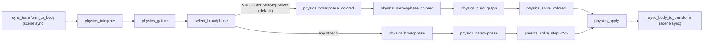

# Physics

`boyko_physics` is a **fully in-house** 3D rigid-body engine. There is no Rapier,
no Jolt, no parry — no third-party physics FFI at all. The solver is written from
first principles as a Temporal Gauss-Seidel "Soft Step" (TGS-Soft) sequential-
impulse scheme, in the Box2D-v3 lineage, and it runs as **ordinary ECS components
and systems on the engine's own threadpool**. A soft-body (XPBD) path lives in the
same crate.

The design choice that makes this work is the one the rest of the engine is built
on: physics is not a subsystem glued on the side with its own parallel data
structures. A body's state lives in `ComponentPool` columns; the per-step solve
state lives in dense, non-fragmenting kernel storage. "ECS-native" and "cache-
optimal" are the same thing here.

## Why fully in-house

An FFI physics backend forces a parallel data system: you keep your authoritative
transforms in the ECS, then mirror them into the foreign library's own body arrays
every frame, solve there, and copy back. That mirror is a second source of truth.
It also defeats cache locality (you pay a scatter/gather across the FFI boundary
every step) and it defeats determinism control (you inherit the backend's float
contraction and threading model).

boyko-engine instead owns every byte. The solver reads the dense
`SolverScratch` snapshot, mutates it in place, and writes back only the rows it
touched. Float behavior is pinned for **bit-determinism** — exact `sqrt` and `1/x`,
no `rsqrt`/`rcp`, no FMA contraction, no `fast-math` — so the same scene produces
the same result run-to-run, and (on the parallel/SIMD paths) bit-identically across
worker counts.

The seam is still open: an external backend *could* slot in by implementing the
[`RigidSolver`](#the-rigidsolver-seam) trait on its own resource, with no edit to
this crate. The shipped default is the in-house solver.

## The body model — capability is structural

A body is just a set of components. What kind of body it is comes from **which
components are present**, not a `BodyType` enum branch.

- `RigidBody` — the **hot** integrator state (position, linear velocity, rotation,
  angular velocity), in its own SoA column so the integrate loop streams a tight,
  cache-dense buffer.
- `RigidBodyMass` — the **cold** mass/material (inverse mass, inverse inertia
  *tensor*, restitution, friction), in a *separate* column so it never pollutes the
  integrate cache lines.
- `Collider` — a zero-`dyn` tagged-union shape (`ColliderShape::Sphere` or
  `ColliderShape::Box`, an oriented OBB) plus a `layer`/`mask` broadphase filter.
  These two are the only collider shapes: there are no capsule, convex-hull, mesh or
  heightfield colliders. Terrain-like static geometry collides through
  [SDF contacts](#contact-shapes) instead.

A permanent static body simply **does not carry** a `RigidBody` (structural skip —
the integrator never iterates it). An immovable contact surface carries
`RigidBody` with `inv_mass == 0`. There is no enum to branch on.

Runtime on/off is a **bit**, not a component swap:

- `Simulated` — an [enable-tag](../concepts/enable-tags.md) bit
  (`#[component(storage = "bitset")]`). A body whose `Simulated` bit is set
  integrates under gravity and is advanced by the solver. Clearing it "parks" the
  body — its pose freezes in place — with **O(1) toggle and no archetype
  migration**. The integrate stage and the solver both read this bit non-filteringly
  through `IsEnabled<Simulated>`, so flipping it never reorders the physics gather.
- `Kinematic` — another enable-tag bit, for a body moved by external control only.
  (Kinematic *motion* — actually advancing a kinematic body's pose from a target —
  is a documented deferral, not yet built.)

This is the engine-wide rule: **capability = component presence; runtime state = an
`IsEnabled<T>` bit.** It replaces the old `BodyType` enum entirely.

> Solver-state-in-a-side-`Vec` is exactly the anti-pattern that caused a real data
> race (the "SP4 race") in an earlier iteration. The fix — and the standing rule —
> is that durable per-body solve state lives in the kernel's own dense storage, not
> a `std::Vec` mirror.

### Spawning a body

```rust,ignore
use boyko_ecs::prelude::*;
use boyko_physics::{
    RigidBody, RigidBodyMass, Collider, ColliderShape, RigidBodyBundle, Simulated,
};
use boyko_physics::math::{Vec3, Mat3, Quat};

// `RigidBodyBundle` is a named `#[derive(Bundle)]` struct — a bare tuple is NOT a
// bundle. The three columns spawn together in one call.
let bundle = RigidBodyBundle {
    body: RigidBody {
        position: Vec3::new(0.0, 5.0, 0.0),
        linear_velocity: Vec3::ZERO,
        rotation: Quat::IDENTITY,        // a default body has a valid identity quat
        angular_velocity: Vec3::ZERO,
    },
    mass: RigidBodyMass {
        inv_inertia: Mat3::IDENTITY,     // unit-tensor placeholder
        inv_mass: 1.0,                   // 0.0 = immovable
        restitution: 0.5,
        friction: 0.3,
    },
    collider: Collider {
        shape: ColliderShape::Sphere { radius: 0.5 },
        layer: 1,
        mask: 1,
    },
};

let entity = commands.spawn(bundle).id();
// The body does NOT simulate yet — the `Simulated` bit can't be a bundle field
// (a bitset tag has no column). Enable it (deferred, O(1), no migration):
commands.entity(entity).enable::<Simulated>();
```

For the common "I want a visible body that simulates immediately" case, the std-lib
provides the `DynamicBody` bundle (pose + render handles + physics columns) and a
`spawn_dynamic(commands, bundle)` helper that spawns it **and** enables `Simulated`
in one call. A non-blocking overlap volume is the `Trigger` bundle (a `Collider`
plus the `Sensor` marker — the solver detects the overlap and reports it, but
applies no impulse).

## The TGS-Soft solver

The crate ships two TGS-Soft solvers with the same contact model. They differ in the
order in which they sweep the contacts:

- **`ColoredSoftStepSolver` — the default.** The type alias `DefaultRigidSolver`
  names it. It sweeps the contacts color by color over a constraint graph (see
  [Scaling](#scaling--the-performance-paths)), with the AVX2 cohort kernel on
  (`PhysicsConfig::simd_solve` defaults to `true`).
- **`SoftStepSolver` — the reference.** It sweeps the contacts in the deterministic
  manifold order. It stays in the tree as the oracle the colored solve is checked
  against, and a world runs it only when it names it.

For each step, both run a velocity-level sequential-impulse solve with:

- **Inertia tensor** — the cold `RigidBodyMass::inv_inertia` is the *world-space*
  inverse inertia tensor, so angular response is `Δω = inv_inertia · τ_world`,
  paired with the world-frame quaternion integrate.
- **2-DOF Coulomb friction cone** — a coupled two-tangent friction solve clamped to
  the normal impulse (not two independent 1-DOF axes).
- **Soft penetration recovery** — a soft-constraint bias (`contact_hertz` /
  `contact_damping`) pushes overlapping bodies apart smoothly instead of snapping,
  with a clamped maximum bias velocity so a deep initial overlap cannot launch a
  body.
- **Warm-starting** — each contact *point* persists its converged accumulated
  impulses (normal + 2 tangent) across frames in a double-buffered table, keyed by
  `(body_a, body_b, feature_id)`. This is what lets a stack rest instead of
  jittering apart under a fixed substep budget.
- **Restitution** — a single post-loop pass, gated by an approach-speed threshold
  so a body resting under gravity does not creep upward frame after frame.

Both solvers **own integration**: each integrates simulated dynamic bodies inside its
own substep loop, so the pipeline's standalone integrate stage is gated off (see
[the pipeline](#the-pipeline)).

### The default and the reference differ in value, not in validity

The colored sweep visits the contacts in a different order than the manifold sweep,
so the two solvers converge to **different, equally valid floats**. They are compared
by tolerance acceptance gates (stacking, penetration, friction, restitution), never
by bits. Two consequences follow:

- Moving a world from one solver to the other changes its simulation values.
- A world or a replay pinned to the reference must name `SoftStepSolver` explicitly
  (see [the pipeline](#the-pipeline)).

Each solver is bit-deterministic run to run on its own; see
[Determinism](#determinism--the-contract).

### Contact shapes

The narrowphase generates manifolds for:

- **sphere–sphere**, **sphere–box**, **box–box** (OBB, with feature-id-stable
  multi-point manifolds), and
- **body–vs–SDF** — a body resolved against the analytic signed-distance field, the
  *same* CPU-authoritative edit list the renderer draws (see
  [SDF rendering](../rendering/sdf.md)). SDF contacts use a sentinel `body_b` and
  ride the one-sided immovable-surface impulse path, with **zero GPU readback**. The
  SDF narrowphase is opt-in (`add_physics_sdf`, or `PhysicsPlugin::with_sdf`).

## Contacts: speculative margin and reuse

Two contact rules are **on by default**, and both change simulation values. They are
part of the value contract: a replay must run with the settings it was recorded with.

**Speculative contacts.** A contact point is kept while its separation is at most an
effective margin, not only while the shapes overlap:

```text
d_eff = d + min(cap, max(0, approach) · dt)
```

- `d` is `PhysicsConfig::speculative_distance` (default 20 mm).
- `cap` is `speculative_velocity_cap` (default 0.5 m). `approach` is the rate at which
  the two bodies close the gap at the start of the step, linear and angular.
- Each body's broadphase bounding sphere is inflated to match, so every pair a contact
  could keep is a candidate.
- The solvers treat a point whose separation is still positive as a speculative
  contact: it can stop the approach, but it never pushes the bodies apart (the Box2D v3
  and Jolt rule).
- The rule covers every pair type: box–box, sphere–sphere, sphere–box and SDF. A pair
  with a sensor on either side keeps the overlap-only rule, so overlap reports stay
  exact.

The velocity term makes a pair that closes more than `d` in one step a contact on the
step *before* it touches, instead of landing on whichever corner arrives first. Setting
both `d` and `cap` to `0` gives the overlap-only rule, bit for bit the engine before
speculative contacts.

**Contact reuse.** A slow, touching box–box pair with no sensor keeps a record of its
last full collision. While the pair's relative pose stays within a small distance τ of
that collision, the narrowphase refreshes the record from the current poses instead of
re-running the SAT test and the clip.

- τ is `contact_reuse_distance` (default 1 mm). It is clamped per pair, so small and
  thin boxes get a tighter bound.
- A kept point travels with its body, and a point that lifted off is dropped.
- Reuse is deterministic: the serial loop and the parallel narrowphase give the same
  bits for any worker count.
- `contact_reuse = false` runs the exact narrowphase every step.

Source:
[`narrowphase/speculative.rs`](https://github.com/bluesteelll/boyko-engine/blob/master/crates/boyko_physics/src/narrowphase/speculative.rs),
[`narrowphase/reuse.rs`](https://github.com/bluesteelll/boyko-engine/blob/master/crates/boyko_physics/src/narrowphase/reuse.rs).

## The `RigidSolver` seam

The solver is swappable behind a trait, and the dispatch is **static — deliberately
not object-safe**:

```rust,ignore
use boyko_physics::{PhysicsConfig, Manifold, SolverScratch};

pub trait RigidSolver: /* Resource + */ 'static {
    /// Resolve all contacts for one step: mutate `scratch.bodies` in place and
    /// flag `scratch.touched` for every row written.
    fn solve(
        &mut self,
        config: &PhysicsConfig,
        manifolds: &[Manifold],
        scratch: &mut SolverScratch,
    );

    fn is_noop(&self) -> bool { false }          // skip the solve entirely
    fn owns_integration(&self) -> bool { false } // solver integrates internally
}
```

Because a `Resource` is `Sized`, `dyn RigidSolver` does not compile by design. The
step system is generic over `S: RigidSolver`; the solver rides as a `ResMut<S>` and
the user picks the backend at schedule-build time. Monomorphization makes the per-
contact loop a direct, inlinable call with **zero vtable** — the hot loop inlines
across the seam instead of being firewalled behind dynamic dispatch.

The crate ships three solvers:

| Solver | What it does | `owns_integration` |
|--------|--------------|--------------------|
| `NoopSolver` | The foundation seam-prover: `is_noop()` is `true`, the solve is skipped, the pipeline degenerates to integrate-only. | `false` |
| `SoftStepSolver` | The reference TGS-Soft solver (above). Solves in manifold order. Runs only when a world names it. | `true` |
| `ColoredSoftStepSolver` | The default (`DefaultRigidSolver`). Solves in graph-color order, with the parallel and SIMD paths (below). Its trait `solve` is empty: the `physics_solve_colored` stage drives it, because the trait signature carries no constraint graph. | `true` |

`DefaultRigidSolver` is a type alias for `ColoredSoftStepSolver`, not a fourth solver.

## Using it from an `App`

`PhysicsPlugin` is the `App`-facing wiring. It inserts the physics resources and
registers the pipeline into `CoreSchedule::Fixed`, with every stage in
`FixedSet::Gameplay`:

```rust,ignore
use boyko_ecs::App;
use boyko_physics::PhysicsPlugin;

let mut app = App::new();
app.add_plugin(PhysicsPlugin::new());
```

- **The solver** is `DefaultRigidSolver`, the colored solve.
- **Pose sync is on.** The plugin wires the `Transform ⇄ RigidBody` sync, because a
  drawn scene reads `Transform`. The builder `add_physics_systems` leaves it off: its
  callers are determinism harnesses that read `RigidBody` directly.
- **The set matters.** `EnginePlugins` orders `FixedSet::Snapshot` after
  `FixedSet::Gameplay`, and the engine's interpolation pack reads each body's
  post-solve `Transform` in `Snapshot`.
- **Everything else is off.** Builder methods opt in:

| Method | Effect |
|--------|--------|
| `with_sdf()` | adds the body-vs-SDF narrowphase stage and an empty `SdfField` to fill |
| `colored()` | builds the constraint graph for a non-colored solver; a no-op on the default |
| `colored_solve()` | re-types the plugin to `ColoredSoftStepSolver`; a no-op on the default |
| `soft(coupling)` | adds the XPBD soft-body pass, with two-way soft↔rigid coupling if `coupling` |
| `soft_colored()` | adds the colored soft-body step (the non-coupling path) |
| `without_scene_sync()` | drops the pose sync; nothing then writes `Transform` |
| `PhysicsPlugin::<S>::with_solver()` | the same plugin on another solver, e.g. `SoftStepSolver` |

`build` inserts a `PhysicsConfig` whose `colored`, `soft_body`,
`soft_rigid_coupling` and `broadphase` match the stages it registered. Tune the
config field by field after `add_plugin`. Inserting a whole new value resets those
fields, and a soft stage then runs with its flag off.

```rust,ignore
use boyko_physics::{PhysicsConfig, PhysicsPlugin};

app.add_plugin(PhysicsPlugin::new());
let cfg = app.world_mut().resource_mut::<PhysicsConfig>();
cfg.substeps = 8;
```

The `playground` example runs this path:
`cargo run --release -p boyko-app --example playground`.

### Spawning before the gather

To have bodies spawned by a system join the same step, order the spawner before
`PhysicsGatherSet`, the set the gather stage belongs to. The executor applies a
system's `Commands` before it dispatches that system's successors.

```rust,ignore
use boyko_ecs::prelude::CoreSchedule;
use boyko_physics::PhysicsGatherSet;

app.add_systems_cfg_in(CoreSchedule::Fixed, |b| {
    b.add_system(spawn_projectiles).before_set(PhysicsGatherSet);
});
```

## The pipeline

Physics is wired into a schedule as a block of ordinary systems, registered in a
fixed order via `.after(...)`. The body-only pipeline (`add_physics_systems::<S>`)
runs the stages below. The solver **type** `S` picks the solve stage, once, at
wire-up:



The dotted stages exist only with pose sync: `sync_transform_to_body` copies the
`Transform` of static and kinematic bodies into `RigidBody` before the step, and
`sync_body_to_transform` copies dynamic root bodies back out after it. The optional
SDF stage (`physics_narrowphase_sdf`) runs after the narrowphase and before the graph
build and the solve.

- **integrate** — `par_iter_mut` over simulated dynamic bodies: gravity, position
  advance, quaternion advance. **Gated off** when the solver owns integration (both
  TGS solvers do), so the solver is the *sole* integrator and bodies are never
  double-integrated. This gate is the `IntegrationMode::SolverOwned` vs
  `IntegrationMode::Foundation` resource, derived from `owns_integration()` at wire-
  up time.
- **gather** — snapshots `(RigidBody, RigidBodyMass, Collider)` in row order into
  the dense `SolverScratch`, derives each body's world inverse inertia, and stamps
  the step `dt` from the fixed clock (`FixedTime`) into `PhysicsConfig`.
- **select_broadphase** — a cold density policy. In the default
  `BroadphaseSelectMode::Manual` it only counts bodies and never changes
  `PhysicsConfig::broadphase`.
- **broadphase** — emits candidate pairs in deterministic `(min, max)` order. Its
  first act is to latch the step's inputs (below). The colored pipeline registers
  `physics_broadphase_colored` (with the SDF stage, `physics_broadphase_colored_sdf`)
  and `physics_narrowphase_colored`; these carry the sleeping world's skip of held
  islands. The colored pipeline is the default solver's, or any solver's under
  `add_physics_colored`.
- **narrowphase** — produces `Manifold`s for the candidate pairs: the touching ones,
  plus the speculative ones (see [Contacts](#contacts-speculative-margin-and-reuse)).
- **build_graph** — registered only on the colored pipeline. Partitions this step's
  manifolds into islands and greedy-colors them so no color shares a dynamic body.
- **solve** — `physics_solve_colored` for the colored solver. For any other `S`,
  `physics_solve_step::<S>`: `if solver.is_noop() { return } else { S::solve(...) }`.
  The two stages never both run, and `NoopSolver` can never be paired with the
  colored stage.
- **apply** — writes the solved snapshot back through `Mut<RigidBody>`, but only for
  touched rows.

Physics is meant to live in the **fixed-timestep schedule** — the gather reads the
fixed step's `dt`, never a per-render-frame delta. See [Time and the fixed
timestep](../app/time.md).

```rust,ignore
use boyko_physics::{add_physics_systems, DefaultRigidSolver};

// Inserts the physics resources on `world` and registers the pipeline stages on
// `builder`, returning the stage handles. (The caller owns `builder.build`.)
// `DefaultRigidSolver` wires the constraint graph and the colored solve.
let keys = add_physics_systems::<DefaultRigidSolver>(&mut builder, &mut world);
```

Rust has no default type parameters on functions, so the alias `DefaultRigidSolver`
is the one place the default is named. To run the reference solver instead, name it:

```rust,ignore
use boyko_physics::{add_physics_systems, SoftStepSolver};

// The reference manifold-order solve: no constraint graph, no colored stage.
// Its floats differ from the default's, so a world pinned to it must say so here.
let keys = add_physics_systems::<SoftStepSolver>(&mut builder, &mut world);
```

Wiring variants extend this block, each opt-in. Every entry picks the solve stage
from `S` the same way, so the scene-sync, SDF and soft-body variants all run the
colored solve when given `DefaultRigidSolver`:

| Function | Adds |
|----------|------|
| `add_physics_systems::<S>` | the body-only pipeline (above) |
| `add_physics_systems_with_scene_sync::<S>` | the same, wrapped in `Transform ⇄ RigidBody` pose sync |
| `add_physics_sdf::<S>` | a body-vs-SDF narrowphase stage + an (empty) `SdfField` to fill |
| `add_physics_colored::<S>` | the constraint-graph stage for any `S`; with a non-colored solver it is a partition only and the solve is unchanged |
| `add_physics_colored_solve` | kept for existing callers; forwards to `add_physics_systems::<ColoredSoftStepSolver>` |
| `add_physics_soft::<S>` | the XPBD soft-body pass |
| `add_physics_soft_colored::<S>` | the colored-parallel soft-body pass |

`PhysicsPlugin` (above) is the same wiring for an `App`: its builder methods map onto
these shapes.

### Pose stays in one datum

With scene sync, the body's pose has exactly one writer per window: the solver
writes `RigidBody`, `sync_body_to_transform` mirrors it into `Transform`, and
`propagate_transforms` (in `boyko_scene`) derives `GlobalTransform`. There is no
parallel pose store — see [Transforms](transforms.md).

## Tuning

`PhysicsConfig` is the global tunable resource. Most fields are user-set; `dt` is
**not** — it is stamped each step from the fixed clock.

**When a write takes effect.** The broadphase reads `PhysicsConfig` (and the
`SdfField`) once per step and copies it into the `StepInputs` record. Every later
stage of that step reads the record. So a write made after the broadphase takes
effect at the next step's broadphase, however it is made: a field write, a new value,
or `insert_resource`.

| Field | Default | Meaning |
|-------|---------|---------|
| `gravity` | `(0, -9.81, 0)` | constant acceleration on dynamic bodies |
| `substeps` | `4` | TGS substeps per step (the solver reads `h = dt / substeps`) |
| `relax_iterations` | `2` | bias-free relaxation passes per substep |
| `contact_hertz` | `30.0` | soft-constraint stiffness (penetration-recovery spring frequency) |
| `contact_damping` | `10.0` | soft-constraint damping ratio (heavily overdamped, for stable resting contact) |
| `warm_start` | `true` | warm-start contacts from the previous step; the effective value is this flag AND the solver's own setup flag |
| `broadphase` | `Tree` | `Tree`, `AllPairs` or `Grid`; all three give the same pair set ([Scaling](#scaling--the-performance-paths)) |
| `broadphase_select` | `Manual` | `Auto` lets a density policy pick `broadphase` from the live body count; the result is unchanged |
| `speculative_distance` | `0.02` | the speculative contact distance `d`, in metres; **value-changing** |
| `speculative_velocity_cap` | `0.5` | the cap on the approach-velocity margin, in metres; **value-changing** |
| `contact_reuse` | `true` | refresh slow box–box contacts instead of re-colliding them; **value-changing** |
| `contact_reuse_distance` | `0.001` | the reuse distance τ, in metres |
| `simd`, `simd_solve` | `true` | the AVX2 kernels; bit-identical to scalar |
| `parallel_solve` | `true` | the parallel colored solve; bit-identical for any worker count |
| `parallel_narrowphase` | `true` | the parallel narrowphase; bit-identical for any worker count |
| `parallel_broadphase` | `false` | the parallel candidate emit of the `Grid` broadphase |
| `parallel_tree_query` | `false` | the parallel query of the `Tree` broadphase |
| `sleeping` | `false` | per-island sleeping; **value-changing** on purpose |
| `sleep_skip` | `SleepSkip::Sets` | how a sleeping world treats frozen islands (`Sets` holds them, `Off` still collides them) |
| `sleep_threshold`, `sleep_frames` | `1e-4`, `60` | the per-island speed² threshold and the debounce, in frames |
| `sdf_narrowphase` | `Scalar` | the box-vs-SDF kernel. ⚠ `Avx2` is **not** bit-identical to `Scalar`: it can return `+0` where the scalar fold returns `-0` |
| `dt` | stamped | the fixed step delta, written by the gather — a hand-set value is overwritten |

The soft-body fields (`soft_body`, `soft_damping`, `soft_rest_clamp`,
`soft_rigid_coupling`, `self_collision_iters`, `soft_body_colored`,
`soft_self_collision_colored`) all default to off or zero; see [Soft bodies](#soft-bodies-xpbd).
`colored` records the schedule's shape at wire-up, and nothing reads it at runtime.

## Scaling — the performance paths

These are the production-scale levers. They fall into three groups:

- **On by default, bit-identical:** `simd`, `simd_solve`, `parallel_solve`,
  `parallel_narrowphase` and the `Tree` broadphase. They are pure speed paths: turning
  one off changes performance, never a result bit. The AVX2 kernels mirror the scalar
  op sequence exactly per lane (no FMA, no `rsqrt`/`rcp`), and on a non-AVX2 build
  they are no-ops.
- **Opt-in:** the `Grid` and `AllPairs` broadphases, `parallel_broadphase` and
  `parallel_tree_query` (all bit-identical), and `sleeping` (value-changing on
  purpose).
- **On by default, value-changing:** speculative contacts and contact reuse (see
  [Contacts](#contacts-speculative-margin-and-reuse)).

In detail:

- **Broadphase** (`PhysicsConfig::broadphase`). All three kinds emit the same
  `(min, max)`-sorted pair set, bit for bit:
  - `Tree` (default) — a packed 8-wide BVH over the moving rows, plus persistent
    static and sleeper sets. At or below `TREE_BRUTE_MAX_ROWS` (128) rows it runs the
    all-pairs loop itself. `parallel_tree_query` (default off) runs the moving rows'
    query on the threadpool.
  - `AllPairs` — the O(n²) loop.
  - `Grid` — a uniform-grid CSR counting-sort. `parallel_broadphase` (default off)
    fans its candidate emit across the threadpool. The soft↔rigid coupling path
    reads the grid's cells, so it forces `Grid`.
- **Parallel narrowphase** (`parallel_narrowphase`, **default on**) — splits the
  step's candidate pairs into chunks and collides them across the threadpool's
  workers. The manifold stream is bit-identical to the serial loop for any worker
  count and any chunk partition. A one-worker pool runs the serial loop.
- **Constraint coloring** — islands + greedy graph coloring so no color shares a
  dynamic body; the enabler for parallel and SIMD solving. The colored solve
  consumes it, so every world on the default solver builds it.
- **Colored solve** — the default solver (`DefaultRigidSolver`, through any
  `add_physics_*` entry). A Gauss-Seidel sweep across colors over SoA contact
  columns. Its converged values differ from the reference solver's; they are
  validated against tolerance acceptance gates, stay bit-deterministic run-to-run,
  and never move a static body.
  - `simd_solve` (**default on**) widens each color's sweep over cohorts of 8
    body-disjoint manifold-groups with an AVX2 kernel. It is bit-identical to the
    scalar colored oracle.
  - `parallel_solve` (**default on**) runs the solve on the threadpool. A step's
    fill and all of its substeps run as **one region** (the solve region), cut into
    blocks by `RegionGrain`; no color opens a scope of its own. The grain decides
    only where work runs, never a bit: the result is bit-identical to the
    single-threaded colored solve for any worker count. A one-worker pool, or a step
    whose widest color is below the region's floor, runs the single-threaded path.
- **SIMD integrate/inertia** (`simd`, **default on**) — AVX2 width-only kernels for
  the per-substep inertia refresh and the gravity integrate loop. The SIMD output is
  **bit-identical** to scalar — toggling it changes performance, never the result.
- **Sleeping** (`sleeping`, default off) — per-island deactivation. An island whose
  fastest body stays below `sleep_threshold` (speed²) for `sleep_frames` consecutive
  frames freezes. The gather still walks every row, so warm keys stay valid.
  - With `sleep_skip = SleepSkip::Sets` (the default mode), a frozen, clean island is
    **held**: its pairs skip the narrowphase, the SDF stage, the coloring and the
    solve, while its contacts stay in the public views. A held island is restored on
    the step its inputs change.
  - `SleepSkip::Off` still collides frozen islands and skips only their solve and
    integrate. It is the oracle: both modes give the same observables, bit for bit.
  - An island wakes when a new body joins it or its contact count changes.
    `IslandSleep::wake_all()` wakes every island at the next broadphase. A change
    that keeps the island's contact count — a support that moves, a user write to a
    sleeping body — does not wake it; call `wake_all`.
  - Sleeping changes results on purpose (a frozen island stops integrating), so its
    gate is "rest state with sleeping on equals rest state with sleeping off, to ε".
    Sleeping with SDF contacts is gated by `tests/sdf_sleep_settles_and_wakes.rs`: a
    pile on an SDF floor freezes, rests at the sleeping-off pose, and wakes on a field
    edit. One recorded gap remains: with soft↔rigid coupling, a soft→rigid reaction
    does not wake a sleeping body.

`simd_solve`, `parallel_solve` and `sleeping` act only inside the colored solve. With
the reference `SoftStepSolver` they are silent no-ops.

> **Measurements.** This page states no speed figures. The physics benches live in
> [`crates/boyko_physics/benches/`](https://github.com/bluesteelll/boyko-engine/tree/master/crates/boyko_physics/benches)
> (for example `colored_solve.rs`, `broadphase.rs`, `sleeping.rs`); results are on
> the [Benchmarks](../reference/benchmarks.md) page.

The physics step also has its own profiling zones and per-step counters, in the
`boyko_physics::profiling` module.

## Soft bodies (XPBD)

A separate, opt-in path (`add_physics_soft` or `PhysicsPlugin::soft`, config
`soft_body = true`) advances
`SoftBody` components by an XPBD position pass after the rigid solve. It is a
*strictly disjoint* integrator — it operates only on the soft-body columns and never
touches the rigid `SolverScratch`, so the rigid simulation is byte-identical whether
soft bodies are present or not.

A `SoftBody` is a particle cloud tied by distance constraints, stored **SoA by
axis** (`pos_x/y/z`, `prev_x/y/z`, `vel_x/y/z`, per-particle `inv_mass`) with an
immutable constraint topology, all preallocated and refilled in place (zero per-step
allocation). A particle with `inv_mass == 0.0` is pinned. Constructors validate the
topology up front so the solver never re-validates on the hot path:

```rust,ignore
use boyko_physics::SoftBody;

// A cloth/lattice from particle positions + edge constraints.
let soft = SoftBody::from_mesh(
    &positions,   // &[[f32; 3]]
    &inv_masses,  // &[f32]  (0.0 pins a particle)
    &edges,       // &[(u32, u32)] distance constraints
    None,         // rest lengths (None = current distance)
    0.0,          // XPBD compliance (0.0 = perfectly stiff)
    0.05,         // particle radius
).expect("invariant: valid soft-body topology");
```

Shipped soft-body capability, honestly: distance constraints (`from_mesh` /
`from_mesh_per_edge`); volume-constraint tetrahedra (`from_tet_mesh`); per-substep
viscous damping and a rest-velocity clamp; particle self-collision; two-way
soft↔rigid coupling; and a colored-parallel path. Each is its own opt-in flag on
`PhysicsConfig`.

## Determinism — the contract

Each solver is bit-deterministic run to run: a fixed sweep order (graph colors for
the default, manifold order for the reference), fixed point order,
normal-before-friction, fixed substep/relax counts, fixed float op order, no
atomics, no `fast-math`.

On the default colored solve, the speed switches never change a bit. The AVX2 cohort
kernel (`simd_solve`, on by default), the scalar colored oracle, and `parallel_solve`
at any worker count all produce the same result — bit-identical across `{1 thread,
N threads, SIMD-on, SIMD-off}`. The disjoint-body coloring makes each body's
accumulation independent of which worker runs which group, and the warm-start store
is forced into canonical order regardless of solve-dispatch order. So a replay does
not depend on `simd_solve`. At scale, the release run of
`tests/default_world_pyramid_determinism.rs` steps a 1240-box pyramid for 120 frames.
Its per-frame hash of every `RigidBody` bit matches run to run, at 1, 2 and 8
workers with `parallel_solve` off and on, and against the scalar colored oracle.

The two solvers do **not** match each other bit for bit (see
[above](#the-default-and-the-reference-differ-in-value-not-in-validity)), so a
replay pinned to one solver must run under that solver.

The same holds for the value-changing defaults. Speculative contacts
(`speculative_distance`, `speculative_velocity_cap`) and contact reuse
(`contact_reuse`, `contact_reuse_distance`) are deterministic for any worker count,
but changing them changes trajectories. A replay must run with the values it was
recorded with. Sleeping, when on, is run-to-run bit-deterministic too, but it is not
bit-equal to sleeping off.

One precondition: dense-row order is the archetype row order, which is deterministic
across runs only under a deterministic spawn/despawn order. Single-threaded spawning
satisfies this.

## See also

- [Time and the fixed timestep](../app/time.md) — where physics runs
- [Enable-tags](../concepts/enable-tags.md) — the `Simulated`/`Kinematic` mechanism
- [Transforms](transforms.md) — the single-source-of-truth pose pipeline
- [Math](math.md) — the deterministic POD `Vec3` / `Quat` / `Mat3`
- [SDF rendering](../rendering/sdf.md) — the field physics shares for SDF contacts
- [Windowed host](../app/windowed-host.md) — the `playground` example runs `PhysicsPlugin`
- [Benchmarks](../reference/benchmarks.md) — where measured results are published
- Source:
  [`boyko_physics/src/lib.rs`](https://github.com/bluesteelll/boyko-engine/blob/master/crates/boyko_physics/src/lib.rs),
  [`components.rs`](https://github.com/bluesteelll/boyko-engine/blob/master/crates/boyko_physics/src/components.rs),
  [`solver/mod.rs`](https://github.com/bluesteelll/boyko-engine/blob/master/crates/boyko_physics/src/solver/mod.rs),
  [`solver/soft_step.rs`](https://github.com/bluesteelll/boyko-engine/blob/master/crates/boyko_physics/src/solver/soft_step.rs),
  [`solver/colored.rs`](https://github.com/bluesteelll/boyko-engine/blob/master/crates/boyko_physics/src/solver/colored.rs),
  [`resources.rs`](https://github.com/bluesteelll/boyko-engine/blob/master/crates/boyko_physics/src/resources.rs),
  [`systems.rs`](https://github.com/bluesteelll/boyko-engine/blob/master/crates/boyko_physics/src/systems.rs),
  [`plugin.rs`](https://github.com/bluesteelll/boyko-engine/blob/master/crates/boyko_physics/src/plugin.rs),
  [`step_inputs.rs`](https://github.com/bluesteelll/boyko-engine/blob/master/crates/boyko_physics/src/step_inputs.rs),
  [`sleep_sets.rs`](https://github.com/bluesteelll/boyko-engine/blob/master/crates/boyko_physics/src/sleep_sets.rs),
  [`broadphase_tree/mod.rs`](https://github.com/bluesteelll/boyko-engine/blob/master/crates/boyko_physics/src/broadphase_tree/mod.rs)
