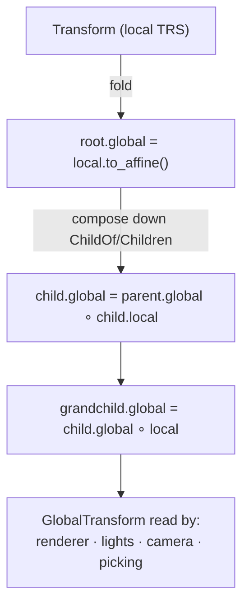
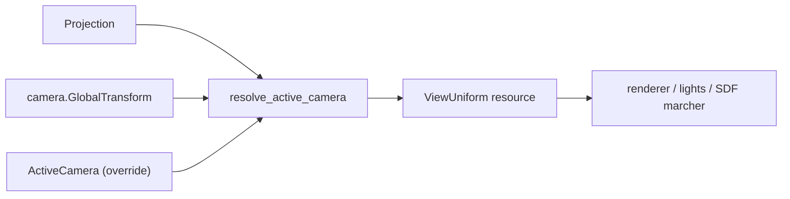
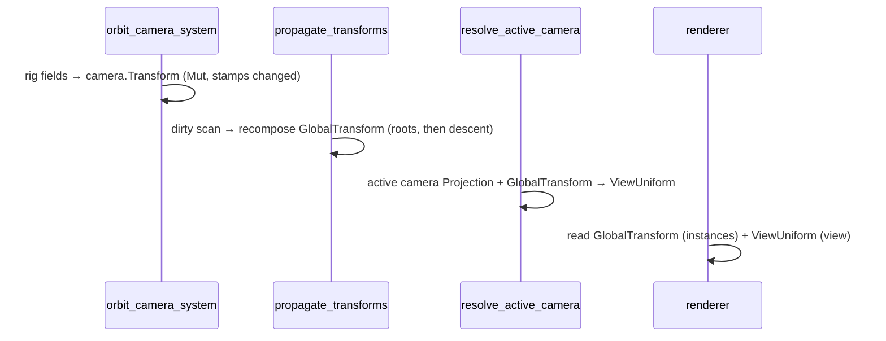

# Transforms & Scene

The `boyko_scene` crate owns the engine's **spatial vocabulary** — the components
every world-space subsystem (renderer, lights, physics sync, picking) reads to
know *where* an entity is. It sits one layer above the ECS kernel and ships two
foundational components, the system that derives one from the other, and a small
camera layer that turns a placed camera entity into the view the renderer
consumes.

Like everything in this engine, the scene is **not a parallel data system**.
There is no separate scene-graph object holding a tree of nodes. A transform is
an ordinary ECS component column; the parent-child tree is the kernel's own
[hierarchy](../concepts/hierarchies.md) relation; the world pose is a second
component derived each frame by a system. "Where things are" lives in the same
SoA storage as everything else (Principle 0).

## Local vs world: two components

The split is the standard game-engine one, expressed as two components:

```rust,ignore
use boyko_scene::prelude::*; // Transform, GlobalTransform
use boyko_math::{Vec3, Quat, Affine3A};

// LOCAL pose, relative to the parent (or the scene root if unparented).
// Decomposed, designer-facing — this is the one gameplay writes.
#[repr(C)]
pub struct Transform {
    pub translation: Vec3, // in parent space
    pub rotation: Quat,    // unit quaternion, in parent space
    pub scale: Vec3,       // per-axis
}

// WORLD pose: a packed affine, world-from-local. Cached, recomputed each frame.
// You READ this; you do not write it (the propagation system is its sole writer).
#[repr(C, align(16))]
pub struct GlobalTransform(pub Affine3A);
```

- [`Transform`](https://github.com/bluesteelll/boyko-engine/blob/ecs/crates/boyko_scene/src/transform.rs#L46)
  is **decomposed** (translation / rotation / scale) on purpose: it round-trips
  cleanly through an editor and is cheap to author. It is read scalar by the
  propagation pass (one affine compose per dirty node), not SIMD-loaded, so the
  natural-`f32`-aligned 40-byte layout is correct — no over-padding.
- [`GlobalTransform`](https://github.com/bluesteelll/boyko-engine/blob/ecs/crates/boyko_scene/src/transform.rs#L133)
  wraps an [`Affine3A`](math.md) (48 bytes, 16-aligned) so it uploads directly to
  a GPU lane and composes with one affine multiply.

There is **no `Transform2D`**. A 2D entity uses the same `Transform` with
`translation.z == 0`, rotation about Z only, and `scale.z == 1`; the `z` lane is
inert through composition. 2D consumers read `global.affine().translation` and
project to `xy`.

### Default validity (no NaN-for-one-frame)

`GlobalTransform::default()` is `Affine3A::IDENTITY` — a **valid** pose, not
garbage. An entity spawned this frame renders at the origin for at most one
frame, until the next propagation run composes its real world pose. This avoids
the classic "newly-spawned entity flickers at a garbage location before the first
propagate" footgun.

## Spawning a placed entity

`Transform` and `GlobalTransform` are plain components, so you spawn them like any
other. Remember the import split: the **types** come from `boyko_scene::prelude`,
but the `#[derive(...)]` macros for your own components come from `boyko_macros`,
and a bundle must be a `#[derive(Bundle)]` struct (a bare tuple is not a bundle).

```rust,ignore
use boyko_ecs::prelude::*;           // Commands, Query, ...
use boyko_scene::prelude::*;         // Transform, GlobalTransform, SpatialBundle
use boyko_math::{Vec3, Quat};

fn spawn_a_pivot(mut commands: Commands) {
    // The crate ships ready-made category bundles. SpatialBundle is the minimal
    // placed, world-tracked node (Transform + GlobalTransform + Visibility).
    commands.spawn(SpatialBundle {
        transform: Transform::from_translation(Vec3::new(0.0, 1.0, 0.0)),
        global: GlobalTransform::default(), // filled by propagation next frame
        visibility: Visibility::default(),
    });
}
```

`Transform` has the usual builder helpers — `Transform::IDENTITY`,
`from_translation`, `from_rotation`, `from_scale` — and `to_affine()` folds it to
a packed `T · R · S` affine. The crate also ships
[`StaticProp`](https://github.com/bluesteelll/boyko-engine/blob/ecs/crates/boyko_scene/src/bundles.rs#L57)
(a placed mesh + material) and
[`CameraRig`](https://github.com/bluesteelll/boyko-engine/blob/ecs/crates/boyko_scene/src/bundles.rs#L75)
as named bundle presets.

## Parenting

Parenting is the kernel's [`ChildOf` / `Children`](../concepts/hierarchies.md)
relation — propagation simply walks it. You attach a child the same way you would
build any hierarchy, via `Commands` / `EntityCommands`:

```rust,ignore
use boyko_ecs::prelude::*;
use boyko_scene::prelude::*;
use boyko_math::Vec3;

fn spawn_parent_and_child(mut commands: Commands) {
    let parent = commands
        .spawn(SpatialBundle {
            transform: Transform::from_translation(Vec3::new(5.0, 0.0, 0.0)),
            global: GlobalTransform::default(),
            visibility: Visibility::default(),
        })
        .id();

    // Child placed 2 units along its PARENT's local +X. Its GlobalTransform
    // becomes parent.global ∘ child.local, so it lands at world x ≈ 7.
    commands
        .spawn(SpatialBundle {
            transform: Transform::from_translation(Vec3::new(2.0, 0.0, 0.0)),
            global: GlobalTransform::default(),
            visibility: Visibility::default(),
        })
        .set_parent(parent); // inserts ChildOf(parent); Children is maintained for you
}
```

`set_parent`, `add_child`, and `add_children` all funnel through inserting
`ChildOf` on the child — see [Hierarchies](../concepts/hierarchies.md) for the
full surface and the deferred-consistency rules.

## Propagation: deriving the world pose

The [`propagate_transforms`](https://github.com/bluesteelll/boyko-engine/blob/ecs/crates/boyko_scene/src/propagation.rs#L208)
system is the **sole writer** of `GlobalTransform`. Once per frame it composes
every entity's world pose from its `Transform` chain along the hierarchy:

- a **root** (no `ChildOf`): `global = local.to_affine()`
- a **child**: `global = parent.global ∘ child.local`



Two properties matter for performance and correctness:

- **Exclusive, on purpose.** The descent reads a parent's already-computed
  `GlobalTransform` and writes a child's `GlobalTransform` — the *same component
  column, different rows*. A non-exclusive `Query` system cannot hold a parent
  `&GlobalTransform` and a child `&mut GlobalTransform` from one query at once, so
  `propagate_transforms` is an exclusive `fn(&mut EcsMaster)`.
- **Alloc-free and dirty-gated.** Its only transient state is a kernel-owned
  `Resource` (`TransformPropagationScratch`) whose buffers are cleared and reused
  every frame — no side `Vec`. A node is recomposed only when its own `Transform`
  **or** its `ChildOf` link changed since the last run (the link leg catches a
  re-parent that never touches the local pose), or an ancestor was recomposed this
  run. A fully static scene pays a linear change-tick read and **zero** affine
  composes.

Every world-pose write goes through a set-if-changed guard, so it bumps the row's
`changed_tick` only on a real move. Downstream `Changed<GlobalTransform>`
consumers (the camera, GPU-instance upload, lights) therefore observe a propagated
move precisely, while a static entity stays tick-silent — see
[Change Detection](../change_detection.md).

> **Honest cost note.** The per-frame dirty scan is currently an
> *O(entities-in-spatial-archetypes)* cheap per-row tick test, **not** the
> *O(archetypes) + O(changed)* streaming column scan the design aspired to.
> Reaching the streaming form needs a public per-archetype changed-tick-column
> accessor on the kernel that is out of scope for this crate; the shipped form is
> the cheap per-row test plus a descent that only visits dirty subtrees. The
> descent also carries depth/visit caps as a release-mode guard against malformed
> `ChildOf` cycles (the kernel detects only the self-reference case).

### Registering it

The [`TransformPlugin`](https://github.com/bluesteelll/boyko-engine/blob/ecs/crates/boyko_scene/src/plugin.rs#L45)
registers propagation into the `Main` schedule (per frame, after the fixed
physics schedule advances and before the camera / light / GPU readers). The
scratch resource is lazily inserted on first run.

```rust,ignore
use boyko_ecs::prelude::*; // App, Plugin
use boyko_scene::prelude::*;

fn build(app: &mut App) {
    app.add_plugins(TransformPlugin);
    // GlobalTransform is now filled in each frame by propagate_transforms.
}
```

If you need a single entity's world pose **mid-frame**, before propagation has
run, `compute_global_transform(world, entity)` folds the `ChildOf` chain on the
spot (a cold helper that does not consult the cache).

## The camera and the view

A camera is an entity carrying a
[`Camera`](https://github.com/bluesteelll/boyko-engine/blob/ecs/crates/boyko_scene/src/camera.rs#L97)
plus a
[`Projection`](https://github.com/bluesteelll/boyko-engine/blob/ecs/crates/boyko_scene/src/camera.rs#L134)
and a `GlobalTransform`. `Camera` uses
`#[require(Transform, GlobalTransform, Projection = ...)]`, so inserting a
`Camera` alone auto-inserts a pose and a placeholder perspective projection —
**capability is component presence**, and the require enforces "a camera is never
spawned without a pose and a projection".

`Projection` is either `Perspective { fov_y, aspect, near, far }` or
`Orthographic { half_height, aspect, near, far }`. A 2D game uses the same types:
an orthographic camera looking down −Z — there is no `Camera2D`.

Camera selection is **explicit**, never "first wins":

1. an [`ActiveCamera(Option<Entity>)`](https://github.com/bluesteelll/boyko-engine/blob/ecs/crates/boyko_scene/src/camera.rs#L232)
   resource override, if it names a live camera, or
2. otherwise the **highest-`order`** `Camera` with `is_active` set.

### `ViewUniform`: the engine's single view

`resolve_active_camera` lives in
[`CameraPlugin`](https://github.com/bluesteelll/boyko-engine/blob/ecs/crates/boyko_scene/src/camera_plugin.rs#L26),
**not** in `TransformPlugin`. When you need the view, add `CameraPlugin`
*instead of* `TransformPlugin` — it supersedes it by registering propagation
**and** `resolve_active_camera` together (with the ordering edge). Do not add
both: that double-registers `propagate_transforms`. A `ViewUniform` consumer
running on `TransformPlugin` alone never gets a resolved view.

Each frame the
[`resolve_active_camera`](https://github.com/bluesteelll/boyko-engine/blob/ecs/crates/boyko_scene/src/camera.rs#L451)
system (which runs `.after(propagate_transforms)`, so it sees the freshly
propagated camera pose) derives a
[`ViewUniform`](https://github.com/bluesteelll/boyko-engine/blob/ecs/crates/boyko_scene/src/camera.rs#L245)
resource from the active camera's `Projection` + `GlobalTransform`. It is the
engine-owned view the renderer is meant to consume rather than reconstructing its
own. `ViewUniform` carries **both** forms so each backend reads what it needs:

- a column-major `view_proj` (`proj · view`) and `inv_view` for the raster path,
  GPU-ready;
- the decomposed eye / orthonormal basis (`cam_right` / `cam_up` / `cam_forward`)
  / FOV scalars for the SDF marcher's push-constant path.



Until a camera resolves, `ViewUniform` stays at its identity default — a valid
view, so the renderer draws the identity view rather than panicking. A camera's
`GlobalTransform` is constrained to **rigid + uniform-scale**; a sheared or
non-uniformly-scaled camera trips a `debug_assert!` (free in release).

### Camera rigs: the orbit example

A rig is **pure state** that derives the camera's `Transform` — keeping motion in
the caller makes the rig system a deterministic, policy-free kernel. The shipped
[`OrbitCamera`](https://github.com/bluesteelll/boyko-engine/blob/ecs/crates/boyko_scene/src/camera.rs#L551)
orbits a `target` on a sphere of `distance`, with `yaw` / `pitch`:

```rust,ignore
use boyko_ecs::prelude::*;
use boyko_scene::prelude::*; // Camera, Projection, OrbitCamera, orbit_camera_system

fn spawn_orbit_camera(mut commands: Commands) {
    commands.spawn(CameraRig {
        transform: Transform::IDENTITY, // overwritten by orbit_camera_system
        global: GlobalTransform::default(),
        camera: Camera::DEFAULT,        // order 0, active, full target
        projection: Projection::Perspective {
            fov_y: core::f32::consts::FRAC_PI_3, // 60°
            aspect: 16.0 / 9.0,
            near: 0.1,
            far: 1000.0,
        },
    });
    // Attach the rig state separately (it owns the orbit parameters):
    // .insert(OrbitCamera::new([0.0, 0.0, 0.0], 5.0, /*yaw*/ 0.0, /*pitch*/ 0.0))
}

// You advance the rig (input / animation); the SYSTEM only re-derives the pose.
fn drive_orbit(time: Res<Time>, mut rigs: Query<Mut<OrbitCamera>>) {
    for mut rig in rigs.iter_mut() {
        rig.yaw += time.delta_secs(); // your motion lives here
    }
}
```

The
[`orbit_camera_system`](https://github.com/bluesteelll/boyko-engine/blob/ecs/crates/boyko_scene/src/camera.rs#L649)
is meant to run `.before(propagate_transforms)`. It does **not** advance
`yaw` / `pitch` itself — that is your loop. It reads the (clamped) rig fields,
places the eye on the orbit sphere, builds the rigid look-at world transform, and
writes the camera's `Transform` through a change-tracking `Mut` guard. So the
same frame: the rig moves → `Transform` is dirty → propagation recomposes the
camera's `GlobalTransform` → `resolve_active_camera` derives the new
`ViewUniform`.

`CameraPlugin` wires the propagation → resolve half of this chain;
`orbit_camera_system` is **not registered by any plugin** — the rig is
policy-free, so you choose its driver and register it yourself with the
`.before(propagate_transforms)` edge. Add `CameraPlugin` expecting the orbit rig
to move the camera on its own and you get no orbit motion. Register it the way
the engine's own examples do:

```rust,ignore
use boyko_ecs::prelude::*; // App, Plugin, system-config builder
use boyko_scene::prelude::*; // CameraPlugin, propagate_transforms, orbit_camera_system

fn build(app: &mut App) {
    app.add_plugins(CameraPlugin); // propagate_transforms + resolve_active_camera

    // The rig is yours to drive: register it BEFORE propagation so the
    // freshly-written camera Transform is the pose that gets composed this frame.
    app.add_systems_cfg(|b| {
        let propagate = b.add_system(propagate_transforms).key();
        b.add_system(orbit_camera_system).before(propagate);
    });
}
```

## The per-frame chain at a glance



## See also

- [Hierarchies](../concepts/hierarchies.md) — the `ChildOf` / `Children` relation
  propagation walks.
- [Math](math.md) — `Vec3`, `Quat`, `Mat4`, and the `Affine3A` world pose type.
- [Rendering overview](../rendering/overview.md) — the consumer of
  `GlobalTransform` and `ViewUniform`.
- [Change Detection](../change_detection.md) — how propagation stays
  zero-overhead on a static scene.
- Source: [`boyko_scene/src/transform.rs`](https://github.com/bluesteelll/boyko-engine/blob/ecs/crates/boyko_scene/src/transform.rs),
  [`propagation.rs`](https://github.com/bluesteelll/boyko-engine/blob/ecs/crates/boyko_scene/src/propagation.rs),
  [`camera.rs`](https://github.com/bluesteelll/boyko-engine/blob/ecs/crates/boyko_scene/src/camera.rs).
