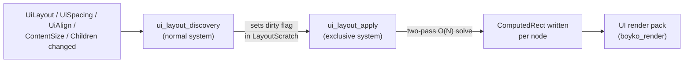
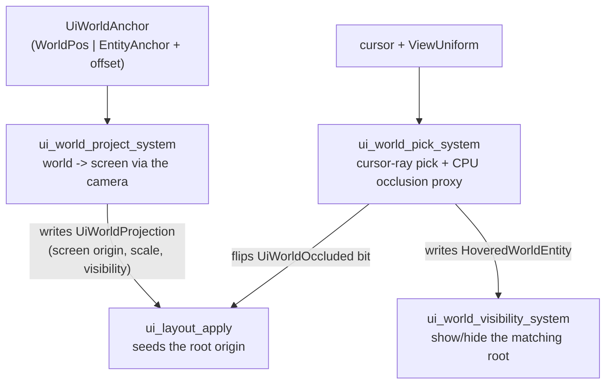

# UI Overview

> `boyko_ui` is an ECS-native UI: a widget IS an entity, every layout / style / interaction property IS a component, and layout / hit-testing / projection are ordinary ECS systems over the kernel storage. There is no parallel UI data system.

## What it is

Most UI libraries keep a tree of their own. Bevy UI delegates layout to Taffy, which holds a parallel `UiSurface` node tree plus an entity↔node map. Immediate-mode toolkits (egui, imgui) own a per-frame context: a `Vec`/`HashMap` of widget state behind an ID stack. Both are a second data system glued beside the application's data.

`boyko_ui` refuses that. The engine's [Principle 0](../architecture/principles.md) is inviolable: all durable per-element data lives in the ECS's own storage — `ComponentPool` columns — and all logic is ECS systems on the engine's scheduler. So a UI node is just an entity with components:

- **Structure** is the existing [`ChildOf` / `Children` hierarchy](../concepts/hierarchies.md) — the same relation the rest of the engine uses. There is no separate widget tree.
- **Layout inputs** (`UiLayout`, `UiSpacing`, `UiAlign`, `ContentSize`) are POD `Copy` components, each its own SoA column.
- **Layout output** (`ComputedRect`) is one more component — the *only* geometry the renderer reads.
- **Style** (`UiBackground`, `UiImage`, `UiText`), **interaction** (`Interaction`, `Focusable`, `OnClick`), and **world anchoring** (`UiWorldAnchor`) are all components.
- **Layout, hit-testing, projection, and picking** are scheduled systems — nothing more.

The payoff is that "ECS-native" and "cache-optimal" are the same thing. The layout solver streams contiguous SoA columns; [change detection](../change_detection.md) gives a true 0%-overhead steady state (an unchanged frame does no layout work); and a UI node composes with any other component (a physics body, a render column) because it is a normal entity.

> Every component in this page is defined in the `boyko_ui` crate and derives the kernel `Component` (from `boyko_macros`). The derive is a pure marker — it adds no fields and only assigns a lazily-allocated `ComponentId` — so it coexists with `#[repr(C)]` POD layout.

## The widget-as-entity model

There is no `Widget` trait, no `Box<dyn Widget>`, and no runtime widget enum. A widget is a deterministic *set* of components on the layout substrate. Where a widget needs an identity beyond its component set it carries a zero-sized marker (the `UiRoot` precedent) so it stays enumerable (`query_entities(&[Button::component_id()])`) and filterable (`Added<Button>`); where it needs config it carries a small POD struct.

`UiNodeBundle` is the always-present node base — exactly `UiLayout` + `ComputedRect`, the two components every laid-out node carries. The shipped widget presets (`PanelBundle`, `ButtonBundle`, `LabelBundle`, `BarBundle`, `ImageBundle`, `GridBundle`) are `#[derive(Bundle)]` named structs that expand to the same component set, so spawning one hits the static archetype cache as a single unit.

```rust,ignore
use boyko_ecs::prelude::*;            // EcsMaster, Commands, Query, ...
use boyko_ui::prelude::*;             // UiNodeBundle, PanelBundle, ButtonBundle, UiLayout, NO_ACTION, ...
use boyko_ui::units::Unit;

// A button is "a styled panel + Interaction + Focusable + OnClick + the Button marker".
// The preset bundle expands to that exact component set.
let button = ButtonBundle {
    layout: UiLayout {
        width: Unit::Px(160.0),
        height: Unit::Px(48.0),
        ..Default::default()
    },
    rect: ComputedRect::default(),    // written by the layout pass
    background: UiBackground {
        color: 0x2A6FF0FF,            // straight RGBA8, premultiplied at render-pack time
        ..Default::default()
    },
    marker: Button,
    interaction: Interaction::default(),
    focusable: Focusable { tab_index: 0 },
    on_click: OnClick(NO_ACTION),         // fire nothing; use OnClick(MyAction::Confirm.index()) to bind a real action
};
```

A bare tuple is **not** a `Bundle` on this engine — bundles are `#[derive(Bundle)]` structs. The preset structs are a Rust-only convenience; the canonical authorable form (used by the `ui!` macro and the `.ui` text format) is the explicit component list, and a `ui!` ≡ `.ui` ≡ hand-spawn equivalence gate verifies the three produce identical archetypes.

Source: [`bundles.rs`](https://github.com/bluesteelll/boyko-engine/blob/ecs/crates/boyko_ui/src/bundles.rs#L31), [`components.rs`](https://github.com/bluesteelll/boyko-engine/blob/ecs/crates/boyko_ui/src/components.rs#L380).

## How layout works

Layout is **two systems**, run in order after all structural / prop-mutation systems.



`ui_layout_discovery` is a normal scheduled `FunctionSystem`. SystemParams supply the `(last_run, this_run]` tick window that `Changed`/`Added` need, so change detection lives here. It runs a `Query<(), Or<(Changed<UiLayout>, Changed<UiSpacing>, …, Added<UiRoot>)>>` and asks "did any layout input change this frame?" via `iter().next().is_some()`. The answer becomes a single `dirty` flag in the `LayoutScratch` resource. In steady state the change query yields nothing, so `dirty` stays `false` and the apply pass early-returns — a genuine zero-cost idle frame.

`ui_layout_apply` is an **exclusive system** (`&mut EcsMaster`). It is exclusive because it needs nested parent↔child mutable row access, which only an exclusive body can express without unsafe aliasing. When `dirty` (or the viewport resized) it re-lays-out the root subtrees. For each `UiRoot` it seeds the root rectangle from the viewport, then runs a two-phase O(N) solve over the `Children` tree: a bottom-up MEASURE pass that records every node's resolved size once into a flat scratch arena, then a top-down POSITION pass that reads those sizes and writes `ComputedRect` without re-measuring. The supported model is CSS-flexbox-flavoured: `Row` / `Column` / `Overlay` / `Grid` containers, with `Px` / `Pct` / `Stretch` / `Auto` units, padding, gaps, and main/cross alignment.

The change path does no per-frame allocation. The root list is cached in `LayoutScratch::roots` and refreshed (one `query_entities`) only when the root *set* could have changed (`Added<UiRoot>` or a structural `Changed<Children>`/`Changed<ChildOf>`). A plain size tweak reuses the cached list, so a stream of property-only frames re-walks roots with zero allocation. The scratch buffers are moved onto the stack at apply entry (the `mem::take` borrow protocol) so the recursion can call `get_component_mut` without holding a resource borrow.

> A note on a deliberate engine deviation: the original plan specified a per-changed-node up-walk to mark only the dirty roots. That needs an entity-yielding change query, which this engine's `Query` does not provide. The shipped resolution keeps the two-system architecture and the zero-cost steady state, but relaxes relayout granularity to all-roots when anything changes — see the [layout source header](https://github.com/bluesteelll/boyko-engine/blob/ecs/crates/boyko_ui/src/layout.rs#L10) for the full reasoning.

Source: [`layout.rs`](https://github.com/bluesteelll/boyko-engine/blob/ecs/crates/boyko_ui/src/layout.rs#L84).

## Screen-space HUD

A screen-space root carries the `UiRoot` marker (a normal enumerable marker, not a bitset tag). The layout pass seeds it from the `UiViewport` and lays its subtree out in logical pixels (`+x` right, `+y` down).

A root may pin itself to a screen edge or corner with `UiAnchor`: nine anchor edges (`TopLeft` … `BottomRight`, `Center`), an inset offset, and an optional `UiSafeArea` subtraction. Anchoring is resolved *inside* `ui_layout_apply` after the root is measured, so the layout pass stays the single `ComputedRect` writer (no pre-pass write race). A root without a `UiAnchor` lays out at the viewport top-left.

The shipped HUD widgets — `Button`, `Bar` / `BarFill`, `Label`, `Panel`, `Image`, `Grid` — are realized this way. A `Bar` track hosts a `0..1` value in `UiValue` and a `BarFill`-marked child whose main-axis `Unit::Pct` is driven from that value by the bar widget system, so a health bar is data-bound (`Changed`-gated), not redrawn imperatively.

## World-space / diegetic UI

The second kind of root attaches the UI to a 3D world point — a nameplate, a floating health bar over an enemy, a hover tooltip above an object. This is fully ECS-native: a world-anchored subtree is a normal `UiRoot` that *also* carries `UiWorldAnchor`. Anchors are components; projection, picking, and visibility are systems. There is no parallel world-anchor data store.



`UiWorldAnchor` tracks a `WorldTarget` — either a fixed `WorldPos([f32; 3])` or a live `EntityAnchor(Entity)` whose `GlobalTransform` translation is read each frame (so the label tracks a moving target). It supports a world-space offset, two scale modes (`ScreenSpace` constant pixels vs `WorldScaled` perspective shrink), and optional distance fade. It auto-inserts `UiWorldProjection` via `#[require(...)]`, so an author can never add the anchor without the projection column the systems read.

`ui_world_project_system` projects each anchor's world point through the camera's column-major view-projection matrix (one `Mat4·Vec4` + a divide), writes the screen origin / scale / visibility into `UiWorldProjection` (set-if-changed, the `Changed`-gate), and flips the frustum-cull `UiWorldCulled` bit. The layout pass reads `UiWorldProjection` to seed the root origin — again keeping the layout pass the single `ComputedRect` writer.

A bare tuple is **not** a `Bundle` here, and neither is a lone component — every
`Commands::spawn` / `EntityCommands::insert` takes a `Bundle`, and the `Bundle`
trait is sealed so the only way to mint one is `#[derive(Bundle)]` (the derive is
**not** in any prelude; import it from `boyko_macros`). So a world-anchored root is
a `#[derive(Bundle)]` struct that carries the node base (`UiLayout` + `ComputedRect`)
plus the `UiRoot` marker and the `UiWorldAnchor` config. Spawning it hits the static
archetype cache as a single unit:

```rust,ignore
use boyko_ecs::prelude::*;            // EcsMaster, Commands, ...
use boyko_macros::Bundle;            // the #[derive(Bundle)] macro (NOT re-exported by any prelude)
use boyko_ui::prelude::*;             // UiLayout, ComputedRect, UiRoot, UiWorldAnchor, WorldTarget, WorldScaleMode

/// A constant-size nameplate that tracks a moving enemy entity. `UiRoot` and
/// `UiWorldAnchor` are plain components, so they ride inside one derived bundle.
#[derive(Bundle)]
struct NameplateBundle {
    layout: UiLayout,                  // a world-anchored subtree still lays out
    rect: ComputedRect,                // written by the layout pass
    root: UiRoot,                      // a UI root ...
    anchor: UiWorldAnchor,             // ... anchored to a 3D entity
}

let nameplate = commands
    .spawn(NameplateBundle {
        layout: UiLayout::default(),
        rect: ComputedRect::default(),
        root: UiRoot,
        anchor: UiWorldAnchor {
            target: WorldTarget::EntityAnchor(enemy),
            offset: [0.0, 2.0, 0.0],   // 2 m above the target
            scale_mode: WorldScaleMode::ScreenSpace,
            depth_test: true,          // occluded by nearer geometry
            ..Default::default()
        },
    })
    .id();
// `UiWorldProjection` is auto-required onto the anchor (`#[require(...)]`), so the
// project system always finds it. Parent the nameplate's label/bar children to
// `nameplate` with the usual `ChildOf` to build out the subtree.
```

### Cursor-ray picking and CPU-proxy depth occlusion

`ui_world_pick_system` turns the cursor into a 3D pick. It builds a cursor ray from the camera `ViewUniform` and ray-tests every scene entity carrying a `UiPickable` bound (a local-frame `Sphere` or `Aabb`, layer-masked, transformed to world space once per frame with the conservative uniform scale of the entity's `GlobalTransform`). The nearest hit's entity is written into the `HoveredWorldEntity` resource (set-if-changed). `ui_world_visibility_system` then shows the world-anchored root whose `EntityAnchor` target equals the picked entity — symmetric to the screen-space hover hit-test, but the "hit" is a 3D object pick.

`UiPickable` lives on the tracked scene entity, **not** on the UI root, and it is a first-class UI component — it is deliberately *not* a borrowed `boyko_physics` collider (`boyko_ui` does not depend on `boyko_physics`; Principle 0 again).

Depth occlusion is a **CPU proxy**, not a GPU depth-buffer test. For each `depth_test == true` root the system casts an eye→anchor ray against the *same* pickable bounds and sets the `UiWorldOccluded` bit when a nearer surface is hit (with a scale-invariant relative bias, and self-exclusion of the anchor's own tracked entity). The occlusion bit is re-derived unconditionally for every root on every run — including the cursor-inactive path — so a stale "occluded" bit can never strand a label permanently hidden. `UiWorldOccluded` is an [EnableTag](../concepts/enable-tags.md) (bitset storage, O(1) toggle, no archetype migration), and it is a *distinct* bit from `UiWorldCulled` (frustum, project-owned) and `UiWorldHidden` (hover, visibility-owned), so the three authorities never race a shared bit. The layout pass skips any root with one of these bits set.

A true GPU depth-buffer occlusion test and a subtree-AABB cull are documented as deferred; the CPU pick + CPU occlusion proxy is what ships.

Source: [`world/pick.rs`](https://github.com/bluesteelll/boyko-engine/blob/ecs/crates/boyko_ui/src/world/pick.rs#L192), [`world/project.rs`](https://github.com/bluesteelll/boyko-engine/blob/ecs/crates/boyko_ui/src/world/project.rs#L85), [`world/components.rs`](https://github.com/bluesteelll/boyko-engine/blob/ecs/crates/boyko_ui/src/world/components.rs#L54).

## Rendering

The layout pass produces `ComputedRect` (plus `StackIndex`, `ComputedClip`, `UiBackground`). The render side lives in `boyko_render`'s `ui` module: it packs those columns into a std430 `UiInstance` record, stable-sorts by `StackIndex`, uploads to a persistent-mapped storage ring, and draws every node as one instanced, anti-aliased, rounded-rect SDF quad on the in-house Vulkan path — steady-state one draw call, zero per-frame heap allocation, with an O(1) generation gate that skips the pack when nothing changed. Colors are authored straight RGBA8 and premultiplied at pack time. See [Rendering overview](../rendering/overview.md).

## What ships (GUI phases P1–P7)

Be precise about scope — all of these are shipped:

| Phase | Capability | Status |
|-------|------------|--------|
| P1 | Layout components + the two-system in-house solver | Shipped |
| P2 | The `ui!` code DSL (spawns the entity tree) | Shipped |
| P3 | The `.ui` text format + diff-by-name hot-reload | Shipped |
| P4 | Pointer/keyboard interaction (`Interaction`, focus, `OnClick`) + data binding | Shipped |
| P5a | UI-rect rendering (instanced rounded-rect SDF, in-house Vulkan) | Shipped |
| P5b | Text rendering (SDF/MSDF atlas) | Shipped — see [Text & MSDF](text-msdf.md) |
| P6 | HUD widgets (Bar/Label/Button/Panel/Image/Grid) + anchoring/safe-area | Shipped |
| P7a | World-space projection / visibility core | Shipped |
| P7b | Cursor-ray pick + CPU-proxy depth occlusion | Shipped |

Documented deferrals (not yet shipped): GPU depth-buffer occlusion (P7b uses a CPU proxy), subtree-AABB world culling (the cull is anchor-point-based), per-side asymmetric borders (the renderer draws a uniform border), and `UiImage` consumption in the render pack (an Image node is layout-complete and authorable but does not yet rasterize).

## Scheduling note

`boyko_ui` ships systems, not an `App` schedule — ordering is the host's responsibility. The required order: run structural / prop-mutation systems first, then `ui_text_measure_system` (`.before(ui_layout_discovery)`), then `ui_world_project_system` / `ui_world_pick_system` (`.after` the camera + transform propagation, `.before` layout), then `ui_layout_discovery`, then `ui_layout_apply`. The `UiPlugin` / `UiInteractionPlugin` / `UiWidgetsPlugin` plugins wire the common registrations.

## See also

- [Hierarchies](../concepts/hierarchies.md) — the `ChildOf` / `Children` tree that *is* the widget tree.
- [Text & MSDF](text-msdf.md) — glyph atlas, shaping, and the text-on-the-quad-path render.
- [EnableTags](../concepts/enable-tags.md) — the O(1) bitset backend behind the world-UI visibility / cull / occlusion bits.
- [Rendering overview](../rendering/overview.md) — how `ComputedRect` becomes a drawn quad.
- Source: [`boyko_ui`](https://github.com/bluesteelll/boyko-engine/blob/ecs/crates/boyko_ui/src/lib.rs#L1).
