# Text & MSDF

> Crisp glyphs at any scale or rotation, from a distance-field atlas baked once and sampled on the GPU.

A bitmap font atlas stores each glyph as opaque pixels. Scale it up and it
blurs; rotate it and the edges crawl. boyko-engine never ships glyph pixels.
Instead, [`boyko_fontbake`](https://github.com/bluesteelll/boyko-engine/blob/ecs/crates/boyko_fontbake/src/lib.rs) bakes a **multi-channel
signed distance field (MSDF)** atlas from a font, and [`boyko_ui`](../ui/overview.md) renders
text by sampling that field on the GPU. The distance field reconstructs a sharp
edge at the fragment level, so the same atlas stays sharp whether the glyph is 8
px tall or fills the screen.

This page covers the full pipeline — font file to glyph outline to MSDF atlas to
GPU sample — and explains *why* multi-channel beats a plain bitmap or
single-channel SDF, especially at sharp corners.

## What a signed distance field is

A signed distance field stores, at every texel, the **signed distance to the
nearest glyph edge** instead of an opacity. Negative is outside, positive is
inside (boyko-engine maps the zero-crossing to `0.5`; see
[`map_distance`](https://github.com/bluesteelll/boyko-engine/blob/ecs/crates/boyko_fontbake/src/msdf/mod.rs#L80)). Because distance is *smooth* and roughly linear near the
edge, bilinear texture filtering interpolates it correctly — so the shader can
recover a clean edge at the exact threshold no matter how the quad was scaled.

A **single-channel** SDF (one distance value per texel) has one flaw: at a sharp
corner the true distance field is non-linear (it bends around the corner point),
and a low-resolution single channel rounds the corner off. Letters are full of
sharp corners — the apex of an `A`, the serifs, the join of a `V`.

**MSDF** (Chlumsky's technique) fixes this by storing **three** distance
channels (R, G, B), each tracking a different subset of edges, chosen by an
**edge-coloring** pass so that a sharp corner is represented by two channels
disagreeing. The shader takes the **median** of the three channels per
fragment. Away from corners all three agree, so the median equals the SDF; *at* a
corner the median reconstructs the exact intersection of two edges — a crisp
point, not a rounded blob.

```mermaid
flowchart LR
    F[Font file<br/>.ttf / .otf] --> P[ttf-parser<br/>outline + metrics]
    P --> O[GlyphOutline<br/>em-normalized<br/>line/quad/cubic]
    O --> C[Edge coloring<br/>assign R/G/B per edge]
    C --> D[Per-channel<br/>signed pseudo-distance]
    D --> S[Scanline<br/>sign-correction]
    S --> E[Error-correction<br/>remove clash speckle]
    E --> A[Skyline-packed<br/>MTSDF RGBA8 atlas]
    A --> B[.bfont binary<br/>atlas + metrics tables]
    B --> G[GPU: sample atlas<br/>median + screenPxRange]
```



## The baker: boyko_fontbake

[`boyko_fontbake`](https://github.com/bluesteelll/boyko-engine/blob/ecs/crates/boyko_fontbake/src/lib.rs) is a **load-time** tool. It runs once, produces a
`.bfont` binary, and is never touched again on the render hot path. Everything
except outline extraction is in-house — that is the engine's value-add.

### Parsing the font

Outline and metric extraction is the *only* part delegated to a third-party
crate, and it is hidden behind the in-house
[`FontFace`](https://github.com/bluesteelll/boyko-engine/blob/ecs/crates/boyko_fontbake/src/face.rs#L56) /
[`OutlineSink`](https://github.com/bluesteelll/boyko-engine/blob/ecs/crates/boyko_fontbake/src/face.rs#L40) traits. The engine code depends on the *trait*, never on the
backend — exactly the way the [RHI](../rendering/rhi.md) isolates Vulkan. A future in-house
`glyf`/CFF parser can implement the same traits with zero call-site churn.

The one shipped backend is
[`TtfFace`](https://github.com/bluesteelll/boyko-engine/blob/ecs/crates/boyko_fontbake/src/face.rs#L87), a thin adapter over `ttf-parser`. It was chosen
deliberately: `ttf-parser` is `#![forbid(unsafe_code)]`, zero-dependency,
zero-alloc, and handles both TrueType `glyf` and CFF/CFF2 outlines.

### Extracting the outline

The [`extract`](https://github.com/bluesteelll/boyko-engine/blob/ecs/crates/boyko_fontbake/src/extract.rs) pass walks each glyph into an em-normalized
[`GlyphOutline`](https://github.com/bluesteelll/boyko-engine/blob/ecs/crates/boyko_fontbake/src/extract.rs#L48): a list of closed contours, each a list of
[`Segment`](https://github.com/bluesteelll/boyko-engine/blob/ecs/crates/boyko_fontbake/src/extract.rs#L16)s (`Line`, `Quad`, or `Cubic`). All downstream coordinates are
in **em units** (1.0 == one em), so the global pixels-per-em scale is applied in
exactly one place.

### Generating the field

The [`msdf`](https://github.com/bluesteelll/boyko-engine/blob/ecs/crates/boyko_fontbake/src/msdf/mod.rs) module runs four independently-gated passes — the canonical
Chlumsky pipeline, re-implemented from scratch:

1. **Edge coloring** ([`color`](https://github.com/bluesteelll/boyko-engine/blob/ecs/crates/boyko_fontbake/src/msdf/color.rs)) — assigns each edge a channel (a
   seeded switch, a max-angle corner predicate, and 0/1/N-corner handling). This
   is what makes the three channels *disagree* at corners.
2. **Per-channel distance** ([`distance`](https://github.com/bluesteelll/boyko-engine/blob/ecs/crates/boyko_fontbake/src/msdf/distance.rs)) — the signed pseudo-distance
   to each channel's edges: a closed form for lines, Cardano for quadratics, and
   a multi-seed Newton search for cubics (multiple seeds avoid the S-curve local
   minimum). The per-texel work is dispatched on the engine threadpool by
   disjoint-output row partitioning — no shared mutable state, no atomics.
3. **Sign-correction** ([`sign`](https://github.com/bluesteelll/boyko-engine/blob/ecs/crates/boyko_fontbake/src/msdf/sign.rs)) — a scanline pass that overrides the
   pseudo-distance sign with authoritative insideness (which side of the
   contour a texel actually falls on).
4. **Error-correction** ([`error_correct`](https://github.com/bluesteelll/boyko-engine/blob/ecs/crates/boyko_fontbake/src/msdf/error_correct.rs)) — the mandatory msdfgen pass
   that removes interpolation/clash speckle (texels where the three channels
   produce an artifact under bilinear interpolation).

The output is a [`GlyphField`](https://github.com/bluesteelll/boyko-engine/blob/ecs/crates/boyko_fontbake/src/msdf/mod.rs#L41): a tightly-packed RGBA float buffer for one
glyph, expanded by a transition-band margin so the anti-aliasing band is never
clipped.

### MSDF vs MTSDF

boyko-engine bakes **MTSDF** — *multi-channel + true* — not plain MSDF. The
[`AtlasKind`](https://github.com/bluesteelll/boyko-engine/blob/ecs/crates/boyko_fontbake/src/atlas.rs#L30) enum carries both variants, but the shipped default is locked to
MTSDF:

| Channel | MSDF (`AtlasKind::Msdf`) | MTSDF (`AtlasKind::Mtsdf`, default) |
|---------|--------------------------|-------------------------------------|
| R, G, B | the 3-channel MSDF (sharp corners) | the 3-channel MSDF (sharp corners) |
| A       | unused | a **true single-channel SDF** |
| Range   | 4 texels | 6 texels |

The extra alpha channel is a plain single-channel SDF sharing the identical
range mapping and `0.5` zero-crossing as RGB. The median of R/G/B gives crisp
corners; the true SDF in A gives a clean, corner-free distance that is exactly
what you want for soft effects like outlines, glows, and drop shadows. MTSDF is
a strict superset — you get sharp text *and* the smooth field for free in one
RGBA8 texel.

### Packing and serializing

[`atlas`](https://github.com/bluesteelll/boyko-engine/blob/ecs/crates/boyko_fontbake/src/atlas.rs) packs every glyph's expanded field into one RGBA8 atlas with a
skyline packer (tallest-first for density), with at least
[`ATLAS_PADDING_TEXELS`](https://github.com/bluesteelll/boyko-engine/blob/ecs/crates/boyko_fontbake/src/constants.rs#L47) of spacing so bilinear filtering never bleeds across
neighboring glyphs. Alongside the image it builds three POD tables:

- [`GlyphMetrics`](https://github.com/bluesteelll/boyko-engine/blob/ecs/crates/boyko_fontbake/src/atlas.rs#L52) — per-glyph advance + the plane/atlas quad bounds.
- a sorted codepoint→slot [`cmap`](https://github.com/bluesteelll/boyko-engine/blob/ecs/crates/boyko_fontbake/src/atlas.rs#L90) (binary-searched; `cp < 128` takes a
  direct-array fast path).
- a sorted [`kern`](https://github.com/bluesteelll/boyko-engine/blob/ecs/crates/boyko_fontbake/src/atlas.rs#L101) table.

Everything is written to an in-house `.bfont` binary — no serde, just POD blits
behind a small magic + version + seed header, round-tripped byte-identically by
[`read_bfont`](https://github.com/bluesteelll/boyko-engine/blob/ecs/crates/boyko_fontbake/src/atlas.rs#L528). The header records the generator version and the pinned
edge-coloring seed so a stale asset is rejected at load.

Baking a font is a single call:

```rust,ignore
use boyko_fontbake::{TtfFace, bake_font, write_bfont};

// Load a font and bake an MTSDF atlas over the codepoints you need.
let bytes = std::fs::read("assets/Inter.ttf").expect("read font");
let face = TtfFace::from_bytes(&bytes).expect("parse font");

let codepoints: Vec<char> = (' '..='~').collect(); // ASCII printable
let baked = bake_font(&face, &codepoints, None);    // None = single-threaded

// Serialize to the in-house .bfont binary for the runtime to load.
std::fs::write("assets/Inter.bfont", write_bfont(&baked)).expect("write");
```

## The runtime: sampling on the GPU

At setup the runtime loads a `.bfont` once into a [`boyko_ui`](../ui/overview.md) `FontTable`
resource — an ECS-resident, dense font table (a `Resource`-owned column, **not** a
`HashMap` side store). Each [`FontEntry`](https://github.com/bluesteelll/boyko-engine/blob/ecs/crates/boyko_ui/src/text/font.rs#L31) reuses the baker's POD records
directly, keeping a single source of truth for the layout. The atlas image is
uploaded once as a `SAMPLED` texture with a no-mip bilinear, clamp-to-edge
sampler, then read by every frame with no per-frame barrier.

### Text is just UI quads

A glyph on screen is one instanced quad — the same
[`UiInstance`](https://github.com/bluesteelll/boyko-engine/blob/ecs/crates/boyko_render/src/ui/instance.rs#L35) record the UI uses for rounded rects. When the
[`FLAG_TEXT`](https://github.com/bluesteelll/boyko-engine/blob/ecs/crates/boyko_render/src/ui/instance.rs#L84) bit is set, the fragment shader reinterprets the quad's
`corner_radius` field as the glyph's normalized atlas UV rect and samples the
MSDF atlas instead of evaluating the rounded-box SDF. One pipeline, one z-sort,
one draw call covers both rects and text.

### The fragment math

The shader samples the RGBA8 atlas, takes the **median** of the R/G/B channels
to get the signed distance, then converts that distance to coverage using
`screenPxRange` — the baked distance range in texels, scaled to screen pixels —
so the anti-aliasing band is always exactly one device pixel wide regardless of
the on-screen text size. In essence:

```glsl
// Conceptual — the in-engine fragment path (HLSL in the real shader).
float median(float r, float g, float b) {
    return max(min(r, g), min(max(r, g), b));
}

vec4  msd      = texture(atlas, uv);
float sd       = median(msd.r, msd.g, msd.b); // crisp at corners
float dist     = sd - 0.5;                     // 0.5 == the edge
float pxRange  = screenPxRange();              // = distance_range_texels, scaled
float coverage = clamp(dist * pxRange + 0.5, 0.0, 1.0);
```

The distance range in texels comes straight from the baked atlas
([`DISTANCE_RANGE_TEXELS`](https://github.com/bluesteelll/boyko-engine/blob/ecs/crates/boyko_fontbake/src/constants.rs#L26) = 6 for MTSDF), carried into the shader as a
per-atlas uniform written once at upload. Because coverage is computed from a
*distance* and not stored pixels, scaling the quad up or rotating it just changes
how the field is sampled — the reconstructed edge stays sharp.

### Authoring text in the ECS

Text is opt-in per node. A node gets a [`UiText`](https://github.com/bluesteelll/boyko-engine/blob/ecs/crates/boyko_ui/src/text/components.rs#L45) style component (color, em
size, font handle, alignment) plus a text-content buffer; absent `UiText`, the
node is a plain rect. The capability is the *presence* of `UiText` — there is no
"is-text" flag.

```rust,ignore
use boyko_ecs::prelude::*;
use boyko_macros::Bundle;
use boyko_ui::text::components::{FontId, TextAlign, UiText};

// A Bundle is a derived struct, never a bare tuple.
#[derive(Bundle)]
struct LabelStyle {
    // Foreground color (straight RGBA8), 24 px, font 0, centered.
    text: UiText,
}

// White, 24 px, centered text on font slot 0.
let style = LabelStyle {
    text: UiText {
        color: 0xFFFF_FFFF,
        size_px: 24.0,
        font: FontId(0),
        align: TextAlign::Center,
        _pad: 0,
    },
};
```

The host folds the window `scale_factor` into the em size at emit, so the shader
works in physical pixels and `screenPxRange` resolves to one device pixel of AA.

## Why this design

- **In-house, no FFI for the field.** Only outline parsing is delegated, behind a
  trait. Edge coloring, distance generation, sign- and error-correction, packing,
  and the `.bfont` format are all the engine's own code — the same no-glued-on-the-
  side principle the rest of the engine follows.
- **Single source of truth.** The runtime reuses the baker's POD metric records
  directly; there is no parallel copy of the layout. The font table is an
  ECS-resident resource, not a `HashMap`.
- **One pipeline for rects and text.** Text quads reuse the rounded-rect
  `UiInstance` record via a flag-gated field alias, so the on-screen path is one
  z-sort and one draw.
- **Deterministic bakes.** The coloring seed, pixels-per-em, and distance range
  are pinned constants recorded in the `.bfont` header, so a bake is
  byte-reproducible and a stale asset is detected at load.

## See also

- [UI overview](../ui/overview.md) — widgets-are-entities, the layout and render path.
- [Rendering overview](../rendering/overview.md) — the in-house Vulkan render spine.
- [SDF rendering](../rendering/sdf.md) — the signed-distance-field technique applied to 3D geometry.
- Source: [`boyko_fontbake`](https://github.com/bluesteelll/boyko-engine/blob/ecs/crates/boyko_fontbake/src/lib.rs), [`boyko_ui` text path](https://github.com/bluesteelll/boyko-engine/blob/ecs/crates/boyko_ui/src/text/font.rs), [UI render instance](https://github.com/bluesteelll/boyko-engine/blob/ecs/crates/boyko_render/src/ui/instance.rs)
